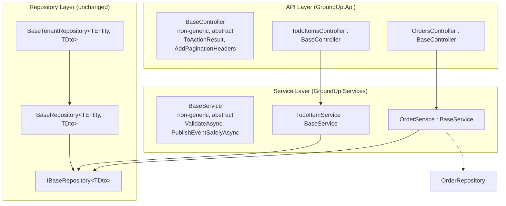

# Design Document: Base Class Refactor

## Overview

This design refactors `BaseController<TDto>` and `BaseService<TDto>` from generic CRUD base classes into infrastructure-only base classes that provide shared helpers without imposing DTO type constraints. The repository layer (`BaseRepository<TEntity, TDto>` and `BaseTenantRepository<TEntity, TDto>`) remains unchanged.

### The Problem

The current design binds each service and controller to a single DTO type via `BaseService<TDto>` and `BaseController<TDto>`. This works for simple entities (TodoItem, Customer) where one DTO handles all operations, but breaks for complex entities (Order) that need different DTOs per operation:

- **OrdersController** inherits `BaseController<OrderListDto>` but needs `CreateOrderDto` for POST, `UpdateOrderDto` for PUT, and `OrderDetailDto` for GET-by-ID
- **OrderService** inherits `BaseService<OrderListDto>` but defines custom methods returning `OrderDetailDto`
- The base class's virtual `Create(TDto)` and `Update(Guid, TDto)` methods remain visible even when not exposed via HTTP attributes, causing potential Swagger ambiguity
- The `GetById` override returns `ActionResult<OperationResult<OrderListDto>>` in its signature but actually returns `OrderDetailDto` inside — the compiler allows it but the Swagger docs are wrong
- The `Delete` method works through the base class but requires `BaseService<OrderListDto>` registration even though the service's primary purpose is multi-DTO orchestration

### The Solution

**BaseController** becomes a non-generic abstract class providing:
- `ToActionResult<T>()` and `ToActionResult()` protected helpers
- `AddPaginationHeaders()` protected helper
- `[ApiController]` and `[Route("api/[controller]")]` attributes

**BaseService** becomes a non-generic abstract class providing:
- `ValidateAsync<TDto>()` protected helper that resolves validators from DI
- `PublishEventSafelyAsync<TEvent>()` protected helper
- `IEventBus` as a protected property
- `IServiceProvider` for runtime validator resolution

Derived classes define their own methods with the correct DTO types per operation. Simple entities write ~5 one-liner methods. Complex entities write custom methods with different DTOs. No more workarounds.

### Design Decisions

1. **Non-generic base classes.** Removing the `<TDto>` type parameter from BaseService and BaseController eliminates the single-DTO constraint entirely. Derived classes are free to use any combination of DTO types.

2. **IServiceProvider for validator resolution.** The current BaseService accepts `IValidator<TDto>?` in its constructor — this only works for one DTO type. The refactored BaseService accepts `IServiceProvider` and resolves `IValidator<T>` at call time via `serviceProvider.GetService<IValidator<T>>()`. This supports validating `CreateOrderDto`, `UpdateOrderDto`, and any other DTO type within the same service.

3. **Repository stays generic.** `BaseRepository<TEntity, TDto>` and `IBaseRepository<TDto>` remain unchanged. Entities are uniform at the data layer — one entity type maps to one "primary" DTO for standard CRUD. Complex entities add custom repository methods for additional DTO types (already the pattern in `OrderRepository`).

4. **No intermediate generic service.** We considered keeping a `CrudService<TDto> : BaseService` that provides the old generic CRUD methods for simple entities. Rejected because: it adds a class to the hierarchy that doesn't pull its weight, and the simple entity pattern is already minimal (5 one-liner methods). The cognitive overhead of "which base class do I use?" is worse than writing 5 trivial methods.

5. **Controller does not hold a service reference.** The current `BaseController<TDto>` stores `protected BaseService<TDto> Service`. The refactored BaseController has no service property — derived controllers inject their own service type directly. This is cleaner because complex controllers need the concrete service type anyway (e.g., `OrderService` not `BaseService<OrderListDto>`).

6. **AddGroundUpServices unchanged.** The `ServicesServiceCollectionExtensions.AddGroundUpServices()` method continues to scan assemblies for FluentValidation validators. No changes needed — validators are already registered in DI, and the new `ValidateAsync<T>` resolves them at runtime.

## Architecture

### Layer Diagram (After Refactor)



### What Changes vs. What Stays

| Component | Before | After | Change? |
|---|---|---|---|
| `BaseController<TDto>` | Generic, 5 virtual CRUD methods + helpers | Non-generic, helpers only | **Breaking** |
| `BaseService<TDto>` | Generic, 5 virtual CRUD methods + helpers | Non-generic, helpers only | **Breaking** |
| `BaseRepository<TEntity, TDto>` | Generic CRUD + queryShaper | Unchanged | No |
| `BaseTenantRepository<TEntity, TDto>` | Extends BaseRepository + tenant isolation | Unchanged | No |
| `IBaseRepository<TDto>` | Generic CRUD interface | Unchanged | No |
| `ServicesServiceCollectionExtensions` | Scans assembly for validators | Unchanged | No |
| Sample controllers | Override base + add HTTP attributes | Define own methods + call service | **Migration** |
| Sample services | Inherit CRUD from base | Define own methods + call repository | **Migration** |
| Sample repositories | Unchanged | Unchanged | No |
| DI registration (Program.cs) | Register as `BaseService<TDto>` | Register as concrete type only | **Migration** |

## Components and Interfaces

### BaseController (Refactored)

```csharp
using GroundUp.Core.Models;
using GroundUp.Core.Results;
using Microsoft.AspNetCore.Mvc;

namespace GroundUp.Api.Controllers;

/// <summary>
/// Abstract base controller providing shared HTTP infrastructure for all
/// GroundUp API controllers. Provides ToActionResult helpers for mapping
/// OperationResult to ActionResult, and pagination header helpers.
/// <para>
/// Derived controllers inject their own service and define endpoint methods
/// with explicit HTTP attributes and operation-specific DTO types.
/// No generic CRUD methods are defined here — controllers own their endpoints.
/// </para>
/// </summary>
[ApiController]
[Route("api/[controller]")]
public abstract class BaseController : ControllerBase
{
    #region Protected Helpers

    /// <summary>
    /// Maps a generic OperationResult to the appropriate ActionResult based on StatusCode.
    /// </summary>
    protected ActionResult ToActionResult<T>(OperationResult<T> result)
    {
        return result.StatusCode switch
        {
            200 => Ok(result),
            201 => StatusCode(201, result),
            400 => BadRequest(result),
            401 => Unauthorized(),
            403 => StatusCode(403, result),
            404 => NotFound(result),
            _ => new ObjectResult(result) { StatusCode = result.StatusCode }
        };
    }

    /// <summary>
    /// Maps a non-generic OperationResult to the appropriate ActionResult based on StatusCode.
    /// </summary>
    protected ActionResult ToActionResult(OperationResult result)
    {
        return result.StatusCode switch
        {
            200 => Ok(result),
            201 => StatusCode(201, result),
            400 => BadRequest(result),
            401 => Unauthorized(),
            403 => StatusCode(403, result),
            404 => NotFound(result),
            _ => new ObjectResult(result) { StatusCode = result.StatusCode }
        };
    }

    /// <summary>
    /// Adds standard pagination headers to the HTTP response.
    /// Call this from GetAll-style endpoints after a successful paginated query.
    /// </summary>
    /// <typeparam name="T">The DTO type in the paginated result.</typeparam>
    /// <param name="paginatedData">The paginated data containing page metadata.</param>
    protected void AddPaginationHeaders<T>(PaginatedData<T> paginatedData)
    {
        Response.Headers["X-Total-Count"] = paginatedData.TotalRecords.ToString();
        Response.Headers["X-Page-Number"] = paginatedData.PageNumber.ToString();
        Response.Headers["X-Page-Size"] = paginatedData.PageSize.ToString();
        Response.Headers["X-Total-Pages"] = paginatedData.TotalPages.ToString();
    }

    #endregion
}
```

### BaseService (Refactored)

```csharp
using FluentValidation;
using GroundUp.Core.Results;
using GroundUp.Events;
using Microsoft.Extensions.DependencyInjection;

namespace GroundUp.Services;

/// <summary>
/// Abstract base service providing shared infrastructure for all GroundUp
/// services: FluentValidation pipeline, event publishing, and error handling.
/// <para>
/// Derived services inject their own repository (via constructor) and define
/// methods with explicit input/output DTO types. No generic CRUD methods are
/// defined here — services own their business operations.
/// </para>
/// <para>
/// Validators are resolved from the DI container at call time, supporting
/// multiple DTO types per service (e.g., CreateOrderDto and UpdateOrderDto
/// in the same OrderService).
/// </para>
/// </summary>
public abstract class BaseService
{
    /// <summary>
    /// The event bus for publishing entity lifecycle events.
    /// </summary>
    protected IEventBus EventBus { get; }

    private readonly IServiceProvider _serviceProvider;

    /// <summary>
    /// Initializes a new instance of <see cref="BaseService"/>.
    /// </summary>
    /// <param name="eventBus">The event bus for publishing lifecycle events.</param>
    /// <param name="serviceProvider">
    /// The DI service provider for resolving FluentValidation validators at runtime.
    /// </param>
    protected BaseService(IEventBus eventBus, IServiceProvider serviceProvider)
    {
        EventBus = eventBus;
        _serviceProvider = serviceProvider;
    }

    /// <summary>
    /// Validates a DTO using the FluentValidation validator registered in DI.
    /// Returns null if validation passes or no validator is registered for the type.
    /// Returns a BadRequest OperationResult if validation fails.
    /// </summary>
    /// <typeparam name="TDto">The DTO type to validate.</typeparam>
    /// <param name="dto">The DTO instance to validate.</param>
    /// <param name="cancellationToken">Cancellation token.</param>
    /// <returns>Null on success; BadRequest OperationResult on failure.</returns>
    protected async Task<OperationResult<TDto>?> ValidateAsync<TDto>(
        TDto dto,
        CancellationToken cancellationToken = default)
    {
        var validator = _serviceProvider.GetService<IValidator<TDto>>();
        if (validator is null)
            return null;

        var validationResult = await validator.ValidateAsync(dto, cancellationToken);
        if (validationResult.IsValid)
            return null;

        var errors = validationResult.Errors
            .Select(e => e.ErrorMessage)
            .ToList();

        return OperationResult<TDto>.BadRequest("Validation failed", errors);
    }

    /// <summary>
    /// Publishes an event via the event bus, catching and swallowing any exceptions.
    /// Event publishing is fire-and-forget — failures never affect the operation result.
    /// </summary>
    protected async Task PublishEventSafelyAsync<TEvent>(
        TEvent @event,
        CancellationToken cancellationToken = default)
        where TEvent : IEvent
    {
        try
        {
            await EventBus.PublishAsync(@event, cancellationToken);
        }
        catch (Exception)
        {
            // Fire-and-forget: event publishing failures do not affect the operation result
        }
    }
}
```

### Simple Entity Pattern: TodoItemService (After Refactor)

```csharp
using GroundUp.Core.Models;
using GroundUp.Core.Results;
using GroundUp.Data.Abstractions;
using GroundUp.Events;
using GroundUp.Sample.Dtos;
using GroundUp.Services;

namespace GroundUp.Sample.Services;

public class TodoItemService : BaseService
{
    private readonly IBaseRepository<TodoItemDto> _repository;

    public TodoItemService(
        IBaseRepository<TodoItemDto> repository,
        IEventBus eventBus,
        IServiceProvider serviceProvider)
        : base(eventBus, serviceProvider)
    {
        _repository = repository;
    }

    public Task<OperationResult<PaginatedData<TodoItemDto>>> GetAllAsync(
        FilterParams filterParams, CancellationToken ct = default)
        => _repository.GetAllAsync(filterParams, ct);

    public Task<OperationResult<TodoItemDto>> GetByIdAsync(
        Guid id, CancellationToken ct = default)
        => _repository.GetByIdAsync(id, ct);

    public async Task<OperationResult<TodoItemDto>> AddAsync(
        TodoItemDto dto, CancellationToken ct = default)
    {
        var error = await ValidateAsync(dto, ct);
        if (error is not null) return error;

        var result = await _repository.AddAsync(dto, ct);
        if (result.Success)
            await PublishEventSafelyAsync(new EntityCreatedEvent<TodoItemDto> { Entity = result.Data! }, ct);
        return result;
    }

    public async Task<OperationResult<TodoItemDto>> UpdateAsync(
        Guid id, TodoItemDto dto, CancellationToken ct = default)
    {
        var error = await ValidateAsync(dto, ct);
        if (error is not null) return error;

        var result = await _repository.UpdateAsync(id, dto, ct);
        if (result.Success)
            await PublishEventSafelyAsync(new EntityUpdatedEvent<TodoItemDto> { Entity = result.Data! }, ct);
        return result;
    }

    public async Task<OperationResult> DeleteAsync(
        Guid id, CancellationToken ct = default)
    {
        var result = await _repository.DeleteAsync(id, ct);
        if (result.Success)
            await PublishEventSafelyAsync(new EntityDeletedEvent<TodoItemDto> { EntityId = id }, ct);
        return result;
    }
}
```

### Simple Entity Pattern: TodoItemsController (After Refactor)

```csharp
using GroundUp.Api.Controllers;
using GroundUp.Core.Models;
using GroundUp.Core.Results;
using GroundUp.Sample.Dtos;
using GroundUp.Sample.Services;
using Microsoft.AspNetCore.Mvc;

namespace GroundUp.Sample.Controllers;

public class TodoItemsController : BaseController
{
    private readonly TodoItemService _service;

    public TodoItemsController(TodoItemService service)
    {
        _service = service;
    }

    [HttpGet]
    public async Task<ActionResult<OperationResult<PaginatedData<TodoItemDto>>>> GetAll(
        [FromQuery] FilterParams filterParams, CancellationToken ct = default)
    {
        var result = await _service.GetAllAsync(filterParams, ct);
        if (result.Success && result.Data is not null)
            AddPaginationHeaders(result.Data);
        return ToActionResult(result);
    }

    [HttpGet("{id}")]
    public async Task<ActionResult<OperationResult<TodoItemDto>>> GetById(
        Guid id, CancellationToken ct = default)
    {
        var result = await _service.GetByIdAsync(id, ct);
        return ToActionResult(result);
    }

    [HttpPost]
    public async Task<ActionResult<OperationResult<TodoItemDto>>> Create(
        [FromBody] TodoItemDto dto, CancellationToken ct = default)
    {
        var result = await _service.AddAsync(dto, ct);
        if (result.Success && result.StatusCode == 201)
            return CreatedAtAction(nameof(GetById), new { id = result.Data!.Id }, result);
        return ToActionResult(result);
    }

    [HttpPut("{id}")]
    public async Task<ActionResult<OperationResult<TodoItemDto>>> Update(
        Guid id, [FromBody] TodoItemDto dto, CancellationToken ct = default)
    {
        var result = await _service.UpdateAsync(id, dto, ct);
        return ToActionResult(result);
    }

    [HttpDelete("{id}")]
    public async Task<ActionResult<OperationResult>> Delete(
        Guid id, CancellationToken ct = default)
    {
        var result = await _service.DeleteAsync(id, ct);
        return ToActionResult(result);
    }
}
```

### Complex Entity Pattern: OrderService (After Refactor)

```csharp
using GroundUp.Core.Models;
using GroundUp.Core.Results;
using GroundUp.Events;
using GroundUp.Sample.Dtos;
using GroundUp.Sample.Repositories;
using GroundUp.Services;

namespace GroundUp.Sample.Services;

public class OrderService : BaseService
{
    private readonly OrderRepository _repository;

    public OrderService(
        OrderRepository repository,
        IEventBus eventBus,
        IServiceProvider serviceProvider)
        : base(eventBus, serviceProvider)
    {
        _repository = repository;
    }

    public async Task<OperationResult<PaginatedData<OrderListDto>>> GetAllAsync(
        FilterParams filterParams, CancellationToken ct = default)
        => await _repository.GetAllAsync(filterParams, ct);

    public async Task<OperationResult<OrderDetailDto>> GetByIdAsync(
        Guid id, CancellationToken ct = default)
        => await _repository.GetDetailByIdAsync(id, ct);

    public async Task<OperationResult<OrderDetailDto>> CreateAsync(
        CreateOrderDto dto, CancellationToken ct = default)
    {
        var error = await ValidateAsync(dto, ct);
        if (error is not null) return error;

        var result = await _repository.CreateOrderAsync(dto, ct);
        if (result.Success)
            await PublishEventSafelyAsync(
                new EntityCreatedEvent<OrderDetailDto> { Entity = result.Data! }, ct);
        return result;
    }

    public async Task<OperationResult<OrderDetailDto>> UpdateAsync(
        Guid id, UpdateOrderDto dto, CancellationToken ct = default)
    {
        var error = await ValidateAsync(dto, ct);
        if (error is not null) return error;

        var result = await _repository.UpdateOrderAsync(id, dto, ct);
        if (result.Success)
            await PublishEventSafelyAsync(
                new EntityUpdatedEvent<OrderDetailDto> { Entity = result.Data! }, ct);
        return result;
    }

    public async Task<OperationResult> DeleteAsync(
        Guid id, CancellationToken ct = default)
    {
        var result = await _repository.DeleteAsync(id, ct);
        if (result.Success)
            await PublishEventSafelyAsync(
                new EntityDeletedEvent<OrderDetailDto> { EntityId = id }, ct);
        return result;
    }
}
```

### Complex Entity Pattern: OrdersController (After Refactor)

```csharp
using GroundUp.Api.Controllers;
using GroundUp.Core.Models;
using GroundUp.Core.Results;
using GroundUp.Sample.Dtos;
using GroundUp.Sample.Services;
using Microsoft.AspNetCore.Mvc;

namespace GroundUp.Sample.Controllers;

public class OrdersController : BaseController
{
    private readonly OrderService _service;

    public OrdersController(OrderService service)
    {
        _service = service;
    }

    [HttpGet]
    public async Task<ActionResult<OperationResult<PaginatedData<OrderListDto>>>> GetAll(
        [FromQuery] FilterParams filterParams, CancellationToken ct = default)
    {
        var result = await _service.GetAllAsync(filterParams, ct);
        if (result.Success && result.Data is not null)
            AddPaginationHeaders(result.Data);
        return ToActionResult(result);
    }

    /// <summary>
    /// Returns OrderDetailDto — the correct rich DTO for single-entity views.
    /// </summary>
    [HttpGet("{id}")]
    public async Task<ActionResult<OperationResult<OrderDetailDto>>> GetById(
        Guid id, CancellationToken ct = default)
    {
        var result = await _service.GetByIdAsync(id, ct);
        return ToActionResult(result);
    }

    /// <summary>
    /// Accepts CreateOrderDto — only user-provided fields, returns OrderDetailDto.
    /// </summary>
    [HttpPost]
    public async Task<ActionResult<OperationResult<OrderDetailDto>>> Create(
        [FromBody] CreateOrderDto dto, CancellationToken ct = default)
    {
        var result = await _service.CreateAsync(dto, ct);
        if (result.Success && result.StatusCode == 201)
            return CreatedAtAction(nameof(GetById), new { id = result.Data!.Id }, result);
        return ToActionResult(result);
    }

    /// <summary>
    /// Accepts UpdateOrderDto — only changeable fields, returns OrderDetailDto.
    /// </summary>
    [HttpPut("{id}")]
    public async Task<ActionResult<OperationResult<OrderDetailDto>>> Update(
        Guid id, [FromBody] UpdateOrderDto dto, CancellationToken ct = default)
    {
        var result = await _service.UpdateAsync(id, dto, ct);
        return ToActionResult(result);
    }

    [HttpDelete("{id}")]
    public async Task<ActionResult<OperationResult>> Delete(
        Guid id, CancellationToken ct = default)
    {
        var result = await _service.DeleteAsync(id, ct);
        return ToActionResult(result);
    }
}
```

### Tenant-Scoped Entity Pattern: ProjectService (After Refactor)

```csharp
using GroundUp.Core.Models;
using GroundUp.Core.Results;
using GroundUp.Data.Abstractions;
using GroundUp.Events;
using GroundUp.Sample.Dtos;
using GroundUp.Services;

namespace GroundUp.Sample.Services;

public class ProjectService : BaseService
{
    private readonly IBaseRepository<ProjectDto> _repository;

    public ProjectService(
        IBaseRepository<ProjectDto> repository,
        IEventBus eventBus,
        IServiceProvider serviceProvider)
        : base(eventBus, serviceProvider)
    {
        _repository = repository;
    }

    public Task<OperationResult<PaginatedData<ProjectDto>>> GetAllAsync(
        FilterParams filterParams, CancellationToken ct = default)
        => _repository.GetAllAsync(filterParams, ct);

    public Task<OperationResult<ProjectDto>> GetByIdAsync(
        Guid id, CancellationToken ct = default)
        => _repository.GetByIdAsync(id, ct);

    public async Task<OperationResult<ProjectDto>> AddAsync(
        ProjectDto dto, CancellationToken ct = default)
    {
        var error = await ValidateAsync(dto, ct);
        if (error is not null) return error;

        var result = await _repository.AddAsync(dto, ct);
        if (result.Success)
            await PublishEventSafelyAsync(new EntityCreatedEvent<ProjectDto> { Entity = result.Data! }, ct);
        return result;
    }

    public async Task<OperationResult<ProjectDto>> UpdateAsync(
        Guid id, ProjectDto dto, CancellationToken ct = default)
    {
        var error = await ValidateAsync(dto, ct);
        if (error is not null) return error;

        var result = await _repository.UpdateAsync(id, dto, ct);
        if (result.Success)
            await PublishEventSafelyAsync(new EntityUpdatedEvent<ProjectDto> { Entity = result.Data! }, ct);
        return result;
    }

    public async Task<OperationResult> DeleteAsync(
        Guid id, CancellationToken ct = default)
    {
        var result = await _repository.DeleteAsync(id, ct);
        if (result.Success)
            await PublishEventSafelyAsync(new EntityDeletedEvent<ProjectDto> { EntityId = id }, ct);
        return result;
    }
}
```

### DI Registration (Program.cs After Refactor)

```csharp
// GroundUp framework services (unchanged)
builder.Services.AddGroundUpPostgres<SampleDbContext>(connectionString);
builder.Services.AddGroundUpEvents();
builder.Services.AddGroundUpServices(typeof(Program).Assembly);
builder.Services.AddGroundUpApi();
builder.Services.AddGroundUpSettings();

// TodoItem — simple pattern: register repository interface + concrete service
builder.Services.AddScoped<IBaseRepository<TodoItemDto>, TodoItemRepository>();
builder.Services.AddScoped<TodoItemService>();

// Customer — simple pattern: register repository interface + concrete service
builder.Services.AddScoped<IBaseRepository<CustomerDto>, CustomerRepository>();
builder.Services.AddScoped<CustomerService>();

// Order — complex pattern: register concrete repository + concrete service
builder.Services.AddScoped<OrderRepository>();
builder.Services.AddScoped<IBaseRepository<OrderListDto>, OrderRepository>();
builder.Services.AddScoped<OrderService>();

// Project — tenant-scoped pattern: register repository interface + concrete service
builder.Services.AddScoped<IBaseRepository<ProjectDto>, ProjectRepository>();
builder.Services.AddScoped<ProjectService>();
```

Key DI changes:
- **No more `BaseService<TDto>` registrations.** Services are registered by their concrete type only. Controllers inject the concrete service type.
- **`IBaseRepository<TDto>` registrations unchanged.** Simple entities still register `IBaseRepository<TDto>` → concrete repository. Complex entities additionally register the concrete repository type for custom methods.
- **Order still registers `IBaseRepository<OrderListDto>`** for the standard CRUD interface (used by `DeleteAsync` which delegates to the base repository).

### Swagger/OpenAPI Resolution

The current Swagger ambiguity problem occurs because `BaseController<TDto>` defines virtual methods like `Create(TDto)` and `Update(Guid, TDto)` without HTTP attributes. Even though derived controllers don't add `[HttpPost]` to these methods, ASP.NET's routing can still discover them as potential endpoints, causing ambiguous match errors.

The refactored `BaseController` eliminates this entirely:
- **No virtual CRUD methods exist on the base class.** Only `ToActionResult` and `AddPaginationHeaders` helpers, which are `protected` and not visible to routing.
- **Every endpoint is explicitly defined** in the derived controller with its own `[HttpGet]`, `[HttpPost]`, etc.
- **Each endpoint declares its exact DTO type** in the method signature, so Swagger generates correct request/response schemas.
- **OrdersController.GetById** now returns `ActionResult<OperationResult<OrderDetailDto>>` — the correct type, not `OrderListDto`.
- **OrdersController.Create** accepts `CreateOrderDto` directly — no type mismatch, no hidden base method.

## Data Models

### Unchanged Models

The following models are **not modified** by this refactor:

- **Entities:** `TodoItem`, `Customer`, `Order`, `Project` — no changes
- **DTOs:** `TodoItemDto`, `CustomerDto`, `CreateOrderDto`, `UpdateOrderDto`, `OrderListDto`, `OrderDetailDto`, `ProjectDto` — no changes
- **Repository interfaces:** `IBaseRepository<TDto>` — no changes
- **Repository implementations:** `BaseRepository<TEntity, TDto>`, `BaseTenantRepository<TEntity, TDto>`, `TodoItemRepository`, `CustomerRepository`, `OrderRepository`, `ProjectRepository` — no changes
- **Mappers:** All Mapperly mappers — no changes
- **Events:** `EntityCreatedEvent<T>`, `EntityUpdatedEvent<T>`, `EntityDeletedEvent<T>` — no changes
- **Core types:** `OperationResult<T>`, `OperationResult`, `FilterParams`, `PaginatedData<T>` — no changes

### Modified Models

| Model | Project | Change |
|---|---|---|
| `BaseController` | GroundUp.Api | Remove `<TDto>` generic parameter, remove 5 virtual CRUD methods, extract `AddPaginationHeaders` helper |
| `BaseService` | GroundUp.Services | Remove `<TDto>` generic parameter, remove 5 virtual CRUD methods, change constructor to accept `IServiceProvider` instead of `IValidator<TDto>?`, make `ValidateAsync` generic |
| `TodoItemService` | GroundUp.Sample | Define 5 CRUD methods explicitly, inject `IBaseRepository<TodoItemDto>` + `IServiceProvider` |
| `CustomerService` | GroundUp.Sample | Define 5 CRUD methods explicitly, inject `IBaseRepository<CustomerDto>` + `IServiceProvider` |
| `OrderService` | GroundUp.Sample | Remove `BaseService<OrderListDto>` inheritance, use `BaseService`, inject `OrderRepository` + `IServiceProvider`, clean up method names |
| `ProjectService` | GroundUp.Sample | Define 5 CRUD methods explicitly, inject `IBaseRepository<ProjectDto>` + `IServiceProvider` |
| `TodoItemsController` | GroundUp.Sample | Remove `BaseController<TodoItemDto>` inheritance, use `BaseController`, inject `TodoItemService`, define endpoints |
| `CustomersController` | GroundUp.Sample | Same pattern as TodoItemsController |
| `OrdersController` | GroundUp.Sample | Remove `BaseController<OrderListDto>` inheritance, use `BaseController`, inject `OrderService`, define endpoints with correct DTO types |
| `ProjectsController` | GroundUp.Sample | Same pattern as TodoItemsController |
| `Program.cs` | GroundUp.Sample | Remove `BaseService<TDto>` registrations, register concrete service types |

## Correctness Properties

*A property is a characteristic or behavior that should hold true across all valid executions of a system — essentially, a formal statement about what the system should do. Properties serve as the bridge between human-readable specifications and machine-verifiable correctness guarantees.*

### Property 1: ToActionResult maps status codes to correct ActionResult types

*For any* `OperationResult<T>` or `OperationResult` with any status code, `ToActionResult` SHALL return an `ActionResult` whose HTTP status code matches the `OperationResult.StatusCode`. Specifically: 200 → OkObjectResult, 201 → ObjectResult(201), 400 → BadRequestObjectResult, 401 → UnauthorizedResult, 403 → ObjectResult(403), 404 → NotFoundObjectResult, and any other code → ObjectResult with that code.

**Validates: Requirements 1.1, 1.2**

### Property 2: AddPaginationHeaders round-trip

*For any* `PaginatedData<T>` with arbitrary TotalRecords, PageNumber, and PageSize values, calling `AddPaginationHeaders` SHALL set response headers such that parsing the header values back produces the original TotalRecords, PageNumber, PageSize, and computed TotalPages.

**Validates: Requirements 1.3**

### Property 3: ValidateAsync correctness

*For any* DTO instance and any FluentValidation result (pass or fail), `ValidateAsync<TDto>` SHALL return null when validation passes (or no validator is registered), and SHALL return an `OperationResult<TDto>` with StatusCode 400 containing every error message from the validation result when validation fails.

**Validates: Requirements 2.1, 11.1, 11.4, 11.5**

### Property 4: ValidateAsync resolves the correct validator per DTO type

*For any* set of registered `IValidator<T>` implementations in the DI container, calling `ValidateAsync<T>` SHALL resolve and execute the validator matching type `T`. When multiple DTO types have validators registered, each call resolves the validator for its specific type independently.

**Validates: Requirements 2.7, 7.5**

### Property 5: PublishEventSafelyAsync swallows all exceptions

*For any* event and any exception thrown by `IEventBus.PublishAsync`, `PublishEventSafelyAsync` SHALL catch the exception and return normally without propagating it to the caller.

**Validates: Requirements 10.5, 2.2**

## Error Handling

### BaseController Error Handling

The `ToActionResult` helpers map `OperationResult.StatusCode` to the appropriate ASP.NET `ActionResult` type. This is the single point of translation between the framework's result model and HTTP semantics:

| OperationResult.StatusCode | ActionResult Type | HTTP Meaning |
|---|---|---|
| 200 | OkObjectResult | Success |
| 201 | ObjectResult(201) | Created |
| 400 | BadRequestObjectResult | Validation failure |
| 401 | UnauthorizedResult | Not authenticated |
| 403 | ObjectResult(403) | Forbidden |
| 404 | NotFoundObjectResult | Entity not found |
| Other | ObjectResult(code) | Pass-through |

The `OperationResult` body (including `Errors`, `ErrorCode`, `Message`) is preserved in the response for all non-401 cases. The 401 case returns `Unauthorized()` without a body per HTTP convention.

### BaseService Error Handling

**Validation errors:** `ValidateAsync<TDto>` returns `OperationResult<TDto>.BadRequest("Validation failed", errors)` when FluentValidation fails. The error list contains all validation error messages. If no validator is registered for the DTO type, validation is skipped (returns null).

**Event publishing errors:** `PublishEventSafelyAsync` catches all exceptions from `IEventBus.PublishAsync`. This is intentional — event handlers are side effects and must never corrupt the primary operation result. The bare `catch (Exception)` is deliberate to cover transport-level failures (e.g., a future RabbitMQ event bus that throws on connection failure).

**Repository errors:** Unchanged. Repositories return `OperationResult.Fail` for business errors (not found, conflict) and let unexpected exceptions propagate to the exception handling middleware.

### Derived Service Error Handling Pattern

Derived services follow the Validate → Persist → Publish pipeline:

```csharp
public async Task<OperationResult<TDto>> AddAsync(TDto dto, CancellationToken ct)
{
    // 1. Validate — returns BadRequest if invalid, null if valid/no validator
    var error = await ValidateAsync(dto, ct);
    if (error is not null) return error;

    // 2. Persist — repository returns OperationResult (NotFound, Conflict, etc.)
    var result = await _repository.AddAsync(dto, ct);

    // 3. Publish — fire-and-forget, exceptions swallowed
    if (result.Success)
        await PublishEventSafelyAsync(new EntityCreatedEvent<TDto> { Entity = result.Data! }, ct);

    return result;
}
```

## Testing Strategy

### Unit Tests

Unit tests verify specific behaviors of the refactored base classes using xUnit + NSubstitute:

**BaseController tests:**
- `ToActionResult_WithStatusCode200_ReturnsOkObjectResult`
- `ToActionResult_WithStatusCode404_ReturnsNotFoundObjectResult`
- `ToActionResult_WithStatusCode201_ReturnsObjectResultWith201`
- `ToActionResult_NonGeneric_MapsStatusCodesCorrectly`
- `AddPaginationHeaders_SetsFourHeaders`
- `BaseController_HasApiControllerAttribute`
- `BaseController_HasRouteAttribute`
- `BaseController_IsNotGeneric`
- `BaseController_HasNoCrudMethods`

**BaseService tests:**
- `ValidateAsync_WithValidDto_ReturnsNull`
- `ValidateAsync_WithInvalidDto_ReturnsBadRequestWithErrors`
- `ValidateAsync_WithNoRegisteredValidator_ReturnsNull`
- `ValidateAsync_ResolvesCorrectValidatorPerType`
- `PublishEventSafelyAsync_PublishesEvent`
- `PublishEventSafelyAsync_SwallowsExceptions`
- `BaseService_IsNotGeneric`
- `BaseService_HasNoCrudMethods`

**Sample service tests (verify migration correctness):**
- `TodoItemService_AddAsync_ValidatesBeforePersisting`
- `TodoItemService_AddAsync_PublishesEventOnSuccess`
- `OrderService_CreateAsync_ValidatesCreateOrderDto`
- `OrderService_UpdateAsync_ValidatesUpdateOrderDto`
- `OrderService_GetByIdAsync_ReturnsOrderDetailDto`

### Property-Based Tests

Property-based tests use [FsCheck.Xunit](https://github.com/fscheck/FsCheck) (the standard PBT library for .NET/xUnit) with a minimum of 100 iterations per property:

- **Property 1:** Generate random status codes (200, 201, 400, 401, 403, 404, 500, random int), create OperationResult with that code, call ToActionResult, verify the ActionResult type and status code match.
- **Property 2:** Generate random PaginatedData (random TotalRecords, PageNumber, PageSize), call AddPaginationHeaders, parse headers back, verify round-trip equality.
- **Property 3:** Generate random DTOs and random validation results (valid/invalid with random error messages), configure mock validator, call ValidateAsync, verify null on valid and BadRequest with all errors on invalid.
- **Property 4:** Register multiple mock validators for different DTO types, call ValidateAsync with each type, verify the correct validator was invoked.
- **Property 5:** Generate random events and random exception types, configure mock IEventBus to throw, call PublishEventSafelyAsync, verify no exception propagates.

Each property test is tagged with a comment referencing the design property:
```csharp
// Feature: base-class-refactor, Property 1: ToActionResult maps status codes to correct ActionResult types
```

### Integration Tests

Integration tests use WebApplicationFactory to verify end-to-end behavior:

- Swagger endpoint loads without errors (no ambiguous HTTP method exceptions)
- Each sample controller endpoint returns correct HTTP status codes
- OrdersController GET /{id} returns OrderDetailDto (not OrderListDto)
- OrdersController POST accepts CreateOrderDto
- OrdersController PUT accepts UpdateOrderDto
- All existing integration tests continue to pass without route changes

### Test Configuration

- **Framework:** xUnit + NSubstitute (mocking) + FsCheck.Xunit (property-based)
- **Naming:** `MethodName_Scenario_ExpectedResult`
- **PBT iterations:** Minimum 100 per property
- **Integration:** WebApplicationFactory + Testcontainers for Postgres
