# GroundUp Authentication Flows — Comprehensive Design

## Overview

This document describes every authentication scenario in GroundUp, from sign-up through logout, for both standard tenants (shared Keycloak realm) and enterprise tenants (dedicated Keycloak realm). Each flow is designed from the user's perspective — natural, zero-friction, no double-login.

### Consuming Application Configuration Model

GroundUp is a framework — the consuming application decides which sign-up UX is active. Two configuration settings control this:

| Setting | Type | Effect |
|---|---|---|
| `auth.application.default-tenant-slug` | `string?` | When set, new users with zero memberships auto-join this tenant on first login/sign-up |
| `auth.application.signup-creates-org` | `bool` | When `true`, the sign-up flow collects an org name and creates a new organization |

**Pattern examples:**

| App Style | Config | UX |
|---|---|---|
| Trello (shared workspace) | `default-tenant-slug = "community"`, `signup-creates-org = false` | User signs up → lands in the shared workspace |
| Slack/Notion (workspaces on demand) | `default-tenant-slug = null`, `signup-creates-org = true` | User signs up → creates their own org |
| Hybrid (both) | `default-tenant-slug = "community"`, `signup-creates-org = true` | User auto-joins shared workspace AND can create additional private workspaces later |

The framework supports all three patterns. The consuming app's configuration determines which UX is active. The API endpoints adapt accordingly:

- **Simple sign-up:** `POST /auth/signup` — no org name needed, user auto-joins the default tenant
- **Sign-up with org creation:** `POST /auth/signup { organizationName: "..." }` — creates user + org in one flow

### Sign-Up vs Login Distinction

- **Sign-up** implies creating a new identity (user doesn't exist in Keycloak yet). The API includes `kc_action=register` in the redirect URL so users land on Keycloak's registration form directly.
- **Login** implies the user already exists. The redirect URL points to Keycloak's standard login form.

Both go through Keycloak's OAuth flow — the difference is whether Keycloak shows the registration form or the login form. The `kc_action=register` query parameter controls this.

### Architectural Constraints

| Constraint | Implication |
|---|---|
| GroundUp is a framework (API-only) | No server-rendered pages. All responses are JSON. |
| Client apps are SPAs or mobile apps | The client controls navigation. The API never returns 302 redirects. |
| Keycloak is the IdP | All authentication happens in Keycloak. GroundUp stores authorization only. |
| API returns JSON with URLs | `POST /auth/login` returns `{ "redirectUrl": "..." }` — the client navigates. |
| Users tracked by `sub` claim | Email is display data. Identity is `ExternalUserId` (Keycloak `sub`). |
| Email is optional | Social login users may not have an email. Never use email as identity key. |
| Multi-tenancy | Users can belong to multiple tenants. Each tenant can be standard or enterprise. |
| Auth is optional | The framework works without Keycloak for SDK-only consumers. |

### Participant Legend

| Participant | Description |
|---|---|
| User | The human interacting with the client application |
| ClientApp | SPA or mobile app (React, Next.js, mobile, etc.) |
| GroundUpAPI | The GroundUp framework API |
| Keycloak | The identity provider (shared or enterprise realm) |
| Database | GroundUp application database (users, tenants, memberships, roles) |

### Key Design Decisions

1. **User creation happens on first successful callback.** We never pre-create user records. The Keycloak `sub` claim is the source of truth for identity. If a user doesn't exist in our DB when we see their `sub` for the first time, we create them.

2. **Enterprise tenants require authentication through their own realm.** A user in the shared realm cannot access an enterprise tenant by switching. They must authenticate through the enterprise realm (which may federate to their corporate IdP). This prevents "lateral movement" and ensures enterprise admins control who accesses their org.

3. **Cross-realm users have separate Keycloak accounts but one GroundUp user.** When a user authenticates through an enterprise realm, we match by `sub`. If that `sub` doesn't exist in our DB, we create a new user. If an existing GroundUp user (from the shared realm) later joins an enterprise tenant, they get a second `ExternalUserId` mapping via the `UserTenant` table — one per realm they authenticate through.

4. **No double-login, ever.** Switching between standard tenants (same realm) is a zero-auth operation — just re-issue the GroundUp token with a different `tid`. Switching to an enterprise tenant requires re-authentication through the enterprise realm, but this feels intentional (like switching to your work account).

5. **The API returns URLs, never redirects.** All auth initiation endpoints return JSON containing the authorization URL. The client app handles navigation. This keeps GroundUp framework-agnostic and works for mobile apps where 302 redirects don't make sense.

6. **Invitation creates a placeholder, not a user.** Invitations store email + target tenant + role. The actual user is created when they complete the OAuth flow. This avoids orphaned user records.

---

## Standard Tenant Flows (Shared Realm)

### 1. Simple Sign-Up (Auto-Join Default Tenant)

**User intent:** "I want to start using this app."

**Precondition:** `auth.application.default-tenant-slug` is configured (e.g., `"community"`). The consuming app uses a shared-workspace pattern (like Trello).

**What the user sees:**
1. Clicks "Sign Up" in the client app
2. Gets redirected to Keycloak (shared realm) — registers with email/password or social login
3. Returns to the app, inside the default workspace. No org name needed, no extra steps.

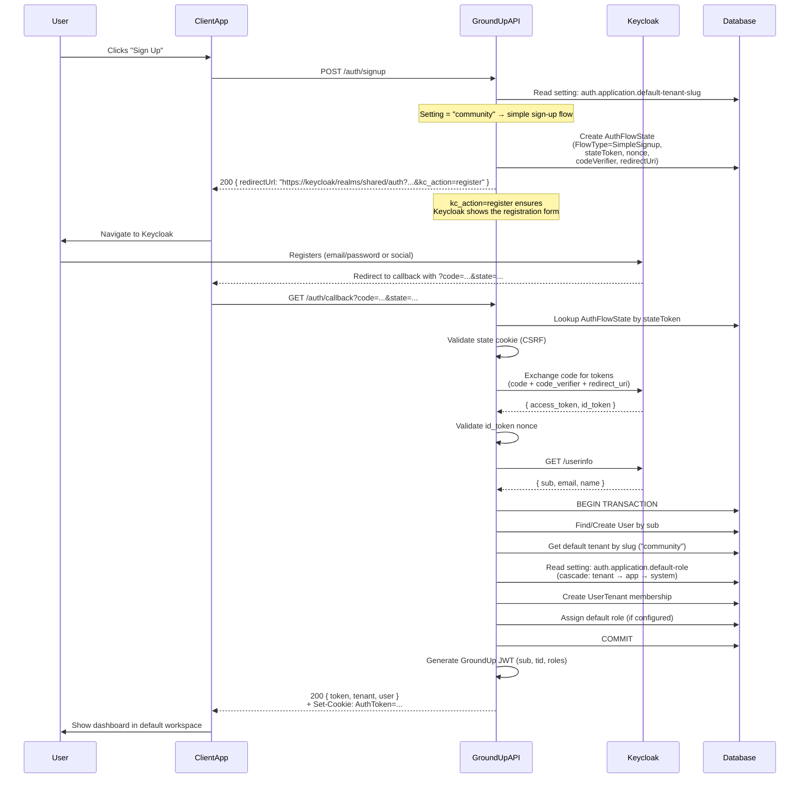
```mermaid
sequenceDiagram
    participant User
    participant ClientApp
    participant GroundUpAPI
    participant Keycloak
    participant Database

    User->>ClientApp: Clicks "Sign Up"
    ClientApp->>GroundUpAPI: POST /auth/signup
    GroundUpAPI->>Database: Read setting: auth.application.default-tenant-slug
    Note over GroundUpAPI: Setting = "community" → simple sign-up flow
    GroundUpAPI->>Database: Create AuthFlowState<br/>(FlowType=SimpleSignup,<br/>stateToken, nonce,<br/>codeVerifier, redirectUri)
    GroundUpAPI-->>ClientApp: 200 { redirectUrl: "https://keycloak/realms/shared/auth?...&kc_action=register" }
    Note over GroundUpAPI: kc_action=register ensures<br/>Keycloak shows the registration form
    ClientApp->>User: Navigate to Keycloak
    User->>Keycloak: Registers (email/password or social)
    Keycloak-->>ClientApp: Redirect to callback with ?code=...&state=...
    ClientApp->>GroundUpAPI: GET /auth/callback?code=...&state=...
    GroundUpAPI->>Database: Lookup AuthFlowState by stateToken
    GroundUpAPI->>GroundUpAPI: Validate state cookie (CSRF)
    GroundUpAPI->>Keycloak: Exchange code for tokens<br/>(code + code_verifier + redirect_uri)
    Keycloak-->>GroundUpAPI: { access_token, id_token }
    GroundUpAPI->>GroundUpAPI: Validate id_token nonce
    GroundUpAPI->>Keycloak: GET /userinfo
    Keycloak-->>GroundUpAPI: { sub, email, name }
    GroundUpAPI->>Database: BEGIN TRANSACTION
    GroundUpAPI->>Database: Find/Create User by sub
    GroundUpAPI->>Database: Get default tenant by slug ("community")
    GroundUpAPI->>Database: Read setting: auth.application.default-role<br/>(cascade: tenant → app → system)
    GroundUpAPI->>Database: Create UserTenant membership
    GroundUpAPI->>Database: Assign default role (if configured)
    GroundUpAPI->>Database: COMMIT
    GroundUpAPI->>GroundUpAPI: Generate GroundUp JWT (sub, tid, roles)
    GroundUpAPI-->>ClientApp: 200 { token, tenant, user }<br/>+ Set-Cookie: AuthToken=...
    ClientApp->>User: Show dashboard in default workspace
```

**Edge cases:**
- User already exists (logged in at Keycloak): they just get matched by `sub` — no new user created, just membership added if not already a member.
- Social login with no email: works fine — email is optional. Display name comes from the `name` or `preferred_username` claim.
- Already a member of the default tenant: idempotent — just issue the token, no duplicate membership.
- `default-tenant-slug` not configured: the API returns 400 with a clear error — the consuming app must configure a default tenant for simple sign-up to work.

### 2. Login (Existing User, Single Membership — Auto-Select)

**User intent:** "I want to log in to the app. I only belong to one org."

**What the user sees:**
1. Clicks "Login"
2. Redirected to Keycloak — enters credentials (or SSO session auto-approves)
3. Returns to the app, already inside their one org. No extra steps.

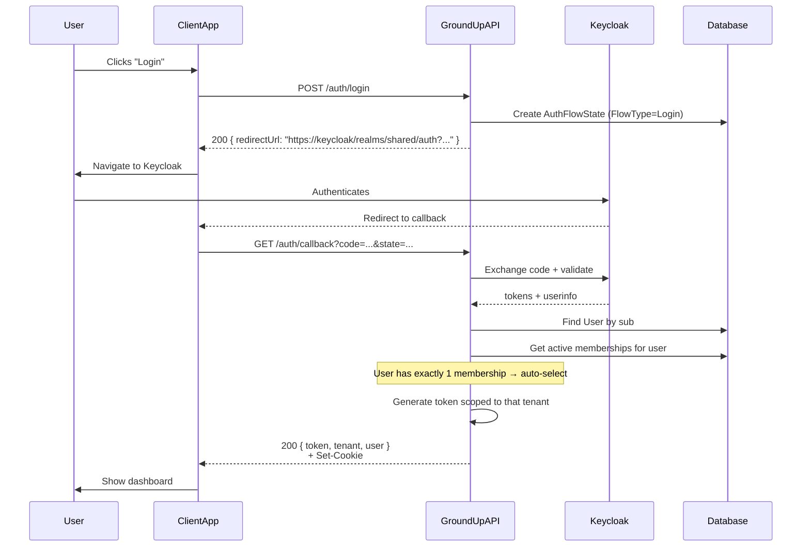
```mermaid
sequenceDiagram
    participant User
    participant ClientApp
    participant GroundUpAPI
    participant Keycloak
    participant Database

    User->>ClientApp: Clicks "Login"
    ClientApp->>GroundUpAPI: POST /auth/login
    GroundUpAPI->>Database: Create AuthFlowState (FlowType=Login)
    GroundUpAPI-->>ClientApp: 200 { redirectUrl: "https://keycloak/realms/shared/auth?..." }
    ClientApp->>User: Navigate to Keycloak
    User->>Keycloak: Authenticates
    Keycloak-->>ClientApp: Redirect to callback
    ClientApp->>GroundUpAPI: GET /auth/callback?code=...&state=...
    GroundUpAPI->>Keycloak: Exchange code + validate
    Keycloak-->>GroundUpAPI: tokens + userinfo
    GroundUpAPI->>Database: Find User by sub
    GroundUpAPI->>Database: Get active memberships for user
    Note over GroundUpAPI: User has exactly 1 membership → auto-select
    GroundUpAPI->>GroundUpAPI: Generate token scoped to that tenant
    GroundUpAPI-->>ClientApp: 200 { token, tenant, user }<br/>+ Set-Cookie
    ClientApp->>User: Show dashboard
```

**Notes:**
- Zero friction for the common case. Most users belong to one org.
- If the user's only membership is in a standard tenant, they land directly in it.
- Login does NOT include `kc_action=register` — Keycloak shows its standard login form.

### 3. Login (Multiple Memberships — Picker)

**User intent:** "I belong to multiple orgs and need to choose which one to work in."

**What the user sees:**
1. Clicks "Login"
2. Authenticates at Keycloak
3. Returns to the app and sees a tenant picker showing their orgs
4. Selects an org
5. Lands in that org's dashboard

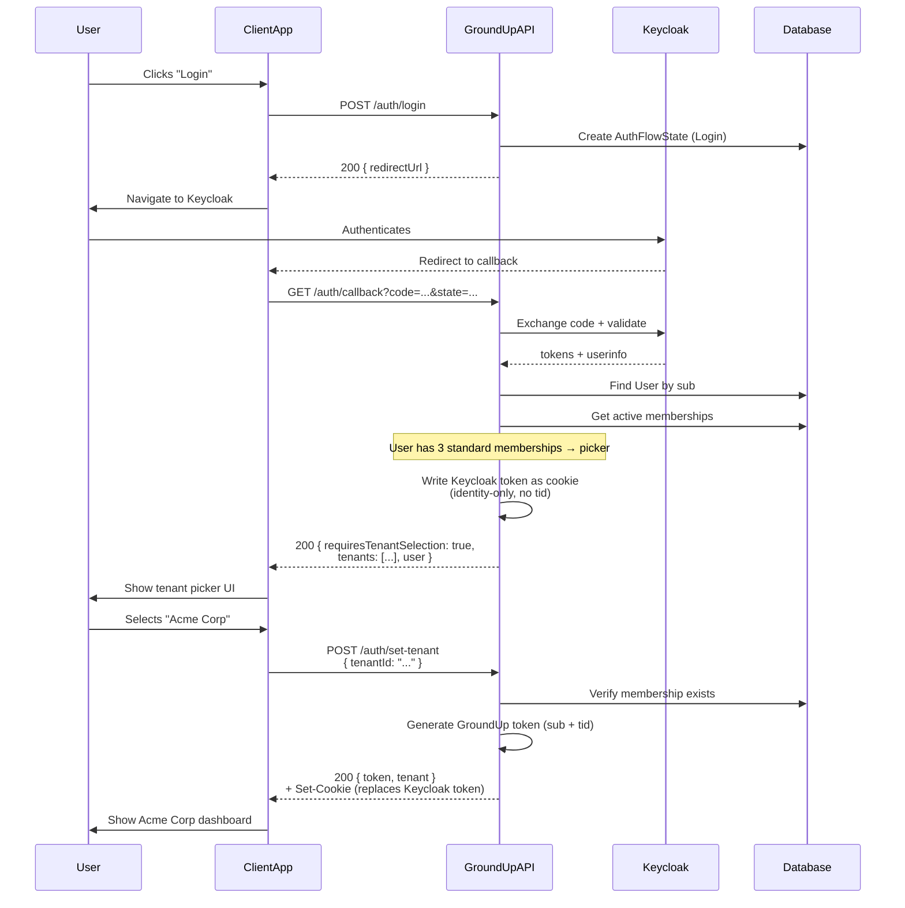
```mermaid
sequenceDiagram
    participant User
    participant ClientApp
    participant GroundUpAPI
    participant Keycloak
    participant Database

    User->>ClientApp: Clicks "Login"
    ClientApp->>GroundUpAPI: POST /auth/login
    GroundUpAPI->>Database: Create AuthFlowState (Login)
    GroundUpAPI-->>ClientApp: 200 { redirectUrl }
    ClientApp->>User: Navigate to Keycloak
    User->>Keycloak: Authenticates
    Keycloak-->>ClientApp: Redirect to callback
    ClientApp->>GroundUpAPI: GET /auth/callback?code=...&state=...
    GroundUpAPI->>Keycloak: Exchange code + validate
    Keycloak-->>GroundUpAPI: tokens + userinfo
    GroundUpAPI->>Database: Find User by sub
    GroundUpAPI->>Database: Get active memberships
    Note over GroundUpAPI: User has 3 standard memberships → picker
    GroundUpAPI->>GroundUpAPI: Write Keycloak token as cookie<br/>(identity-only, no tid)
    GroundUpAPI-->>ClientApp: 200 { requiresTenantSelection: true,<br/>tenants: [...], user }
    ClientApp->>User: Show tenant picker UI
    User->>ClientApp: Selects "Acme Corp"
    ClientApp->>GroundUpAPI: POST /auth/set-tenant<br/>{ tenantId: "..." }
    GroundUpAPI->>Database: Verify membership exists
    GroundUpAPI->>GroundUpAPI: Generate GroundUp token (sub + tid)
    GroundUpAPI-->>ClientApp: 200 { token, tenant }<br/>+ Set-Cookie (replaces Keycloak token)
    ClientApp->>User: Show Acme Corp dashboard
```

**Notes:**
- During the picker phase, the user is "identity-authenticated" only — the Keycloak token cookie proves who they are, but they have no tenant context and cannot access any tenant data.
- Enterprise tenants (with `RealmName` set) are excluded from the picker — they're reached via their own subdomain.
- The picker shows only standard-realm tenants where the user has active membership.

### 4. Login (Subdomain/Host-Pinned — No Picker)

**User intent:** "I'm going to acme.myapp.com and expect to land directly in Acme Corp."

**What the user sees:**
1. Navigates to `acme.myapp.com`
2. Client app detects they're not logged in → triggers login
3. Authenticates at Keycloak
4. Returns directly to Acme Corp — no picker, no confusion

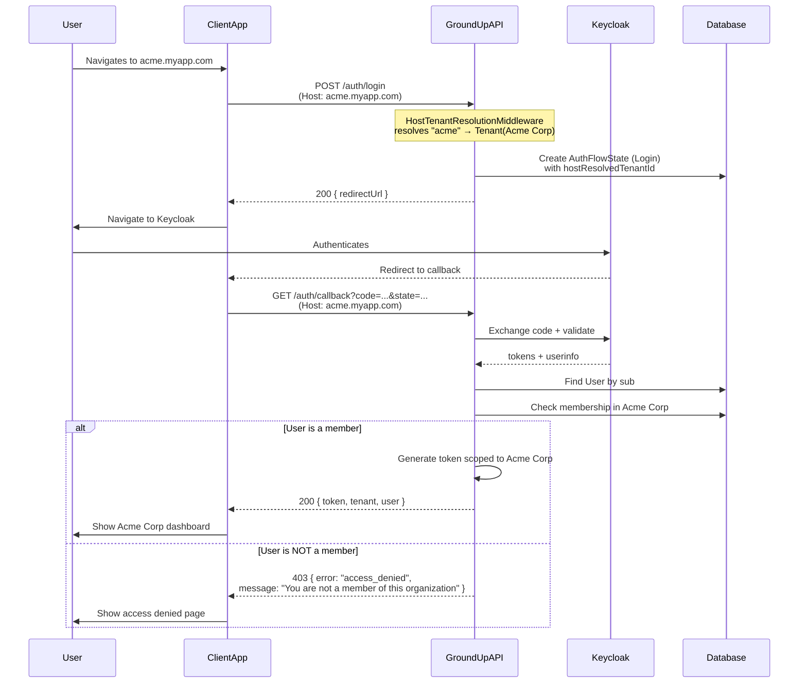
```mermaid
sequenceDiagram
    participant User
    participant ClientApp
    participant GroundUpAPI
    participant Keycloak
    participant Database

    User->>ClientApp: Navigates to acme.myapp.com
    ClientApp->>GroundUpAPI: POST /auth/login<br/>(Host: acme.myapp.com)
    Note over GroundUpAPI: HostTenantResolutionMiddleware<br/>resolves "acme" → Tenant(Acme Corp)
    GroundUpAPI->>Database: Create AuthFlowState (Login)<br/>with hostResolvedTenantId
    GroundUpAPI-->>ClientApp: 200 { redirectUrl }
    ClientApp->>User: Navigate to Keycloak
    User->>Keycloak: Authenticates
    Keycloak-->>ClientApp: Redirect to callback
    ClientApp->>GroundUpAPI: GET /auth/callback?code=...&state=...<br/>(Host: acme.myapp.com)
    GroundUpAPI->>Keycloak: Exchange code + validate
    Keycloak-->>GroundUpAPI: tokens + userinfo
    GroundUpAPI->>Database: Find User by sub
    GroundUpAPI->>Database: Check membership in Acme Corp
    alt User is a member
        GroundUpAPI->>GroundUpAPI: Generate token scoped to Acme Corp
        GroundUpAPI-->>ClientApp: 200 { token, tenant, user }
        ClientApp->>User: Show Acme Corp dashboard
    else User is NOT a member
        GroundUpAPI-->>ClientApp: 403 { error: "access_denied",<br/>message: "You are not a member of this organization" }
        ClientApp->>User: Show access denied page
    end
```

**Notes:**
- Host-pinning is deterministic — the subdomain unambiguously identifies the target tenant.
- No picker is ever shown. Either you're a member and you're in, or you're denied.
- This works even for users with multiple memberships. The host pins the selection.

### 5. Sign-Up + Create Organization

**User intent:** "I want to start using this app with my own workspace/company."

**Precondition:** `auth.application.signup-creates-org = true`. The consuming app uses a workspace-per-customer pattern (like Slack/Notion).

**What the user sees:**
1. Clicks "Create Organization" / "Get Started" in the client app
2. Enters an organization name (e.g., "Acme Corp")
3. Gets redirected to Keycloak (shared realm) — signs up or logs in with Google/Facebook/email
4. Returns to the app, inside their new org as admin

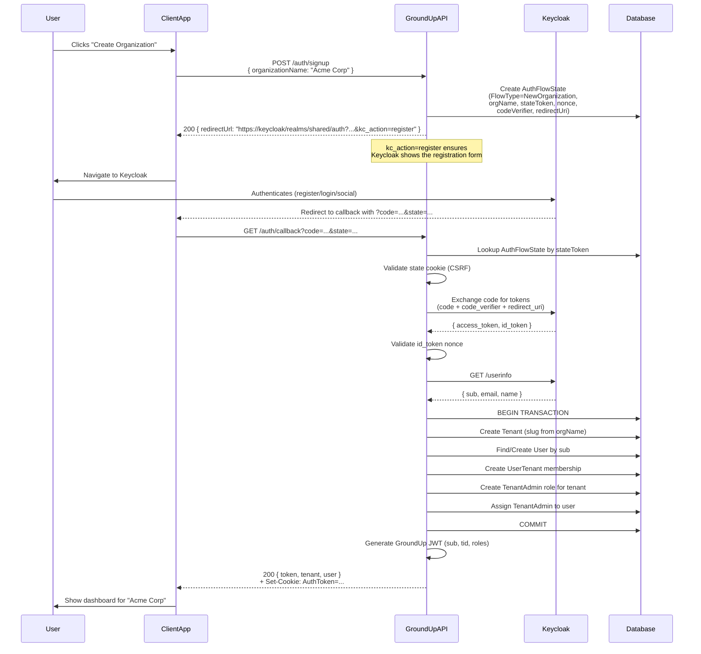
```mermaid
sequenceDiagram
    participant User
    participant ClientApp
    participant GroundUpAPI
    participant Keycloak
    participant Database

    User->>ClientApp: Clicks "Create Organization"
    ClientApp->>GroundUpAPI: POST /auth/signup<br/>{ organizationName: "Acme Corp" }
    GroundUpAPI->>Database: Create AuthFlowState<br/>(FlowType=NewOrganization,<br/>orgName, stateToken, nonce,<br/>codeVerifier, redirectUri)
    GroundUpAPI-->>ClientApp: 200 { redirectUrl: "https://keycloak/realms/shared/auth?...&kc_action=register" }
    Note over GroundUpAPI: kc_action=register ensures<br/>Keycloak shows the registration form
    ClientApp->>User: Navigate to Keycloak
    User->>Keycloak: Authenticates (register/login/social)
    Keycloak-->>ClientApp: Redirect to callback with ?code=...&state=...
    ClientApp->>GroundUpAPI: GET /auth/callback?code=...&state=...
    GroundUpAPI->>Database: Lookup AuthFlowState by stateToken
    GroundUpAPI->>GroundUpAPI: Validate state cookie (CSRF)
    GroundUpAPI->>Keycloak: Exchange code for tokens<br/>(code + code_verifier + redirect_uri)
    Keycloak-->>GroundUpAPI: { access_token, id_token }
    GroundUpAPI->>GroundUpAPI: Validate id_token nonce
    GroundUpAPI->>Keycloak: GET /userinfo
    Keycloak-->>GroundUpAPI: { sub, email, name }
    GroundUpAPI->>Database: BEGIN TRANSACTION
    GroundUpAPI->>Database: Create Tenant (slug from orgName)
    GroundUpAPI->>Database: Find/Create User by sub
    GroundUpAPI->>Database: Create UserTenant membership
    GroundUpAPI->>Database: Create TenantAdmin role for tenant
    GroundUpAPI->>Database: Assign TenantAdmin to user
    GroundUpAPI->>Database: COMMIT
    GroundUpAPI->>GroundUpAPI: Generate GroundUp JWT (sub, tid, roles)
    GroundUpAPI-->>ClientApp: 200 { token, tenant, user }<br/>+ Set-Cookie: AuthToken=...
    ClientApp->>User: Show dashboard for "Acme Corp"
```

**Edge cases:**
- Slug collision: if "acme-corp" already exists, append `-2`, `-3`, etc. Protected by DB unique constraint + retry.
- User already exists (logged in at Keycloak): they just get matched by `sub` — no new user created, but new tenant + membership are.
- Social login with no email: works fine — email is optional. Display name comes from the `name` or `preferred_username` claim.

### 6. Create Additional Organization (Existing User)

**User intent:** "I already have one workspace, but I want to create another for a different team/project."

**What the user sees:**
1. Already logged in to their first org
2. Clicks "Create New Organization" from a workspace switcher or settings
3. Enters a new org name
4. Doesn't need to re-authenticate (they're already signed in at Keycloak's session level)
5. Gets redirected to Keycloak, but Keycloak auto-approves (SSO session exists) — appears instant
6. Returns to the app, now in the new org as admin

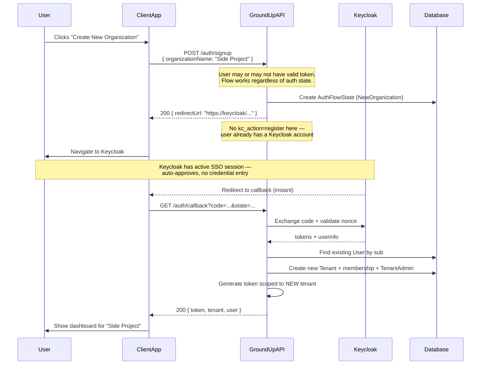
```mermaid
sequenceDiagram
    participant User
    participant ClientApp
    participant GroundUpAPI
    participant Keycloak
    participant Database

    User->>ClientApp: Clicks "Create New Organization"
    ClientApp->>GroundUpAPI: POST /auth/signup<br/>{ organizationName: "Side Project" }
    Note over GroundUpAPI: User may or may not have valid token.<br/>Flow works regardless of auth state.
    GroundUpAPI->>Database: Create AuthFlowState (NewOrganization)
    GroundUpAPI-->>ClientApp: 200 { redirectUrl: "https://keycloak/..." }
    Note over GroundUpAPI: No kc_action=register here —<br/>user already has a Keycloak account
    ClientApp->>User: Navigate to Keycloak
    Note over User,Keycloak: Keycloak has active SSO session —<br/>auto-approves, no credential entry
    Keycloak-->>ClientApp: Redirect to callback (instant)
    ClientApp->>GroundUpAPI: GET /auth/callback?code=...&state=...
    GroundUpAPI->>Keycloak: Exchange code + validate nonce
    Keycloak-->>GroundUpAPI: tokens + userinfo
    GroundUpAPI->>Database: Find existing User by sub
    GroundUpAPI->>Database: Create new Tenant + membership + TenantAdmin
    GroundUpAPI->>GroundUpAPI: Generate token scoped to NEW tenant
    GroundUpAPI-->>ClientApp: 200 { token, tenant, user }
    ClientApp->>User: Show dashboard for "Side Project"
```

**Notes:**
- The user doesn't re-enter credentials because Keycloak's browser session is still alive.
- From the user's perspective, this feels like "create and switch" in one action.
- The old org still exists — they can switch back via tenant switch (Scenario 12).
- No `kc_action=register` is included since the user already has a Keycloak account — they just need to prove identity via the existing SSO session.

### 7. Invitation Acceptance — New User

**User intent:** "I received an invitation email to join a team. I don't have an account yet."

**What the user sees:**
1. Receives email: "You've been invited to join Acme Corp on [App]"
2. Clicks the invitation link
3. Lands on a "You've been invited" page in the client app
4. Clicks "Accept & Create Account"
5. Redirected to Keycloak — registers for a new account (or uses social login)
6. Returns to the app, inside Acme Corp with the invited role

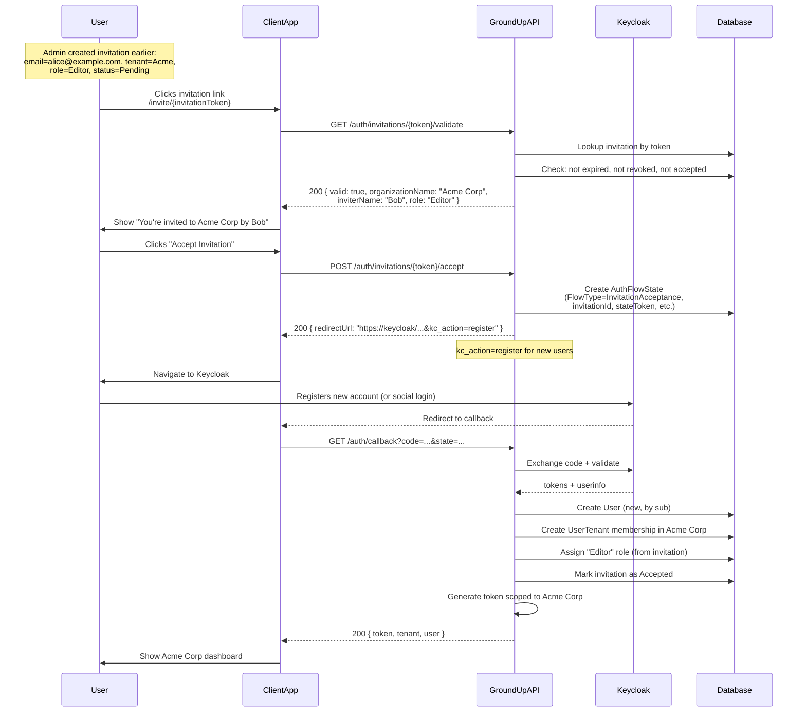
```mermaid
sequenceDiagram
    participant User
    participant ClientApp
    participant GroundUpAPI
    participant Keycloak
    participant Database

    Note over User: Admin created invitation earlier:<br/>email=alice@example.com, tenant=Acme,<br/>role=Editor, status=Pending
    User->>ClientApp: Clicks invitation link<br/>/invite/{invitationToken}
    ClientApp->>GroundUpAPI: GET /auth/invitations/{token}/validate
    GroundUpAPI->>Database: Lookup invitation by token
    GroundUpAPI->>Database: Check: not expired, not revoked, not accepted
    GroundUpAPI-->>ClientApp: 200 { valid: true, organizationName: "Acme Corp",<br/>inviterName: "Bob", role: "Editor" }
    ClientApp->>User: Show "You're invited to Acme Corp by Bob"
    User->>ClientApp: Clicks "Accept Invitation"
    ClientApp->>GroundUpAPI: POST /auth/invitations/{token}/accept
    GroundUpAPI->>Database: Create AuthFlowState<br/>(FlowType=InvitationAcceptance,<br/>invitationId, stateToken, etc.)
    GroundUpAPI-->>ClientApp: 200 { redirectUrl: "https://keycloak/...&kc_action=register" }
    Note over GroundUpAPI: kc_action=register for new users
    ClientApp->>User: Navigate to Keycloak
    User->>Keycloak: Registers new account (or social login)
    Keycloak-->>ClientApp: Redirect to callback
    ClientApp->>GroundUpAPI: GET /auth/callback?code=...&state=...
    GroundUpAPI->>Keycloak: Exchange code + validate
    Keycloak-->>GroundUpAPI: tokens + userinfo
    GroundUpAPI->>Database: Create User (new, by sub)
    GroundUpAPI->>Database: Create UserTenant membership in Acme Corp
    GroundUpAPI->>Database: Assign "Editor" role (from invitation)
    GroundUpAPI->>Database: Mark invitation as Accepted
    GroundUpAPI->>GroundUpAPI: Generate token scoped to Acme Corp
    GroundUpAPI-->>ClientApp: 200 { token, tenant, user }
    ClientApp->>User: Show Acme Corp dashboard
```

**Edge cases:**
- Invitation expired → validate endpoint returns `{ valid: false, reason: "expired" }`. Client shows friendly message.
- Invitation revoked → same pattern.
- User registers with a different email than invited → that's fine. We match by `sub`, not email. The invitation's email was just for delivery.
- Race condition: two people click same invitation → first one wins (invitation marked Accepted), second gets `410 Gone`.

### 8. Invitation Acceptance — Existing User

**User intent:** "I received an invitation to join another org. I already have an account."

**What the user sees:**
1. Receives invitation email
2. Clicks link → sees the invitation page
3. Clicks "Accept"
4. Redirected to Keycloak — but since they already have a session, auto-approves instantly
5. Returns to the app, now inside the new org

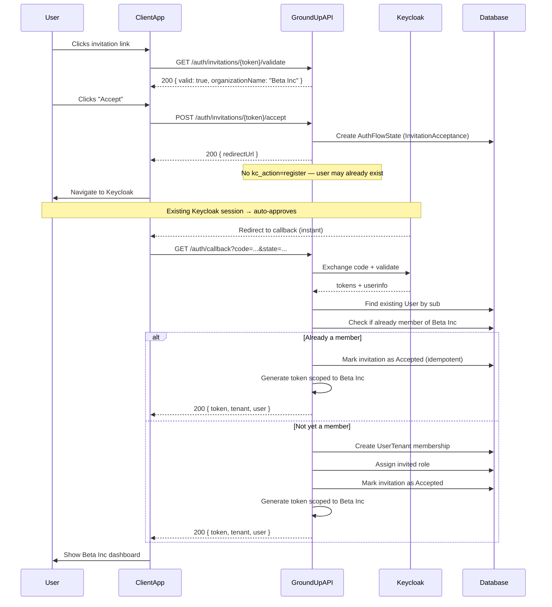
```mermaid
sequenceDiagram
    participant User
    participant ClientApp
    participant GroundUpAPI
    participant Keycloak
    participant Database

    User->>ClientApp: Clicks invitation link
    ClientApp->>GroundUpAPI: GET /auth/invitations/{token}/validate
    GroundUpAPI-->>ClientApp: 200 { valid: true, organizationName: "Beta Inc" }
    User->>ClientApp: Clicks "Accept"
    ClientApp->>GroundUpAPI: POST /auth/invitations/{token}/accept
    GroundUpAPI->>Database: Create AuthFlowState (InvitationAcceptance)
    GroundUpAPI-->>ClientApp: 200 { redirectUrl }
    Note over GroundUpAPI: No kc_action=register — user may already exist
    ClientApp->>User: Navigate to Keycloak
    Note over User,Keycloak: Existing Keycloak session → auto-approves
    Keycloak-->>ClientApp: Redirect to callback (instant)
    ClientApp->>GroundUpAPI: GET /auth/callback?code=...&state=...
    GroundUpAPI->>Keycloak: Exchange code + validate
    Keycloak-->>GroundUpAPI: tokens + userinfo
    GroundUpAPI->>Database: Find existing User by sub
    GroundUpAPI->>Database: Check if already member of Beta Inc
    alt Already a member
        GroundUpAPI->>Database: Mark invitation as Accepted (idempotent)
        GroundUpAPI->>GroundUpAPI: Generate token scoped to Beta Inc
        GroundUpAPI-->>ClientApp: 200 { token, tenant, user }
    else Not yet a member
        GroundUpAPI->>Database: Create UserTenant membership
        GroundUpAPI->>Database: Assign invited role
        GroundUpAPI->>Database: Mark invitation as Accepted
        GroundUpAPI->>GroundUpAPI: Generate token scoped to Beta Inc
        GroundUpAPI-->>ClientApp: 200 { token, tenant, user }
    end
    ClientApp->>User: Show Beta Inc dashboard
```

**Notes:**
- The user never re-enters credentials (Keycloak SSO session).
- If they're already a member, the invitation is just marked as accepted — no duplicate membership created.
- After acceptance, they can switch between their orgs freely (Scenario 12).

### 9. Join Link — New User

**User intent:** "I found a shareable join link (posted on a website, shared in Slack) and want to join that org."

**What the user sees:**
1. Clicks a join link (e.g., `myapp.com/join/abc123`)
2. Sees a "Join Acme Corp" page
3. Clicks "Join"
4. Redirected to Keycloak — registers
5. Returns to the app, inside Acme Corp

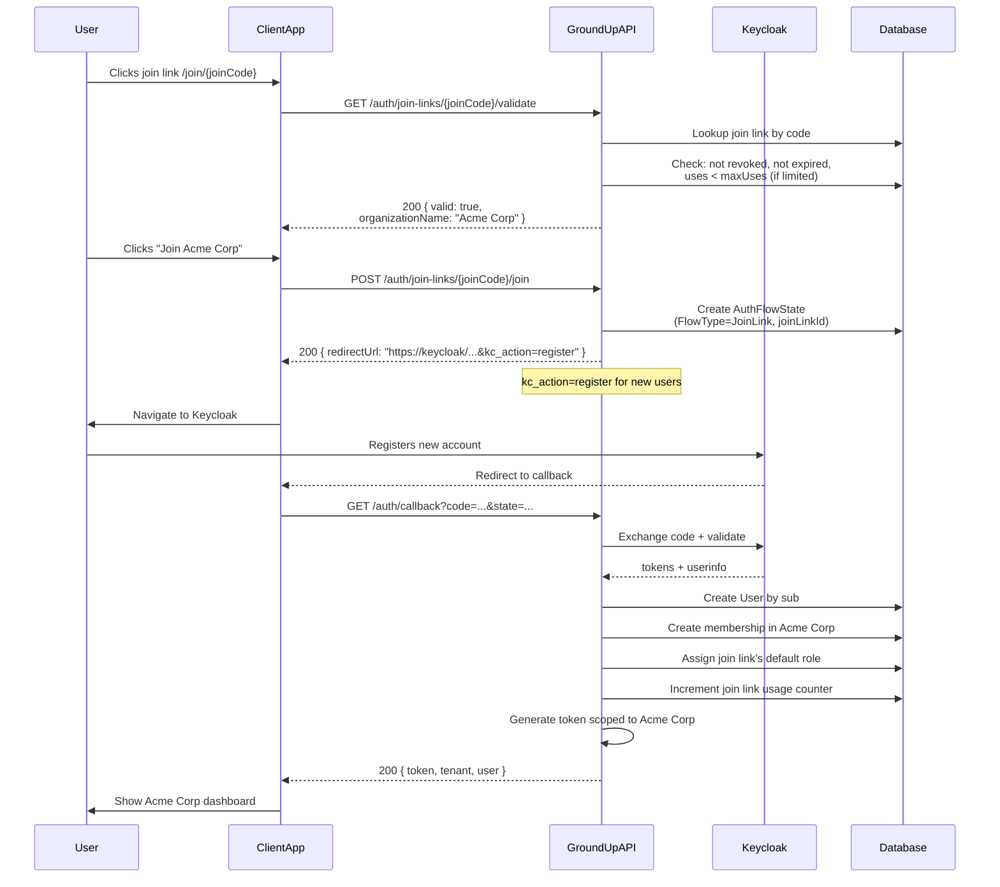
```mermaid
sequenceDiagram
    participant User
    participant ClientApp
    participant GroundUpAPI
    participant Keycloak
    participant Database

    User->>ClientApp: Clicks join link /join/{joinCode}
    ClientApp->>GroundUpAPI: GET /auth/join-links/{joinCode}/validate
    GroundUpAPI->>Database: Lookup join link by code
    GroundUpAPI->>Database: Check: not revoked, not expired,<br/>uses < maxUses (if limited)
    GroundUpAPI-->>ClientApp: 200 { valid: true,<br/>organizationName: "Acme Corp" }
    User->>ClientApp: Clicks "Join Acme Corp"
    ClientApp->>GroundUpAPI: POST /auth/join-links/{joinCode}/join
    GroundUpAPI->>Database: Create AuthFlowState<br/>(FlowType=JoinLink, joinLinkId)
    GroundUpAPI-->>ClientApp: 200 { redirectUrl: "https://keycloak/...&kc_action=register" }
    Note over GroundUpAPI: kc_action=register for new users
    ClientApp->>User: Navigate to Keycloak
    User->>Keycloak: Registers new account
    Keycloak-->>ClientApp: Redirect to callback
    ClientApp->>GroundUpAPI: GET /auth/callback?code=...&state=...
    GroundUpAPI->>Keycloak: Exchange code + validate
    Keycloak-->>GroundUpAPI: tokens + userinfo
    GroundUpAPI->>Database: Create User by sub
    GroundUpAPI->>Database: Create membership in Acme Corp
    GroundUpAPI->>Database: Assign join link's default role
    GroundUpAPI->>Database: Increment join link usage counter
    GroundUpAPI->>GroundUpAPI: Generate token scoped to Acme Corp
    GroundUpAPI-->>ClientApp: 200 { token, tenant, user }
    ClientApp->>User: Show Acme Corp dashboard
```

**Notes:**
- Join links can have: expiration date, max uses, a default role, revocation status.
- Unlike invitations, join links are not tied to a specific email — anyone with the link can use it.
- Useful for communities, open teams, onboarding batches.

### 10. Join Link — Existing User

**User intent:** "I already have an account but want to join another org via a shared link."

**What the user sees:**
1. Clicks join link
2. Sees "Join Acme Corp" page
3. Clicks "Join"
4. Keycloak auto-approves (existing session)
5. Lands in Acme Corp

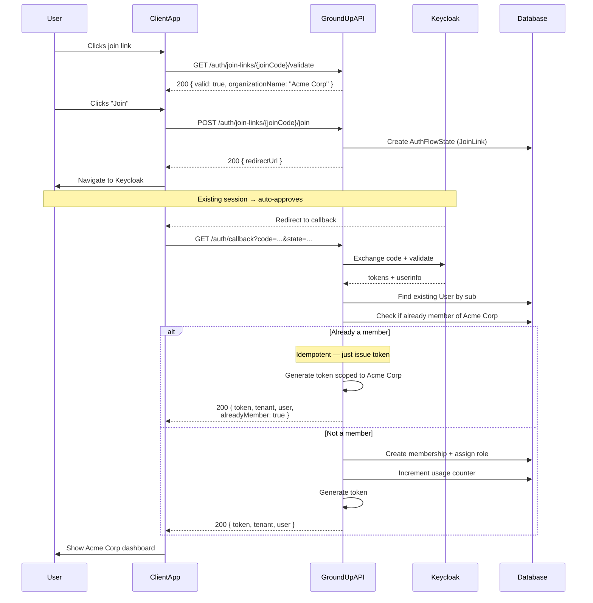
```mermaid
sequenceDiagram
    participant User
    participant ClientApp
    participant GroundUpAPI
    participant Keycloak
    participant Database

    User->>ClientApp: Clicks join link
    ClientApp->>GroundUpAPI: GET /auth/join-links/{joinCode}/validate
    GroundUpAPI-->>ClientApp: 200 { valid: true, organizationName: "Acme Corp" }
    User->>ClientApp: Clicks "Join"
    ClientApp->>GroundUpAPI: POST /auth/join-links/{joinCode}/join
    GroundUpAPI->>Database: Create AuthFlowState (JoinLink)
    GroundUpAPI-->>ClientApp: 200 { redirectUrl }
    ClientApp->>User: Navigate to Keycloak
    Note over User,Keycloak: Existing session → auto-approves
    Keycloak-->>ClientApp: Redirect to callback
    ClientApp->>GroundUpAPI: GET /auth/callback?code=...&state=...
    GroundUpAPI->>Keycloak: Exchange code + validate
    Keycloak-->>GroundUpAPI: tokens + userinfo
    GroundUpAPI->>Database: Find existing User by sub
    GroundUpAPI->>Database: Check if already member of Acme Corp
    alt Already a member
        Note over GroundUpAPI: Idempotent — just issue token
        GroundUpAPI->>GroundUpAPI: Generate token scoped to Acme Corp
        GroundUpAPI-->>ClientApp: 200 { token, tenant, user,<br/>alreadyMember: true }
    else Not a member
        GroundUpAPI->>Database: Create membership + assign role
        GroundUpAPI->>Database: Increment usage counter
        GroundUpAPI->>GroundUpAPI: Generate token
        GroundUpAPI-->>ClientApp: 200 { token, tenant, user }
    end
    ClientApp->>User: Show Acme Corp dashboard
```

**Notes:**
- If already a member, we don't create a duplicate membership — we just log them in to that tenant.
- The client can show a "You're already a member!" toast if `alreadyMember: true`.

### 11. Token Refresh (Sliding Window)

**User intent:** "I'm actively using the app. My session should stay alive without interrupting me."

**What the user sees:** Nothing. The refresh happens transparently.

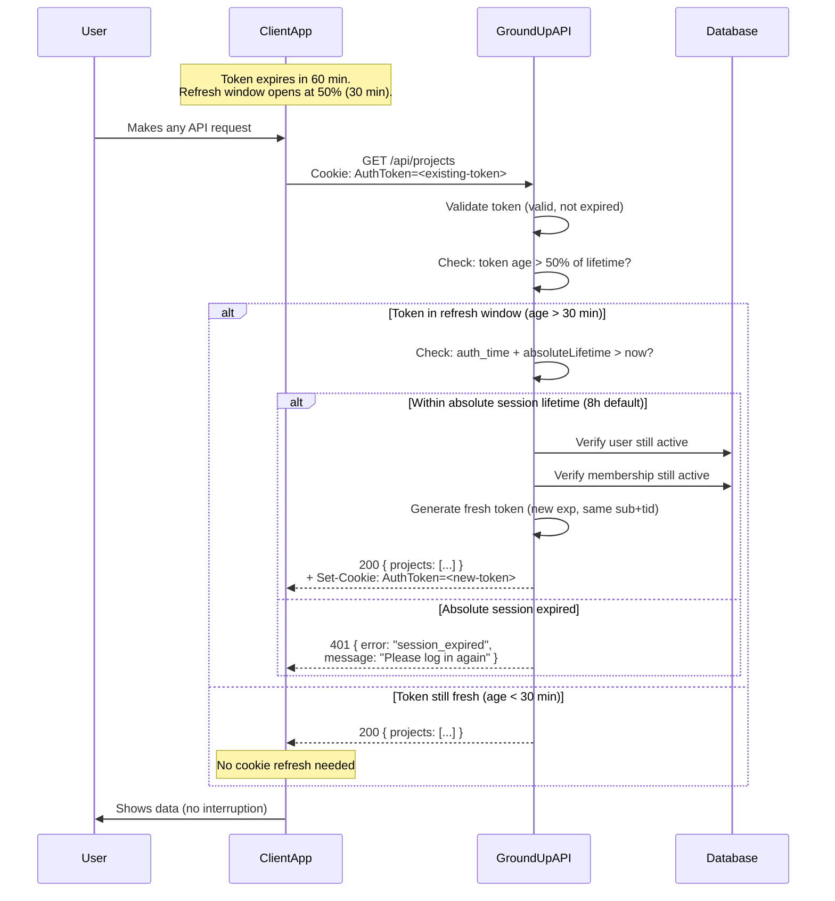
```mermaid
sequenceDiagram
    participant User
    participant ClientApp
    participant GroundUpAPI
    participant Database

    Note over ClientApp: Token expires in 60 min.<br/>Refresh window opens at 50% (30 min).
    User->>ClientApp: Makes any API request
    ClientApp->>GroundUpAPI: GET /api/projects<br/>Cookie: AuthToken=<existing-token>
    GroundUpAPI->>GroundUpAPI: Validate token (valid, not expired)
    GroundUpAPI->>GroundUpAPI: Check: token age > 50% of lifetime?
    alt Token in refresh window (age > 30 min)
        GroundUpAPI->>GroundUpAPI: Check: auth_time + absoluteLifetime > now?
        alt Within absolute session lifetime (8h default)
            GroundUpAPI->>Database: Verify user still active
            GroundUpAPI->>Database: Verify membership still active
            GroundUpAPI->>GroundUpAPI: Generate fresh token (new exp, same sub+tid)
            GroundUpAPI-->>ClientApp: 200 { projects: [...] }<br/>+ Set-Cookie: AuthToken=<new-token>
        else Absolute session expired
            GroundUpAPI-->>ClientApp: 401 { error: "session_expired",<br/>message: "Please log in again" }
        end
    else Token still fresh (age < 30 min)
        GroundUpAPI-->>ClientApp: 200 { projects: [...] }
        Note over ClientApp: No cookie refresh needed
    end
    ClientApp->>User: Shows data (no interruption)
```

**Key design points:**
- No Keycloak interaction at refresh time. This is a pure GroundUp token re-issue.
- The `auth_time` claim records when the user originally authenticated. It never changes across refreshes.
- Absolute session lifetime (default 8h) prevents infinite session extension.
- On each refresh, the API re-checks: user active? membership active? This is the revocation control point.
- The sliding window means tokens are refreshed "lazily" on the next request after 50%, not on a timer.

### 12. Tenant Switch (No Re-Auth)

**User intent:** "I'm working in Org A but want to switch to Org B without logging in again."

**What the user sees:**
1. Clicks on a workspace switcher
2. Sees list of their orgs
3. Clicks on Org B
4. Instantly switches context — no authentication prompt

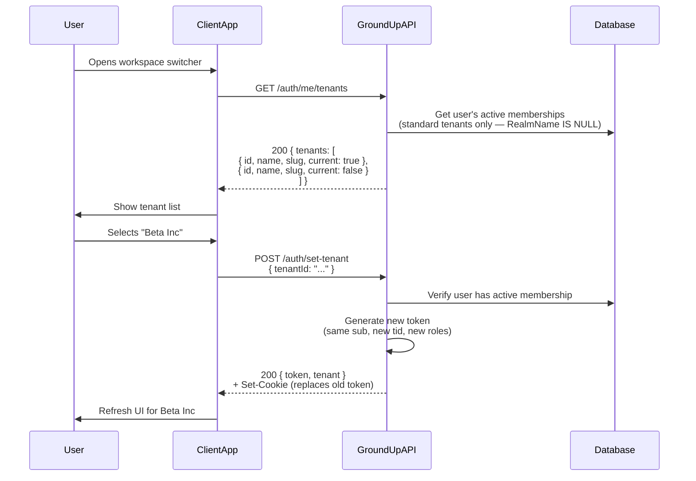
```mermaid
sequenceDiagram
    participant User
    participant ClientApp
    participant GroundUpAPI
    participant Database

    User->>ClientApp: Opens workspace switcher
    ClientApp->>GroundUpAPI: GET /auth/me/tenants
    GroundUpAPI->>Database: Get user's active memberships<br/>(standard tenants only — RealmName IS NULL)
    GroundUpAPI-->>ClientApp: 200 { tenants: [<br/>  { id, name, slug, current: true },<br/>  { id, name, slug, current: false }<br/>] }
    ClientApp->>User: Show tenant list
    User->>ClientApp: Selects "Beta Inc"
    ClientApp->>GroundUpAPI: POST /auth/set-tenant<br/>{ tenantId: "..." }
    GroundUpAPI->>Database: Verify user has active membership
    GroundUpAPI->>GroundUpAPI: Generate new token<br/>(same sub, new tid, new roles)
    GroundUpAPI-->>ClientApp: 200 { token, tenant }<br/>+ Set-Cookie (replaces old token)
    ClientApp->>User: Refresh UI for Beta Inc
```

**Notes:**
- This only works for tenants in the SAME Keycloak realm (standard tenants in the shared realm).
- Enterprise tenants are excluded from this list — switching to an enterprise tenant requires re-auth through their realm (Scenario 19).
- The new token carries the same `auth_time` as the old one — switching doesn't reset the session clock.
- Roles in the new token reflect the user's roles in the target tenant, not the source tenant.

### 13. Leave Organization

**User intent:** "I want to leave an org I no longer need access to."

**What the user sees:**
1. In org settings, clicks "Leave Organization"
2. Confirms the action
3. Membership is removed; user is redirected to another org or the login screen

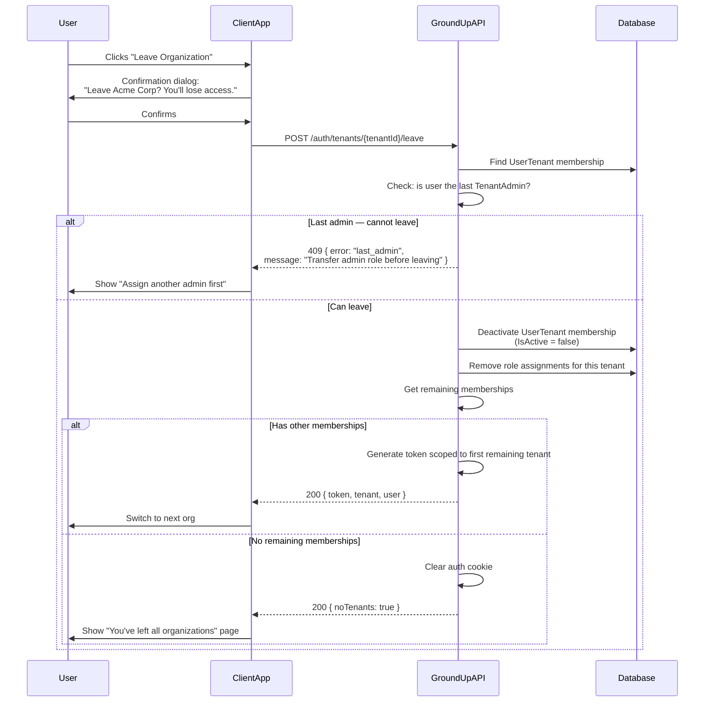
```mermaid
sequenceDiagram
    participant User
    participant ClientApp
    participant GroundUpAPI
    participant Database

    User->>ClientApp: Clicks "Leave Organization"
    ClientApp->>User: Confirmation dialog:<br/>"Leave Acme Corp? You'll lose access."
    User->>ClientApp: Confirms
    ClientApp->>GroundUpAPI: POST /auth/tenants/{tenantId}/leave
    GroundUpAPI->>Database: Find UserTenant membership
    GroundUpAPI->>GroundUpAPI: Check: is user the last TenantAdmin?
    alt Last admin — cannot leave
        GroundUpAPI-->>ClientApp: 409 { error: "last_admin",<br/>message: "Transfer admin role before leaving" }
        ClientApp->>User: Show "Assign another admin first"
    else Can leave
        GroundUpAPI->>Database: Deactivate UserTenant membership<br/>(IsActive = false)
        GroundUpAPI->>Database: Remove role assignments for this tenant
        GroundUpAPI->>GroundUpAPI: Get remaining memberships
        alt Has other memberships
            GroundUpAPI->>GroundUpAPI: Generate token scoped to first remaining tenant
            GroundUpAPI-->>ClientApp: 200 { token, tenant, user }
            ClientApp->>User: Switch to next org
        else No remaining memberships
            GroundUpAPI->>GroundUpAPI: Clear auth cookie
            GroundUpAPI-->>ClientApp: 200 { noTenants: true }
            ClientApp->>User: Show "You've left all organizations" page
        end
    end
```

**Notes:**
- Leaving an org removes the membership — it does NOT delete the user account.
- The last admin of an org cannot leave until they transfer the admin role.
- Soft-delete: `UserTenant.IsActive = false` — membership history is preserved.
- If the user was viewing the left tenant, they're automatically switched to another org or shown a "no orgs" state.

### 14. Logout

**User intent:** "I'm done. Sign me out."

**What the user sees:**
1. Clicks "Logout"
2. App clears their session
3. Optionally redirected to Keycloak's logout endpoint to kill the SSO session

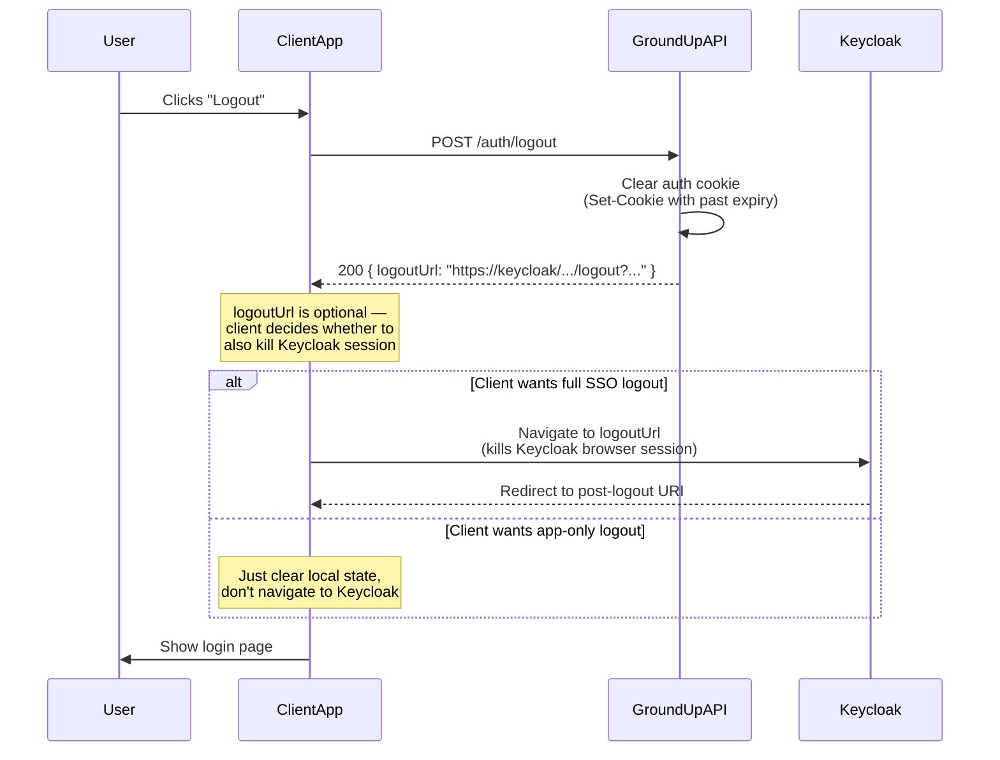
```mermaid
sequenceDiagram
    participant User
    participant ClientApp
    participant GroundUpAPI
    participant Keycloak

    User->>ClientApp: Clicks "Logout"
    ClientApp->>GroundUpAPI: POST /auth/logout
    GroundUpAPI->>GroundUpAPI: Clear auth cookie<br/>(Set-Cookie with past expiry)
    GroundUpAPI-->>ClientApp: 200 { logoutUrl: "https://keycloak/.../logout?..." }
    Note over ClientApp: logoutUrl is optional —<br/>client decides whether to<br/>also kill Keycloak session
    alt Client wants full SSO logout
        ClientApp->>Keycloak: Navigate to logoutUrl<br/>(kills Keycloak browser session)
        Keycloak-->>ClientApp: Redirect to post-logout URI
    else Client wants app-only logout
        Note over ClientApp: Just clear local state,<br/>don't navigate to Keycloak
    end
    ClientApp->>User: Show login page
```

**Notes:**
- The GroundUp API always clears its own cookie. The Keycloak logout URL is returned as optional info.
- App-only logout: user can log back in instantly (Keycloak SSO session still alive → auto-approves).
- Full SSO logout: user must re-enter credentials next time.
- The client app decides which behavior is appropriate (e.g., shared computer → full logout, personal device → app-only).

---

## Enterprise Tenant Flows (Dedicated Realm)

### 15. Enterprise Tenant Setup by Platform Admin

**User intent:** "I'm a platform admin (SuperAdmin). I need to provision a new enterprise customer with their own isolated identity realm."

**What the user sees:**
1. In the platform admin panel, clicks "Create Enterprise Tenant"
2. Fills in: org name, slug, admin email
3. System provisions everything — realm, client, tenant record
4. Gets a confirmation with the enterprise admin onboarding link

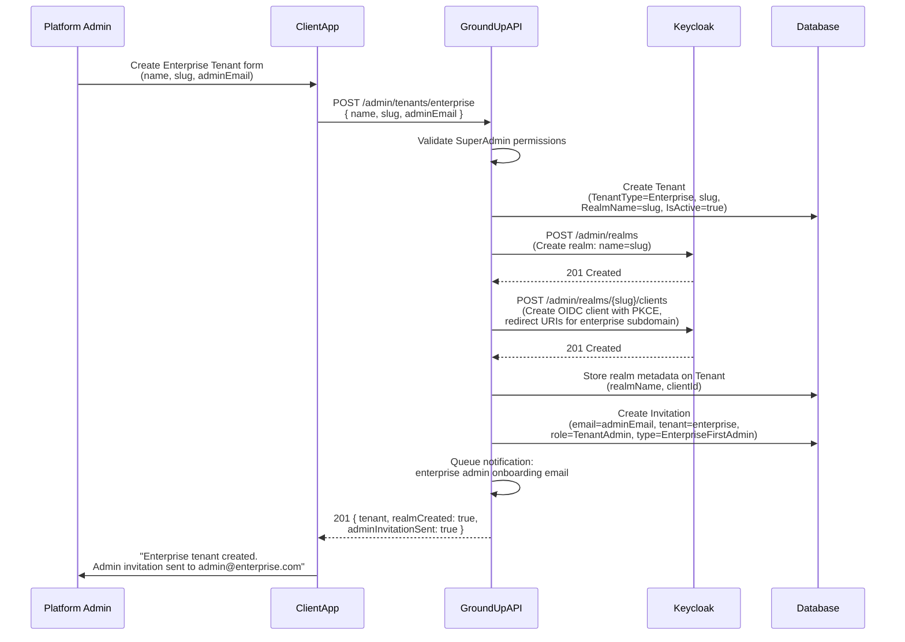
```mermaid
sequenceDiagram
    participant User as Platform Admin
    participant ClientApp
    participant GroundUpAPI
    participant Keycloak
    participant Database

    User->>ClientApp: Create Enterprise Tenant form<br/>(name, slug, adminEmail)
    ClientApp->>GroundUpAPI: POST /admin/tenants/enterprise<br/>{ name, slug, adminEmail }
    GroundUpAPI->>GroundUpAPI: Validate SuperAdmin permissions
    GroundUpAPI->>Database: Create Tenant<br/>(TenantType=Enterprise, slug,<br/>RealmName=slug, IsActive=true)
    GroundUpAPI->>Keycloak: POST /admin/realms<br/>(Create realm: name=slug)
    Keycloak-->>GroundUpAPI: 201 Created
    GroundUpAPI->>Keycloak: POST /admin/realms/{slug}/clients<br/>(Create OIDC client with PKCE,<br/>redirect URIs for enterprise subdomain)
    Keycloak-->>GroundUpAPI: 201 Created
    GroundUpAPI->>Database: Store realm metadata on Tenant<br/>(realmName, clientId)
    GroundUpAPI->>Database: Create Invitation<br/>(email=adminEmail, tenant=enterprise,<br/>role=TenantAdmin, type=EnterpriseFirstAdmin)
    GroundUpAPI->>GroundUpAPI: Queue notification:<br/>enterprise admin onboarding email
    GroundUpAPI-->>ClientApp: 201 { tenant, realmCreated: true,<br/>adminInvitationSent: true }
    ClientApp->>User: "Enterprise tenant created.<br/>Admin invitation sent to admin@enterprise.com"
```

**Notes:**
- The realm name matches the tenant slug for simplicity (e.g., slug "megacorp" → realm "megacorp").
- The OIDC client is configured with the enterprise subdomain's callback URL.
- Registration is left OPEN in the realm initially — the first admin needs to be able to register. After the first admin completes onboarding, registration can be disabled (or limited to IdP-federated users).
- The invitation carries a special `EnterpriseFirstAdmin` type so the callback handler knows to grant TenantAdmin and finalize setup.

### 16. Enterprise First Admin Onboarding

**User intent:** "I'm the first admin of a new enterprise customer. I need to set up my account and get into my org."

**What the user sees:**
1. Receives an onboarding email with a link to `megacorp.myapp.com/setup`
2. Clicks the link
3. Gets redirected to the enterprise Keycloak realm — registers their account
4. Returns to the app as TenantAdmin of their enterprise org

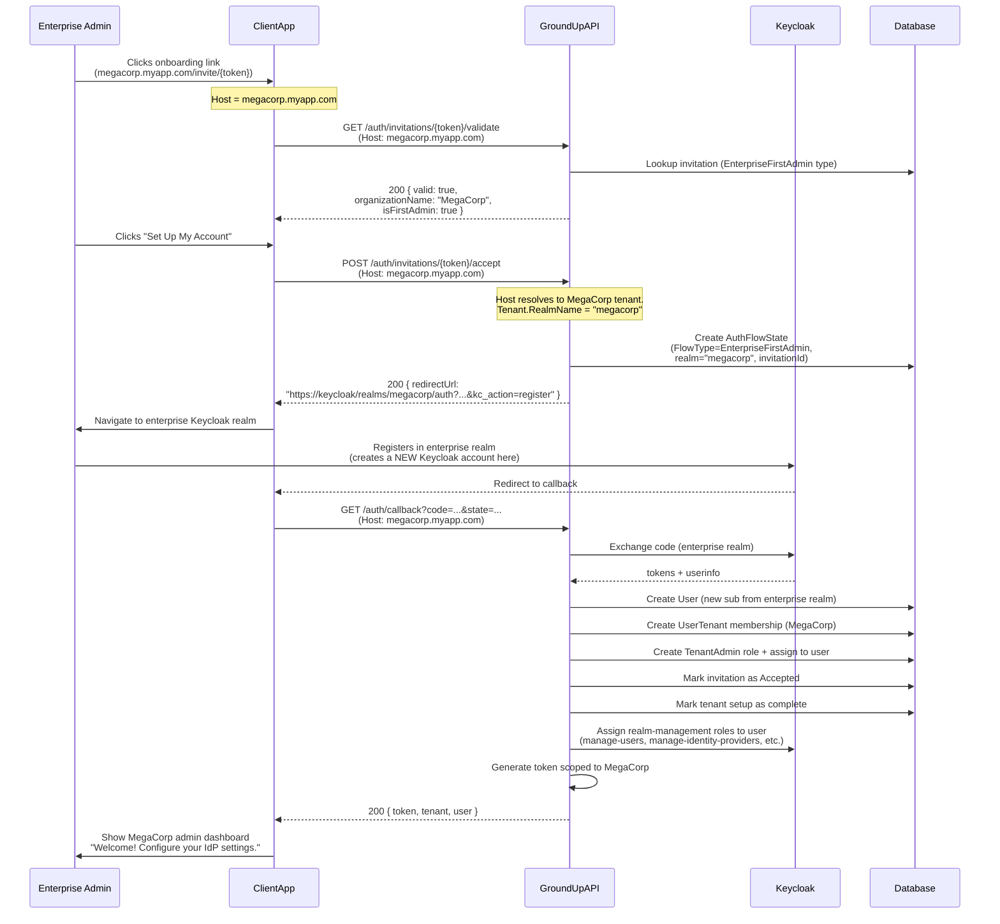
```mermaid
sequenceDiagram
    participant User as Enterprise Admin
    participant ClientApp
    participant GroundUpAPI
    participant Keycloak
    participant Database

    User->>ClientApp: Clicks onboarding link<br/>(megacorp.myapp.com/invite/{token})
    Note over ClientApp: Host = megacorp.myapp.com
    ClientApp->>GroundUpAPI: GET /auth/invitations/{token}/validate<br/>(Host: megacorp.myapp.com)
    GroundUpAPI->>Database: Lookup invitation (EnterpriseFirstAdmin type)
    GroundUpAPI-->>ClientApp: 200 { valid: true,<br/>organizationName: "MegaCorp",<br/>isFirstAdmin: true }
    User->>ClientApp: Clicks "Set Up My Account"
    ClientApp->>GroundUpAPI: POST /auth/invitations/{token}/accept<br/>(Host: megacorp.myapp.com)
    Note over GroundUpAPI: Host resolves to MegaCorp tenant.<br/>Tenant.RealmName = "megacorp"
    GroundUpAPI->>Database: Create AuthFlowState<br/>(FlowType=EnterpriseFirstAdmin,<br/>realm="megacorp", invitationId)
    GroundUpAPI-->>ClientApp: 200 { redirectUrl:<br/>"https://keycloak/realms/megacorp/auth?...&kc_action=register" }
    ClientApp->>User: Navigate to enterprise Keycloak realm
    User->>Keycloak: Registers in enterprise realm<br/>(creates a NEW Keycloak account here)
    Keycloak-->>ClientApp: Redirect to callback
    ClientApp->>GroundUpAPI: GET /auth/callback?code=...&state=...<br/>(Host: megacorp.myapp.com)
    GroundUpAPI->>Keycloak: Exchange code (enterprise realm)
    Keycloak-->>GroundUpAPI: tokens + userinfo
    GroundUpAPI->>Database: Create User (new sub from enterprise realm)
    GroundUpAPI->>Database: Create UserTenant membership (MegaCorp)
    GroundUpAPI->>Database: Create TenantAdmin role + assign to user
    GroundUpAPI->>Database: Mark invitation as Accepted
    GroundUpAPI->>Database: Mark tenant setup as complete
    GroundUpAPI->>Keycloak: Assign realm-management roles to user<br/>(manage-users, manage-identity-providers, etc.)
    GroundUpAPI->>GroundUpAPI: Generate token scoped to MegaCorp
    GroundUpAPI-->>ClientApp: 200 { token, tenant, user }
    ClientApp->>User: Show MegaCorp admin dashboard<br/>"Welcome! Configure your IdP settings."
```

**Notes:**
- The user registers in the ENTERPRISE realm, not the shared realm. This is a separate Keycloak account.
- The `sub` from the enterprise realm is different from any shared-realm `sub`. They're different identities to Keycloak.
- After this flow, the platform admin may disable self-registration in the enterprise realm and configure federated IdP (SAML/OIDC) instead.
- Guard: once an EnterpriseFirstAdmin invitation is accepted, no other invitation of that type should be valid for this tenant.
- **Keycloak realm-management roles:** The first admin receives Keycloak's `realm-management` client roles (e.g., `manage-users`, `manage-identity-providers`, `view-realm`). This allows them to configure IdPs and manage users directly in their realm via the Keycloak admin console. The GroundUp admin UI provides deep-links to the Keycloak console for their realm (via `KeycloakAdminLinkBuilder`), so enterprise admins can self-service IdP configuration without platform admin involvement.

### 17. Enterprise Login — Subdomain Routing

**User intent:** "I'm an enterprise user. I go to my company's subdomain and log in."

**What the user sees:**
1. Navigates to `megacorp.myapp.com`
2. Clicks "Login"
3. Gets redirected to the MegaCorp Keycloak realm (not the shared realm)
4. Authenticates (directly in Keycloak or via their federated IdP)
5. Returns to the app, inside MegaCorp

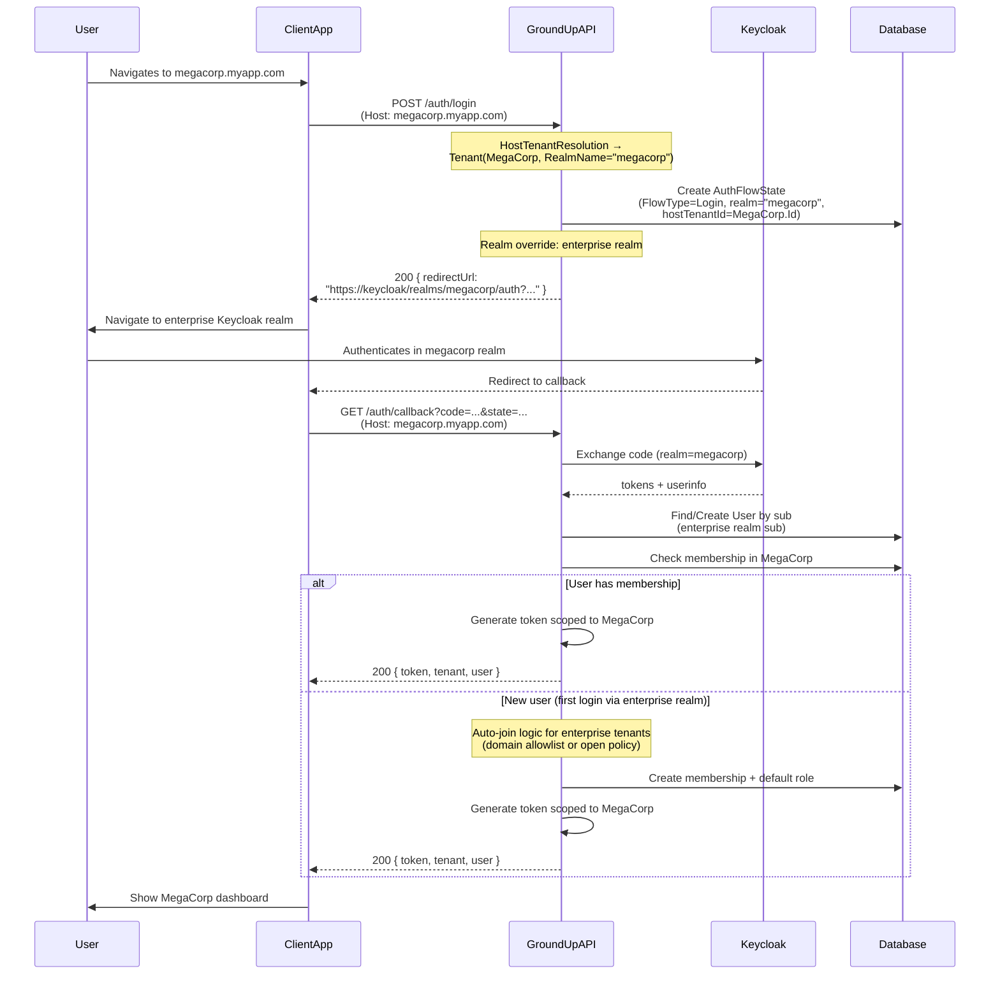
```mermaid
sequenceDiagram
    participant User
    participant ClientApp
    participant GroundUpAPI
    participant Keycloak
    participant Database

    User->>ClientApp: Navigates to megacorp.myapp.com
    ClientApp->>GroundUpAPI: POST /auth/login<br/>(Host: megacorp.myapp.com)
    Note over GroundUpAPI: HostTenantResolution →<br/>Tenant(MegaCorp, RealmName="megacorp")
    GroundUpAPI->>Database: Create AuthFlowState<br/>(FlowType=Login, realm="megacorp",<br/>hostTenantId=MegaCorp.Id)
    Note over GroundUpAPI: Realm override: enterprise realm
    GroundUpAPI-->>ClientApp: 200 { redirectUrl:<br/>"https://keycloak/realms/megacorp/auth?..." }
    ClientApp->>User: Navigate to enterprise Keycloak realm
    User->>Keycloak: Authenticates in megacorp realm
    Keycloak-->>ClientApp: Redirect to callback
    ClientApp->>GroundUpAPI: GET /auth/callback?code=...&state=...<br/>(Host: megacorp.myapp.com)
    GroundUpAPI->>Keycloak: Exchange code (realm=megacorp)
    Keycloak-->>GroundUpAPI: tokens + userinfo
    GroundUpAPI->>Database: Find/Create User by sub<br/>(enterprise realm sub)
    GroundUpAPI->>Database: Check membership in MegaCorp
    alt User has membership
        GroundUpAPI->>GroundUpAPI: Generate token scoped to MegaCorp
        GroundUpAPI-->>ClientApp: 200 { token, tenant, user }
    else New user (first login via enterprise realm)
        Note over GroundUpAPI: Auto-join logic for enterprise tenants<br/>(domain allowlist or open policy)
        GroundUpAPI->>Database: Create membership + default role
        GroundUpAPI->>GroundUpAPI: Generate token scoped to MegaCorp
        GroundUpAPI-->>ClientApp: 200 { token, tenant, user }
    end
    ClientApp->>User: Show MegaCorp dashboard
```

**Notes:**
- Enterprise login ALWAYS goes to the enterprise realm. The host subdomain determines the realm.
- No tenant picker is ever shown for enterprise tenants — the host pins it.
- New users who authenticate through the enterprise realm can be auto-joined based on enterprise tenant policy (configured by the enterprise admin: open, domain-allowlist, or invitation-only).
- The `sub` from the enterprise realm is specific to that realm — different from any shared-realm `sub`.

### 18. Enterprise SSO — Federated IdP (SAML/OIDC)

**User intent:** "I'm an enterprise user with corporate SSO. I click login and it goes through my company's Azure AD/Okta/etc."

**What the user sees:**
1. Navigates to `megacorp.myapp.com`
2. Clicks "Login"
3. Gets redirected to Keycloak's enterprise realm
4. Keycloak shows corporate IdP login (or auto-redirects if only one IdP is configured)
5. Authenticates at their corporate IdP (Azure AD, Okta, etc.)
6. Flows back: Corporate IdP → Keycloak → GroundUp callback
7. Lands in MegaCorp dashboard

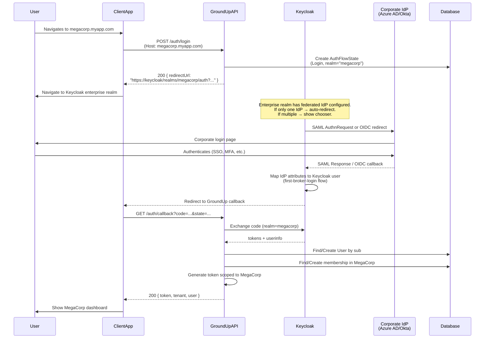
```mermaid
sequenceDiagram
    participant User
    participant ClientApp
    participant GroundUpAPI
    participant Keycloak
    participant CorporateIdP as Corporate IdP<br/>(Azure AD/Okta)
    participant Database

    User->>ClientApp: Navigates to megacorp.myapp.com
    ClientApp->>GroundUpAPI: POST /auth/login<br/>(Host: megacorp.myapp.com)
    GroundUpAPI->>Database: Create AuthFlowState<br/>(Login, realm="megacorp")
    GroundUpAPI-->>ClientApp: 200 { redirectUrl:<br/>"https://keycloak/realms/megacorp/auth?..." }
    ClientApp->>User: Navigate to Keycloak enterprise realm
    Note over Keycloak: Enterprise realm has federated IdP configured.<br/>If only one IdP → auto-redirect.<br/>If multiple → show chooser.
    Keycloak->>CorporateIdP: SAML AuthnRequest or OIDC redirect
    CorporateIdP->>User: Corporate login page
    User->>CorporateIdP: Authenticates (SSO, MFA, etc.)
    CorporateIdP-->>Keycloak: SAML Response / OIDC callback
    Keycloak->>Keycloak: Map IdP attributes to Keycloak user<br/>(first-broker-login flow)
    Keycloak-->>ClientApp: Redirect to GroundUp callback
    ClientApp->>GroundUpAPI: GET /auth/callback?code=...&state=...
    GroundUpAPI->>Keycloak: Exchange code (realm=megacorp)
    Keycloak-->>GroundUpAPI: tokens + userinfo
    GroundUpAPI->>Database: Find/Create User by sub
    GroundUpAPI->>Database: Find/Create membership in MegaCorp
    GroundUpAPI->>GroundUpAPI: Generate token scoped to MegaCorp
    GroundUpAPI-->>ClientApp: 200 { token, tenant, user }
    ClientApp->>User: Show MegaCorp dashboard
```

**Notes:**
- From GroundUp's perspective, this is identical to Scenario 17. The federation happens inside Keycloak — GroundUp doesn't know or care whether the user authenticated directly or via a federated IdP.
- Keycloak handles the "first broker login" flow: mapping IdP claims to a Keycloak user, handling first-time federation, etc.
- The enterprise admin configures the IdP in Keycloak's admin console (realm settings → Identity Providers). GroundUp provides a link to this page in the admin UI via `KeycloakAdminLinkBuilder`.
- Attribute mapping (e.g., corporate groups → Keycloak roles) happens in Keycloak, not GroundUp. GroundUp only sees the final `sub` + user info from Keycloak.

### 19. Enterprise Invitation

**User intent:** "I'm an enterprise admin. I want to invite someone to my org."

**What the user sees (admin):**
1. Goes to team settings in MegaCorp
2. Enters invitee's email + selects a role
3. Invitation is sent

**What the invitee sees:**
1. Receives email
2. Clicks link → arrives at `megacorp.myapp.com/invite/{token}`
3. Clicks "Accept"
4. Redirected to enterprise Keycloak realm → registers or logs in via corporate SSO
5. Lands in MegaCorp

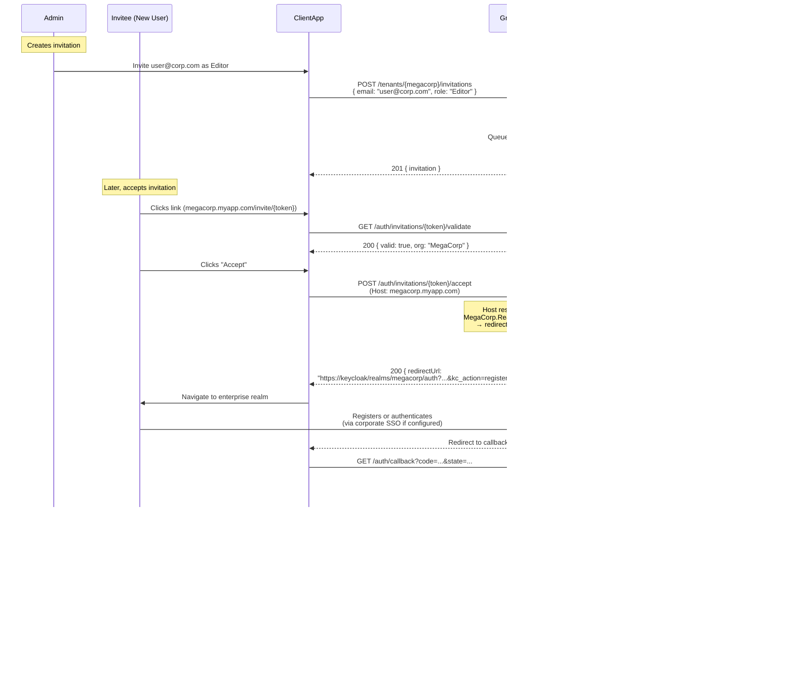
```mermaid
sequenceDiagram
    participant Admin
    participant Invitee as Invitee (New User)
    participant ClientApp
    participant GroundUpAPI
    participant Keycloak
    participant Database

    Note over Admin: Creates invitation
    Admin->>ClientApp: Invite user@corp.com as Editor
    ClientApp->>GroundUpAPI: POST /tenants/{megacorp}/invitations<br/>{ email: "user@corp.com", role: "Editor" }
    GroundUpAPI->>Database: Create Invitation<br/>(tenant=MegaCorp, email, role, status=Pending)
    GroundUpAPI->>GroundUpAPI: Queue invitation email
    GroundUpAPI-->>ClientApp: 201 { invitation }

    Note over Invitee: Later, accepts invitation
    Invitee->>ClientApp: Clicks link (megacorp.myapp.com/invite/{token})
    ClientApp->>GroundUpAPI: GET /auth/invitations/{token}/validate
    GroundUpAPI-->>ClientApp: 200 { valid: true, org: "MegaCorp" }
    Invitee->>ClientApp: Clicks "Accept"
    ClientApp->>GroundUpAPI: POST /auth/invitations/{token}/accept<br/>(Host: megacorp.myapp.com)
    Note over GroundUpAPI: Host resolves MegaCorp.<br/>MegaCorp.RealmName = "megacorp"<br/>→ redirect to enterprise realm
    GroundUpAPI->>Database: Create AuthFlowState<br/>(InvitationAcceptance, realm="megacorp")
    GroundUpAPI-->>ClientApp: 200 { redirectUrl:<br/>"https://keycloak/realms/megacorp/auth?...&kc_action=register" }
    ClientApp->>Invitee: Navigate to enterprise realm
    Invitee->>Keycloak: Registers or authenticates<br/>(via corporate SSO if configured)
    Keycloak-->>ClientApp: Redirect to callback
    ClientApp->>GroundUpAPI: GET /auth/callback?code=...&state=...
    GroundUpAPI->>Keycloak: Exchange code (realm=megacorp)
    Keycloak-->>GroundUpAPI: tokens + userinfo
    GroundUpAPI->>Database: Create User (enterprise realm sub)
    GroundUpAPI->>Database: Create membership in MegaCorp
    GroundUpAPI->>Database: Assign "Editor" role
    GroundUpAPI->>Database: Mark invitation Accepted
    GroundUpAPI->>GroundUpAPI: Generate token
    GroundUpAPI-->>ClientApp: 200 { token, tenant, user }
    ClientApp->>Invitee: Show MegaCorp dashboard
```

**Notes:**
- The invitation email goes to `user@corp.com` but the actual identity is whatever `sub` they authenticate with in the enterprise realm. The email is for delivery only.
- If the enterprise realm has SSO configured, the invitee goes through their corporate IdP. From GroundUp's perspective, it's the same callback flow.
- Enterprise invitations always route through the enterprise realm, never the shared realm.

### 20. Cross-Realm User — Switching Between Standard and Enterprise Tenants

**User intent:** "I belong to a personal org (standard) and my company's enterprise org. I want to switch between them."

**What the user sees:**
1. Currently in "My Personal Workspace" (standard tenant, shared realm)
2. Wants to access "MegaCorp" (enterprise tenant)
3. The workspace switcher shows MegaCorp but indicates "requires re-authentication"
4. Clicks MegaCorp → redirected to enterprise realm → authenticates
5. Lands in MegaCorp

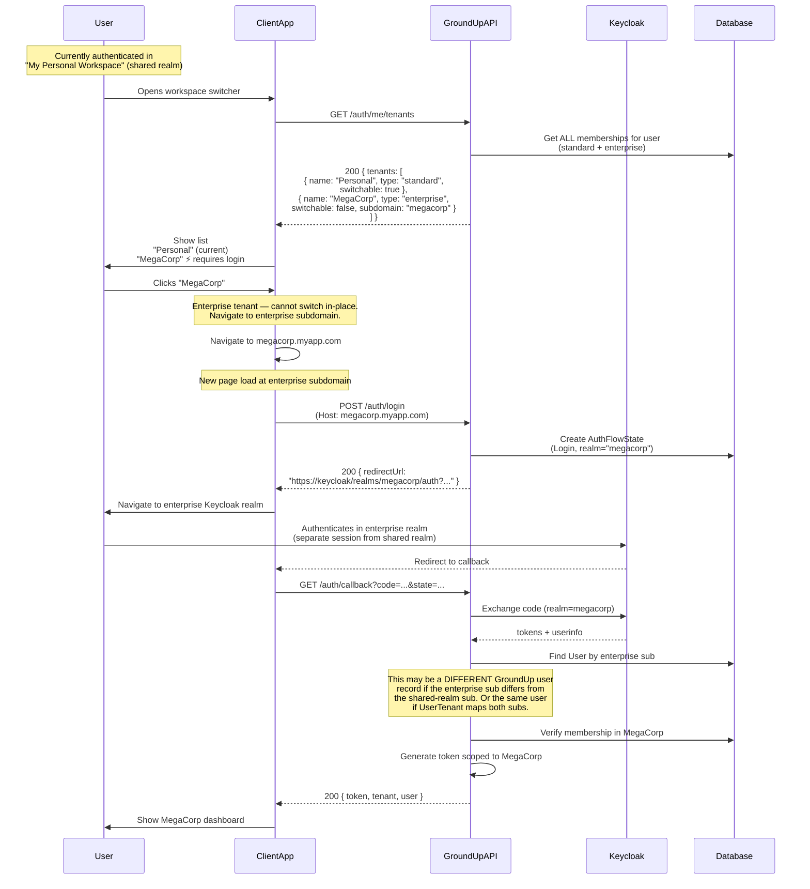
```mermaid
sequenceDiagram
    participant User
    participant ClientApp
    participant GroundUpAPI
    participant Keycloak
    participant Database

    Note over User: Currently authenticated in<br/>"My Personal Workspace" (shared realm)
    User->>ClientApp: Opens workspace switcher
    ClientApp->>GroundUpAPI: GET /auth/me/tenants
    GroundUpAPI->>Database: Get ALL memberships for user<br/>(standard + enterprise)
    GroundUpAPI-->>ClientApp: 200 { tenants: [<br/>  { name: "Personal", type: "standard",<br/>    switchable: true },<br/>  { name: "MegaCorp", type: "enterprise",<br/>    switchable: false, subdomain: "megacorp" }<br/>] }
    ClientApp->>User: Show list<br/>"Personal" (current)<br/>"MegaCorp" ⚡ requires login

    User->>ClientApp: Clicks "MegaCorp"
    Note over ClientApp: Enterprise tenant — cannot switch in-place.<br/>Navigate to enterprise subdomain.
    ClientApp->>ClientApp: Navigate to megacorp.myapp.com
    Note over ClientApp: New page load at enterprise subdomain
    ClientApp->>GroundUpAPI: POST /auth/login<br/>(Host: megacorp.myapp.com)
    GroundUpAPI->>Database: Create AuthFlowState<br/>(Login, realm="megacorp")
    GroundUpAPI-->>ClientApp: 200 { redirectUrl:<br/>"https://keycloak/realms/megacorp/auth?..." }
    ClientApp->>User: Navigate to enterprise Keycloak realm
    User->>Keycloak: Authenticates in enterprise realm<br/>(separate session from shared realm)
    Keycloak-->>ClientApp: Redirect to callback
    ClientApp->>GroundUpAPI: GET /auth/callback?code=...&state=...
    GroundUpAPI->>Keycloak: Exchange code (realm=megacorp)
    Keycloak-->>GroundUpAPI: tokens + userinfo
    GroundUpAPI->>Database: Find User by enterprise sub
    Note over GroundUpAPI: This may be a DIFFERENT GroundUp user<br/>record if the enterprise sub differs from<br/>the shared-realm sub. Or the same user<br/>if UserTenant maps both subs.
    GroundUpAPI->>Database: Verify membership in MegaCorp
    GroundUpAPI->>GroundUpAPI: Generate token scoped to MegaCorp
    GroundUpAPI-->>ClientApp: 200 { token, tenant, user }
    ClientApp->>User: Show MegaCorp dashboard
```

**Critical design decision — identity mapping for cross-realm users:**

A user who exists in both the shared realm and an enterprise realm has **two different Keycloak `sub` values** (one per realm). GroundUp handles this via the `UserTenant` table:

| UserId (GroundUp) | TenantId | ExternalUserId (sub) | Realm |
|---|---|---|---|
| user-001 | personal-workspace | shared-sub-abc | shared |
| user-001 | megacorp | enterprise-sub-xyz | megacorp |

The `UserTenant.ExternalUserId` maps the realm-specific `sub` to the GroundUp user. This allows one GroundUp user to authenticate through multiple realms.

**How to link the accounts:** When an existing GroundUp user (shared realm) first authenticates through an enterprise realm, we need a way to link the two identities. Options:
1. **Invitation-based linking:** The invitation was sent to their known email. When they complete the enterprise auth, we create the `UserTenant` entry linking the existing user to the new enterprise `sub`. The invitation ties the two identities together.
2. **Self-service linking (future):** User is authenticated in one realm, initiates a "link account" flow for another realm, authenticates there, and the system creates the mapping.

For Phase 10E, invitation-based linking is the primary path.

---

## Cross-Cutting Flows

### 21. Social Login (Google/Facebook) During Sign-Up

**User intent:** "I want to create an org and sign up with my Google account instead of making a new password."

**What the user sees:**
1. Clicks "Create Organization" → enters org name
2. Redirected to Keycloak shared realm
3. Clicks "Sign in with Google" (Keycloak's login page shows social providers)
4. Authenticates with Google
5. Returns to the app, in their new org

```mermaid
sequenceDiagram
    participant User
    participant ClientApp
    participant GroundUpAPI
    participant Keycloak
    participant Google
    participant Database

    User->>ClientApp: "Create Organization" → "Acme Corp"
    ClientApp->>GroundUpAPI: POST /auth/signup { organizationName: "Acme Corp" }
    GroundUpAPI->>Database: Create AuthFlowState (NewOrganization)
    GroundUpAPI-->>ClientApp: 200 { redirectUrl: "...&kc_action=register" }
    ClientApp->>User: Navigate to Keycloak shared realm
    User->>Keycloak: Clicks "Sign in with Google"
    Keycloak->>Google: OAuth redirect
    User->>Google: Authenticates + consents
    Google-->>Keycloak: Returns tokens + profile
    Keycloak->>Keycloak: Creates/links Keycloak user<br/>(first-broker-login flow)
    Keycloak-->>ClientApp: Redirect to callback with code
    ClientApp->>GroundUpAPI: GET /auth/callback?code=...&state=...
    GroundUpAPI->>Keycloak: Exchange code
    Keycloak-->>GroundUpAPI: tokens + userinfo
    Note over GroundUpAPI: userinfo may have email from Google<br/>or may not (depending on user consent)
    GroundUpAPI->>Database: Create Tenant + User + Membership
    GroundUpAPI->>GroundUpAPI: Generate token
    GroundUpAPI-->>ClientApp: 200 { token, tenant, user }
    ClientApp->>User: Show dashboard
```

**Notes:**
- From GroundUp's perspective, social login is transparent. Keycloak handles the social provider federation internally. GroundUp sees the same callback flow regardless of how the user authenticated.
- The `sub` claim from Keycloak is Keycloak's own user ID (not Google's). Keycloak is the identity authority.
- Email may or may not be present. The user object is created with whatever info is available from the userinfo endpoint.
- Social login providers are configured in Keycloak's admin console for the shared realm.

### 22. Social Login During Standard Login

**User intent:** "I want to log in using my Google account (I previously signed up with it)."

**What the user sees:**
1. Clicks "Login"
2. Redirected to Keycloak
3. Clicks "Sign in with Google"
4. Auto-approves (Google session exists) or enters Google credentials
5. Returns to the app

```mermaid
sequenceDiagram
    participant User
    participant ClientApp
    participant GroundUpAPI
    participant Keycloak
    participant Google
    participant Database

    User->>ClientApp: Clicks "Login"
    ClientApp->>GroundUpAPI: POST /auth/login
    GroundUpAPI->>Database: Create AuthFlowState (Login)
    GroundUpAPI-->>ClientApp: 200 { redirectUrl }
    ClientApp->>User: Navigate to Keycloak
    User->>Keycloak: Clicks "Sign in with Google"
    Keycloak->>Google: OAuth redirect
    User->>Google: Authenticates
    Google-->>Keycloak: Returns tokens
    Keycloak->>Keycloak: Matches existing Keycloak user<br/>(linked from previous social login)
    Keycloak-->>ClientApp: Redirect to callback
    ClientApp->>GroundUpAPI: GET /auth/callback?code=...&state=...
    GroundUpAPI->>Keycloak: Exchange code + validate
    Keycloak-->>GroundUpAPI: tokens + userinfo
    GroundUpAPI->>Database: Find User by sub (existing)
    GroundUpAPI->>Database: Get memberships
    Note over GroundUpAPI: Standard login logic applies<br/>(auto-select, picker, or host-pinned)
    GroundUpAPI->>GroundUpAPI: Generate token
    GroundUpAPI-->>ClientApp: 200 { token, tenant, user }
    ClientApp->>User: Show dashboard
```

**Notes:**
- This is identical to Scenarios 2/3/4 from GroundUp's perspective. The social login happens inside Keycloak's realm — GroundUp never knows or cares.
- Keycloak links the Google identity to the same Keycloak user that was created during sign-up.
- The `sub` is the same Keycloak user ID regardless of whether they authenticated with password or Google.

### 23. Enterprise User Accesses Shared Realm Login Page

**User intent:** "I'm a MegaCorp employee but accidentally went to `myapp.com` (shared realm) instead of `megacorp.myapp.com`."

**What the user sees:**
1. Goes to `myapp.com` and clicks "Login"
2. Gets redirected to the shared Keycloak realm
3. Authenticates (creates a shared-realm account if they don't have one)
4. Returns to the app...

At this point, the behavior depends on their memberships:

```mermaid
sequenceDiagram
    participant User
    participant ClientApp
    participant GroundUpAPI
    participant Keycloak
    participant Database

    User->>ClientApp: Goes to myapp.com → Login
    ClientApp->>GroundUpAPI: POST /auth/login<br/>(Host: myapp.com — no subdomain)
    GroundUpAPI->>Database: Create AuthFlowState<br/>(Login, realm=shared)
    GroundUpAPI-->>ClientApp: 200 { redirectUrl:<br/>"https://keycloak/realms/shared/auth?..." }
    ClientApp->>User: Navigate to shared Keycloak realm
    User->>Keycloak: Authenticates in shared realm
    Keycloak-->>ClientApp: Redirect to callback
    ClientApp->>GroundUpAPI: GET /auth/callback?code=...&state=...
    GroundUpAPI->>Keycloak: Exchange code (shared realm)
    Keycloak-->>GroundUpAPI: tokens + userinfo
    GroundUpAPI->>Database: Find/Create User by shared-realm sub
    GroundUpAPI->>Database: Get memberships for this user

    alt Has standard tenant memberships
        Note over GroundUpAPI: Normal login flow<br/>(auto-select or picker)
        GroundUpAPI-->>ClientApp: 200 { token or tenantPicker }
    else Zero standard memberships, has enterprise only
        Note over GroundUpAPI: User's memberships are all enterprise<br/>but they authenticated in the SHARED realm.<br/>They can't access enterprise tenants from here.
        GroundUpAPI-->>ClientApp: 200 { noAccess: true,<br/>message: "No organizations found.",<br/>hint: "If you belong to an enterprise org,<br/>please use your organization's login page.",<br/>enterpriseSubdomains: ["megacorp"] }
    else Zero memberships at all, default tenant configured
        Note over GroundUpAPI: Auto-join to default tenant
        GroundUpAPI-->>ClientApp: 200 { token, tenant }
    else Zero memberships, no default tenant
        GroundUpAPI-->>ClientApp: 200 { noAccess: true,<br/>message: "You don't belong to any organization." }
    end
```

**Notes:**
- An enterprise user authenticating through the shared realm gets a DIFFERENT `sub` than when they authenticate through their enterprise realm. These are separate Keycloak users in separate realms.
- If they have no standard-tenant memberships, we don't automatically link them to their enterprise org — that would be a security violation (enterprise admins control access through their realm).
- The helpful response includes a hint about their enterprise subdomain (if we can determine it from their email domain, or from known enterprise tenants they've been invited to).
- This is a "wrong door" scenario — the app gently redirects them to the right place.

---

## Key Questions Answered

### When does the user get created in GroundUp's database?

**On first successful callback.** Never before.

| Scenario | When user is created |
|---|---|
| Sign-up (simple or with org) | At callback, after code exchange succeeds |
| Invitation (new user) | At callback, when invitation is consumed |
| Join link (new user) | At callback, when join link is consumed |
| Enterprise first admin | At callback, in the enterprise realm |
| Login (existing user) | Never — they already exist |

We never pre-create users at invitation time. The invitation stores the email for delivery but the user record is only created when we have a verified `sub` from Keycloak. This prevents orphaned user records and ensures we always have a valid identity link.

### How do we handle shared-realm users joining an enterprise tenant?

**They can't directly.** Enterprise tenants require authentication through the enterprise realm. The flows are:

1. **Invitation-based:** An enterprise admin invites them. They click the link on the enterprise subdomain, authenticate through the enterprise realm (creating a new Keycloak account there), and get a `UserTenant` entry linking their GroundUp user to the enterprise `sub`.

2. **Self-registration (if enabled):** The enterprise realm allows self-registration or has corporate SSO configured. The user navigates to the enterprise subdomain and authenticates. If it's their first time, a new `UserTenant` entry is created.

The key insight: a shared-realm `sub` ≠ an enterprise-realm `sub`. They're different Keycloak users. The GroundUp `UserTenant` table maps each realm-specific `sub` to the same GroundUp user ID (when linked via invitation).

### Should enterprise tenants allow users from the shared realm?

**No.** Enterprise tenants enforce authentication through their own realm. This is by design:

- Enterprise admins control who can access their org via their realm's login policies
- Corporate security requirements (MFA, device compliance, etc.) are enforced at the enterprise realm level
- There's no "backdoor" through the shared realm

A user who belongs to both standard and enterprise tenants has separate authentication paths:
- Standard tenants: authenticate via shared realm
- Enterprise tenants: authenticate via enterprise realm

### What's the experience for inviting someone to an enterprise tenant who doesn't exist yet?

1. Admin enters their email
2. Invitation is created (stores email, tenant, role)
3. Email is sent with link to `enterprise.myapp.com/invite/{token}`
4. Invitee clicks link → arrives at enterprise subdomain
5. Clicks "Accept" → redirected to enterprise Keycloak realm
6. Registers a new account in the enterprise realm (or uses SSO)
7. On callback: GroundUp creates User + UserTenant + role assignment

The invitee doesn't need to exist in any realm beforehand. They create their enterprise realm account during the invitation acceptance flow.

### How do we prevent the "double login" problem?

**By scoping sessions to realms and using seamless switching for same-realm tenants:**

| Scenario | Double login? | Why |
|---|---|---|
| Switch between standard tenants | No | Same realm — just re-issue the GroundUp token |
| Switch from standard to enterprise | Yes (intentional) | Different realm = different security domain |
| Login at enterprise subdomain | No | Directly routed to enterprise realm |
| Already logged in at Keycloak (SSO session) | No | Keycloak auto-approves |

The only time a user re-authenticates is when crossing realm boundaries — and even then, if they have an active Keycloak session in the target realm, it's instant (auto-approve).

For the common case (user belongs to multiple standard tenants), switching is a zero-auth API call.

---

## Data Model

### User Identity Mapping

```
┌─────────────┐     ┌──────────────────┐     ┌─────────────┐
│   User      │     │   UserTenant     │     │   Tenant    │
│─────────────│     │──────────────────│     │─────────────│
│ Id (Guid)   │◄────│ UserId           │────►│ Id (Guid)   │
│ Email       │     │ TenantId         │     │ Name        │
│ DisplayName │     │ ExternalUserId   │     │ Slug        │
│ IsActive    │     │ IsActive         │     │ TenantType  │
│             │     │ JoinedAt         │     │ RealmName?  │
│             │     │                  │     │ IsActive    │
└─────────────┘     └──────────────────┘     └─────────────┘
```

- `User.Id` is the GroundUp-internal user identity
- `UserTenant.ExternalUserId` is the Keycloak `sub` for that specific realm
- A user with memberships in both shared and enterprise realms has TWO `UserTenant` rows with different `ExternalUserId` values
- Email is stored on User for display — NOT used for identity matching

### Auth Flow State

```
┌────────────────────────┐
│   AuthFlowState        │
│────────────────────────│
│ Id (UUIDv7)            │  ← Primary key (NOT used as state param)
│ StateToken (random)    │  ← Used as OAuth state param
│ FlowType (enum)        │
│ Realm                  │
│ Nonce                  │
│ CodeVerifier           │
│ RedirectUri            │
│ HostTenantId?          │
│ InvitationId?          │
│ JoinLinkId?            │
│ OrganizationName?      │
│ ClientIp               │
│ UserAgent              │
│ Status (enum)          │
│ ExpiresAt              │
│ ConsumedAt?            │
│ CreatedAt              │
└────────────────────────┘
```

### Token Claims

**GroundUp JWT claims:**
| Claim | Description | Example |
|---|---|---|
| `sub` | GroundUp user ID | `user-uuid-v7` |
| `tid` | Current tenant ID | `tenant-uuid-v7` |
| `email` | User's email (optional) | `alice@example.com` |
| `name` | Display name | `Alice Smith` |
| `role` | Roles (multiple) | `TenantAdmin`, `Editor` |
| `auth_time` | Original authentication timestamp | `1704067200` |
| `iss` | Token issuer (GroundUp API) | `https://api.myapp.com` |
| `aud` | Token audience | `myapp` |
| `exp` | Expiration | `1704070800` |

---

## API Endpoints Summary

| Method | Path | Purpose | Returns |
|---|---|---|---|
| `POST` | `/auth/login` | Initiate login flow | `{ redirectUrl }` |
| `POST` | `/auth/signup` | Initiate sign-up flow (simple or with org) | `{ redirectUrl }` |
| `GET` | `/auth/callback` | OAuth callback (all flows) | `{ token, tenant, user }` or `{ requiresTenantSelection, tenants }` |
| `POST` | `/auth/set-tenant` | Select tenant (post-picker) | `{ token, tenant }` |
| `POST` | `/auth/refresh` | Explicit token refresh | `{ token }` |
| `POST` | `/auth/logout` | Clear session | `{ logoutUrl? }` |
| `GET` | `/auth/me` | Get current user info | `{ user, tenant, roles }` |
| `GET` | `/auth/me/tenants` | List user's memberships | `{ tenants: [...] }` |
| `POST` | `/auth/tenants/{id}/leave` | Leave an organization | `{ token, tenant }` or `{ noTenants: true }` |
| `GET` | `/auth/invitations/{token}/validate` | Validate invitation | `{ valid, org, role }` |
| `POST` | `/auth/invitations/{token}/accept` | Accept invitation | `{ redirectUrl }` |
| `GET` | `/auth/join-links/{code}/validate` | Validate join link | `{ valid, org }` |
| `POST` | `/auth/join-links/{code}/join` | Join via link | `{ redirectUrl }` |

**All endpoints return JSON. No 302 redirects. The client app handles navigation.**

---

## Security Properties

### CSRF Protection (State Cookie Binding)

Every OAuth flow:
1. At initiation: generates a random `stateToken`, persists it in DB AND in a short-lived HttpOnly cookie
2. At callback: compares the `state` query parameter against the cookie value
3. If mismatch: rejects the callback (browser-binding failure)

This prevents an attacker from forcing a victim's browser to complete an OAuth flow initiated by the attacker.

### Replay Attack Prevention

`AuthFlowState` has a `Status` field:
- `Pending` → can be consumed
- `Consumed` → returns 410 Gone on second use
- `Expired` → returns error

Each state token can only be used ONCE. The `ConsumeAsync` method atomically transitions status.

### PKCE (Proof Key for Code Exchange)

Every flow generates:
- `code_verifier`: random 43-128 char string
- `code_challenge`: `Base64URL(SHA256(code_verifier))`

The verifier is stored in the DB and sent at code exchange. This prevents authorization code interception even if the callback URL is compromised.

### Nonce Validation

The OIDC `nonce` is:
- Generated at flow initiation
- Stored in `AuthFlowState`
- Sent in the authorize request
- Validated against the `nonce` claim in the returned `id_token`

This prevents token injection attacks (attacker can't replay an `id_token` from a different flow).

### Token Hierarchy

```
Keycloak Token (identity only)
  ↓ (exchanged at callback)
GroundUp Token (identity + tenant + roles)
  ↓ (refreshed via sliding window)
GroundUp Token (same identity + same tenant + updated roles)
```

The GroundUp token is the authority for application access. Keycloak tokens are only used during the authentication ceremony and during the brief picker phase.

---

## Flow Handler Registry (Phase Mapping)

| FlowType | Handler Class | Phase |
|---|---|---|
| `SimpleSignup` | `SimpleSignupFlowHandler` | 10C |
| `NewOrganization` | `NewOrganizationFlowHandler` | 10C |
| `Login` | `LoginFlowHandler` | 10C |
| `InvitationAcceptance` | `InvitationFlowHandler` | 10D |
| `JoinLink` | `JoinLinkFlowHandler` | 10D |
| `EnterpriseFirstAdmin` | `EnterpriseFirstAdminFlowHandler` | 10E |
| `EnterpriseLogin` | `EnterpriseLoginFlowHandler` | 10E |

Each phase adds new handlers to the DI container. The dispatcher routes based on `AuthFlowState.FlowType`.

---

## UX Flow Summary

### What the User Never Experiences

| Anti-pattern | How we avoid it |
|---|---|
| Double login | Same-realm switch = no auth. Cross-realm = one auth only. Keycloak SSO sessions make re-auth instant when session exists. |
| Awkward redirect loops | API returns JSON URLs. Client controls navigation. No server-side 302 chains. |
| "Which email did I use?" | We match by Keycloak `sub`, not email. Whatever account they authenticate with, we find them. |
| Orphaned registrations | User records only created on successful callback. No half-created accounts. |
| Mystery "access denied" | When denied, we explain WHY (wrong org, not a member, use your enterprise login page). |
| Forced re-registration for enterprise | Existing users accepting enterprise invitations just authenticate — they don't "register again" from the user's perspective. |

### Flow Decision Tree (Login Callback)

```
User authenticates at Keycloak
  │
  ├─ Find/Create User by sub
  │
  ├─ Host-pinned? (enterprise subdomain or standard subdomain)
  │   ├─ YES, enterprise realm → Enterprise login flow
  │   └─ YES, standard realm → Check membership in host tenant
  │       ├─ Member → Issue token (no picker)
  │       └─ Not member → Access denied
  │
  ├─ Not host-pinned → Get all standard memberships
  │   ├─ 0 memberships → Check default tenant setting
  │   │   ├─ Default configured → Auto-join + issue token
  │   │   └─ No default → Access denied
  │   ├─ 1 membership → Auto-select + issue token
  │   └─ 2+ memberships → Return picker (Keycloak token as cookie)
  │
  └─ Done
```

### Cookie Lifecycle

```
Flow initiation:
  → Set state cookie (short-lived, HttpOnly, for CSRF binding)

Callback (success, single tenant):
  → Clear state cookie
  → Set auth cookie (GroundUp JWT, HttpOnly, domain-scoped)

Callback (success, picker needed):
  → Clear state cookie
  → Set auth cookie (Keycloak token, identity-only)

Set-tenant:
  → Replace auth cookie (GroundUp JWT with tid)

Refresh:
  → Replace auth cookie (new GroundUp JWT, same tid)

Logout:
  → Clear auth cookie (past expiry)
```

---

## Open Items for Future Phases

| Item | Target Phase | Notes |
|---|---|---|
| Enterprise flow handlers (first admin, login, SSO) | 10E | All diagrams above are the target — implementation lands in 10E |
| Invitation + join link flow handlers | 10D | Standard tenant versions first |
| Account linking (cross-realm identity merge) | Future | Allow a user to self-service link shared + enterprise identities |
| Enterprise auto-join policies | 10E | Domain allowlist, open, invitation-only modes |
| Keycloak session revocation sync | 10E | Near-instant revocation for enterprise (AD disable → session kill) |
| Password reset flow | 10D | Delegates to Keycloak's built-in flow |
| MFA enforcement per tenant | 10E | Configured in Keycloak realm settings |
| Mobile deep-link callbacks | Future | Custom URI schemes for mobile OAuth callbacks |
