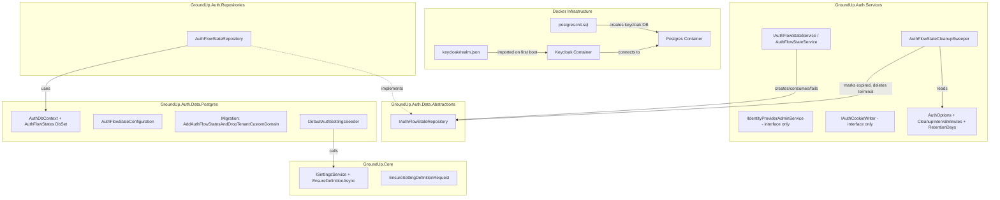
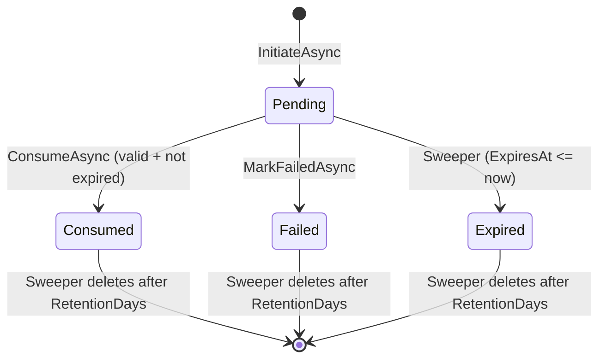
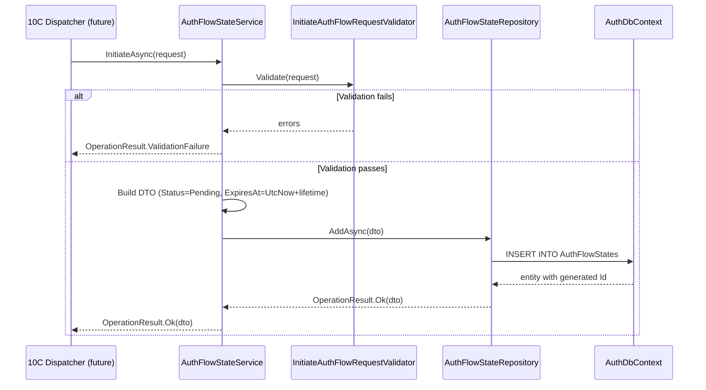
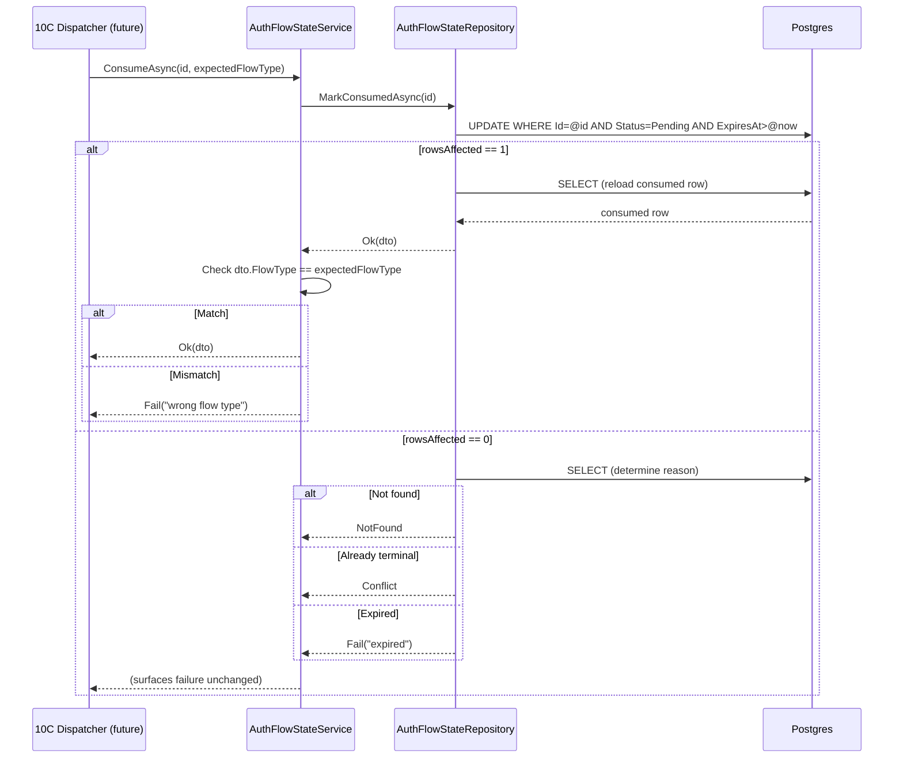
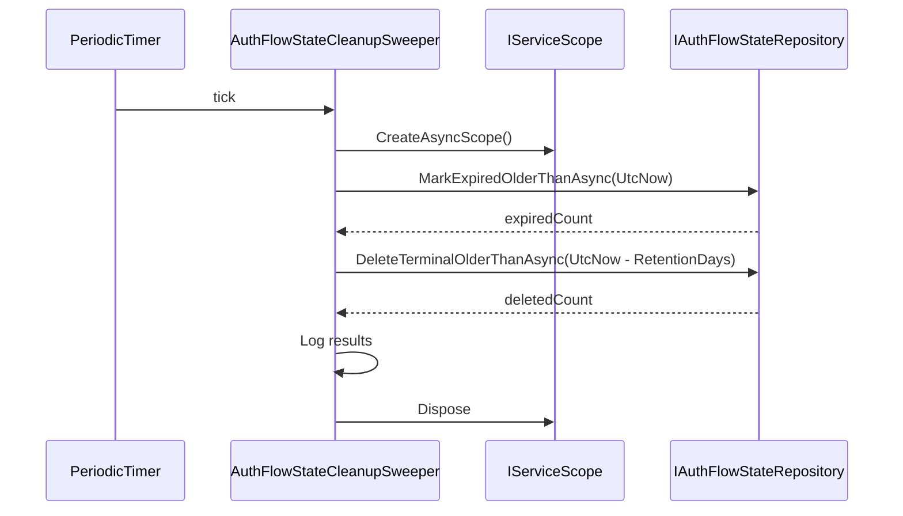

# Design Document — Phase 10A: Keycloak Infra, IdP Admin Contract, AuthFlowState

## Overview

Phase 10A establishes the foundational infrastructure for Keycloak integration and OAuth flow state management. It delivers **no flow logic** — only containers, contracts, persistence, and service skeletons that Phases 10B–10E build upon.

The phase spans five functional areas:
1. **Docker infrastructure** — deterministic Keycloak container with dedicated database and realm auto-import
2. **IIdentityProviderAdminService contract** — realm CRUD, client CRUD, user provisioning (interface + DTOs only)
3. **AuthFlowState persistence** — entity, enums, EF configuration, migration, repository with atomic one-shot consumption
4. **AuthFlowState service skeleton** — InitiateAsync, ConsumeAsync, MarkFailedAsync (pure persistence, no flow logic)
5. **Supporting infrastructure** — IAuthCookieWriter interface, AuthOptions extensions, cleanup sweeper, settings seeder, Tenant.CustomDomain removal

### Key Design Decisions

1. **AuthFlowState is NOT tenant-scoped**: Some flows (e.g., NewOrganization) create the tenant as part of the flow, so the row must exist before any tenant context. Uses `BaseRepository`, not `BaseTenantRepository`.
2. **One-shot consumption via conditional UPDATE**: `MarkConsumedAsync` uses `WHERE Id = @id AND Status = 0 AND ExpiresAt > @now` so that concurrent callbacks can never both succeed — the database enforces exactly-one-winner semantics.
3. **No FK constraints on TenantId, InvitationId, JoinLinkId**: These reference entities that may not exist yet (tenant created during flow) or tables not yet created (TenantInvitations in 10D). FKs added in later phases.
4. **Sweeper uses IHostedService with PeriodicTimer**: Simple, non-allocating timer pattern. Multi-instance safe because bulk SQL operations are inherently atomic per-row (worst case: one instance processes 0 rows because another already did).
5. **DefaultAuthSettingsSeeder calls ISettingsService.EnsureDefinitionAsync**: Cross-module communication goes through the service interface, never through direct DbContext access. This requires a small additive method on ISettingsService.
6. **Keycloak realm.json uses `--import-realm` with idempotent semantics**: Keycloak skips import if realm already exists, preventing overwrite of admin UI edits.
7. **IAuthCookieWriter derives Domain from setting, not config**: Cookie domain comes from `auth.application.default-domain` system setting, making it changeable at runtime without redeployment.
8. **Tenant.CustomDomain dropped permanently**: Enterprise customers wanting their own registrable domain self-deploy. No cross-registrable-domain cookie handoff.

### Project Placement

| Component | Project |
|---|---|
| AuthFlowState entity, FlowType/FlowStatus enums | `GroundUp.Auth.Core` |
| AuthFlowState DTOs, IdP Admin DTOs, InitiateAuthFlowRequest | `GroundUp.Auth.Core` |
| InitiateAuthFlowRequestValidator | `GroundUp.Auth.Core` |
| IAuthFlowStateRepository | `GroundUp.Auth.Data.Abstractions` |
| AuthFlowStateRepository, AuthFlowStateMapper | `GroundUp.Auth.Repositories` |
| AuthFlowStateConfiguration, Migration, DefaultAuthSettingsSeeder | `GroundUp.Auth.Data.Postgres` |
| IIdentityProviderAdminService, IAuthFlowStateService, IAuthCookieWriter | `GroundUp.Auth.Services` |
| AuthFlowStateService, AuthFlowStateCleanupSweeper | `GroundUp.Auth.Services` |
| AuthOptions extensions, DI registration updates | `GroundUp.Auth.Services` |
| EnsureSettingDefinitionRequest DTO, ISettingsService extension | `GroundUp.Core` |
| docker-compose.yml, keycloak/postgres-init.sql, keycloak/realm.json | Repository root |

## Architecture

### High-Level Component Diagram



### AuthFlowState Lifecycle State Machine



## Components and Interfaces

| Interface | Purpose | Project |
|---|---|---|
| `IIdentityProviderAdminService` | Realm CRUD, client CRUD, user provisioning contract | `GroundUp.Auth.Services` |
| `IAuthFlowStateRepository` | Standard CRUD + atomic consumption + sweeper bulk ops | `GroundUp.Auth.Data.Abstractions` |
| `IAuthFlowStateService` | InitiateAsync, ConsumeAsync, MarkFailedAsync | `GroundUp.Auth.Services` |
| `IAuthCookieWriter` | Write/clear auth cookie with domain derivation | `GroundUp.Auth.Services` |
| `ISettingsService.EnsureDefinitionAsync` | Idempotent setting definition creation | `GroundUp.Core` |

| Implementation | Purpose | Project |
|---|---|---|
| `AuthFlowStateRepository` | BaseRepository with atomic MarkConsumedAsync | `GroundUp.Auth.Repositories` |
| `AuthFlowStateService` | Service skeleton delegating to repository | `GroundUp.Auth.Services` |
| `AuthFlowStateCleanupSweeper` | BackgroundService for expiration + pruning | `GroundUp.Auth.Services` |
| `DefaultAuthSettingsSeeder` | IDataSeeder for auth system settings | `GroundUp.Auth.Data.Postgres` |
| `AuthFlowStateConfiguration` | EF Fluent API configuration | `GroundUp.Auth.Data.Postgres` |

## Data Models

### AuthFlowState Table Schema

| Column | Type | Nullable | Constraints |
|---|---|---|---|
| Id | uuid | No | PK, UUID v7 generated |
| FlowType | int | No | Enum → int |
| Status | int | No | Enum → int, default 0 (Pending) |
| TenantId | uuid | Yes | Index (non-unique), no FK |
| InvitationId | uuid | Yes | No FK (table created in 10D) |
| JoinLinkId | uuid | Yes | No FK (table created in 10D) |
| Realm | varchar(128) | Yes | |
| ReturnUrl | varchar(2048) | Yes | |
| Nonce | varchar(128) | No | Required |
| CreatedByIp | varchar(64) | Yes | |
| CreatedByUserAgent | varchar(512) | Yes | |
| ExpiresAt | timestamp | No | Composite index (Status, ExpiresAt) |
| ConsumedAt | timestamp | Yes | |
| TerminatedAt | timestamp | Yes | |
| FailureReason | varchar(1024) | Yes | |
| CreatedAt | timestamp | No | IAuditable |
| CreatedBy | text | Yes | IAuditable |
| UpdatedAt | timestamp | Yes | IAuditable |
| UpdatedBy | text | Yes | IAuditable |

### Indexes

| Name | Columns | Type |
|---|---|---|
| IX_AuthFlowStates_Status_ExpiresAt | (Status, ExpiresAt) | Non-unique |
| IX_AuthFlowStates_TenantId | (TenantId) | Non-unique |

### Migration: AddAuthFlowStatesAndDropTenantCustomDomain

- **Up**: CREATE TABLE AuthFlowStates + indexes; ALTER TABLE Tenants DROP COLUMN CustomDomain
- **Down**: ALTER TABLE Tenants ADD COLUMN CustomDomain varchar(256) NULL; DROP TABLE AuthFlowStates

## Detailed Design

### 1. Docker Compose Updates

```yaml
services:
  postgres:
    image: postgres:16
    environment:
      POSTGRES_DB: groundup
      POSTGRES_USER: groundup
      POSTGRES_PASSWORD: groundup_dev
    ports:
      - "5432:5432"
    volumes:
      - pgdata:/var/lib/postgresql/data
      - ./keycloak/postgres-init.sql:/docker-entrypoint-initdb.d/01-create-keycloak-db.sql
    healthcheck:
      test: ["CMD-SHELL", "pg_isready -U groundup"]
      interval: 5s
      retries: 5

  keycloak:
    image: quay.io/keycloak/keycloak:26.0.7
    command: start-dev --import-realm
    environment:
      KC_DB: postgres
      KC_DB_URL: jdbc:postgresql://postgres:5432/keycloak
      KC_DB_USERNAME: groundup
      KC_DB_PASSWORD: groundup_dev
      KEYCLOAK_ADMIN: admin
      KEYCLOAK_ADMIN_PASSWORD: admin
    ports:
      - "8080:8080"
    volumes:
      - ./keycloak/realm.json:/opt/keycloak/data/import/realm.json
      - kcdata:/opt/keycloak/data
    depends_on:
      postgres:
        condition: service_healthy

volumes:
  pgdata:
  kcdata:
```

### 2. keycloak/postgres-init.sql

```sql
-- Creates the Keycloak database on first Postgres container start.
-- The main 'groundup' database is created via POSTGRES_DB env var.
SELECT 'CREATE DATABASE keycloak'
WHERE NOT EXISTS (SELECT FROM pg_database WHERE datname = 'keycloak')\gexec
```

### 3. keycloak/realm.json (Key Structure)

```json
{
  "realm": "groundup",
  "enabled": true,
  "registrationAllowed": false,
  "loginWithEmailAllowed": true,
  "duplicateEmailsAllowed": false,
  "clients": [
    {
      "clientId": "groundup-app",
      "enabled": true,
      "publicClient": true,
      "standardFlowEnabled": true,
      "directAccessGrantsEnabled": false,
      "redirectUris": ["https://localhost:*/auth/callback"],
      "webOrigins": ["https://localhost:*"],
      "attributes": {
        "pkce.code.challenge.method": "S256"
      }
    }
  ]
}
```

### 4. FlowType and FlowStatus Enums

```csharp
namespace GroundUp.Auth.Core.Enums;

public enum FlowType
{
    NewOrganization = 0,
    Invitation = 1,
    JoinLink = 2,
    EnterpriseFirstAdmin = 3,
    EnterpriseSsoAutoJoin = 4,
    MultiTenantSelection = 5,
    TokenRefresh = 6
}

public enum FlowStatus
{
    Pending = 0,
    Consumed = 1,
    Expired = 2,
    Failed = 3
}
```

### 5. AuthFlowState Entity

```csharp
namespace GroundUp.Auth.Core.Entities;

/// <summary>
/// Represents an in-flight OAuth flow. The primary key (UUID v7) is the value
/// embedded in the OAuth state parameter sent to Keycloak.
/// Not tenant-scoped (some flows create the tenant as part of the flow).
/// Not soft-deletable (cleanup sweeper hard-deletes to keep table bounded).
/// </summary>
public sealed class AuthFlowState : BaseEntity, IAuditable
{
    public FlowType FlowType { get; set; }
    public FlowStatus Status { get; set; } = FlowStatus.Pending;
    public Guid? TenantId { get; set; }
    public Guid? InvitationId { get; set; }
    public Guid? JoinLinkId { get; set; }
    public string? Realm { get; set; }
    public string? ReturnUrl { get; set; }
    public string Nonce { get; set; } = string.Empty;
    public string? CreatedByIp { get; set; }
    public string? CreatedByUserAgent { get; set; }
    public DateTime ExpiresAt { get; set; }
    public DateTime? ConsumedAt { get; set; }
    public DateTime? TerminatedAt { get; set; }
    public string? FailureReason { get; set; }

    // IAuditable
    public DateTime CreatedAt { get; set; }
    public string? CreatedBy { get; set; }
    public DateTime? UpdatedAt { get; set; }
    public string? UpdatedBy { get; set; }
}
```

### 6. Identity Provider Admin DTOs (GroundUp.Auth.Core/Dtos)

```csharp
namespace GroundUp.Auth.Core.Dtos;

public record RealmDto(string RealmName, string DisplayName, bool Enabled);
public record CreateRealmRequest(string RealmName, string? DisplayName);
public record UpdateRealmRequest(string? DisplayName, bool? Enabled);

public record IdentityProviderClientDto(
    string ClientId, string? ClientSecret,
    IReadOnlyList<string> RedirectUris, bool RequiresPkce);
public record CreateIdentityProviderClientRequest(
    string ClientId, IReadOnlyList<string> RedirectUris, bool RequiresPkce);
public record UpdateIdentityProviderClientRequest(
    IReadOnlyList<string>? RedirectUris, bool? RequiresPkce);

public record ProvisionUserRequest(
    string Email, string? DisplayName,
    string? InitialPassword, bool RequirePasswordReset);
public record ProvisionedUserDto(
    string ExternalUserId, string Email,
    string? DisplayName, bool RequiresPasswordReset);
public record IdentityProviderUserCredentialsDto(string Password, bool Temporary);
```

### 7. IIdentityProviderAdminService Interface

```csharp
namespace GroundUp.Auth.Services;

/// <summary>
/// Administrative contract for external identity provider operations.
/// Supports realm CRUD, client CRUD, and user provisioning.
/// Phase 10B implements against Keycloak; 10A defines the contract only.
/// </summary>
public interface IIdentityProviderAdminService
{
    // Realm operations
    Task<OperationResult<RealmDto>> CreateRealmAsync(
        CreateRealmRequest request, CancellationToken cancellationToken = default);
    Task<OperationResult<RealmDto>> GetRealmAsync(
        string realmName, CancellationToken cancellationToken = default);
    Task<OperationResult<RealmDto>> UpdateRealmAsync(
        string realmName, UpdateRealmRequest request, CancellationToken cancellationToken = default);
    Task<OperationResult> DeleteRealmAsync(
        string realmName, CancellationToken cancellationToken = default);

    // Client operations (scoped to a realm)
    Task<OperationResult<IdentityProviderClientDto>> CreateClientAsync(
        string realmName, CreateIdentityProviderClientRequest request, CancellationToken cancellationToken = default);
    Task<OperationResult<IdentityProviderClientDto>> GetClientAsync(
        string realmName, string clientId, CancellationToken cancellationToken = default);
    Task<OperationResult<IdentityProviderClientDto>> UpdateClientAsync(
        string realmName, string clientId, UpdateIdentityProviderClientRequest request, CancellationToken cancellationToken = default);
    Task<OperationResult> DeleteClientAsync(
        string realmName, string clientId, CancellationToken cancellationToken = default);

    // User provisioning
    Task<OperationResult<ProvisionedUserDto>> ProvisionUserAsync(
        string realmName, ProvisionUserRequest request, CancellationToken cancellationToken = default);
    Task<OperationResult> SetUserCredentialsAsync(
        string realmName, string externalUserId, IdentityProviderUserCredentialsDto credentials,
        CancellationToken cancellationToken = default);
    Task<OperationResult> DeleteUserAsync(
        string realmName, string externalUserId, CancellationToken cancellationToken = default);
}
```

### 8. AuthFlowState DTOs

```csharp
namespace GroundUp.Auth.Core.Dtos;

public record AuthFlowStateDto(
    Guid Id, FlowType FlowType, FlowStatus Status,
    Guid? TenantId, Guid? InvitationId, Guid? JoinLinkId,
    string? Realm, string? ReturnUrl, string Nonce,
    string? CreatedByIp, string? CreatedByUserAgent,
    DateTime ExpiresAt, DateTime? ConsumedAt, DateTime? TerminatedAt,
    string? FailureReason, DateTime CreatedAt, DateTime? UpdatedAt);

public record InitiateAuthFlowRequest(
    FlowType FlowType, Guid? TenantId, Guid? InvitationId, Guid? JoinLinkId,
    string? Realm, string? ReturnUrl, string Nonce,
    string? CreatedByIp, string? CreatedByUserAgent, TimeSpan? Lifetime);
```

### 9. AuthFlowState Mapper (Mapperly)

```csharp
namespace GroundUp.Auth.Repositories.Mappers;

[Mapper]
public static partial class AuthFlowStateMapper
{
    public static partial AuthFlowStateDto ToDto(AuthFlowState entity);
    public static partial AuthFlowState ToEntity(AuthFlowStateDto dto);
}
```

### 10. IAuthFlowStateRepository

```csharp
namespace GroundUp.Auth.Data.Abstractions;

public interface IAuthFlowStateRepository : IBaseRepository<AuthFlowStateDto>
{
    /// <summary>
    /// Atomically marks a Pending, non-expired row as Consumed.
    /// Returns conflict if already consumed/failed, expired failure if past ExpiresAt.
    /// </summary>
    Task<OperationResult<AuthFlowStateDto>> MarkConsumedAsync(
        Guid id, CancellationToken cancellationToken = default);

    /// <summary>
    /// Marks a Pending row as Failed with a reason.
    /// Returns conflict if already terminal.
    /// </summary>
    Task<OperationResult<AuthFlowStateDto>> MarkFailedAsync(
        Guid id, string reason, CancellationToken cancellationToken = default);

    /// <summary>
    /// Bulk-updates all Pending rows with ExpiresAt <= cutoff to Expired.
    /// Returns the count of rows updated.
    /// </summary>
    Task<OperationResult<int>> MarkExpiredOlderThanAsync(
        DateTime cutoff, CancellationToken cancellationToken = default);

    /// <summary>
    /// Bulk-deletes all terminal (Consumed/Expired/Failed) rows with TerminatedAt <= cutoff.
    /// Returns the count of rows deleted.
    /// </summary>
    Task<OperationResult<int>> DeleteTerminalOlderThanAsync(
        DateTime cutoff, CancellationToken cancellationToken = default);
}
```

### 11. AuthFlowStateRepository Implementation

```csharp
namespace GroundUp.Auth.Repositories;

public sealed class AuthFlowStateRepository : BaseRepository<AuthFlowState, AuthFlowStateDto>, IAuthFlowStateRepository
{
    public AuthFlowStateRepository(AuthDbContext context)
        : base(context, AuthFlowStateMapper.ToDto, AuthFlowStateMapper.ToEntity) { }

    public async Task<OperationResult<AuthFlowStateDto>> MarkConsumedAsync(
        Guid id, CancellationToken cancellationToken = default)
    {
        // Single conditional UPDATE:
        // UPDATE AuthFlowStates
        // SET Status = Consumed, ConsumedAt = @now, TerminatedAt = @now, UpdatedAt = @now
        // WHERE Id = @id AND Status = Pending AND ExpiresAt > @now
        //
        // If rowsAffected == 1: reload and return Ok
        // If rowsAffected == 0: read the row to determine failure reason:
        //   - Not found → NotFound
        //   - Status != Pending → Conflict (already consumed/failed/expired)
        //   - ExpiresAt <= now → domain failure "expired"
    }

    public async Task<OperationResult<AuthFlowStateDto>> MarkFailedAsync(
        Guid id, string reason, CancellationToken cancellationToken = default)
    {
        // Truncate reason to 1024 chars if exceeded
        // Load entity, verify Status == Pending
        // Set Status = Failed, FailureReason = reason, TerminatedAt = UtcNow
        // SaveChanges
    }

    public async Task<OperationResult<int>> MarkExpiredOlderThanAsync(
        DateTime cutoff, CancellationToken cancellationToken = default)
    {
        // ExecuteUpdateAsync:
        // WHERE Status == Pending AND ExpiresAt <= cutoff
        // SET Status = Expired, TerminatedAt = UtcNow
        var count = await DbSet
            .Where(x => x.Status == FlowStatus.Pending && x.ExpiresAt <= cutoff)
            .ExecuteUpdateAsync(s => s
                .SetProperty(x => x.Status, FlowStatus.Expired)
                .SetProperty(x => x.TerminatedAt, DateTime.UtcNow), cancellationToken);
        return OperationResult<int>.Ok(count);
    }

    public async Task<OperationResult<int>> DeleteTerminalOlderThanAsync(
        DateTime cutoff, CancellationToken cancellationToken = default)
    {
        // ExecuteDeleteAsync:
        // WHERE Status IN (Consumed, Expired, Failed) AND TerminatedAt <= cutoff
        var count = await DbSet
            .Where(x => x.Status != FlowStatus.Pending && x.TerminatedAt <= cutoff)
            .ExecuteDeleteAsync(cancellationToken);
        return OperationResult<int>.Ok(count);
    }
}
```

### 12. AuthFlowState EF Configuration

```csharp
namespace GroundUp.Auth.Data.Postgres.Configurations;

public sealed class AuthFlowStateConfiguration : IEntityTypeConfiguration<AuthFlowState>
{
    public void Configure(EntityTypeBuilder<AuthFlowState> builder)
    {
        builder.ToTable("AuthFlowStates");
        builder.HasKey(e => e.Id);

        // Indexes
        builder.HasIndex(e => new { e.Status, e.ExpiresAt });
        builder.HasIndex(e => e.TenantId);

        // Enum storage as int
        builder.Property(e => e.FlowType).HasConversion<int>();
        builder.Property(e => e.Status).HasConversion<int>();

        // String constraints
        builder.Property(e => e.Nonce).IsRequired().HasMaxLength(128);
        builder.Property(e => e.Realm).HasMaxLength(128);
        builder.Property(e => e.ReturnUrl).HasMaxLength(2048);
        builder.Property(e => e.CreatedByIp).HasMaxLength(64);
        builder.Property(e => e.CreatedByUserAgent).HasMaxLength(512);
        builder.Property(e => e.FailureReason).HasMaxLength(1024);

        // Nullable timestamps
        builder.Property(e => e.ConsumedAt);
        builder.Property(e => e.TerminatedAt);
    }
}
```

### 13. IAuthFlowStateService

```csharp
namespace GroundUp.Auth.Services;

public interface IAuthFlowStateService
{
    /// <summary>
    /// Creates a new Pending AuthFlowState row and returns it with its server-generated Id.
    /// </summary>
    Task<OperationResult<AuthFlowStateDto>> InitiateAsync(
        InitiateAuthFlowRequest request, CancellationToken cancellationToken = default);

    /// <summary>
    /// Atomically transitions a Pending row to Consumed and verifies the expected FlowType.
    /// </summary>
    Task<OperationResult<AuthFlowStateDto>> ConsumeAsync(
        Guid id, FlowType expectedFlowType, CancellationToken cancellationToken = default);

    /// <summary>
    /// Marks a Pending row as Failed with a reason string.
    /// </summary>
    Task<OperationResult<AuthFlowStateDto>> MarkFailedAsync(
        Guid id, string reason, CancellationToken cancellationToken = default);
}
```

### 14. AuthFlowStateService Implementation

```csharp
namespace GroundUp.Auth.Services;

public sealed class AuthFlowStateService : IAuthFlowStateService
{
    private readonly IAuthFlowStateRepository _repository;
    private readonly IValidator<InitiateAuthFlowRequest> _validator;

    public async Task<OperationResult<AuthFlowStateDto>> InitiateAsync(
        InitiateAuthFlowRequest request, CancellationToken cancellationToken = default)
    {
        // 1. Validate request (FluentValidation)
        // 2. Build AuthFlowStateDto with:
        //    - Status = Pending
        //    - ExpiresAt = UtcNow + (request.Lifetime ?? 15 minutes)
        //    - All other fields copied from request
        // 3. Call _repository.AddAsync(dto)
        // 4. Return persisted row
    }

    public async Task<OperationResult<AuthFlowStateDto>> ConsumeAsync(
        Guid id, FlowType expectedFlowType, CancellationToken cancellationToken = default)
    {
        // 1. Call _repository.MarkConsumedAsync(id)
        // 2. If failure → surface unchanged
        // 3. If success but consumed.FlowType != expectedFlowType → return "wrong flow type" failure
        // 4. Return consumed row
    }

    public async Task<OperationResult<AuthFlowStateDto>> MarkFailedAsync(
        Guid id, string reason, CancellationToken cancellationToken = default)
    {
        // 1. If reason is null/empty/whitespace → return ValidationFailure
        // 2. Delegate to _repository.MarkFailedAsync(id, reason)
        // 3. Surface result unchanged
    }
}
```

### 15. InitiateAuthFlowRequestValidator

```csharp
namespace GroundUp.Auth.Core.Validators;

public sealed class InitiateAuthFlowRequestValidator : AbstractValidator<InitiateAuthFlowRequest>
{
    public InitiateAuthFlowRequestValidator()
    {
        RuleFor(x => x.Nonce).NotEmpty().MaximumLength(128);
        RuleFor(x => x.FlowType).IsInEnum();
        RuleFor(x => x.Realm).MaximumLength(128).When(x => x.Realm is not null);
        RuleFor(x => x.ReturnUrl).MaximumLength(2048).When(x => x.ReturnUrl is not null);
        RuleFor(x => x.CreatedByIp).MaximumLength(64).When(x => x.CreatedByIp is not null);
        RuleFor(x => x.CreatedByUserAgent).MaximumLength(512).When(x => x.CreatedByUserAgent is not null);
        RuleFor(x => x.Lifetime)
            .Must(lt => lt == null || lt.Value > TimeSpan.Zero)
            .WithMessage("Lifetime must be positive if specified.");
    }
}
```

### 16. IAuthCookieWriter Interface

```csharp
namespace GroundUp.Auth.Services;

/// <summary>
/// Abstraction for writing and clearing the authentication cookie.
/// Implementations MUST honour AuthOptions.CookieName, CookieSecure, and CookieSameSite.
/// Implementations MUST derive the cookie's Domain attribute from the
/// auth.application.default-domain system setting:
///   - If empty → host-only cookie (no Domain attribute set)
///   - If non-empty (e.g., "sampleapp.com") → Domain = ".sampleapp.com"
/// Cookie expiration MUST align with AuthOptions.TokenExpirationMinutes.
/// Phase 10C implements; 10A defines the contract only.
/// </summary>
public interface IAuthCookieWriter
{
    void WriteAuthCookie(HttpContext httpContext, string token);
    void ClearAuthCookie(HttpContext httpContext);
}
```

### 17. AuthOptions Extensions

New properties added to the existing `AuthOptions` class:

```csharp
/// <summary>
/// Interval in minutes between cleanup sweeper cycles. Default: 5.
/// Must be > 0; validated on startup.
/// </summary>
public int CleanupIntervalMinutes { get; set; } = 5;

/// <summary>
/// Number of days to retain terminal AuthFlowState rows before hard deletion. Default: 7.
/// Must be >= 0; validated on startup. 0 = delete immediately after termination.
/// </summary>
public int RetentionDays { get; set; } = 7;
```

Updated options validation (added to existing `AddOptionsValidation`):

```csharp
.Validate(options => options.CleanupIntervalMinutes > 0,
    "AuthOptions.CleanupIntervalMinutes must be greater than 0.")
.Validate(options => options.RetentionDays >= 0,
    "AuthOptions.RetentionDays must be 0 or greater.")
```

### 18. AuthFlowStateCleanupSweeper

```csharp
namespace GroundUp.Auth.Services;

/// <summary>
/// Background service that periodically expires stale Pending rows and
/// prunes terminal rows past the retention window.
/// </summary>
public sealed class AuthFlowStateCleanupSweeper : BackgroundService
{
    private readonly IServiceScopeFactory _scopeFactory;
    private readonly IOptions<AuthOptions> _options;
    private readonly ILogger<AuthFlowStateCleanupSweeper> _logger;

    protected override async Task ExecuteAsync(CancellationToken stoppingToken)
    {
        var interval = TimeSpan.FromMinutes(_options.Value.CleanupIntervalMinutes);
        using var timer = new PeriodicTimer(interval);

        while (!stoppingToken.IsCancellationRequested)
        {
            try
            {
                await timer.WaitForNextTickAsync(stoppingToken);
            }
            catch (OperationCanceledException) { break; }

            try
            {
                await using var scope = _scopeFactory.CreateAsyncScope();
                var repository = scope.ServiceProvider.GetRequiredService<IAuthFlowStateRepository>();

                // Step 1: Expire stale Pending rows
                var expiredResult = await repository.MarkExpiredOlderThanAsync(
                    DateTime.UtcNow, stoppingToken);
                var expiredCount = expiredResult.Success ? expiredResult.Data : 0;

                // Step 2: Delete terminal rows past retention
                var retentionCutoff = DateTime.UtcNow - TimeSpan.FromDays(_options.Value.RetentionDays);
                var deletedResult = await repository.DeleteTerminalOlderThanAsync(
                    retentionCutoff, stoppingToken);
                var deletedCount = deletedResult.Success ? deletedResult.Data : 0;

                if (expiredCount > 0)
                    _logger.LogInformation("AuthFlowState sweep: expired {Count} rows", expiredCount);
                if (deletedCount > 0)
                    _logger.LogInformation("AuthFlowState sweep: deleted {Count} terminal rows", deletedCount);
                if (expiredCount == 0 && deletedCount == 0)
                    _logger.LogDebug("AuthFlowState sweep: no work");
            }
            catch (OperationCanceledException) { break; }
            catch (Exception ex)
            {
                _logger.LogError(ex, "AuthFlowState sweep cycle failed");
            }
        }
    }
}
```

### 19. EnsureSettingDefinitionRequest DTO

```csharp
namespace GroundUp.Core.Dtos.Settings;

public record EnsureSettingDefinitionRequest(
    string Key,
    SettingDataType DataType,
    string DefaultValue,
    string DisplayName,
    string? Description,
    string? Category,
    string GroupKey,
    string GroupDisplayName,
    IReadOnlyList<string> AllowedLevelNames,
    string? RegexPattern = null,
    string? ValidationMessage = null,
    bool IsRequired = false,
    bool IsSecret = false,
    bool IsEncrypted = false);
```

### 20. ISettingsService.EnsureDefinitionAsync Extension

```csharp
// Added to ISettingsService interface:

/// <summary>
/// Creates a setting definition (with its group and allowed levels) if it doesn't
/// already exist. Idempotent — returns the existing definition unchanged if the key
/// is already registered.
/// </summary>
Task<OperationResult<SettingDefinitionDto>> EnsureDefinitionAsync(
    EnsureSettingDefinitionRequest request,
    CancellationToken cancellationToken = default);
```

### 21. DefaultAuthSettingsSeeder

```csharp
namespace GroundUp.Auth.Data.Postgres.Seeders;

/// <summary>
/// Seeds authentication-related system settings on startup.
/// Calls ISettingsService.EnsureDefinitionAsync for cross-module communication.
/// </summary>
public sealed class DefaultAuthSettingsSeeder : IDataSeeder
{
    private readonly ISettingsService _settingsService;

    public int Order => 30; // After DefaultPermissionSeeder (10) and DefaultSystemRoleSeeder (20)

    public async Task SeedAsync(CancellationToken cancellationToken = default)
    {
        // Seed: auth.application.default-domain
        // Seed: auth.keycloak.shared-realm-name
        // Seed: auth.keycloak.public-base-url
        // Each call is idempotent via EnsureDefinitionAsync
    }
}
```

### 22. Tenant.CustomDomain Removal

- Remove `CustomDomain` property from `Tenant` entity
- Remove `CustomDomain` from `TenantDto`, `CreateTenantDto`, `UpdateTenantDto`
- Remove `CustomDomain` mapping from `TenantConfiguration`
- Remove `CustomDomain` references from mappers, validators, and tests
- Migration drops the column in `Up`, re-adds in `Down`

### 23. DI Registration Updates

Added to `RegisterCoreServices` in `AuthServiceCollectionExtensions`:

```csharp
// Phase 10A — AuthFlowState
services.AddScoped<IAuthFlowStateRepository, AuthFlowStateRepository>();
services.AddScoped<IAuthFlowStateService, AuthFlowStateService>();
services.AddHostedService<AuthFlowStateCleanupSweeper>();

// Phase 10A — Validator
services.AddScoped<IValidator<InitiateAuthFlowRequest>, InitiateAuthFlowRequestValidator>();
```

No registration for `IIdentityProviderAdminService` (10B) or `IAuthCookieWriter` (10C).

## Sequence Diagrams

### AuthFlowState Initiation



### AuthFlowState One-Shot Consumption



### Cleanup Sweeper Cycle



## Correctness Properties

*A property is a characteristic or behavior that should hold true across all valid executions of a system — essentially, a formal statement about what the system should do. Properties serve as the bridge between human-readable specifications and machine-verifiable correctness guarantees.*

### Property 1: One-Shot Consumption Idempotency

*For any* `Pending`, non-expired `AuthFlowState` row with id `x`, calling `ConsumeAsync(x, matchingFlowType)` twice sequentially SHALL result in exactly one success outcome and one "already consumed" failure outcome. Two successes SHALL never be observed.

**Validates: Requirements 13.2, 13.3, 13.5**

### Property 2: Initiate → Consume Round-Trip Preserves Metadata

*For any* valid `InitiateAuthFlowRequest`, the row returned by `ConsumeAsync(initiated.Id, request.FlowType)` (where `initiated` is the result of `InitiateAsync(request)`) SHALL have matching `FlowType`, `TenantId`, `InvitationId`, `JoinLinkId`, `Realm`, `ReturnUrl`, `Nonce`, `CreatedByIp`, `CreatedByUserAgent` — and `Status == Consumed` with `ConsumedAt != null`.

**Validates: Requirements 16.6, 16.7, 13.2**

### Property 3: Concurrent Consumption Selects Exactly One Winner

*For any* `Pending`, non-expired row with id `x` and any `n >= 2`, launching `n` concurrent `ConsumeAsync(x, matchingFlowType)` calls SHALL yield exactly one success result; the remaining `n - 1` results SHALL be "already consumed" failures.

**Validates: Requirements 13.3, 13.5**

### Property 4: Sweeper Expiration Transition Correctness

*For any* set of `AuthFlowState` rows, after one sweep cycle, all rows with `Status == Pending` and `ExpiresAt <= DateTime.UtcNow` SHALL have `Status == Expired`. All rows with `ExpiresAt > DateTime.UtcNow` SHALL remain `Pending`.

**Validates: Requirements 15.1, 15.2, 23.3**

### Property 5: Sweeper Retention Pruning Correctness

*For any* set of `AuthFlowState` rows, after one sweep cycle with retention cutoff `C`, all rows with `Status IN (Consumed, Expired, Failed)` and `TerminatedAt <= C` SHALL no longer exist. Rows with `TerminatedAt > C` and rows with `Status == Pending` (which have `TerminatedAt = null`) SHALL remain.

**Validates: Requirements 15.3, 15.4, 24.1**

### Property 6: Expired Rows Cannot Be Consumed

*For any* `AuthFlowState` row whose `ExpiresAt <= DateTime.UtcNow`, every call to `ConsumeAsync` SHALL return a non-success result, regardless of whether the sweeper has yet transitioned the row's `Status` from `Pending` to `Expired`.

**Validates: Requirements 13.6, 7.14**

## Error Handling

| Operation | Error Condition | Result |
|---|---|---|
| `InitiateAsync` | Validation failure (empty Nonce, invalid FlowType, etc.) | `OperationResult.ValidationFailure` |
| `ConsumeAsync` | Row not found | `OperationResult.NotFound` |
| `ConsumeAsync` | Row already consumed/failed/expired | `OperationResult.Conflict` with domain code |
| `ConsumeAsync` | Row pending but past ExpiresAt | `OperationResult.Fail` with "expired" code |
| `ConsumeAsync` | FlowType mismatch after successful consumption | `OperationResult.Fail` with "wrong_flow_type" code |
| `MarkFailedAsync` | Empty/null reason | `OperationResult.ValidationFailure` |
| `MarkFailedAsync` | Row not found | `OperationResult.NotFound` |
| `MarkFailedAsync` | Row already terminal | `OperationResult.Conflict` |
| Sweeper cycle | Repository throws | Logged at Error, sweeper continues next cycle |
| `EnsureDefinitionAsync` | Unknown level name in `AllowedLevelNames` | `OperationResult.BadRequest` |

## Testing Strategy

### Unit Tests (NSubstitute)

- **AuthFlowStateService.InitiateAsync**: default lifetime (15 min), custom lifetime, validation failure (empty Nonce), validation failure (Nonce > 128 chars)
- **AuthFlowStateService.ConsumeAsync**: happy path, wrong flow type mismatch, surfaces NotFound/Conflict/expired unchanged
- **AuthFlowStateService.MarkFailedAsync**: empty reason rejection, delegates to repo
- **AuthOptions validation**: CleanupIntervalMinutes <= 0 fails, RetentionDays < 0 fails
- **InitiateAuthFlowRequestValidator**: all rules exercised

### Integration Tests (Testcontainers Postgres)

- **AuthFlowStateRepository CRUD**: add, get by ID, update, delete
- **AuthFlowStateRepository.MarkConsumedAsync**: happy path, already-consumed rejection, expired rejection, not-found
- **AuthFlowStateRepository.MarkFailedAsync**: happy path, already-terminal rejection
- **AuthFlowStateRepository.MarkExpiredOlderThanAsync**: only Pending rows past cutoff transition
- **AuthFlowStateRepository.DeleteTerminalOlderThanAsync**: only terminal rows past cutoff deleted, Pending rows unaffected
- **AuthFlowStateCleanupSweeper**: sub-second interval, verify expired row transitions; RetentionDays=0, verify terminal row deleted
- **DefaultAuthSettingsSeeder**: first run creates all definitions; second run is idempotent

### Property-Based Tests (FsCheck)

- **Property 1**: Generate random valid AuthFlowState, consume twice sequentially, assert exactly one success
  - Tag: `Feature: phase-10a-keycloak-infra-and-state, Property 1: One-shot consumption idempotency`
  - Minimum 100 iterations
- **Property 2**: Generate random InitiateAuthFlowRequest, initiate → consume, verify all metadata fields preserved
  - Tag: `Feature: phase-10a-keycloak-infra-and-state, Property 2: Initiate-consume round-trip preserves metadata`
  - Minimum 100 iterations
- **Property 3**: Generate random valid row, launch N (2-10) concurrent ConsumeAsync calls, verify exactly one winner
  - Tag: `Feature: phase-10a-keycloak-infra-and-state, Property 3: Concurrent consumption selects exactly one winner`
  - Minimum 100 iterations (requires real Postgres for true concurrency)
- **Property 4**: Generate random mix of rows (expired/non-expired), run sweep, verify only expired Pending rows transition
  - Tag: `Feature: phase-10a-keycloak-infra-and-state, Property 4: Sweeper expiration transition correctness`
  - Minimum 100 iterations
- **Property 5**: Generate random mix of terminal rows (old/recent), run sweep, verify only old ones deleted
  - Tag: `Feature: phase-10a-keycloak-infra-and-state, Property 5: Sweeper retention pruning correctness`
  - Minimum 100 iterations
- **Property 6**: Generate random rows with ExpiresAt in the past, attempt consume, verify all fail
  - Tag: `Feature: phase-10a-keycloak-infra-and-state, Property 6: Expired rows cannot be consumed`
  - Minimum 100 iterations

### Test Configuration Notes

- Properties 1, 2, 6 can run against in-process service with NSubstitute repo (testing service logic)
- Properties 3, 4, 5 require Testcontainers Postgres (testing database-level atomicity and bulk operations)
- Sweeper integration tests use `AuthOptions.CleanupIntervalMinutes` override to 100ms equivalent via a custom timer injection or test-only configuration
