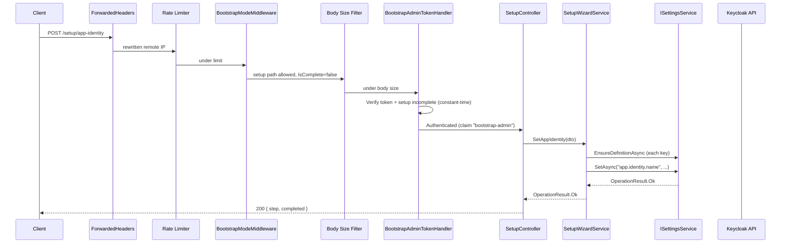
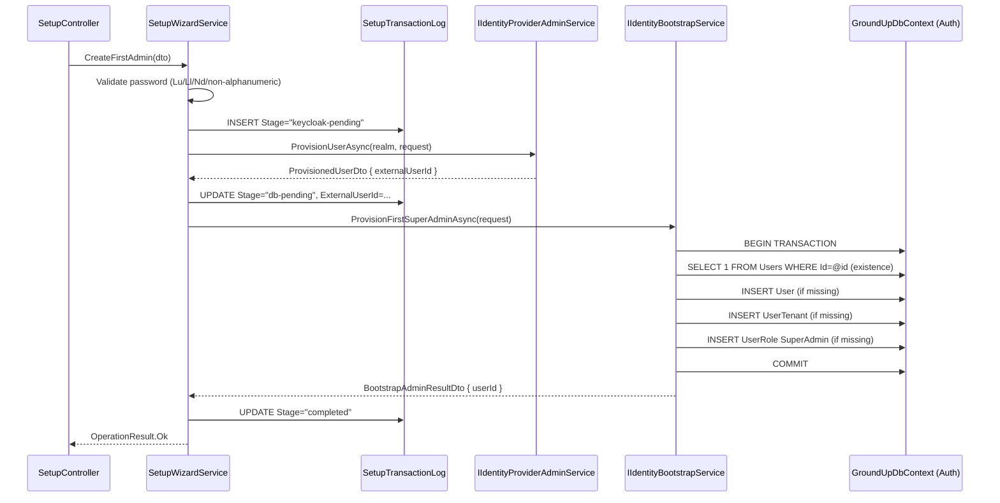
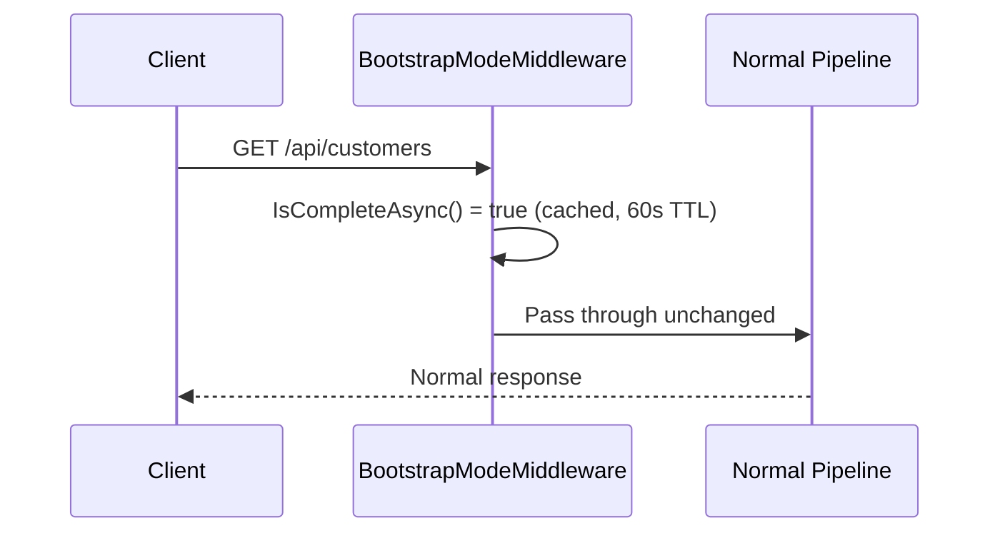

# Design Document

## Phase 10AB: Initial Setup & Secrets Foundation

## Overview

Phase 10AB delivers the encryption substrate, bootstrap state machine, and first-run setup wizard that together enable the GroundUp framework to be configured from a fresh database through a sequential JSON API. The design spans three pillars:

1. **Secrets at rest** — A master key provider abstraction resolves a 256-bit AES key at startup; an AES-GCM encryption provider transparently encrypts/decrypts `IsEncrypted=true` settings; an `ISecretResolver` interface allows future integration with external secret stores (single-pass, no implementation ships in 10AB).
2. **Bootstrap state machine** — A singleton `BootstrapState` entity gates the application. Middleware redirects all non-setup traffic until setup completes. A one-shot bootstrap admin token is the sole authentication mechanism during setup.
3. **Setup wizard** — Sequential JSON endpoints capture app identity, Keycloak URLs, provision a service-account client, create the first super admin (via `IIdentityBootstrapService` + `IIdentityProviderAdminService` — never directly against auth-module repositories), and finalize setup. A bounded transaction log enables recovery from partial failures.

### Design Decisions

| Decision | Rationale |
|----------|-----------|
| AES-GCM over AES-CBC | Authenticated encryption prevents silent corruption; .NET 8 has native `AesGcm` support |
| Self-describing ciphertext format | `aes-gcm-v1:` prefix enables future algorithm rotation without breaking existing data |
| `AesGcmSettingEncryptionProvider` throws on null/empty/whitespace; `SettingsService` short-circuits before calling | Keeps the provider's contract focused on "valid string in / valid string out" so misuse fails loudly. The "should this even be encrypted?" decision lives in the only layer that knows — the settings service |
| Single-pass `ISecretResolver` (no recursion) | Prevents infinite resolution loops; keeps the resolver contract simple |
| Singleton BootstrapState with CHECK constraint | Database-enforced singleton prevents race conditions during multi-worker deployments |
| `xmin` concurrency token (manual EF shadow property) | Postgres-native, zero-column-overhead optimistic concurrency |
| 60-second cache TTL for bootstrap state | Acceptable lag for a one-time event; avoids DB hit on every request |
| Two `IHostedService`s for startup ordering: `MigrationStartupHostedService` then `BootstrapTokenStartupValidator` | EF migrations must run before any request hits the bootstrap-mode middleware; the token presence check needs the migrated `BootstrapState` row |
| Cross-module work via service interfaces (`IIdentityBootstrapService`, `IIdentityProviderAdminService`) | Preserves strict layering — `SetupWizardService` MUST NOT inject auth-module repositories |
| Keycloak admin-client bootstrap step is the **one** justified exception that calls Keycloak directly via a typed `KeycloakAdminHttpClient` | At that step the admin client doesn't exist yet; the wizard is creating it. After this step, `IIdentityProviderAdminService` is the only path |
| `SecretMask = "***REDACTED***"` | Replaces Phase 6's `"••••••••"`. Plain-ASCII marker is unambiguous in logs and JSON tooling |
| Rate limiting before auth | Prevents unauthenticated resource exhaustion; bypassed automatically once setup completes |
| Transaction log with bounded rotation (default 1000 rows; pending rows protected) | Partial failures are diagnosable and recoverable; unbounded growth prevented; rows representing unresolved partial state are never auto-deleted |

### Note on EF Core `xmin` mapping

EF Core 8 does not expose a first-class fluent helper for the Postgres `xmin` system column. The design uses the well-tested manual approach: a shadow property of type `uint` mapped to column type `xid`, configured via `IsConcurrencyToken()` and `ValueGeneratedOnAddOrUpdate()`. This is consistent with the existing pattern across the framework's other concurrency-tracked entities and is preserved unchanged in this revision.

## Architecture

### Component Diagram

```mermaid
graph TB
    subgraph "GroundUp.Core.Abstractions"
        IMasterKeyProvider
        ISettingEncryptionProvider
        ISecretResolver
        IBootstrapStateService
        ICurrentUser
    end

    subgraph "GroundUp.Core.Entities"
        BootstrapState
        SetupTransactionLog
    end

    subgraph "GroundUp.Core.Configuration"
        BootstrapOptions
        SetupOptions
        SetupRateLimitOptions
        SetupTransactionLogOptions
    end

    subgraph "GroundUp.Services"
        MasterKeyProvider[EnvironmentFileMasterKeyProvider]
        AesGcmProvider[AesGcmSettingEncryptionProvider]
        BootstrapStateServiceImpl[BootstrapStateService]
        SetupCurrentUser
        SetupWizardService
        MigrationStartup[MigrationStartupHostedService]
        TokenStartup[BootstrapTokenStartupValidator]
    end

    subgraph "GroundUp.Auth.Services.Bootstrap"
        IIdentityBootstrapService
        IdentityBootstrapServiceImpl[IdentityBootstrapService]
    end

    subgraph "GroundUp.Auth.Services"
        IIdentityProviderAdminService
    end

    subgraph "GroundUp.Api"
        BootstrapModeMiddleware
        BootstrapAdminTokenHandler[BootstrapAdminTokenAuthenticationHandler]
        SetupController
        SetupRateLimitPolicy
        SetupBodySizeFilter
        KeycloakAdminHttpClient[KeycloakAdminHttpClient<br/>(typed, named)]
        MasterKeyHealthCheck
        BootstrapAwarePublisher[BootstrapStateAwareHealthCheckPublisher]
    end

    subgraph "GroundUp.Data.Postgres"
        BootstrapStateConfig[BootstrapStateConfiguration]
        SetupTransactionLogConfig[SetupTransactionLogConfiguration]
        Migration[AddBootstrapStateAndSetupTransactionLog]
    end

    SetupController --> SetupWizardService
    SetupController --> BootstrapAdminTokenHandler
    BootstrapModeMiddleware --> IBootstrapStateService
    SetupWizardService --> IBootstrapStateService
    SetupWizardService --> ISettingsService
    SetupWizardService --> KeycloakAdminHttpClient
    SetupWizardService --> IIdentityProviderAdminService
    SetupWizardService --> IIdentityBootstrapService
    IdentityBootstrapServiceImpl -.-> IIdentityBootstrapService
    AesGcmProvider --> IMasterKeyProvider
    AesGcmProvider -.-> ISettingEncryptionProvider
    MasterKeyProvider -.-> IMasterKeyProvider
    BootstrapStateServiceImpl -.-> IBootstrapStateService
    SetupCurrentUser -.-> ICurrentUser
    MigrationStartup --> Migration
    TokenStartup --> IBootstrapStateService
    MasterKeyHealthCheck --> IMasterKeyProvider
    BootstrapAwarePublisher --> IBootstrapStateService
```

### Request Flow — Setup Mode



### Request Flow — First Admin Step (Cross-Module)



### Request Flow — Normal Mode (Post-Setup)




## Components and Interfaces

### 1. IMasterKeyProvider (GroundUp.Core.Abstractions)

```csharp
namespace GroundUp.Core.Abstractions;

/// <summary>
/// Provides the 256-bit master key used for AES-GCM encryption of secret settings.
/// Implementations resolve the key from environment variables, files, or HSMs.
/// The key is cached after first resolution; subsequent calls return the same byte array.
/// </summary>
public interface IMasterKeyProvider
{
    /// <summary>
    /// Returns the 256-bit (32-byte) master key.
    /// </summary>
    /// <returns>A 32-byte array containing the master key.</returns>
    /// <exception cref="InvalidOperationException">
    /// Thrown if the key cannot be resolved from any configured source.
    /// </exception>
    byte[] GetKey();
}
```

### 2. EnvironmentFileMasterKeyProvider (GroundUp.Services)

```csharp
namespace GroundUp.Services.Security;

/// <summary>
/// Resolves the master key from file path (GroundUp:MasterKeyPath) or
/// base64 environment variable (GroundUp:MasterKey) with file-first priority.
/// Registered as singleton. Caches the key after first resolution.
/// </summary>
public sealed class EnvironmentFileMasterKeyProvider : IMasterKeyProvider
{
    private readonly IConfiguration _configuration;
    private readonly ILogger<EnvironmentFileMasterKeyProvider> _logger;
    private byte[]? _cachedKey;
    private readonly object _lock = new();

    public EnvironmentFileMasterKeyProvider(
        IConfiguration configuration,
        ILogger<EnvironmentFileMasterKeyProvider> logger) { }

    public byte[] GetKey()
    {
        // Double-checked locking for thread-safe lazy initialization.
        // 1. If MasterKeyPath set → file MUST exist (no silent fallback to env var)
        // 2. Else if MasterKey set → decode base64 env var
        // 3. Else throw naming both config keys
        // Validates: trimmed non-empty, valid base64, decoded length >= 32 bytes
        // Unix: warns if file mode is more permissive than 0600 (does not block startup)
    }
}
```

**Key resolution algorithm:**
1. Read `GroundUp:MasterKeyPath` from configuration.
2. If set AND `GroundUp:MasterKey` also set → log warning, proceed with file.
3. If file path set → read file as text, trim leading/trailing whitespace (incl. trailing newlines), base64-decode.
   - File not found → throw naming the path.
   - File empty after trim → throw distinguishing "empty" from "too short".
   - Invalid base64 → throw naming expected format.
   - Decoded < 32 bytes → throw naming actual length.
   - Unix + permissive mode → log warning (do not block).
4. Else read `GroundUp:MasterKey` → trim, base64-decode (same validations).
5. Neither configured → throw naming both config keys.
6. Cache the byte array; subsequent calls return the same instance.

### 3. AesGcmSettingEncryptionProvider (GroundUp.Services)

```csharp
namespace GroundUp.Services.Security;

/// <summary>
/// AES-256-GCM encryption provider for settings marked IsEncrypted=true.
/// Produces self-describing ciphertext: aes-gcm-v1:{nonce-b64}:{ciphertext-b64}:{tag-b64}.
/// Uses a fresh 12-byte nonce per encryption operation.
/// Throws ArgumentException for null/empty/whitespace input on Encrypt and Decrypt.
/// </summary>
public sealed class AesGcmSettingEncryptionProvider : ISettingEncryptionProvider
{
    private const string VersionPrefix = "aes-gcm-v1";
    private const int NonceSize = 12; // 96 bits per NIST recommendation
    private const int TagSize = 16;   // 128 bits for full authentication strength

    private readonly IMasterKeyProvider _masterKeyProvider;

    public AesGcmSettingEncryptionProvider(IMasterKeyProvider masterKeyProvider) { }

    /// <summary>
    /// Encrypts plaintext using AES-256-GCM with a fresh nonce.
    /// </summary>
    /// <exception cref="ArgumentException">
    /// Thrown when <paramref name="plaintext"/> is null, empty, or whitespace-only.
    /// </exception>
    public string Encrypt(string plaintext)
    {
        if (string.IsNullOrWhiteSpace(plaintext))
            throw new ArgumentException("Plaintext must be non-null, non-empty, and non-whitespace.", nameof(plaintext));
        // 1. Generate 12-byte random nonce via RandomNumberGenerator
        // 2. Encrypt using AesGcm with master key
        // 3. Format: "aes-gcm-v1:{Convert.ToBase64String(nonce)}:{Convert.ToBase64String(ciphertext)}:{Convert.ToBase64String(tag)}"
    }

    /// <summary>
    /// Decrypts ciphertext in aes-gcm-v1 format.
    /// </summary>
    /// <exception cref="ArgumentException">
    /// Thrown when <paramref name="ciphertext"/> is null, empty, or whitespace-only.
    /// </exception>
    /// <exception cref="EncryptionException">
    /// Thrown when the prefix is unsupported, the format is malformed, or the auth tag fails.
    /// </exception>
    public string Decrypt(string ciphertext)
    {
        if (string.IsNullOrWhiteSpace(ciphertext))
            throw new ArgumentException("Ciphertext must be non-null, non-empty, and non-whitespace.", nameof(ciphertext));
        // 1. Split on ':'
        // 2. Verify prefix == "aes-gcm-v1" (else throw EncryptionException)
        // 3. Decode nonce, ciphertext, tag from base64 (parse failures → EncryptionException same type)
        // 4. Decrypt using AesGcm with master key
        // 5. On CryptographicException → throw EncryptionException("tampering or wrong key")
    }
}
```

**Ciphertext format:** `aes-gcm-v1:{nonce-base64}:{ciphertext-base64}:{tag-base64}`

- `aes-gcm-v1` — algorithm version identifier for future rotation.
- nonce — 12 bytes (96 bits), fresh per encryption, base64-encoded.
- ciphertext — variable length, base64-encoded.
- tag — 16 bytes (128 bits), authentication tag, base64-encoded.

**Note on `ISettingEncryptionProvider` signature:** The interface is unchanged at `string Encrypt(string)` / `string Decrypt(string)`. Per Requirement 2.6, the provider treats null/empty/whitespace as caller misuse and throws `ArgumentException`. Per Requirement 3.1–3.4, `SettingsService` short-circuits null/empty/whitespace BEFORE calling the provider, so the provider's strict contract is never violated by the framework's own code.

### 4. ISecretResolver (GroundUp.Core.Abstractions)

```csharp
namespace GroundUp.Core.Abstractions;

/// <summary>
/// Resolves secret references (values prefixed with "secretref://") from external
/// secret stores such as Azure Key Vault, AWS Secrets Manager, or HSMs.
/// No implementation ships in Phase 10AB — this is the extension point contract.
///
/// Resolution is single-pass per Requirement 4.8: if the resolver returns a value
/// that itself starts with "secretref://", that returned value is treated as the
/// final, literal resolved value and is NOT re-resolved.
/// </summary>
public interface ISecretResolver
{
    /// <summary>
    /// Resolves a secret reference to its actual value.
    /// </summary>
    /// <param name="secretRef">The full secret reference string (including the secretref:// prefix).</param>
    /// <param name="cancellationToken">Cancellation token.</param>
    /// <returns>The resolved secret value, or null if the reference cannot be resolved.</returns>
    Task<string?> ResolveAsync(string secretRef, CancellationToken cancellationToken = default);
}
```

**Integration with `SettingsService` (read paths only):**
1. Load raw value from DB.
2. If `IsEncrypted=true` AND value is non-null/non-empty/non-whitespace → decrypt via `ISettingEncryptionProvider`.
3. If decrypted value starts with `secretref://`:
   - If `ISecretResolver` registered → call `ResolveAsync(value)` ONCE.
     - If result is null → return failure (`secret_resolution_failed`).
     - Else → return result verbatim (do NOT inspect or re-resolve, even if it begins with `secretref://`).
   - If `ISecretResolver` NOT registered → return the literal `secretref://...` string (no info-level log).
4. On `SetAsync`: persist the literal value as-is (no resolution on write paths).

### 5. SettingsService Updates (GroundUp.Services.Settings)

The existing `SettingsService` is updated for Requirements 2.6, 3.1–3.10, 4.8:

```csharp
namespace GroundUp.Services.Settings;

public sealed class SettingsService : ISettingsService
{
    // Per Req 3.7: replaces the existing "••••••••" mask. Phase 6 unit tests
    // asserting on the old mask MUST be updated as part of this phase.
    public const string SecretMask = "***REDACTED***";

    // ... (existing fields)

    private async Task<OperationResult> WriteValueAsync(
        SettingDefinitionEntity definition,
        string scope,
        string? rawValue,
        CancellationToken ct)
    {
        // Req 3.2: short-circuit null/empty/whitespace BEFORE calling provider
        if (string.IsNullOrWhiteSpace(rawValue))
        {
            return await PersistValueAsync(definition, scope, value: null, ct);
        }

        if (definition.IsEncrypted)
        {
            if (_encryptionProvider is null)
                return OperationResult.Fail(
                    $"Encryption provider is required to write IsEncrypted setting '{definition.Key}'.");

            // Provider is contracted to fail loudly if we ever pass through whitespace —
            // guarded above, so this call is always with valid input.
            var ciphertext = _encryptionProvider.Encrypt(rawValue);
            return await PersistValueAsync(definition, scope, ciphertext, ct);
        }

        return await PersistValueAsync(definition, scope, rawValue, ct);
    }

    private async Task<OperationResult<string?>> ReadValueAsync(
        SettingDefinitionEntity definition,
        string? storedValue,
        CancellationToken ct)
    {
        // Req 3.4: short-circuit null/empty/whitespace BEFORE calling provider
        if (string.IsNullOrWhiteSpace(storedValue))
        {
            return OperationResult<string?>.Ok(definition.DefaultValue);
        }

        var current = storedValue;
        if (definition.IsEncrypted)
        {
            if (_encryptionProvider is null)
                return OperationResult<string?>.Fail(
                    $"Encryption provider is required to read IsEncrypted setting '{definition.Key}'.");
            current = _encryptionProvider.Decrypt(current);
        }

        // Req 4.8: single-pass resolution
        if (current is not null && current.StartsWith("secretref://", StringComparison.Ordinal))
        {
            if (_secretResolver is not null)
            {
                var resolved = await _secretResolver.ResolveAsync(current, ct);
                if (resolved is null)
                    return OperationResult<string?>.Fail(
                        $"Secret reference could not be resolved for setting '{definition.Key}'.");
                // Return resolved verbatim — even if it itself begins with "secretref://"
                return OperationResult<string?>.Ok(resolved);
            }
            // No resolver registered → literal pass-through (Req 4.3)
        }

        return OperationResult<string?>.Ok(current);
    }
}
```

**Masking (Req 3.7, 3.8):** The mask `"***REDACTED***"` is applied on the response shaping path (after read) for any setting whose `IsSecret=true`, regardless of `IsEncrypted`. Plain encryption-at-rest (`IsSecret=false, IsEncrypted=true`) is decrypted and returned without masking; the combination `IsSecret=true, IsEncrypted=true` is decrypted and then masked at the controller's response.

### 6. IBootstrapStateService (GroundUp.Core.Abstractions)

```csharp
namespace GroundUp.Core.Abstractions;

/// <summary>
/// Service for querying and completing the bootstrap state.
/// Uses IMemoryCache with key "groundup:bootstrap-state" and 60-second TTL.
/// Multi-instance cache invalidation lag is accepted (one-time event).
/// </summary>
public interface IBootstrapStateService
{
    /// <summary>
    /// Returns whether setup is complete. Cached for 60 seconds.
    /// </summary>
    Task<bool> IsCompleteAsync(CancellationToken cancellationToken = default);

    /// <summary>
    /// Marks setup as complete. Fails if already complete or concurrent attempt detected
    /// (xmin optimistic concurrency). Invalidates the local cache on success.
    /// </summary>
    Task<OperationResult> CompleteSetupAsync(Guid completedByUserId, CancellationToken cancellationToken = default);

    /// <summary>
    /// Evicts the cached bootstrap state value immediately (local instance only).
    /// </summary>
    void InvalidateCache();
}
```

### 7. BootstrapStateService (GroundUp.Services.Bootstrap)

```csharp
namespace GroundUp.Services.Bootstrap;

/// <summary>
/// Scoped service that manages the BootstrapState singleton row.
/// Uses IMemoryCache with 60-second absolute expiration.
/// </summary>
public sealed class BootstrapStateService : IBootstrapStateService
{
    private const string CacheKey = "groundup:bootstrap-state";
    private static readonly TimeSpan CacheTtl = TimeSpan.FromSeconds(60);

    public async Task<bool> IsCompleteAsync(CancellationToken cancellationToken = default)
    {
        // 1. Check IMemoryCache → return if hit
        // 2. Read BootstrapState row (sentinel ID) — if missing, throw (caller handles 503)
        // 3. Cache result with 60s absolute expiration
        // 4. Return IsComplete
    }

    public async Task<OperationResult> CompleteSetupAsync(
        Guid completedByUserId, CancellationToken cancellationToken = default)
    {
        // 1. Load BootstrapState row with tracking
        // 2. If already complete → return Conflict
        // 3. Set IsComplete=true, CompletedAt=UtcNow, CompletedBy=userId
        // 4. SaveChanges (xmin concurrency token auto-checked)
        // 5. On DbUpdateConcurrencyException → return Conflict
        // 6. InvalidateCache()
        // 7. Return Ok
    }

    public void InvalidateCache() => _cache.Remove(CacheKey);
}
```

### 8. ICurrentUser Implementation During Setup Mode

Per Cross-Cutting Convention 8 and Requirement 12.21, all `IAuditable` writes during setup mode MUST set `CreatedBy`/`UpdatedBy` to the sentinel `"setup-wizard"`. The mechanism is a new `SetupCurrentUser` registered conditionally based on bootstrap state.

```csharp
namespace GroundUp.Services.Bootstrap;

/// <summary>
/// ICurrentUser used during setup mode. UserId is a fixed sentinel Guid;
/// the AuditableInterceptor reads ICurrentUser.UserId and writes it as a string
/// to CreatedBy/UpdatedBy. The sentinel string "setup-wizard" reaches the DB via
/// the interceptor's existing pipeline.
/// </summary>
public sealed class SetupCurrentUser : ICurrentUser
{
    /// <summary>The literal sentinel persisted to CreatedBy/UpdatedBy during setup.</summary>
    public const string Sentinel = "setup-wizard";

    /// <summary>A deterministic Guid used to satisfy the ICurrentUser.UserId contract.</summary>
    public static readonly Guid SetupSentinelUserId = new("00000000-0000-0000-0000-00000000ABCD");

    public Guid UserId => SetupSentinelUserId;
    public string? Email => null;
    public string? DisplayName => Sentinel;
}
```

Because the existing `AuditableInterceptor` writes `currentUser.UserId.ToString()` to `CreatedBy`/`UpdatedBy`, the sentinel value reaches the database via a small interceptor adjustment OR via a dedicated override. The chosen approach in this design is to **keep the interceptor unchanged** and instead register `SetupCurrentUser` conditionally. The interceptor will then write the Guid string for setup-mode rows, but `BaseEntity.IAuditable.CreatedBy/UpdatedBy` will be normalized to the literal `"setup-wizard"` via a tiny extension to the interceptor that recognizes the sentinel Guid:

```csharp
// In AuditableInterceptor.UpdateAuditableEntities:
var userIdString = currentUser?.UserId == SetupCurrentUser.SetupSentinelUserId
    ? SetupCurrentUser.Sentinel
    : currentUser?.UserId.ToString();
```

**Registration (in `AddGroundUpBootstrap()`):**

```csharp
// SetupCurrentUser is registered as scoped and ONLY when the bootstrap state is incomplete
// at scope creation time. This is wired via a scoped factory that checks IBootstrapStateService.
services.TryAddScoped<ICurrentUser>(sp =>
{
    var bootstrap = sp.GetRequiredService<IBootstrapStateService>();
    // Synchronous check: cache hit is the common case; on cache miss we await briefly.
    var isComplete = bootstrap.IsCompleteAsync().GetAwaiter().GetResult();
    return isComplete
        ? sp.GetRequiredService<JwtCurrentUser>()  // post-setup: normal JWT-based identity
        : new SetupCurrentUser();
});
```

The `JwtCurrentUser` from `GroundUp.Auth.Services` is registered explicitly so the factory above can resolve it. This design avoids modifying `SystemCurrentUser` (which is a non-HTTP convenience type used by background jobs and tests).

### 9. BootstrapModeMiddleware (GroundUp.Api.Middleware)

```csharp
namespace GroundUp.Api.Middleware;

/// <summary>
/// Redirects non-setup traffic to /setup while bootstrap is incomplete.
/// Registered via UseGroundUpBootstrapMode() before authentication middleware.
/// JSON clients (Accept: application/json parsed via MediaTypeWithQualityHeaderValue)
/// receive 503 instead of 302.
/// </summary>
public sealed class BootstrapModeMiddleware
{
    private static readonly PathString[] AllowedPrefixes = new[]
    {
        new PathString("/setup"),
        new PathString("/_framework"),
        new PathString("/css"),
        new PathString("/js"),
        new PathString("/images"),
        new PathString("/lib")
    };

    private static readonly PathString[] AllowedExact = new[]
    {
        new PathString("/health"),
        new PathString("/ready")
    };

    private readonly RequestDelegate _next;
    private readonly ILogger<BootstrapModeMiddleware> _logger;
    private static int _hasLoggedSetupMode; // Interlocked

    public async Task InvokeAsync(HttpContext context)
    {
        var bootstrap = context.RequestServices.GetRequiredService<IBootstrapStateService>();

        bool isComplete;
        try
        {
            isComplete = await bootstrap.IsCompleteAsync(context.RequestAborted);
        }
        catch (DbException dbEx)
        {
            _logger.LogError(dbEx, "Bootstrap state lookup failed; returning 503.");
            await Respond503(context, "service_unavailable", "Service temporarily unavailable.");
            return;
        }
        catch (InvalidOperationException missingRow)
        {
            _logger.LogCritical(missingRow, "BootstrapState row is missing.");
            await Respond503(context, "bootstrap_state_missing",
                "Bootstrap state row is missing — restore from backup or re-run migration.");
            return;
        }

        if (isComplete) { await _next(context); return; }

        if (IsAllowed(context.Request.Path)) { await _next(context); return; }

        if (Interlocked.CompareExchange(ref _hasLoggedSetupMode, 1, 0) == 0)
        {
            _logger.LogInformation(
                "Application is in setup mode; non-setup routes will redirect to /setup");
        }
        else
        {
            _logger.LogDebug("Setup mode redirect for path {Path}", context.Request.Path);
        }

        if (PrefersJson(context.Request))
        {
            await Respond503(context, "setup_required",
                "Application setup is not yet complete. Please complete setup at /setup.");
            return;
        }

        context.Response.Redirect("/setup");
    }

    private static bool IsAllowed(PathString path)
    {
        foreach (var prefix in AllowedPrefixes)
            if (path.StartsWithSegments(prefix, StringComparison.OrdinalIgnoreCase))
                return true;
        foreach (var exact in AllowedExact)
            if (path.Equals(exact, StringComparison.OrdinalIgnoreCase))
                return true;
        return false;
    }

    // Req 7.6: parse Accept header properly — no substring matching.
    private static bool PrefersJson(HttpRequest request)
    {
        var values = request.Headers.Accept;
        if (StringValues.IsNullOrEmpty(values)) return false;
        try
        {
            var parsed = MediaTypeWithQualityHeaderValue.ParseList(values);
            return parsed.Any(m =>
                string.Equals(m.MediaType, "application/json", StringComparison.OrdinalIgnoreCase));
        }
        catch (FormatException)
        {
            return false;
        }
    }
}
```

**Allowed-path matching** uses `StartsWithSegments` (segment-aware, case-insensitive) per Cross-Cutting Convention 6, preventing `/setup-evil` from matching `/setup`.

### 10. BootstrapAdminTokenAuthenticationHandler (GroundUp.Api.Authentication)

```csharp
namespace GroundUp.Api.Authentication;

/// <summary>
/// Authentication handler for the bootstrap admin token.
/// Validates Bearer token against GroundUp:BootstrapAdminToken configuration.
/// Automatically rejects all requests once setup is complete.
/// Uses constant-time comparison to prevent timing attacks.
/// </summary>
public sealed class BootstrapAdminTokenAuthenticationHandler
    : AuthenticationHandler<AuthenticationSchemeOptions>
{
    public const string SchemeName = "BootstrapAdminToken";
    public const string ClaimType = "bootstrap-admin";

    protected override async Task<AuthenticateResult> HandleAuthenticateAsync()
    {
        var bootstrap = Context.RequestServices.GetRequiredService<IBootstrapStateService>();
        if (await bootstrap.IsCompleteAsync(Context.RequestAborted))
            return AuthenticateResult.Fail("Setup is already complete; bootstrap token is no longer accepted.");

        var authorization = Request.Headers.Authorization.ToString();
        if (string.IsNullOrWhiteSpace(authorization) ||
            !authorization.StartsWith("Bearer ", StringComparison.OrdinalIgnoreCase))
            return AuthenticateResult.Fail("Missing Authorization header.");

        var provided = authorization["Bearer ".Length..].Trim();
        var configured = _configuration["GroundUp:BootstrapAdminToken"];
        if (string.IsNullOrWhiteSpace(configured))
            return AuthenticateResult.Fail("Bootstrap admin token is not configured.");

        var providedBytes = Encoding.UTF8.GetBytes(provided);
        var configuredBytes = Encoding.UTF8.GetBytes(configured);
        if (!CryptographicOperations.FixedTimeEquals(providedBytes, configuredBytes))
            return AuthenticateResult.Fail("Invalid bootstrap admin token.");

        var identity = new ClaimsIdentity(new[] { new Claim(ClaimType, "true") }, SchemeName);
        var principal = new ClaimsPrincipal(identity);
        return AuthenticateResult.Success(new AuthenticationTicket(principal, SchemeName));
    }
}
```

The required-when-incomplete and minimum-length checks for `GroundUp:BootstrapAdminToken` are split:
- **Length check** lives in `BootstrapOptionsValidator` (Section 19).
- **Required-when-incomplete** lives in `BootstrapTokenStartupValidator` (Section 18) which has access to the migrated `BootstrapState` row.

### 11. SetupController (GroundUp.Api.Controllers.Setup)

```csharp
namespace GroundUp.Api.Controllers.Setup;

[ApiController]
[Route("setup")]
public sealed class SetupController : ControllerBase
{
    private readonly ISetupWizardService _wizardService;

    public SetupController(ISetupWizardService wizardService) => _wizardService = wizardService;

    /// <summary>Req 22 — public landing page; 200 in setup mode, 404 once complete.</summary>
    [HttpGet]
    [AllowAnonymous]
    public async Task<IActionResult> GetSetupLanding(
        [FromServices] IBootstrapStateService bootstrap, CancellationToken ct)
    {
        Response.Headers.CacheControl = "no-store";
        if (await bootstrap.IsCompleteAsync(ct)) return NotFound();
        return Ok(new
        {
            code = "setup_active",
            message = "Setup mode active. Authenticate with the bootstrap admin token and call GET /setup/status to inspect wizard state."
        });
    }

    [HttpGet("status")]
    [Authorize(AuthenticationSchemes = BootstrapAdminTokenAuthenticationHandler.SchemeName)]
    public Task<IActionResult> GetStatus(CancellationToken ct) => /* maps OperationResult */;

    [HttpPost("app-identity")]
    [Authorize(AuthenticationSchemes = BootstrapAdminTokenAuthenticationHandler.SchemeName)]
    public Task<IActionResult> SetAppIdentity([FromBody] SetAppIdentityRequest request, CancellationToken ct) => /* … */;

    [HttpPost("identity-provider")]
    [Authorize(AuthenticationSchemes = BootstrapAdminTokenAuthenticationHandler.SchemeName)]
    public Task<IActionResult> SetIdentityProvider([FromBody] SetIdentityProviderRequest request, CancellationToken ct) => /* … */;

    [HttpPost("keycloak-bootstrap")]
    [Authorize(AuthenticationSchemes = BootstrapAdminTokenAuthenticationHandler.SchemeName)]
    public Task<IActionResult> BootstrapKeycloak([FromBody] KeycloakBootstrapRequest request, CancellationToken ct) => /* … */;

    [HttpPost("first-admin")]
    [Authorize(AuthenticationSchemes = BootstrapAdminTokenAuthenticationHandler.SchemeName)]
    public Task<IActionResult> CreateFirstAdmin([FromBody] CreateFirstAdminRequest request, CancellationToken ct) => /* … */;

    [HttpPost("complete")]
    [Authorize(AuthenticationSchemes = BootstrapAdminTokenAuthenticationHandler.SchemeName)]
    public Task<IActionResult> CompleteSetup(CancellationToken ct) => /* … */;

    [HttpGet("transaction-log")]
    [Authorize(AuthenticationSchemes = BootstrapAdminTokenAuthenticationHandler.SchemeName)]
    public Task<IActionResult> GetTransactionLog(CancellationToken ct) => /* … */;

    [HttpPost("recover/{transactionLogId:guid}")]
    [Authorize(AuthenticationSchemes = BootstrapAdminTokenAuthenticationHandler.SchemeName)]
    public Task<IActionResult> Recover(Guid transactionLogId, CancellationToken ct) => /* … */;
}
```


### 12. ISetupWizardService (GroundUp.Services.Setup)

```csharp
namespace GroundUp.Services.Setup;

/// <summary>
/// Orchestrates setup wizard steps. Each method validates preconditions,
/// persists settings via ISettingsService, and writes transaction-log rows
/// for cross-system operations (Keycloak bootstrap, first-admin).
/// </summary>
public interface ISetupWizardService
{
    Task<OperationResult<SetupStatusDto>> GetStatusAsync(CancellationToken ct = default);
    Task<OperationResult<StepResultDto>> SetAppIdentityAsync(SetAppIdentityRequest request, CancellationToken ct = default);
    Task<OperationResult<StepResultDto>> SetIdentityProviderAsync(SetIdentityProviderRequest request, CancellationToken ct = default);
    Task<OperationResult<KeycloakBootstrapResultDto>> BootstrapKeycloakAsync(KeycloakBootstrapRequest request, string? operatorIp, CancellationToken ct = default);
    Task<OperationResult<FirstAdminResultDto>> CreateFirstAdminAsync(CreateFirstAdminRequest request, string? operatorIp, string? correlationId, CancellationToken ct = default);
    Task<OperationResult<StepResultDto>> CompleteSetupAsync(CancellationToken ct = default);
    Task<OperationResult<IReadOnlyList<SetupTransactionLogDto>>> GetTransactionLogAsync(CancellationToken ct = default);
    Task<OperationResult<RecoverResultDto>> RecoverAsync(Guid transactionLogId, CancellationToken ct = default);
}
```

`SetupWizardService` consumes (constructor-injected):
- `ISettingsService` — for all persisted wizard values.
- `IBootstrapStateService` — for `CompleteSetupAsync`.
- `KeycloakAdminHttpClient` — only inside `BootstrapKeycloakAsync`. This is the **one** justified exception to the "use service interfaces" rule because the admin client is being created in this step.
- `IIdentityProviderAdminService` — for the first-admin step's Keycloak user provisioning. This goes through the Phase 10A contract, NOT a hand-rolled HTTP client.
- `IIdentityBootstrapService` — for the first-admin step's database writes (User + UserTenant + SuperAdmin role). Crosses the auth-module boundary via a service interface only.
- `GroundUpDbContext` — for the `SetupTransactionLog` table only.

### 13. Setup DTOs (GroundUp.Core.Dtos.Setup)

```csharp
// Request DTOs
public sealed record SetAppIdentityRequest(string? ApplicationName, string? DefaultDomain);

public sealed record SetIdentityProviderRequest(
    string? PublicBaseUrl, string? InternalBaseUrl, string? SharedRealmName);

public sealed record KeycloakBootstrapRequest(
    string? MasterAdminUsername, string? MasterAdminPassword);

public sealed record CreateFirstAdminRequest(
    string? Email, string? DisplayName, string? Password);

// Response DTOs
public sealed record StepResultDto(string Step, bool Completed);
public sealed record KeycloakBootstrapResultDto(string Step, bool Completed, string ClientId);
public sealed record FirstAdminResultDto(string Step, bool Completed, Guid UserId, string Email);
public sealed record RecoverResultDto(bool Recovered, Guid UserId);

public sealed record SetupTransactionLogDto(
    Guid Id, string Operation, string Stage, string? CorrelationId,
    string? ExternalUserId, string? Email, string? ErrorMessage, DateTime CreatedAt);

public sealed record SetupStatusDto(
    bool IsComplete, string CurrentStep,
    bool AppIdentityCompleted, bool IdentityProviderCompleted,
    bool KeycloakBootstrapCompleted, bool FirstAdminCompleted,
    bool FirstAdminPending, string? FirstAdminPendingTransactionLogId);
```

### 14. Cross-Module Auth Bootstrap Contract (GroundUp.Auth.Services.Bootstrap)

Per Requirement 12.23–12.26, the auth module exposes a service interface for the database side of first-admin provisioning. `SetupWizardService` MUST NOT inject auth-module repositories.

```csharp
namespace GroundUp.Auth.Services.Bootstrap;

/// <summary>
/// Service contract used by the setup wizard to provision the first SuperAdmin
/// user in the auth-module database. Performs User + UserTenant + SuperAdmin
/// role assignment in a single transaction with explicit existence checks for
/// idempotent retry support.
/// </summary>
public interface IIdentityBootstrapService
{
    /// <summary>
    /// Idempotently provisions the first SuperAdmin user in the GroundUp database.
    /// Uses explicit existence checks before each insert so retries on a partially-
    /// completed state do not throw primary-key or unique-constraint violations.
    /// </summary>
    /// <param name="request">Email, display name, external user ID, and tenant info.</param>
    /// <param name="cancellationToken">Cancellation token.</param>
    /// <returns>
    /// On success, a <see cref="BootstrapAdminResultDto"/> with the user's ID.
    /// On conflict (different attributes for same email), a <see cref="OperationResultStatus.Conflict"/> failure.
    /// On internal error, a generic failure with the underlying message preserved.
    /// </returns>
    Task<OperationResult<BootstrapAdminResultDto>> ProvisionFirstSuperAdminAsync(
        ProvisionFirstSuperAdminRequest request,
        CancellationToken cancellationToken);

    /// <summary>
    /// Returns true if at least one user with the SuperAdmin role exists in the database.
    /// Used by the setup wizard's status endpoint and Complete-step preconditions.
    /// </summary>
    Task<bool> HasSuperAdminAsync(CancellationToken cancellationToken);
}

public sealed record ProvisionFirstSuperAdminRequest(
    string Email,
    string DisplayName,
    string ExternalUserId,
    Guid TenantId);

public sealed record BootstrapAdminResultDto(
    Guid UserId,
    string Email,
    bool AlreadyExisted);
```

The implementation lives in `GroundUp.Auth.Services.Bootstrap.IdentityBootstrapService` and is registered as scoped by the auth module's existing `AddGroundUpAuth()` extension. The `SetupWizardService` takes a constructor dependency on `IIdentityBootstrapService`; the DI container resolves it from the auth-module registration without any layering violation.

### 15. KeycloakAdminHttpClient (GroundUp.Api)

The Keycloak admin-client bootstrap step (Req 11) is the **one** justified exception to the "cross-module work goes through service interfaces" rule. At that step the admin client doesn't yet exist — the wizard is creating it — so `IIdentityProviderAdminService` (which depends on the admin client) cannot be used. After this step, all Keycloak admin operations go through `IIdentityProviderAdminService`.

```csharp
namespace GroundUp.Api.Setup;

/// <summary>
/// Typed, named HttpClient for the one-shot Keycloak admin bootstrap call.
/// 30-second timeout per request, retry-once on 5xx and transient network failures.
/// Master admin credentials are scrubbed from memory using Array.Clear after use
/// and never written to the database, log files, or response body.
/// </summary>
public sealed class KeycloakAdminHttpClient
{
    private readonly HttpClient _http;
    private readonly ILogger<KeycloakAdminHttpClient> _logger;

    /// <summary>
    /// The minimum required realm-management role list for the groundup-admin-client
    /// service account. Defined as a static readonly array so it is referenced in
    /// exactly one place across creation, validation, and re-add code paths.
    /// </summary>
    public static readonly string[] RequiredRealmManagementRoles = new[]
    {
        "manage-users",
        "manage-clients",
        "manage-realm",
        "view-realm",
        "view-users",
        "view-clients",
        "query-users",
        "query-clients",
    };

    public KeycloakAdminHttpClient(HttpClient http, ILogger<KeycloakAdminHttpClient> logger)
    {
        _http = http;
        _logger = logger;
    }

    public Task<KeycloakAdminTokenResponse> AcquireAdminTokenAsync(
        string baseUrl, string username, string password, CancellationToken ct);

    public Task<KeycloakClientLookupResult> GetExistingClientAsync(
        string baseUrl, string realm, string accessToken, string clientId, CancellationToken ct);

    public Task<KeycloakClientCreateResult> CreateAdminClientAsync(
        string baseUrl, string realm, string accessToken, string clientId, CancellationToken ct);

    public Task<IReadOnlyCollection<string>> GetServiceAccountRoleNamesAsync(
        string baseUrl, string realm, string accessToken, string clientId, CancellationToken ct);

    public Task AddServiceAccountRolesAsync(
        string baseUrl, string realm, string accessToken, string clientId,
        IEnumerable<string> roleNames, CancellationToken ct);

    public Task<string> GetClientSecretAsync(
        string baseUrl, string realm, string accessToken, string clientId, CancellationToken ct);
}
```

**HttpClient registration (named + typed):**

```csharp
services.AddHttpClient<KeycloakAdminHttpClient>("keycloak-admin", client =>
{
    client.Timeout = TimeSpan.FromSeconds(30);
})
.AddPolicyHandler(GetRetryPolicy());

static IAsyncPolicy<HttpResponseMessage> GetRetryPolicy() =>
    HttpPolicyExtensions
        .HandleTransientHttpError() // 5xx and network failures
        .WaitAndRetryAsync(retryCount: 1, _ => TimeSpan.FromMilliseconds(200));
```

**Bootstrap step algorithm (Req 11):**
1. Resolve `auth.keycloak.public-base-url` and `auth.keycloak.shared-realm-name` from settings (412 if missing).
2. Resolve master admin username/password from request body OR `GroundUp:Keycloak:BootstrapAdminUsername`/`Password` config fallback. (400 if neither.)
3. Call `AcquireAdminTokenAsync` against `master` realm using `password` grant.
   - 401/403 → 400 `keycloak_credentials_rejected`.
   - 5xx → already retried once by Polly; on second failure → 502.
4. Call `GetExistingClientAsync(realm, "groundup-admin-client")`:
   - If exists → `existingClient`; reuse path.
   - If not → call `CreateAdminClientAsync` → `newClient`.
5. Call `GetServiceAccountRoleNamesAsync(client)` to get current roles.
6. Compute `missing = RequiredRealmManagementRoles \ current`.
7. If `missing.Any()` → call `AddServiceAccountRolesAsync(client, missing)`.
   - On failure → 502 (do NOT silently leave client misconfigured).
8. Call `GetClientSecretAsync(client)` → `secret`.
9. Persist via `ISettingsService.SetAsync("auth.keycloak.admin-client-id", "groundup-admin-client")`.
10. Persist via `ISettingsService.SetAsync("auth.keycloak.admin-client-secret", secret)` — definition has `IsEncrypted=true` so AES-GCM kicks in transparently.
11. Scrub master credentials in `finally`:
    ```csharp
    Array.Clear(usernameBytes, 0, usernameBytes.Length);
    Array.Clear(passwordBytes, 0, passwordBytes.Length);
    ```
12. Return 200 `{ step, completed: true, clientId: "groundup-admin-client" }`. Body never includes the secret.

### 16. First-Admin Step Algorithm (Req 12)

`SetupWizardService.CreateFirstAdminAsync`:

1. **Precondition checks** (return 412 with `precondition_step_missing` if any fail):
   - `app.identity.name` exists (App Identity step done).
   - `auth.keycloak.public-base-url` and `auth.keycloak.shared-realm-name` exist (Identity Provider step done).
   - `auth.keycloak.admin-client-secret` exists (Keycloak Bootstrap step done).
2. **System-level preconditions** (500 if missing — startup seeders should have done this):
   - System tenant exists.
   - SuperAdmin role exists.
3. **Input validation**:
   - `email`: trim, RFC-5322 format → 400 if fails.
   - `displayName`: trim, non-empty, ≤ 200 chars → 400.
   - `password`: ≥ 12 chars → 400.
   - `password` complexity: at least one each of `Lu`, `Ll`, `Nd`, and one non-alphanumeric:
     ```csharp
     bool HasComplexity(string pw)
     {
         bool upper = false, lower = false, digit = false, nonAlnum = false;
         foreach (var ch in pw)
         {
             var cat = CharUnicodeInfo.GetUnicodeCategory(ch);
             if (cat == UnicodeCategory.UppercaseLetter) upper = true;
             else if (cat == UnicodeCategory.LowercaseLetter) lower = true;
             else if (cat == UnicodeCategory.DecimalDigitNumber) digit = true;
             else if (cat is not (
                 UnicodeCategory.UppercaseLetter or UnicodeCategory.LowercaseLetter or
                 UnicodeCategory.TitlecaseLetter or UnicodeCategory.ModifierLetter or
                 UnicodeCategory.OtherLetter or UnicodeCategory.DecimalDigitNumber or
                 UnicodeCategory.LetterNumber or UnicodeCategory.OtherNumber))
                 nonAlnum = true;
         }
         return upper && lower && digit && nonAlnum;
     }
     ```
4. **Idempotency check (DB-side)**:
   - Call `IIdentityBootstrapService.HasSuperAdminAsync()`.
   - If true AND a SuperAdmin user with matching email + display name exists → return 200 with that user's ID.
   - If true AND attributes conflict → 409 `conflicting_admin`.
5. **Write transaction log row**: `Operation="first-admin-create"`, `Stage="keycloak-pending"`, `Email`, `CorrelationId`, `CreatedAt=UtcNow`.
6. **Provision Keycloak user via `IIdentityProviderAdminService.ProvisionUserAsync(realmName, request)`**:
   - On 401/403 from underlying transport → 400 (mapped from operation result).
   - On 409 from Keycloak (existing user with matching email):
     - If existing user's display name matches → idempotent reuse; retrieve `externalUserId`, proceed.
     - Else → 409 `conflicting_admin` ("A different user already exists with that email in Keycloak…").
   - On any other 4xx/5xx → 502 `keycloak_error`. Log underlying failure at Error level.
7. **Update transaction log**: `Stage="db-pending"`, `ExternalUserId=<from Keycloak>`.
8. **Provision DB rows via `IIdentityBootstrapService.ProvisionFirstSuperAdminAsync(request)`**:
   - The bootstrap service performs User + UserTenant + SuperAdmin role assignment in a single transaction with explicit existence checks (per Req 12.21).
   - On failure → leave transaction log row at `Stage="db-pending"` (recoverable via `/setup/recover/{id}`); return 500 `failed_partial_state`.
   - The unique-violation error on `(UserId, TenantId)` is translated by the bootstrap service into a `Conflict` failure result.
9. **Update transaction log**: `Stage="completed"`.
10. **Error mapping** (consistent across the wizard step):

| Underlying condition | HTTP | Code |
|---|---|---|
| Validation failure | 400 | `validation_error` |
| Keycloak 401/403 | 400 | `keycloak_credentials_rejected` |
| Keycloak 409 with display-name match | 200 (idempotent) | — |
| Keycloak 409 with display-name mismatch | 409 | `conflicting_admin` |
| Keycloak 4xx (other) | 502 | `keycloak_error` |
| Keycloak 5xx | 502 | `keycloak_error` |
| `IIdentityBootstrapService` Conflict | 409 | `conflicting_admin` |
| `IIdentityBootstrapService` other failure | 500 | `failed_partial_state` |

### 17. Setup Setting Definitions (Req 17)

Each wizard step calls `ISettingsService.EnsureDefinitionAsync` for its keys before the first `SetAsync`. The definitions are idempotent — pre-existing definitions are left unchanged.

**Group:** `groundup.setup` / display name `"Setup"`.

#### App Identity step

```csharp
await _settings.EnsureDefinitionAsync(new EnsureSettingDefinitionRequest(
    Key: "app.identity.name",
    DataType: SettingDataType.String,
    DefaultValue: "",
    DisplayName: "Application Name",
    Description: "Display name shown in the application UI and emails.",
    Category: "Setup",
    GroupKey: "groundup.setup",
    GroupDisplayName: "Setup",
    AllowedLevelNames: ["system"],
    RegexPattern: null,
    ValidationMessage: null,
    IsRequired: true,
    IsSecret: false,
    IsEncrypted: false), ct);

await _settings.EnsureDefinitionAsync(new EnsureSettingDefinitionRequest(
    Key: "auth.application.default-domain",
    DataType: SettingDataType.String,
    DefaultValue: "",
    DisplayName: "Default Domain",
    Description: "Cookie domain. Empty = host-only cookie.",
    Category: "Setup",
    GroupKey: "groundup.setup",
    GroupDisplayName: "Setup",
    AllowedLevelNames: ["system"],
    RegexPattern: @"^[a-z0-9]([a-z0-9-]*[a-z0-9])?(\.[a-z0-9]([a-z0-9-]*[a-z0-9])?)*$",
    ValidationMessage: "Must be a valid DNS name.",
    IsRequired: false,
    IsSecret: false,
    IsEncrypted: false), ct);
// MaxLength is enforced in the service layer (200 / 253 respectively per Req 17 tables).
```

#### Identity Provider step

```csharp
await _settings.EnsureDefinitionAsync(new EnsureSettingDefinitionRequest(
    Key: "auth.keycloak.public-base-url",
    DataType: SettingDataType.String, DefaultValue: "",
    DisplayName: "Keycloak Public Base URL",
    Description: "Public-facing Keycloak base URL.",
    Category: "Setup", GroupKey: "groundup.setup", GroupDisplayName: "Setup",
    AllowedLevelNames: ["system"],
    RegexPattern: null, ValidationMessage: null,
    IsRequired: true, IsSecret: false, IsEncrypted: false), ct);
// URL validation happens in the service per Cross-Cutting Convention 3 (Uri.TryCreate).
// MaxLength: 2048 (enforced in service).

await _settings.EnsureDefinitionAsync(new EnsureSettingDefinitionRequest(
    Key: "auth.keycloak.internal-base-url",
    DataType: SettingDataType.String, DefaultValue: "",
    DisplayName: "Keycloak Internal Base URL",
    Description: "Internal Keycloak base URL (defaults to public URL when empty).",
    Category: "Setup", GroupKey: "groundup.setup", GroupDisplayName: "Setup",
    AllowedLevelNames: ["system"],
    RegexPattern: null, ValidationMessage: null,
    IsRequired: false, IsSecret: false, IsEncrypted: false), ct);

await _settings.EnsureDefinitionAsync(new EnsureSettingDefinitionRequest(
    Key: "auth.keycloak.shared-realm-name",
    DataType: SettingDataType.String, DefaultValue: "groundup",
    DisplayName: "Shared Realm Name",
    Description: "Keycloak realm name used for shared (non-enterprise) auth.",
    Category: "Setup", GroupKey: "groundup.setup", GroupDisplayName: "Setup",
    AllowedLevelNames: ["system"],
    RegexPattern: null, ValidationMessage: null,
    IsRequired: true, IsSecret: false, IsEncrypted: false), ct);
// MaxLength: 128 (enforced in service).
```

**`internalBaseUrl` defaulting (Req 10.6):** Within the service method, every invocation overwrites both stored settings using the request body values. If trimmed `internalBaseUrl` is empty, the service substitutes `publicBaseUrl` for that single call before persisting:

```csharp
var publicUrl = (request.PublicBaseUrl ?? string.Empty).Trim();
var internalUrl = (request.InternalBaseUrl ?? string.Empty).Trim();
if (string.IsNullOrEmpty(internalUrl)) internalUrl = publicUrl;
// validate publicUrl is absolute http/https; validate internalUrl too
await _settings.SetAsync(/*system*/, "auth.keycloak.public-base-url", publicUrl, ct);
await _settings.SetAsync(/*system*/, "auth.keycloak.internal-base-url", internalUrl, ct);
await _settings.SetAsync(/*system*/, "auth.keycloak.shared-realm-name", request.SharedRealmName?.Trim(), ct);
```

#### Keycloak Bootstrap step

```csharp
await _settings.EnsureDefinitionAsync(new EnsureSettingDefinitionRequest(
    Key: "auth.keycloak.admin-client-id",
    DataType: SettingDataType.String, DefaultValue: "groundup-admin-client",
    DisplayName: "Admin Client ID",
    Description: "Keycloak service-account client ID for admin operations.",
    Category: "Setup", GroupKey: "groundup.setup", GroupDisplayName: "Setup",
    AllowedLevelNames: ["system"],
    RegexPattern: null, ValidationMessage: null,
    IsRequired: true, IsSecret: false, IsEncrypted: false), ct);

await _settings.EnsureDefinitionAsync(new EnsureSettingDefinitionRequest(
    Key: "auth.keycloak.admin-client-secret",
    DataType: SettingDataType.String, DefaultValue: "",
    DisplayName: "Admin Client Secret",
    Description: "Keycloak service-account client secret. Encrypted at rest.",
    Category: "Setup", GroupKey: "groundup.setup", GroupDisplayName: "Setup",
    AllowedLevelNames: ["system"],
    RegexPattern: null, ValidationMessage: null,
    IsRequired: true, IsSecret: true, IsEncrypted: true), ct);
```

All wizard definitions are `IsVisible=true, IsReadOnly=false` so operators can rotate values via the standard Settings admin API after setup completes.

#### Optional `SetupSettingDefinitionSeeder`

The phase MAY include an optional `IDataSeeder` that pre-creates the seven definitions at startup. The seeder is **optional** because `EnsureDefinitionAsync` calls inside the wizard work correctly whether the definitions pre-exist or not. If included:

```csharp
namespace GroundUp.Services.Setup;

/// <summary>
/// Optional pre-seeding of the seven wizard setting definitions at startup.
/// The wizard's runtime EnsureDefinitionAsync calls remain authoritative; this
/// seeder is purely a convenience so admins can see the definitions in the UI
/// before the wizard runs.
/// </summary>
public sealed class SetupSettingDefinitionSeeder : IDataSeeder
{
    public int Order => 25; // before DefaultAuthSettingsSeeder (Order = 30)
    public async Task SeedAsync(CancellationToken ct = default) { /* same EnsureDefinitionAsync calls */ }
}
```


### 18. Startup Sequencing — Hosted Services

Per Requirements 5.9 and 8.6, EF migrations MUST run before any request hits the bootstrap-mode middleware, and the bootstrap-token presence check MUST run after migrations (because it reads the migrated `BootstrapState` row to know if setup is complete).

```csharp
namespace GroundUp.Services.Bootstrap;

/// <summary>
/// Runs EF Core migrations during host startup BEFORE the application accepts traffic.
/// Registered as IHostedService; StartAsync awaits MigrateAsync to completion.
/// </summary>
public sealed class MigrationStartupHostedService : IHostedService
{
    private readonly IServiceProvider _serviceProvider;
    private readonly ILogger<MigrationStartupHostedService> _logger;

    public async Task StartAsync(CancellationToken cancellationToken)
    {
        using var scope = _serviceProvider.CreateScope();
        var dbContext = scope.ServiceProvider.GetRequiredService<GroundUpDbContext>();
        _logger.LogInformation("Applying database migrations...");
        await dbContext.Database.MigrateAsync(cancellationToken);
        _logger.LogInformation("Database migrations complete.");
    }

    public Task StopAsync(CancellationToken cancellationToken) => Task.CompletedTask;
}

/// <summary>
/// Validates that GroundUp:BootstrapAdminToken is configured when setup is incomplete.
/// Runs AFTER migrations so it can read BootstrapState. Throws to fail host startup
/// if the token is missing in setup mode (Req 8.6).
/// </summary>
public sealed class BootstrapTokenStartupValidator : IHostedService
{
    private readonly IServiceProvider _serviceProvider;
    private readonly IConfiguration _configuration;

    public async Task StartAsync(CancellationToken cancellationToken)
    {
        using var scope = _serviceProvider.CreateScope();
        var bootstrap = scope.ServiceProvider.GetRequiredService<IBootstrapStateService>();
        var isComplete = await bootstrap.IsCompleteAsync(cancellationToken);
        if (isComplete) return; // Req 8.9: post-setup, token is not required

        var token = _configuration["GroundUp:BootstrapAdminToken"];
        if (string.IsNullOrWhiteSpace(token))
            throw new InvalidOperationException(
                "GroundUp:BootstrapAdminToken must be configured when setup is incomplete.");
    }

    public Task StopAsync(CancellationToken cancellationToken) => Task.CompletedTask;
}
```

**Registration order matters.** `IHostedService` instances run in registration order during `StartAsync`. The `AddGroundUpBootstrap()` extension registers `MigrationStartupHostedService` first, then `BootstrapTokenStartupValidator`. Both run before the Kestrel listener begins accepting traffic, so middleware never observes a pre-migration state.

### 19. BootstrapOptions and SetupOptions (GroundUp.Core.Configuration)

Per the gap-fix request, configuration is split into focused options classes by section root rather than nested under a single `BootstrapOptions`:

```csharp
namespace GroundUp.Core.Configuration;

/// <summary>
/// Bound from the "GroundUp" configuration section root.
/// Validated at startup via BootstrapOptionsValidator with ValidateOnStart().
/// </summary>
public sealed class BootstrapOptions
{
    public const string SectionName = "GroundUp";

    public string? DatabaseConnection { get; set; }
    public string? MasterKey { get; set; }
    public string? MasterKeyPath { get; set; }
    public string? BootstrapAdminToken { get; set; }

    public KeycloakBootstrapOptions KeycloakBootstrap { get; set; } = new();
}

public sealed class KeycloakBootstrapOptions
{
    public string? BootstrapAdminUsername { get; set; }
    public string? BootstrapAdminPassword { get; set; }
}

/// <summary>
/// Bound from "GroundUp:Setup". Holds wizard-related runtime tunables.
/// </summary>
public sealed class SetupOptions
{
    public const string SectionName = "GroundUp:Setup";

    public int MaxRequestBodyBytes { get; set; } = 65536;
    public SetupRateLimitOptions RateLimit { get; set; } = new();
}

/// <summary>
/// Bound from "GroundUp:Setup:RateLimit".
/// </summary>
public sealed class SetupRateLimitOptions
{
    public const string SectionName = "GroundUp:Setup:RateLimit";

    public int RequestsPerWindow { get; set; } = 30;
    public int WindowSeconds { get; set; } = 60;
}

/// <summary>
/// Bound from "GroundUp:SetupTransactionLog".
/// </summary>
public sealed class SetupTransactionLogOptions
{
    public const string SectionName = "GroundUp:SetupTransactionLog";

    public int MaxRowCount { get; set; } = 1000;
}
```

#### Validators

```csharp
namespace GroundUp.Services.Configuration;

/// <summary>
/// Synchronous startup validator. Runs without DB access (the IsComplete=false →
/// token-required check lives in BootstrapTokenStartupValidator instead).
/// </summary>
public sealed class BootstrapOptionsValidator : IValidateOptions<BootstrapOptions>
{
    public ValidateOptionsResult Validate(string? name, BootstrapOptions options)
    {
        var failures = new List<string>();
        if (string.IsNullOrWhiteSpace(options.DatabaseConnection))
            failures.Add("GroundUp:DatabaseConnection is required.");
        if (string.IsNullOrWhiteSpace(options.MasterKey) &&
            string.IsNullOrWhiteSpace(options.MasterKeyPath))
            failures.Add("Either GroundUp:MasterKey or GroundUp:MasterKeyPath must be configured.");
        if (!string.IsNullOrEmpty(options.BootstrapAdminToken) &&
            options.BootstrapAdminToken.Length < 32)
            failures.Add("GroundUp:BootstrapAdminToken must be at least 32 characters.");
        return failures.Count > 0
            ? ValidateOptionsResult.Fail(failures)
            : ValidateOptionsResult.Success;
    }
}

/// <summary>
/// Validates SetupOptions and clamps MaxRequestBodyBytes to a 4096-byte floor (Req 21.1).
/// </summary>
public sealed class SetupOptionsValidator : IValidateOptions<SetupOptions>
{
    public ValidateOptionsResult Validate(string? name, SetupOptions options)
    {
        // Req 21.1: minimum enforced 4096
        if (options.MaxRequestBodyBytes < 4096)
            options.MaxRequestBodyBytes = 4096;
        return ValidateOptionsResult.Success;
    }
}
```

### 20. Rate Limiting and Body Size

**Rate limiting (Req 20):**

- Uses ASP.NET Core `Microsoft.AspNetCore.RateLimiting`.
- Fixed-window policy keyed on remote IP (post-`UseForwardedHeaders`).
- Default: 30 requests / 60-second window per IP.
- Applied **before** authentication middleware (Req 20.5).
- Bypassed for loopback (`127.0.0.1`, `::1`) when `IHostEnvironment.IsDevelopment()` (Req 20.7).
- Disabled automatically once `BootstrapState.IsComplete=true` (Req 20.6) — the policy delegate consults `IBootstrapStateService.IsCompleteAsync()` and returns a no-op partition (`RateLimitPartition.GetNoLimiter`) when complete.

```csharp
services.AddRateLimiter(options =>
{
    options.AddPolicy("SetupRateLimit", context =>
    {
        var bootstrap = context.RequestServices.GetRequiredService<IBootstrapStateService>();
        var isComplete = bootstrap.IsCompleteAsync(context.RequestAborted).GetAwaiter().GetResult();
        if (isComplete) return RateLimitPartition.GetNoLimiter<string>("complete");

        var env = context.RequestServices.GetRequiredService<IHostEnvironment>();
        var ip = context.Connection.RemoteIpAddress;
        if (env.IsDevelopment() && ip is not null && IPAddress.IsLoopback(ip))
            return RateLimitPartition.GetNoLimiter<string>("loopback-dev");

        var key = ip?.ToString() ?? "unknown";
        var setupOptions = context.RequestServices
            .GetRequiredService<IOptionsMonitor<SetupOptions>>().CurrentValue;
        return RateLimitPartition.GetFixedWindowLimiter(key, _ => new FixedWindowRateLimiterOptions
        {
            PermitLimit = setupOptions.RateLimit.RequestsPerWindow,
            Window = TimeSpan.FromSeconds(setupOptions.RateLimit.WindowSeconds),
            QueueLimit = 0,
        });
    });

    options.OnRejected = async (ctx, ct) =>
    {
        ctx.HttpContext.Response.StatusCode = StatusCodes.Status429TooManyRequests;
        if (ctx.Lease.TryGetMetadata(MetadataName.RetryAfter, out var retryAfter))
            ctx.HttpContext.Response.Headers.RetryAfter =
                ((int)retryAfter.TotalSeconds).ToString(CultureInfo.InvariantCulture);
        await ctx.HttpContext.Response.WriteAsJsonAsync(
            new { code = "rate_limited", message = "Too many setup requests from this IP; try again later." }, ct);
    };
});
```

**Body size limit (Req 21):**

- Endpoint filter applied to `[Route("setup")]` controller actions.
- Default 64 KB (`SetupOptions.MaxRequestBodyBytes`); minimum 4096 (clamped by `SetupOptionsValidator`).
- 413 response with `{ "code": "payload_too_large", "message": "Request body exceeds the {N}-byte limit." }`.
- Applied to setup endpoints only, never to `/health`, `/ready`, or static asset paths.

```csharp
public sealed class SetupBodySizeFilter : IEndpointFilter
{
    public async ValueTask<object?> InvokeAsync(EndpointFilterInvocationContext context, EndpointFilterDelegate next)
    {
        var setupOptions = context.HttpContext.RequestServices
            .GetRequiredService<IOptionsMonitor<SetupOptions>>().CurrentValue;
        var contentLength = context.HttpContext.Request.ContentLength;
        if (contentLength is not null && contentLength > setupOptions.MaxRequestBodyBytes)
        {
            context.HttpContext.Response.StatusCode = StatusCodes.Status413PayloadTooLarge;
            await context.HttpContext.Response.WriteAsJsonAsync(new
            {
                code = "payload_too_large",
                message = $"Request body exceeds the {setupOptions.MaxRequestBodyBytes}-byte limit."
            });
            return null;
        }
        return await next(context);
    }
}
```

### 21. Middleware Pipeline Order

The middleware pipeline order is:

```csharp
app.UseMiddleware<CorrelationIdMiddleware>();      // 1. Correlation ID
app.UseMiddleware<ExceptionHandlingMiddleware>();   // 2. Exception handling
app.UseForwardedHeaders();                          // 3. Forwarded headers (when used) — BEFORE rate limiter (Req 20.8)
app.UseRateLimiter();                              // 4. Rate limiting (sees real client IP)
app.UseMiddleware<BootstrapModeMiddleware>();       // 5. Bootstrap gate
app.UseAuthentication();                           // 6. Authentication
app.UseAuthorization();                            // 7. Authorization
```

**Forwarded headers ordering (Req 20.8):** When the consuming app calls `app.UseForwardedHeaders(...)`, it MUST be called BEFORE `app.UseRateLimiter()`. Otherwise the rate limiter sees the proxy IP, defeating per-IP partitioning. This requirement is documented in the XML comments of `UseGroundUpMiddleware` and the order in `UseGroundUpBootstrapMode()` reflects it. When `UseForwardedHeaders` is NOT registered, the rate limiter falls back to `HttpContext.Connection.RemoteIpAddress`.

### 22. Health Checks (Req 7.7)

```csharp
namespace GroundUp.Api.HealthChecks;

/// <summary>
/// Verifies that IMasterKeyProvider.GetKey() succeeds.
/// Always active — the master key is required for ANY mode (setup or normal).
/// </summary>
public sealed class MasterKeyHealthCheck : IHealthCheck
{
    private readonly IMasterKeyProvider _provider;

    public Task<HealthCheckResult> CheckHealthAsync(
        HealthCheckContext context, CancellationToken cancellationToken = default)
    {
        try
        {
            var key = _provider.GetKey();
            return Task.FromResult(key.Length >= 32
                ? HealthCheckResult.Healthy()
                : HealthCheckResult.Unhealthy($"Master key length {key.Length} < 32."));
        }
        catch (Exception ex)
        {
            return Task.FromResult(HealthCheckResult.Unhealthy("Master key unavailable.", ex));
        }
    }
}

/// <summary>
/// Wraps an inner health check so it returns Healthy in setup mode without
/// actually executing. Used for checks that depend on configured-but-not-yet-
/// provisioned resources (Keycloak, etc.).
/// </summary>
public sealed class BootstrapStateAwareHealthCheck : IHealthCheck
{
    private readonly IHealthCheck _inner;
    private readonly IBootstrapStateService _bootstrap;

    public async Task<HealthCheckResult> CheckHealthAsync(
        HealthCheckContext context, CancellationToken cancellationToken = default)
    {
        if (!await _bootstrap.IsCompleteAsync(cancellationToken))
            return HealthCheckResult.Healthy("setup-mode");
        return await _inner.CheckHealthAsync(context, cancellationToken);
    }
}
```

**Custom response writer for `/ready`:**

```csharp
endpoints.MapHealthChecks("/ready", new HealthCheckOptions
{
    ResponseWriter = async (ctx, report) =>
    {
        var bootstrap = ctx.RequestServices.GetRequiredService<IBootstrapStateService>();
        var isComplete = await bootstrap.IsCompleteAsync(ctx.RequestAborted);
        ctx.Response.ContentType = "application/json";
        var body = new
        {
            status = report.Status.ToString(),
            setupMode = !isComplete
        };
        await ctx.Response.WriteAsync(JsonSerializer.Serialize(body));
    }
});
```

**`AddGroundUpHealthChecks()` extension:**

```csharp
public static IServiceCollection AddGroundUpHealthChecks(this IServiceCollection services)
{
    services.AddHealthChecks()
        .AddCheck<MasterKeyHealthCheck>("master-key", tags: new[] { "infrastructure" })
        .AddDbContextCheck<GroundUpDbContext>("database", tags: new[] { "infrastructure" });
    // Phase 10B will add Keycloak health check wrapped in BootstrapStateAwareHealthCheck.
    return services;
}
```

### 23. Step Precondition Helper

```csharp
namespace GroundUp.Services.Setup;

/// <summary>
/// Shared precondition checker used by all wizard steps to enforce ordering.
/// Returns the first unmet precondition or null if all are satisfied.
/// </summary>
internal static class SetupPreconditions
{
    // Returns null = satisfied; non-null = error message naming the missing step.
    public static Task<string?> CheckAppIdentityAsync(ISettingsService settings, CancellationToken ct);
    public static Task<string?> CheckIdentityProviderAsync(ISettingsService settings, CancellationToken ct);
    public static Task<string?> CheckKeycloakBootstrapAsync(ISettingsService settings, CancellationToken ct);
    public static Task<string?> CheckFirstAdminAsync(IIdentityBootstrapService identity, GroundUpDbContext db, CancellationToken ct);
}
```

### 24. Status Endpoint Computation (Req 15.7)

```csharp
async Task<SetupStatusDto> ComputeStatusAsync(CancellationToken ct)
{
    var appNameOk = await _settings.HasNonNullValueAsync("app.identity.name", ct);
    var defaultDomainOk = await _settings.HasNonNullValueAsync("auth.application.default-domain", ct);
    var publicUrlOk = await _settings.HasNonNullValueAsync("auth.keycloak.public-base-url", ct);
    var realmOk = await _settings.HasNonNullValueAsync("auth.keycloak.shared-realm-name", ct);
    var clientIdOk = await _settings.HasNonNullValueAsync("auth.keycloak.admin-client-id", ct);
    var clientSecretOk = await _settings.HasNonNullValueAsync("auth.keycloak.admin-client-secret", ct);

    var hasSuperAdmin = await _identityBootstrap.HasSuperAdminAsync(ct);
    var pendingRow = await _db.SetupTransactionLogs
        .Where(l => l.Operation == "first-admin-create"
                 && (l.Stage == "keycloak-pending" || l.Stage == "db-pending" || l.Stage == "failed"))
        .OrderByDescending(l => l.CreatedAt)
        .FirstOrDefaultAsync(ct);

    var firstAdminCompleted = hasSuperAdmin && pendingRow is null;
    var firstAdminPending = pendingRow is not null;

    var appIdentityCompleted = appNameOk && defaultDomainOk;
    var idpCompleted = publicUrlOk && realmOk;
    var kcBootstrapCompleted = clientIdOk && clientSecretOk;

    var isComplete = await _bootstrap.IsCompleteAsync(ct);

    var currentStep = isComplete ? "done"
        : !appIdentityCompleted ? "app-identity"
        : !idpCompleted ? "identity-provider"
        : !kcBootstrapCompleted ? "keycloak-bootstrap"
        : !firstAdminCompleted ? "first-admin"
        : "complete";

    return new SetupStatusDto(
        isComplete, currentStep,
        appIdentityCompleted, idpCompleted, kcBootstrapCompleted, firstAdminCompleted,
        firstAdminPending, pendingRow?.Id.ToString());
}
```

### 25. Transaction Log Rotation (Req 13.10)

The rotation is implemented as a private helper on `SetupWizardService` (or factored into a small `SetupTransactionLogService`). It runs in the **same** EF transaction as the insert.

```csharp
private async Task InsertWithRotationAsync(SetupTransactionLog row, CancellationToken ct)
{
    var max = _options.CurrentValue.MaxRowCount;
    using var tx = await _db.Database.BeginTransactionAsync(ct);

    if (max > 0)
    {
        var total = await _db.SetupTransactionLogs.CountAsync(ct);
        // We will be at total+1 after insert; need to delete (total + 1 - max) oldest non-pending rows.
        var toDelete = (total + 1) - max;
        if (toDelete > 0)
        {
            // Skip rows in pending stages; never auto-delete unresolved partial state.
            var deletable = await _db.SetupTransactionLogs
                .Where(l => l.Stage != "keycloak-pending" && l.Stage != "db-pending")
                .OrderBy(l => l.CreatedAt)
                .Take(toDelete)
                .ToListAsync(ct);

            if (deletable.Count < toDelete)
            {
                _logger.LogWarning(
                    "Transaction log rotation could not free enough rows: total={Total}, max={Max}, " +
                    "pendingCount={Pending}. Insert will proceed unrotated.",
                    total, max, total - deletable.Count);
            }

            _db.SetupTransactionLogs.RemoveRange(deletable);
        }
    }
    // max <= 0 → rotation disabled (Req 13.10), proceed with unbounded insert.

    _db.SetupTransactionLogs.Add(row);
    await _db.SaveChangesAsync(ct);
    await tx.CommitAsync(ct);
}
```

### 26. Module Registration Extensions

The phase introduces three new and one health-check extension. Naming follows the existing `AddGroundUp{Module}()` convention.

```csharp
namespace GroundUp.Services;

/// <summary>
/// Registers the bootstrap-mode primitives shared by setup and normal mode:
/// master key provider, bootstrap state service, options, and migration/token startup validators.
/// Should be called before AddGroundUpSetup() and before AddGroundUpAuth().
/// </summary>
public static class BootstrapServiceCollectionExtensions
{
    public static IServiceCollection AddGroundUpBootstrap(
        this IServiceCollection services, IConfiguration configuration)
    {
        services.AddSingleton<IMasterKeyProvider, EnvironmentFileMasterKeyProvider>();
        services.AddScoped<IBootstrapStateService, BootstrapStateService>();
        services.AddMemoryCache();

        services.AddOptions<BootstrapOptions>()
            .Bind(configuration.GetSection(BootstrapOptions.SectionName))
            .ValidateOnStart();
        services.AddSingleton<IValidateOptions<BootstrapOptions>, BootstrapOptionsValidator>();

        services.AddOptions<SetupTransactionLogOptions>()
            .Bind(configuration.GetSection(SetupTransactionLogOptions.SectionName));

        // ICurrentUser switch — SetupCurrentUser when bootstrap incomplete, JwtCurrentUser when complete
        services.AddScoped<JwtCurrentUser>();
        services.TryAddScoped<ICurrentUser>(sp =>
        {
            var bootstrap = sp.GetRequiredService<IBootstrapStateService>();
            var isComplete = bootstrap.IsCompleteAsync().GetAwaiter().GetResult();
            return isComplete
                ? sp.GetRequiredService<JwtCurrentUser>()
                : new SetupCurrentUser();
        });

        // Hosted services — order matters: migrations BEFORE token validation
        services.AddHostedService<MigrationStartupHostedService>();
        services.AddHostedService<BootstrapTokenStartupValidator>();

        // AES-GCM as default ISettingEncryptionProvider (Req 2.9)
        services.TryAddSingleton<ISettingEncryptionProvider, AesGcmSettingEncryptionProvider>();

        return services;
    }
}

namespace GroundUp.Api;

/// <summary>
/// Registers the setup wizard endpoints and HTTP-side primitives.
/// Depends on AddGroundUpBootstrap() being called first.
/// </summary>
public static class SetupServiceCollectionExtensions
{
    public static IServiceCollection AddGroundUpSetup(
        this IServiceCollection services, IConfiguration configuration)
    {
        services.AddOptions<SetupOptions>()
            .Bind(configuration.GetSection(SetupOptions.SectionName))
            .Validate(o => o.MaxRequestBodyBytes >= 0, "MaxRequestBodyBytes must be non-negative.")
            .ValidateOnStart();
        services.AddSingleton<IValidateOptions<SetupOptions>, SetupOptionsValidator>();

        // Authentication scheme (single scheme, default for /setup/*)
        services.AddAuthentication(BootstrapAdminTokenAuthenticationHandler.SchemeName)
            .AddScheme<AuthenticationSchemeOptions, BootstrapAdminTokenAuthenticationHandler>(
                BootstrapAdminTokenAuthenticationHandler.SchemeName, _ => { });

        services.AddScoped<ISetupWizardService, SetupWizardService>();
        services.AddControllers().AddApplicationPart(typeof(SetupController).Assembly);

        // Typed Keycloak admin HttpClient with retry-once Polly policy
        services.AddHttpClient<KeycloakAdminHttpClient>(c => c.Timeout = TimeSpan.FromSeconds(30))
            .AddPolicyHandler(HttpPolicyExtensions
                .HandleTransientHttpError()
                .WaitAndRetryAsync(1, _ => TimeSpan.FromMilliseconds(200)));

        // Rate limiter + body size filter
        services.AddRateLimiter(/* SetupRateLimit policy as in Section 20 */);

        return services;
    }

    public static IApplicationBuilder UseGroundUpBootstrapMode(this IApplicationBuilder app)
    {
        return app.UseMiddleware<BootstrapModeMiddleware>();
    }
}

namespace GroundUp.Api;

public static class HealthCheckServiceCollectionExtensions
{
    public static IServiceCollection AddGroundUpHealthChecks(this IServiceCollection services)
    {
        services.AddHealthChecks()
            .AddCheck<MasterKeyHealthCheck>("master-key", tags: new[] { "infrastructure" })
            .AddDbContextCheck<GroundUpDbContext>("database", tags: new[] { "infrastructure" });
        return services;
    }
}
```


## Data Models

### BootstrapState Entity

```csharp
namespace GroundUp.Core.Entities;

/// <summary>
/// Singleton entity tracking whether first-run setup is complete.
/// Fixed sentinel ID enforced by database CHECK constraint.
/// Uses Postgres xmin as optimistic concurrency token.
/// </summary>
public sealed class BootstrapState : BaseEntity, IAuditable
{
    /// <summary>Fixed sentinel ID for the singleton row.</summary>
    public static readonly Guid SentinelId = new("00000000-0000-0000-0000-000000000001");

    public bool IsComplete { get; set; }
    public DateTime? CompletedAt { get; set; }
    public Guid? CompletedBy { get; set; }

    // xmin concurrency token (manual EF shadow property — see Note in Overview)

    // IAuditable
    public DateTime CreatedAt { get; set; }
    public string? CreatedBy { get; set; }
    public DateTime? UpdatedAt { get; set; }
    public string? UpdatedBy { get; set; }
}
```

### BootstrapState EF Configuration

```csharp
namespace GroundUp.Data.Postgres.Configurations;

public sealed class BootstrapStateConfiguration : IEntityTypeConfiguration<BootstrapState>
{
    public void Configure(EntityTypeBuilder<BootstrapState> builder)
    {
        builder.ToTable("BootstrapState", t =>
        {
            t.HasCheckConstraint("CK_BootstrapState_Singleton",
                "\"Id\" = '00000000-0000-0000-0000-000000000001'");
        });

        builder.HasKey(e => e.Id);
        builder.HasIndex(e => e.Id).IsUnique();

        // xmin concurrency token (manual shadow property — preserves Phase 6 design choice)
        builder.Property<uint>("xmin")
            .HasColumnType("xid")
            .IsConcurrencyToken()
            .ValueGeneratedOnAddOrUpdate();

        builder.Property(e => e.IsComplete).HasDefaultValue(false);
        builder.Property(e => e.CompletedAt);
        builder.Property(e => e.CompletedBy);

        // IAuditable
        builder.Property(e => e.CreatedAt);
        builder.Property(e => e.CreatedBy).HasMaxLength(256);
        builder.Property(e => e.UpdatedAt);
        builder.Property(e => e.UpdatedBy).HasMaxLength(256);
    }
}
```

### SetupTransactionLog Entity

```csharp
namespace GroundUp.Core.Entities;

/// <summary>
/// Records in-progress and completed setup wizard operations for
/// partial-failure diagnosis and recovery. Bounded by SetupTransactionLogOptions.MaxRowCount
/// (default 1000) — pending-stage rows are never auto-deleted.
/// </summary>
public sealed class SetupTransactionLog : BaseEntity, IAuditable
{
    public string Operation { get; set; } = string.Empty;
    public string Stage { get; set; } = string.Empty;
    public string? CorrelationId { get; set; }
    public string? ExternalUserId { get; set; }
    public string? Email { get; set; }
    public string? ErrorMessage { get; set; }

    // IAuditable
    public DateTime CreatedAt { get; set; }
    public string? CreatedBy { get; set; }
    public DateTime? UpdatedAt { get; set; }
    public string? UpdatedBy { get; set; }
}
```

### SetupTransactionLog EF Configuration

```csharp
namespace GroundUp.Data.Postgres.Configurations;

public sealed class SetupTransactionLogConfiguration : IEntityTypeConfiguration<SetupTransactionLog>
{
    public void Configure(EntityTypeBuilder<SetupTransactionLog> builder)
    {
        builder.ToTable("SetupTransactionLogs");
        builder.HasKey(e => e.Id);

        builder.Property(e => e.Operation).IsRequired().HasMaxLength(128);
        builder.Property(e => e.Stage).IsRequired().HasMaxLength(64);
        builder.Property(e => e.CorrelationId).HasMaxLength(128);
        builder.Property(e => e.ExternalUserId).HasMaxLength(256);
        builder.Property(e => e.Email).HasMaxLength(320);
        builder.Property(e => e.ErrorMessage).HasMaxLength(2048);

        builder.HasIndex(e => new { e.Operation, e.Stage });
        builder.HasIndex(e => e.CreatedAt);

        builder.Property(e => e.CreatedAt);
        builder.Property(e => e.CreatedBy).HasMaxLength(256);
        builder.Property(e => e.UpdatedAt);
        builder.Property(e => e.UpdatedBy).HasMaxLength(256);
    }
}
```

### Migration

The migration `AddBootstrapStateAndSetupTransactionLog` will:
1. Create `BootstrapState` table with CHECK constraint and unique index.
2. Create `SetupTransactionLogs` table with indexes.
3. Seed the singleton `BootstrapState` row with `Id=sentinel`, `IsComplete=false`, `CreatedAt=NOW()`, `CreatedBy='migration'`.

```csharp
migrationBuilder.InsertData(
    table: "BootstrapState",
    columns: new[] { "Id", "IsComplete", "CreatedAt", "CreatedBy" },
    values: new object[]
    {
        new Guid("00000000-0000-0000-0000-000000000001"),
        false,
        DateTime.UtcNow,
        "migration"
    });
```

### Setting Keys Used by Setup Wizard

| Setting Key | Purpose | DataType | IsEncrypted | IsSecret | MaxLength | Step |
|-------------|---------|----------|-------------|----------|-----------|------|
| `app.identity.name` | Application display name | String | false | false | 200 | App Identity |
| `auth.application.default-domain` | Cookie domain for auth | String | false | false | 253 | App Identity |
| `auth.keycloak.public-base-url` | Public Keycloak URL | String | false | false | 2048 | Identity Provider |
| `auth.keycloak.internal-base-url` | Internal Keycloak URL | String | false | false | 2048 | Identity Provider |
| `auth.keycloak.shared-realm-name` | Shared realm name | String | false | false | 128 | Identity Provider |
| `auth.keycloak.admin-client-id` | Service account client ID | String | false | false | 256 | Keycloak Bootstrap |
| `auth.keycloak.admin-client-secret` | Service account secret | String | true | true | 4096 | Keycloak Bootstrap |

All seven definitions belong to group `groundup.setup` ("Setup"), are visible, non-read-only, and are ensured idempotently by their respective wizard step. An optional `SetupSettingDefinitionSeeder` (see Section 17) MAY pre-create them at startup.


## Correctness Properties

*A property is a characteristic or behavior that should hold true across all valid executions of a system — essentially, a formal statement about what the system should do. Properties serve as the bridge between human-readable specifications and machine-verifiable correctness guarantees.*

### Property 1: Encryption Round-Trip Integrity

*For any* non-null UTF-8 string `v` that is not entirely whitespace, encrypting `v` with `AesGcmSettingEncryptionProvider` and then decrypting the result SHALL produce the original string `v`.

**Validates: Requirements 2.2, 2.3, 3.1, 3.3**

### Property 2: Encryption Produces Tagged, Fresh Ciphertext

*For any* non-null, non-whitespace UTF-8 string `v`, two successive calls to `Encrypt(v)` SHALL each produce output that (a) is not equal to `v`, (b) starts with the prefix `"aes-gcm-v1:"`, (c) parses into exactly four colon-delimited segments where segments 2–4 are valid base64, and (d) the two outputs differ from each other (fresh nonce per call).

**Validates: Requirements 2.2, 2.7, 19.2, 19.4**

### Property 3: Decryption Fails on Wrong Key, Tampering, or Unsupported Prefix

*For any* pair of distinct 32-byte master keys `k1 ≠ k2` and any non-null, non-whitespace UTF-8 string `v`, decrypting under `k2` ciphertext produced under `k1` SHALL throw `EncryptionException`. *For any* valid ciphertext from `k1`, mutating any single byte of the ciphertext or tag segment SHALL cause decryption under `k1` to throw `EncryptionException`. *For any* string that does not match the `aes-gcm-v1:` prefix, calling `Decrypt` SHALL throw `EncryptionException` (same exception type whether the input is malformed or has an unknown prefix).

**Validates: Requirements 2.4, 2.5, 19.3**

### Property 4: Provider Rejects Null/Empty/Whitespace with ArgumentException

*For any* string `s` that is null, empty, or composed entirely of Unicode whitespace characters, both `AesGcmSettingEncryptionProvider.Encrypt(s)` and `AesGcmSettingEncryptionProvider.Decrypt(s)` SHALL throw `ArgumentException` naming the offending parameter (`plaintext` or `ciphertext` respectively). The provider SHALL NOT silently return null, empty, or any sentinel value.

**Validates: Requirements 2.6**

### Property 5: SettingsService Short-Circuits Whitespace Before Calling Provider

*For any* `IsEncrypted=true` setting and any value `v` that is null, empty, or whitespace-only, `SettingsService.SetAsync` SHALL persist `null` AND SHALL NOT invoke `ISettingEncryptionProvider.Encrypt`. *For any* stored value that is null, empty, or whitespace-only, `SettingsService.GetAsync` SHALL return the definition's default-value fallback AND SHALL NOT invoke `ISettingEncryptionProvider.Decrypt`. *For any* non-null, non-whitespace value on an `IsEncrypted=true` setting, `Encrypt` SHALL be invoked exactly once during `SetAsync` AND `Decrypt` SHALL be invoked exactly once during `GetAsync`.

**Validates: Requirements 3.1, 3.2, 3.3, 3.4**

### Property 6: Single-Pass Secret Reference Resolution

*For any* setting value `v` that starts with `"secretref://"` AND any registered `ISecretResolver` whose `ResolveAsync` returns a non-null result `r` (whether or not `r` itself starts with `"secretref://"`), `SettingsService.GetAsync` SHALL invoke `ISecretResolver.ResolveAsync` exactly once AND return `r` verbatim. *For any* setting value `v` that starts with `"secretref://"`, `SettingsService.SetAsync` SHALL persist the literal `v` without invoking the resolver.

**Validates: Requirements 4.6, 4.8**

### Property 7: Bootstrap One-Shot Completion Under Concurrency

*For any* number `N` of concurrent attempts (2 ≤ N ≤ 10) to call `IBootstrapStateService.CompleteSetupAsync` against the same singleton `BootstrapState` row, exactly one call SHALL return success and the remaining `N-1` calls SHALL return `Conflict` failures. *For any* call invoked after a prior successful completion, the call SHALL return `Conflict` regardless of timing.

**Validates: Requirements 6.3, 6.4, 19.5**

### Property 8: Bootstrap Middleware Path Partition

*For any* HTTP request path that case-insensitively, segment-aware matches the allowed list (prefix `/setup`, `/_framework`, `/css`, `/js`, `/images`, `/lib`; or exact `/health`, `/ready`), with `BootstrapState.IsComplete=false`, the middleware SHALL invoke the next middleware unchanged. *For any* path that does NOT match the allowed list, with `BootstrapState.IsComplete=false`, the middleware SHALL respond with HTTP 503 (when the request's `Accept` header parsed via `MediaTypeWithQualityHeaderValue.ParseList` contains `application/json`) OR HTTP 302 to `/setup` otherwise. *For any* path with `BootstrapState.IsComplete=true`, the middleware SHALL pass through unchanged.

**Validates: Requirements 7.2, 7.3, 7.4, 7.6**

### Property 9: Bootstrap Token Authentication Correctness

*For any* triple (`provided`, `configured`, `isComplete`) where `provided` is a UTF-8 string, `configured` is a non-null, non-empty UTF-8 string, and `isComplete` is a boolean, the `BootstrapAdminTokenAuthenticationHandler` SHALL succeed authentication if and only if `isComplete = false` AND the bytes of `provided` constant-time-equal the bytes of `configured`. In all other cases, authentication SHALL fail.

**Validates: Requirements 8.2, 8.3, 8.4, 8.5, 8.8**

### Property 10: Wizard Idempotency and Transaction Log Rotation

*For any* wizard step `S ∈ { app-identity, identity-provider, first-admin }` and any valid request `R`, invoking `S(R)` two or more times in succession (with the same body) SHALL leave the persisted state in the same shape as a single invocation: settings have the request's values, no duplicate User/UserTenant/UserRole rows exist for the first-admin case, and any returned IDs are stable across calls. *For any* `(MaxRowCount, currentTotal, pendingCount)` tuple where `MaxRowCount > 0`, after one insertion the resulting `SetupTransactionLogs` row count SHALL equal `min(currentTotal + 1, MaxRowCount + pendingCount)`, AND no row whose `Stage ∈ {"keycloak-pending", "db-pending"}` SHALL be deleted by rotation. *For any* `MaxRowCount ≤ 0`, rotation SHALL be disabled (insert-only growth).

**Validates: Requirements 9.8, 10.10, 10.6, 12.20, 13.10**


## Error Handling

### Startup Errors (Fail-Fast)

| Condition | Exception Type | Message Pattern |
|-----------|---------------|-----------------|
| No master key source configured | `InvalidOperationException` | "Neither GroundUp:MasterKeyPath nor GroundUp:MasterKey is configured." |
| Master key file not found | `InvalidOperationException` | "Master key file not found at path '{path}'." |
| Master key file empty | `InvalidOperationException` | "Master key file at '{path}' is empty after trimming whitespace." |
| Master key invalid base64 | `InvalidOperationException` | "Master key value is not valid base64. Expected a base64-encoded 32-byte key." |
| Master key too short | `InvalidOperationException` | "Master key is {n} bytes after decoding; minimum 32 bytes (256 bits) required." |
| BootstrapAdminToken missing (setup mode) — checked in `BootstrapTokenStartupValidator` | `InvalidOperationException` | "GroundUp:BootstrapAdminToken must be configured when setup is incomplete." |
| BootstrapAdminToken too short — checked in `BootstrapOptionsValidator` | `OptionsValidationException` | "GroundUp:BootstrapAdminToken must be at least 32 characters." |
| DatabaseConnection missing | `OptionsValidationException` | "GroundUp:DatabaseConnection is required." |

### Runtime Errors (OperationResult → HTTP)

| Condition | HTTP | Code |
|-----------|------|------|
| Bootstrap state row missing | 503 | `bootstrap_state_missing` |
| Setup required (JSON client) | 503 | `setup_required` |
| Rate limited | 429 | `rate_limited` |
| Payload too large | 413 | `payload_too_large` |
| Precondition step missing | 412 | `precondition_step_missing` |
| Validation error | 400 | `validation_error` |
| Keycloak credentials rejected (401/403) | 400 | `keycloak_credentials_rejected` |
| Keycloak other error (4xx/5xx) | 502 | `keycloak_error` |
| Setup already complete | 409 | `setup_already_complete` |
| Conflicting admin (409 from Keycloak with mismatched displayName, OR existing SuperAdmin with conflicting attributes) | 409 | `conflicting_admin` |
| First-admin partial state recorded | 500 | `failed_partial_state` |
| Encryption provider missing | 500 | `encryption_provider_missing` |
| Secret resolution failed | 500 | `secret_resolution_failed` |
| DB unreachable (middleware) | 503 | `service_unavailable` |

### Exception Types

```csharp
namespace GroundUp.Core.Exceptions;

/// <summary>
/// Thrown when encryption or decryption operations fail due to
/// unsupported format, malformed input, tampering, or wrong key.
/// One exception type for all decrypt-side failures so callers can
/// handle them uniformly.
/// </summary>
public sealed class EncryptionException : Exception
{
    public EncryptionException(string message) : base(message) { }
    public EncryptionException(string message, Exception inner) : base(message, inner) { }
}
```

### Sensitive Data in Logs

Per Requirement 12.13 and Cross-Cutting Convention 2:

- **Passwords, tokens, secrets, master admin credentials, AES master keys** SHALL NEVER appear in log entries at any level.
- The Keycloak bootstrap step zeroes byte arrays via `Array.Clear` in `finally` blocks before they leave scope.
- The `/setup/keycloak-bootstrap` and `/setup/first-admin` request bodies SHALL be excluded from any configured request-body logging — either by skipping these paths in the logger or by redacting the known field names (`masterAdminPassword`, `password`).
- `OperationResult.Fail` messages MUST NOT echo back submitted secrets; e.g., a "Keycloak credentials rejected" error SHALL NOT include the username or password.

This is the only logging-related rule remaining in the design — Requirement 19's broader audit-logging mandate was removed in this revision and is not part of Phase 10AB scope.

## Testing Strategy

### Property-Based Tests (FsCheck via xUnit)

The project uses **FsCheck.Xunit** for property-based testing (consistent with the existing `OperationResultPropertyTests.cs` in the test suite). Each property test runs a minimum of 100 iterations.

| Property | Test Class | Tag |
|----------|-----------|-----|
| Property 1: Round-trip integrity | `AesGcmEncryptionPropertyTests` | Feature: phase-10ab-initial-setup-and-secrets, Property 1: Encryption round-trip |
| Property 2: Tagged + fresh ciphertext | `AesGcmEncryptionPropertyTests` | Feature: phase-10ab-initial-setup-and-secrets, Property 2: Tagged fresh output |
| Property 3: Decrypt failures | `AesGcmEncryptionPropertyTests` | Feature: phase-10ab-initial-setup-and-secrets, Property 3: Decryption failures |
| Property 4: Provider rejects whitespace | `AesGcmEncryptionPropertyTests` | Feature: phase-10ab-initial-setup-and-secrets, Property 4: Whitespace rejection |
| Property 5: SettingsService short-circuit | `SettingsServiceEncryptionPropertyTests` | Feature: phase-10ab-initial-setup-and-secrets, Property 5: Whitespace short-circuit |
| Property 6: Single-pass resolution | `SecretResolverPropertyTests` | Feature: phase-10ab-initial-setup-and-secrets, Property 6: Single-pass resolution |
| Property 7: One-shot completion | `BootstrapStatePropertyTests` | Feature: phase-10ab-initial-setup-and-secrets, Property 7: One-shot completion |
| Property 8: Path partition | `BootstrapMiddlewarePropertyTests` | Feature: phase-10ab-initial-setup-and-secrets, Property 8: Path partition |
| Property 9: Token auth correctness | `BootstrapTokenAuthPropertyTests` | Feature: phase-10ab-initial-setup-and-secrets, Property 9: Token auth |
| Property 10: Idempotency + rotation | `WizardIdempotencyAndRotationPropertyTests` | Feature: phase-10ab-initial-setup-and-secrets, Property 10: Idempotency and rotation |

### Unit Tests (xUnit + NSubstitute)

| Area | Test Class | Key Scenarios |
|------|-----------|---------------|
| Master key provider | `EnvironmentFileMasterKeyProviderTests` | File not found, empty file, invalid base64, short key, caching, both sources warning |
| AES-GCM provider | `AesGcmSettingEncryptionProviderTests` | ArgumentException on whitespace, format validation, tampered ciphertext exception |
| Settings service encryption | `SettingsServiceEncryptionTests` | Encrypt on set, decrypt on get, missing-provider error, mask `***REDACTED***`, IsSecret + IsEncrypted combo |
| Settings service mask migration | `SettingsServiceMaskTests` | Existing Phase 6 tests asserting `••••••••` MUST be updated to `***REDACTED***` |
| Secret resolver integration | `SettingsServiceSecretResolverTests` | Resolve on read, verbatim without resolver, null resolution failure, single-pass behavior |
| Bootstrap state service | `BootstrapStateServiceTests` | Cache hit/miss, complete success, already-complete conflict, xmin concurrency |
| Bootstrap middleware | `BootstrapModeMiddlewareTests` | Allowed paths, redirect, JSON 503, health passthrough, Accept header parsing |
| Auth handler | `BootstrapAdminTokenAuthHandlerTests` | Valid token, invalid token, missing header, post-setup rejection, constant-time |
| Setup wizard service | `SetupWizardServiceTests` | Each step validation, precondition enforcement, idempotency, password complexity (Lu/Ll/Nd/non-alnum) |
| Step preconditions | `SetupPreconditionsTests` | Each ordering rule |
| Identity bootstrap service | `IdentityBootstrapServiceTests` | Existence checks, transactional User+UserTenant+SuperAdmin, idempotent retry, conflict on attribute mismatch, HasSuperAdminAsync |
| Status endpoint computation | `SetupStatusComputationTests` | All flag combinations, currentStep transitions, firstAdminPending detection |
| Transaction log rotation | `TransactionLogRotationTests` | Pending rows skipped, all-pending warning, rotation disabled when MaxRowCount ≤ 0 |
| Health checks | `MasterKeyHealthCheckTests`, `BootstrapStateAwareHealthCheckTests` | Setup-mode → Healthy without inner check; complete-mode → inner check runs |
| Hosted services | `MigrationStartupHostedServiceTests`, `BootstrapTokenStartupValidatorTests` | Migrations run, token validation throws iff missing-and-incomplete |
| Options validators | `BootstrapOptionsValidatorTests`, `SetupOptionsValidatorTests` | Each validation rule, body-size 4096 floor clamp |
| ICurrentUser switching | `SetupCurrentUserTests` | Setup-mode produces `"setup-wizard"` sentinel via interceptor; complete-mode produces JwtCurrentUser |
| GET /setup landing | `SetupLandingTests` | 200 in setup mode, 404 after, Cache-Control: no-store |

### Integration Tests (xUnit + Testcontainers + WebApplicationFactory)

| Area | Test Class | Key Scenarios |
|------|-----------|---------------|
| Full setup flow | `SetupWizardIntegrationTests` | Happy path: all steps in order, verify state transitions and CreatedBy="setup-wizard" |
| Step ordering | `SetupStepOrderingTests` | Skip steps → 412, repeat steps → idempotent |
| Rate limiting | `SetupRateLimitTests` | Exceed limit → 429 with Retry-After, loopback bypass in dev, disabled when complete |
| ForwardedHeaders ordering | `SetupForwardedHeadersTests` | When `UseForwardedHeaders` runs before `UseRateLimiter`, partition key is the forwarded IP |
| Body size | `SetupBodySizeTests` | Oversized payload → 413, 4096-byte floor clamp respected |
| Bootstrap middleware | `BootstrapModeIntegrationTests` | Redirect in setup mode, passthrough after complete, JSON 503 on `Accept: application/json;q=0.9, text/plain;q=0.5` |
| Transaction log recovery | `SetupRecoveryIntegrationTests` | db-pending recovery, already-completed rejection, keycloak-pending refusal |
| Encryption round-trip via DB | `SettingsEncryptionIntegrationTests` | Write encrypted, read decrypted, verify DB row contains `aes-gcm-v1:` ciphertext |
| Concurrent completion | `BootstrapConcurrencyTests` | Multiple workers calling CompleteSetupAsync — exactly one wins via xmin |
| Health checks | `HealthCheckIntegrationTests` | `/ready` returns `{ status: "Healthy", setupMode: true }` in setup mode |
| Migration startup ordering | `StartupSequencingTests` | First request after host start succeeds against migrated DB; token validator throws when token absent |
| First-admin idempotency | `FirstAdminIdempotencyIntegrationTests` | Re-run with same email/displayName → 200 with same userId; conflicting attributes → 409 |
| First-admin via service interfaces | `FirstAdminLayeringIntegrationTests` | Verify `SetupWizardService` resolves `IIdentityProviderAdminService` and `IIdentityBootstrapService` (not auth-module repositories directly) |

### Test Configuration

- Property tests: minimum 100 iterations per property (FsCheck `[Property(MaxTest = 100)]`).
- Integration tests use Testcontainers with real Postgres.
- Keycloak HTTP interactions use a mocked HTTP handler (WireMock or NSubstitute over `HttpMessageHandler`); real Keycloak verification is deferred to the Phase 10B integration suite.
- All test classes follow the framework's `MethodName_Scenario_ExpectedResult` convention.
