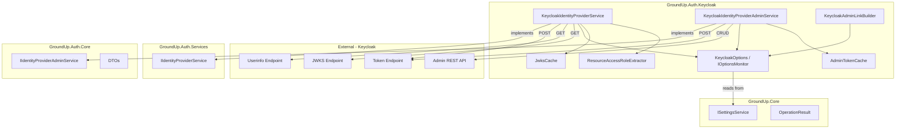

# Design Document — Phase 10B: GroundUp.Auth.Keycloak Provider Implementation

## Overview

This design describes the concrete Keycloak implementation of `IIdentityProviderService` and `IIdentityProviderAdminService` as a new project `GroundUp.Auth.Keycloak`. The project is a pure HTTP-client library — no EF Core, no controllers, no flow logic. It communicates with Keycloak via two separate named `HttpClient` instances (one for user-facing IdP operations, one for Admin REST API calls), both wrapped with Polly retry policies.

Configuration comes exclusively from the settings database via `IOptionsMonitor<KeycloakOptions>`, initialized at startup from `ISettingsService` with runtime change propagation. The admin client authenticates via `client_credentials` grant with a cached token protected by `SemaphoreSlim` for thread-safe refresh. Token validation uses JWKS with auto-refresh on unknown `kid`.

The project registers everything through a single `AddGroundUpAuthKeycloak()` extension method, following the established GroundUp pattern.

## Architecture



### Project Dependencies

```
GroundUp.Auth.Keycloak
├── GroundUp.Auth.Core        (IIdentityProviderAdminService, DTOs)
├── GroundUp.Auth.Services    (IIdentityProviderService)
├── GroundUp.Core             (ISettingsService, OperationResult, abstractions)
├── Microsoft.Extensions.Http.Polly
├── Microsoft.Extensions.Options
├── Microsoft.IdentityModel.Tokens (JWKS/JWT validation)
└── System.IdentityModel.Tokens.Jwt
```

### HTTP Client Separation

| Named Client | Purpose | Endpoints Hit |
|---|---|---|
| `KeycloakIdp` | User-facing IdP operations | Token endpoint, Userinfo endpoint, JWKS endpoint |
| `KeycloakAdmin` | Admin REST API operations | `/admin/realms/...` |

Both clients share the same Polly policy (exponential backoff, 3 retries, 5xx + transient only) but are registered separately so that base addresses, timeouts, or policies can diverge in the future.

## Components and Interfaces

### KeycloakOptions

```csharp
namespace GroundUp.Auth.Keycloak;

public sealed class KeycloakOptions
{
    public string PublicBaseUrl { get; set; } = string.Empty;
    public string SharedRealmName { get; set; } = string.Empty;
    public string InternalBaseUrl { get; set; } = string.Empty;
    public string AdminClientId { get; set; } = string.Empty;
    public string AdminClientSecret { get; set; } = string.Empty;
    public string AppClientId { get; set; } = string.Empty;
}
```

Populated by a custom `IConfigureOptions<KeycloakOptions>` + `IOptionsChangeTokenSource<KeycloakOptions>` that reads from `ISettingsService` at startup and listens for setting changes.

### KeycloakOptionsSetup

Implements `IConfigureOptions<KeycloakOptions>` and `IOptionsChangeTokenSource<KeycloakOptions>`:

- Receives `IServiceProvider` in its constructor (since `ISettingsService` is scoped and this class is singleton).
- On first resolution (`Configure` call), creates a DI scope via `_serviceProvider.CreateScope()`, resolves `ISettingsService`, and reads all six settings keys using the system-level scope chain.
- Exposes a `IChangeToken` that triggers when the `SettingChangedEvent` fires for any of the six keys (listens via `IEventBus` subscription or a manual `CancellationTokenSource` flip).
- On token change, the options monitor re-invokes `Configure`, pulling fresh values via a new scope.

### KeycloakStartupValidator

An `IHostedService` (or startup filter) that runs during host startup:

1. Waits for `ISettingsService` availability.
2. Checks `BootstrapState.IsComplete` — if `false` and settings are empty, skips validation.
3. Validates all six settings are non-null/non-whitespace.
4. Validates `PublicBaseUrl` and `InternalBaseUrl` are valid absolute URIs with http/https scheme.
5. Throws `InvalidOperationException` with descriptive message naming missing/invalid keys on failure.

### KeycloakIdentityProviderService

Implements `IIdentityProviderService`:

```csharp
public sealed class KeycloakIdentityProviderService : IIdentityProviderService
{
    private readonly IHttpClientFactory _httpClientFactory;
    private readonly IOptionsMonitor<KeycloakOptions> _options;
    private readonly JwksCache _jwksCache;
    private readonly ILogger<KeycloakIdentityProviderService> _logger;

    public Task<TokenResponseDto?> ExchangeCodeForTokensAsync(
        string code, string redirectUri, string? realm = null,
        string? clientId = null, string? codeVerifier = null);

    public Task<bool> ValidateTokenAsync(string token);

    public Task<ExternalUserInfo?> GetUserInfoAsync(string accessToken);
}
```

**ExchangeCodeForTokensAsync:**
- Constructs URL: `{InternalBaseUrl}/realms/{realm ?? SharedRealmName}/protocol/openid-connect/token`
- POSTs `application/x-www-form-urlencoded` with: `grant_type=authorization_code`, `code`, `redirect_uri`, `client_id` (from parameter or `AppClientId`), and optionally `code_verifier`
- On HTTP 200: deserializes to `TokenResponseDto`; throws on malformed JSON
- On non-success: returns `null`

**ValidateTokenAsync:**
- Extracts the `iss` claim from the token *without* full validation first (peek at payload)
- Validates the `iss` starts with `{InternalBaseUrl}/realms/` (rejects tokens from unknown issuers)
- Uses `JwksCache.GetKeysForIssuerAsync(issuerUrl)` to get the signing keys for the token's issuer (supports both shared-realm and enterprise per-tenant realm tokens)
- Validates with `TokenValidationParameters`: signature via JWKS, issuer matching the extracted `iss`, lifetime validation
- On unknown `kid`: triggers JWKS refresh for that issuer, retries validation once
- Returns `true` if valid, `false` on any failure (never throws to caller)

**GetUserInfoAsync:**
- GETs `{InternalBaseUrl}/realms/{SharedRealmName}/protocol/openid-connect/userinfo` with `Authorization: Bearer {accessToken}`
- On HTTP 200: maps JSON to `ExternalUserInfo` (sub → ExternalUserId, email → Email, name/preferred_username → DisplayName, rest → Attributes)
- On HTTP 401: returns `null`
- On other non-success: returns `null`, logs at Warning

### KeycloakIdentityProviderAdminService

Implements `IIdentityProviderAdminService`:

```csharp
public sealed class KeycloakIdentityProviderAdminService : IIdentityProviderAdminService
{
    private readonly IHttpClientFactory _httpClientFactory;
    private readonly IOptionsMonitor<KeycloakOptions> _options;
    private readonly AdminTokenCache _adminTokenCache;
    private readonly ILogger<KeycloakIdentityProviderAdminService> _logger;

    // Realm CRUD
    public Task<OperationResult<RealmDto>> CreateRealmAsync(...);
    public Task<OperationResult<RealmDto>> GetRealmAsync(...);
    public Task<OperationResult<RealmDto>> UpdateRealmAsync(...);
    public Task<OperationResult> DeleteRealmAsync(...);

    // Client CRUD
    public Task<OperationResult<IdentityProviderClientDto>> CreateClientAsync(...);
    public Task<OperationResult<IdentityProviderClientDto>> GetClientAsync(...);
    public Task<OperationResult<IdentityProviderClientDto>> UpdateClientAsync(...);
    public Task<OperationResult> DeleteClientAsync(...);

    // User provisioning
    public Task<OperationResult<ProvisionedUserDto>> ProvisionUserAsync(...);
    public Task<OperationResult> SetUserCredentialsAsync(...);
    public Task<OperationResult> DeleteUserAsync(...);
}
```

All admin methods:
1. Call `_adminTokenCache.GetTokenAsync()` to obtain a valid admin token
2. If token is null (acquisition failed), return `OperationResult.Fail("Failed to acquire Keycloak admin token", 503)` immediately — do not attempt the API call
3. Make the HTTP request with `Authorization: Bearer {token}`
4. Map success responses to DTOs
5. Map failure responses to appropriate `OperationResult.Fail(...)` / `OperationResult.NotFound()`

### AdminTokenCache

Thread-safe admin token caching with `SemaphoreSlim`:

```csharp
internal sealed class AdminTokenCache : IDisposable
{
    private readonly SemaphoreSlim _semaphore = new(1, 1);
    private readonly IHttpClientFactory _httpClientFactory;
    private readonly IOptionsMonitor<KeycloakOptions> _options;
    private string? _cachedToken;
    private DateTimeOffset _expiresAt = DateTimeOffset.MinValue;
    private const int SafetyMarginSeconds = 30;

    public AdminTokenCache(IHttpClientFactory httpClientFactory, IOptionsMonitor<KeycloakOptions> options)
    {
        // Subscribe to options change to invalidate cache
        options.OnChange(_ => InvalidateCache());
    }

    public async Task<string?> GetTokenAsync(CancellationToken ct);
    private void InvalidateCache();
}
```

- `GetTokenAsync`: acquires semaphore, checks if cached token is still valid (expiry > now + 30s margin), returns cached or acquires new via `client_credentials` POST
- On options change: sets `_expiresAt = DateTimeOffset.MinValue` to force next call to refresh
- Never exposes `AdminClientSecret` in error messages or logs

### JwksCache

Per-issuer JWKS key caching with auto-refresh:

```csharp
internal sealed class JwksCache
{
    private readonly IHttpClientFactory _httpClientFactory;
    private readonly IOptionsMonitor<KeycloakOptions> _options;
    private readonly SemaphoreSlim _semaphore = new(1, 1);
    private readonly ConcurrentDictionary<string, CachedKeySet> _keysByIssuer = new();
    private static readonly TimeSpan MinRefreshInterval = TimeSpan.FromSeconds(30);

    public Task<ICollection<SecurityKey>> GetKeysForIssuerAsync(string issuerUrl, CancellationToken ct);
    public Task<ICollection<SecurityKey>> RefreshKeysForIssuerAsync(string issuerUrl, CancellationToken ct);

    private record CachedKeySet(ICollection<SecurityKey> Keys, DateTimeOffset FetchedAt);
}
```

- `GetKeysForIssuerAsync`: returns cached keys for the given issuer if available, otherwise fetches from the JWKS endpoint derived from the issuer URL (`{issuerUrl}/protocol/openid-connect/certs`)
- `RefreshKeysForIssuerAsync`: force-refreshes for a specific issuer (called when unknown `kid` encountered), rate-limited to once per 30 seconds per issuer to prevent abuse
- Keys are cached per-issuer using a `ConcurrentDictionary`, supporting both shared-realm and enterprise per-tenant realm tokens
- JWKS URL derivation: `{issuerUrl}/protocol/openid-connect/certs` (since `iss` = `{InternalBaseUrl}/realms/{realmName}`)

### ResourceAccessRoleExtractor

Stateless static utility for extracting roles from Keycloak tokens:

```csharp
public static class ResourceAccessRoleExtractor
{
    public static IReadOnlyList<string> ExtractRoles(string token, string clientId);
    public static IReadOnlyList<string> ExtractRolesFromClaims(
        IEnumerable<Claim> claims, string clientId);
}
```

- Parses the `resource_access` claim (JSON object)
- Navigates to `resource_access.{clientId}.roles` array
- Returns role strings or empty list on any failure (missing claim, wrong structure, malformed JSON)
- Does NOT log internally (static utility) — the calling service logs when an unexpected empty result is returned

### KeycloakAdminLinkBuilder

Stateless singleton for admin console URL construction:

```csharp
public sealed class KeycloakAdminLinkBuilder
{
    private readonly IOptionsMonitor<KeycloakOptions> _options;

    public string RealmOverview(string? realmName = null);
    public string ClientList(string? realmName = null);
    public string ClientDetail(string clientId, string? realmName = null);
    public string UserList(string? realmName = null);
    public string UserDetail(string userId, string? realmName = null);
    public string IdentityProviderConfig(string? realmName = null);
}
```

URL pattern: `{PublicBaseUrl}/admin/{realmName}/console/#/{subPath}`

| Method | Sub-path |
|---|---|
| RealmOverview | (empty — just the console root) |
| ClientList | `clients` |
| ClientDetail | `clients/{clientId}` |
| UserList | `users` |
| UserDetail | `users/{userId}` |
| IdentityProviderConfig | `identity-providers` |

When `realmName` is null, defaults to `SharedRealmName`.

### DI Registration

```csharp
namespace Microsoft.Extensions.DependencyInjection;

public static class KeycloakServiceCollectionExtensions
{
    public static IServiceCollection AddGroundUpAuthKeycloak(this IServiceCollection services)
    {
        // Options
        services.AddSingleton<KeycloakOptionsSetup>();
        services.AddSingleton<IConfigureOptions<KeycloakOptions>>(sp =>
            sp.GetRequiredService<KeycloakOptionsSetup>());
        services.AddSingleton<IOptionsChangeTokenSource<KeycloakOptions>>(sp =>
            sp.GetRequiredService<KeycloakOptionsSetup>());

        // Startup validation
        services.AddHostedService<KeycloakStartupValidator>();

        // HTTP clients with Polly
        services.AddHttpClient("KeycloakIdp", client =>
            {
                client.Timeout = TimeSpan.FromSeconds(10); // Per-request timeout
            })
            .AddPolicyHandler(GetRetryPolicy());
        services.AddHttpClient("KeycloakAdmin", client =>
            {
                client.Timeout = TimeSpan.FromSeconds(10); // Per-request timeout
            })
            .AddPolicyHandler(GetRetryPolicy());

        // Services
        services.AddSingleton<AdminTokenCache>();
        services.AddSingleton<JwksCache>();
        services.AddScoped<IIdentityProviderService, KeycloakIdentityProviderService>();
        services.AddScoped<IIdentityProviderAdminService, KeycloakIdentityProviderAdminService>();
        services.AddSingleton<KeycloakAdminLinkBuilder>();

        return services;
    }

    private static IAsyncPolicy<HttpResponseMessage> GetRetryPolicy()
    {
        return HttpPolicyExtensions
            .HandleTransientHttpError() // 5xx + network exceptions
            .WaitAndRetryAsync(
                retryCount: 3,
                sleepDurationProvider: attempt =>
                    TimeSpan.FromSeconds(Math.Pow(2, attempt - 1)) +
                    TimeSpan.FromMilliseconds(Random.Shared.Next(0, 1000)),
                onRetry: (outcome, delay, attempt, context) =>
                {
                    // Log at Warning level
                });
    }
}
```

### Interface Modification (IIdentityProviderService)

The `ExchangeCodeForTokensAsync` method signature needs two new optional parameters:

```csharp
Task<TokenResponseDto?> ExchangeCodeForTokensAsync(
    string code, string redirectUri, string? realm = null,
    string? clientId = null, string? codeVerifier = null);
```

These are added as trailing optional parameters to maintain backward compatibility.

## Data Models

### Keycloak API Request/Response Models (Internal)

These are internal `record` types used for JSON serialization to/from the Keycloak REST API. They are NOT exposed outside the project.

```csharp
// Token endpoint response
internal record KeycloakTokenResponse(
    [property: JsonPropertyName("access_token")] string AccessToken,
    [property: JsonPropertyName("refresh_token")] string? RefreshToken,
    [property: JsonPropertyName("expires_in")] int ExpiresIn,
    [property: JsonPropertyName("id_token")] string? IdToken,
    [property: JsonPropertyName("token_type")] string TokenType);

// Realm representation (subset)
internal record KeycloakRealmRepresentation(
    [property: JsonPropertyName("realm")] string Realm,
    [property: JsonPropertyName("displayName")] string? DisplayName,
    [property: JsonPropertyName("enabled")] bool Enabled);

// Client representation (subset)
internal record KeycloakClientRepresentation(
    [property: JsonPropertyName("id")] string Id,  // internal UUID
    [property: JsonPropertyName("clientId")] string ClientId,
    [property: JsonPropertyName("secret")] string? Secret,
    [property: JsonPropertyName("redirectUris")] List<string>? RedirectUris,
    [property: JsonPropertyName("publicClient")] bool PublicClient,
    [property: JsonPropertyName("attributes")] Dictionary<string, string>? Attributes);

// User representation (subset)
internal record KeycloakUserRepresentation(
    [property: JsonPropertyName("id")] string Id,
    [property: JsonPropertyName("username")] string Username,
    [property: JsonPropertyName("email")] string? Email,
    [property: JsonPropertyName("firstName")] string? FirstName,
    [property: JsonPropertyName("lastName")] string? LastName,
    [property: JsonPropertyName("enabled")] bool Enabled,
    [property: JsonPropertyName("requiredActions")] List<string>? RequiredActions);

// Credential representation
internal record KeycloakCredentialRepresentation(
    [property: JsonPropertyName("type")] string Type,
    [property: JsonPropertyName("value")] string Value,
    [property: JsonPropertyName("temporary")] bool Temporary);
```

### Mapping Between Keycloak Models and GroundUp DTOs

| Keycloak Model | GroundUp DTO | Notes |
|---|---|---|
| KeycloakTokenResponse | TokenResponseDto | Direct field mapping |
| KeycloakRealmRepresentation | RealmDto | realm → RealmName, displayName → DisplayName |
| KeycloakClientRepresentation | IdentityProviderClientDto | Extracts PKCE from attributes["pkce.code.challenge.method"] |
| KeycloakUserRepresentation | ProvisionedUserDto | id → ExternalUserId, requiredActions contains "UPDATE_PASSWORD" → RequiresPasswordReset=true |
| Userinfo JSON | ExternalUserInfo | sub → ExternalUserId, remaining claims → Attributes |

## Correctness Properties

*A property is a characteristic or behavior that should hold true across all valid executions of a system — essentially, a formal statement about what the system should do. Properties serve as the bridge between human-readable specifications and machine-verifiable correctness guarantees.*

### Property 1: Settings-to-Options Mapping Roundtrip

*For any* set of six valid setting values (PublicBaseUrl, SharedRealmName, InternalBaseUrl, AdminClientId, AdminClientSecret, AppClientId), when those values are provided by `ISettingsService`, the resolved `KeycloakOptions.CurrentValue` SHALL contain exactly those values in the corresponding properties.

**Validates: Requirements 2.2**

### Property 2: Options Refresh on Settings Change

*For any* sequence of setting value updates, after each update triggers the change notification, `KeycloakOptions.CurrentValue` SHALL reflect the most recently set values for all six properties.

**Validates: Requirements 2.4**

### Property 3: Startup Validation Names Missing or Invalid Keys

*For any* non-empty subset of the six required settings that resolves to null/empty/whitespace, the startup validator SHALL throw an exception whose message contains the setting key for each missing setting in that subset. *For any* PublicBaseUrl or InternalBaseUrl value that is not a valid absolute URI with http/https scheme, the exception message SHALL name the invalid key.

**Validates: Requirements 3.1, 3.2**

### Property 4: Token Endpoint Request Construction

*For any* valid authorization code, redirect URI, realm name, client ID, and optional code verifier, the HTTP request sent to the token endpoint SHALL target `{InternalBaseUrl}/realms/{realm}/protocol/openid-connect/token` with form-encoded body containing `grant_type=authorization_code`, `code={code}`, `redirect_uri={redirectUri}`, `client_id={clientId}`, and (when codeVerifier is non-null) `code_verifier={codeVerifier}`.

**Validates: Requirements 5.1, 5.5, 5.6**

### Property 5: Token Response Mapping

*For any* valid Keycloak token endpoint JSON response containing `access_token`, `refresh_token`, `expires_in`, and `id_token` fields, the deserialized `TokenResponseDto` SHALL have `AccessToken`, `RefreshToken`, `ExpiresIn`, and `IdToken` matching the JSON values exactly.

**Validates: Requirements 5.3**

### Property 6: Non-Success Code Exchange Returns Null

*For any* HTTP response with a status code in the range 400–599, `ExchangeCodeForTokensAsync` SHALL return `null`.

**Validates: Requirements 5.4**

### Property 7: Valid Tokens Validate True

*For any* JWT signed with a key present in the JWKS, with `exp` in the future, and `iss` matching the expected realm issuer URL, `ValidateTokenAsync` SHALL return `true`.

**Validates: Requirements 6.1, 6.6**

### Property 8: Invalid or Malformed Tokens Validate False Without Throwing

*For any* string that is either (a) a JWT with an invalid signature, (b) a JWT with `exp` in the past, (c) a JWT with a non-matching `iss`, or (d) not a valid JWT at all, `ValidateTokenAsync` SHALL return `false` without throwing an exception.

**Validates: Requirements 6.3, 6.4, 6.5**

### Property 9: Userinfo Response Mapping

*For any* valid Keycloak userinfo JSON response containing `sub`, `email`, and optionally `name`/`preferred_username` and additional claims, the mapped `ExternalUserInfo` SHALL have `ExternalUserId` equal to `sub`, `Email` equal to `email`, `DisplayName` equal to `name` (falling back to `preferred_username`), and `Attributes` containing remaining claims as key-value pairs.

**Validates: Requirements 7.2**

### Property 10: Admin Token Caching With Expiry-Based Refresh

*For any* admin token with `expires_in = N` seconds, the cached token SHALL be reused for requests made within `(N - 30)` seconds of acquisition. After that window, the next request SHALL trigger a fresh token acquisition.

**Validates: Requirements 8.2, 8.3**

### Property 11: Admin Token Failure Does Not Expose Secrets

*For any* failure response from the admin token endpoint, the returned `OperationResult` error message and any logged messages SHALL NOT contain the `AdminClientSecret` value.

**Validates: Requirements 8.4**

### Property 12: Admin API URL Construction for Realm Operations

*For any* realm name, `CreateRealmAsync` SHALL POST to `{InternalBaseUrl}/admin/realms`, `GetRealmAsync` SHALL GET from `{InternalBaseUrl}/admin/realms/{realmName}`, `UpdateRealmAsync` SHALL PUT to `{InternalBaseUrl}/admin/realms/{realmName}`, and `DeleteRealmAsync` SHALL DELETE `{InternalBaseUrl}/admin/realms/{realmName}`.

**Validates: Requirements 9.1, 9.2, 9.4, 9.5**

### Property 13: Admin API URL Construction for Client Operations

*For any* realm name and client ID, `CreateClientAsync` SHALL POST to `{InternalBaseUrl}/admin/realms/{realmName}/clients`, and `GetClientAsync` SHALL GET from `{InternalBaseUrl}/admin/realms/{realmName}/clients?clientId={clientId}`.

**Validates: Requirements 10.1, 10.3**

### Property 14: User Provisioning Location Header Extraction

*For any* HTTP 201 response with a `Location` header of the form `.../users/{userId}`, `ProvisionUserAsync` SHALL extract the `userId` segment and return it as `ProvisionedUserDto.ExternalUserId`.

**Validates: Requirements 11.2**

### Property 15: Role Extraction From resource_access (Happy Path)

*For any* JWT containing a `resource_access` claim with a valid JSON structure `{ "{clientId}": { "roles": [...] } }`, the role extractor SHALL return exactly the strings in the `roles` array for the specified client ID.

**Validates: Requirements 12.1, 12.2**

### Property 16: Role Extraction Returns Empty for Missing or Malformed Claims

*For any* JWT where `resource_access` is absent, does not contain the specified client ID, or has a malformed structure (wrong JSON types, missing `roles` array), the role extractor SHALL return an empty list (not null).

**Validates: Requirements 12.3, 12.5**

### Property 17: Admin Link Builder URL Pattern Correctness

*For any* valid `PublicBaseUrl` and realm name, all URLs generated by `KeycloakAdminLinkBuilder` SHALL match the pattern `{PublicBaseUrl}/admin/{realmName}/console/#/{subPath}` where `subPath` corresponds to the specific link type (clients, users, identity-providers, etc.).

**Validates: Requirements 13.2, 13.3, 13.4, 13.5**

### Property 18: Retry Occurs on 5xx, Not on 4xx

*For any* HTTP 5xx status code or transient network exception, the Polly policy SHALL trigger a retry. *For any* HTTP 4xx status code, the policy SHALL NOT retry.

**Validates: Requirements 14.2, 14.3**

### Property 19: All Retries Exhausted Returns Failure Without Throwing

*For any* scenario where all 3 retry attempts fail with 5xx responses, the calling method SHALL return a failure result (null for IdP methods, failure `OperationResult` for admin methods) rather than throwing an unhandled exception to the caller.

**Validates: Requirements 14.6**

## Error Handling

### Error Categorization

| Error Source | Handling Strategy |
|---|---|
| Missing/invalid settings at startup | Throw `InvalidOperationException` — fail fast |
| Token endpoint 4xx (bad code, bad credentials) | Return `null` — expected business case |
| Token endpoint 5xx / network error | Polly retries, then return `null` |
| Admin API 404 | Return `OperationResult.NotFound` |
| Admin API 409 (conflict) | Return `OperationResult.Fail` with 409 status |
| Admin API 5xx / network error | Polly retries, then return failure `OperationResult` |
| Admin token acquisition failure | Return failure `OperationResult` (secret never logged) |
| Malformed Keycloak JSON on 200 | Throw — indicates version incompatibility or bug |
| JWKS fetch failure | Return `false` from `ValidateTokenAsync` |
| Malformed JWT input | Return `false` from `ValidateTokenAsync` (no throw) |
| Malformed `resource_access` claim | Return empty list, log at Debug |

### Logging Strategy

| Level | Scenarios |
|---|---|
| Debug | JWKS cache hit, admin token cache hit, resource_access parse details |
| Information | Successful admin operations, options refresh |
| Warning | Polly retries, non-success userinfo response, admin token refresh |
| Error | Admin token acquisition failure, repeated JWKS fetch failures |

All log messages:
- Include correlation ID (via Serilog enrichment)
- Never include `AdminClientSecret`, user passwords, or full token strings
- May include truncated token prefix (first 8 chars) for debugging

## Testing Strategy

### Unit Tests (GroundUp.Tests.Unit)

**Framework:** xUnit + NSubstitute + FsCheck

Unit tests cover:
- `ResourceAccessRoleExtractor` — property-based tests with generated JWT claim structures
- `KeycloakAdminLinkBuilder` — property-based tests with generated realm/base URLs
- `KeycloakStartupValidator` — validation logic with generated setting combinations
- `AdminTokenCache` — caching/refresh behavior with mocked time and HTTP responses
- `KeycloakIdentityProviderService` — request construction and response mapping with mocked `HttpMessageHandler`
- `KeycloakIdentityProviderAdminService` — URL construction, response mapping, error handling with mocked HTTP
- Polly policy behavior — retry/no-retry assertions with generated status codes

**Property-Based Testing Configuration:**
- Library: FsCheck.Xunit (already used in the project)
- Minimum iterations: 100 per property
- Each property test tagged with: `Feature: phase-10b-keycloak-provider, Property {N}: {title}`
- Custom `Arbitrary` generators for:
  - Valid/invalid URLs
  - JWT-like token strings with configurable claims
  - `resource_access` JSON structures
  - Keycloak API response payloads
  - Setting key/value combinations

### Integration Tests (Testcontainers Keycloak)

**Framework:** xUnit + Testcontainers (quay.io/keycloak/keycloak:26.0.7)

**Shared Fixture:** `KeycloakFixture` implementing `IAsyncLifetime`:
- Starts one Keycloak container per test collection
- Pre-imports `groundup` realm from `keycloak/realm.json`
- Provides `HttpClient` factory pointing at the container
- Provides admin credentials for test setup
- Tears down container after all tests complete

**Test Coverage:**
1. Code exchange end-to-end (using direct-access grant to simulate)
2. Token validation against real JWKS
3. Realm CRUD round-trip (create → get → update → verify → delete → verify gone)
4. Client CRUD round-trip (create → get → verify settings → update → delete)
5. User provisioning (create with password → verify exists → set credentials → delete)
6. Role extraction (assign roles → get token → extract → verify)
7. Admin link builder URL correctness
8. Startup validation (missing settings → exception)

### Test Project Structure

```
tests/
├── GroundUp.Tests.Unit/
│   └── Auth/
│       └── Keycloak/
│           ├── ResourceAccessRoleExtractorPropertyTests.cs
│           ├── KeycloakAdminLinkBuilderPropertyTests.cs
│           ├── KeycloakStartupValidatorPropertyTests.cs
│           ├── AdminTokenCachePropertyTests.cs
│           ├── KeycloakIdentityProviderServiceTests.cs
│           ├── KeycloakIdentityProviderAdminServiceTests.cs
│           └── PollyRetryPolicyPropertyTests.cs
└── GroundUp.Tests.Integration/
    └── Auth/
        └── Keycloak/
            ├── Fixtures/
            │   ├── KeycloakFixture.cs
            │   └── KeycloakCollection.cs
            ├── KeycloakCodeExchangeTests.cs
            ├── KeycloakTokenValidationTests.cs
            ├── KeycloakRealmCrudTests.cs
            ├── KeycloakClientCrudTests.cs
            ├── KeycloakUserProvisioningTests.cs
            ├── KeycloakRoleExtractionTests.cs
            ├── KeycloakAdminLinkBuilderTests.cs
            └── KeycloakStartupValidationTests.cs
```
