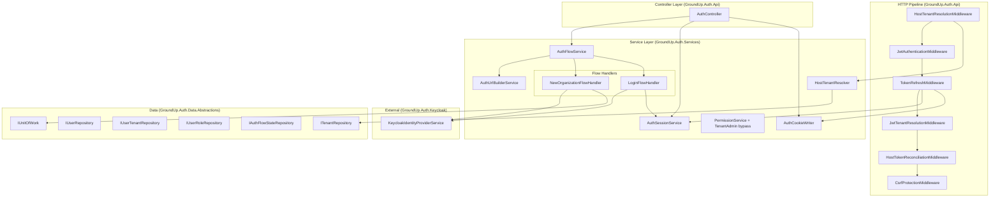
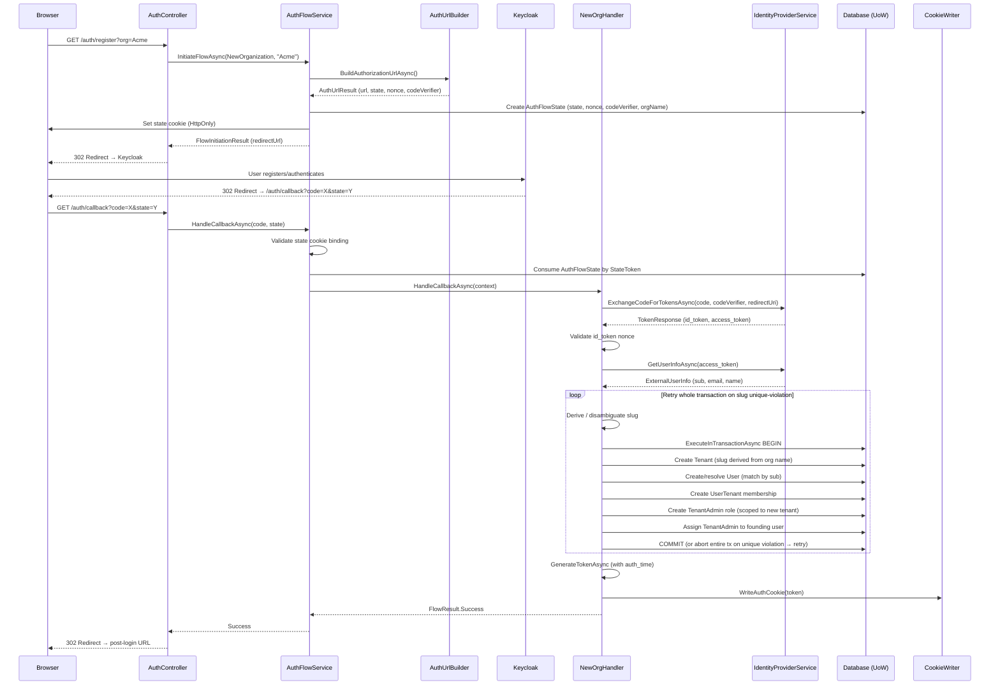
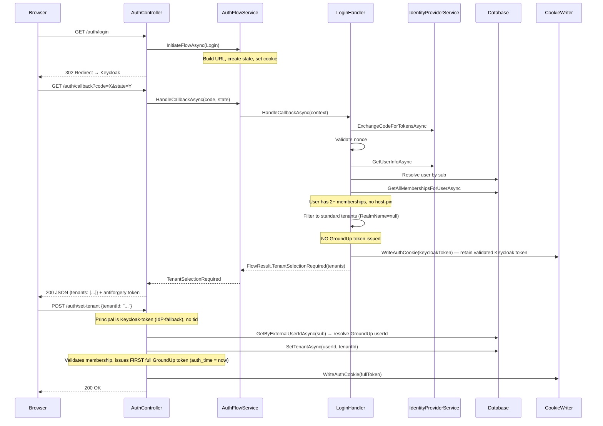
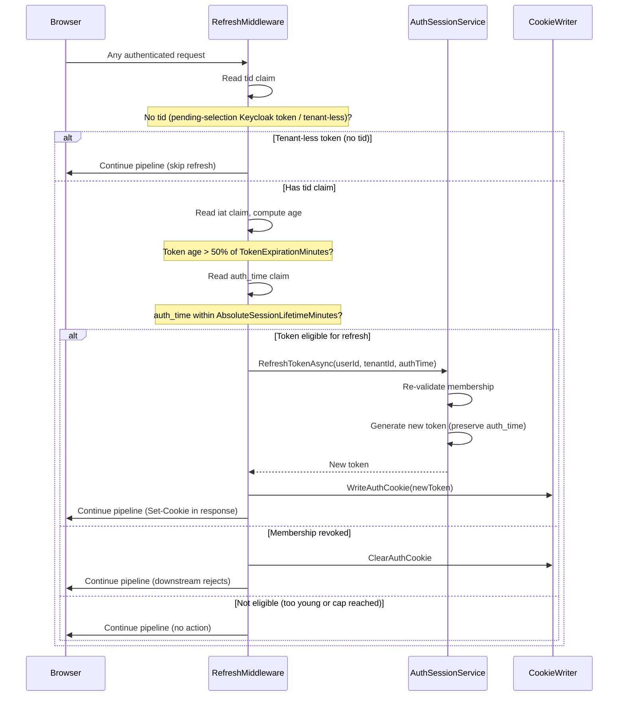

# Design Document: Phase 10C — Auth Dispatcher, Host Resolver, Cookie Writer, Basic Flows

## Overview

Phase 10C delivers the first user-facing authentication slice for the GroundUp framework. It connects the OAuth2/OIDC pipeline from browser-initiated login through Keycloak callback to GroundUp-issued JWT tokens, cookie management, and session maintenance.

The design introduces:
- **AuthCookieWriter** — writes/clears the auth cookie with domain derived from settings
- **HostTenantResolver + middleware** — maps incoming Host headers to tenants via subdomain matching
- **AuthUrlBuilderService** — constructs Keycloak authorization URLs with state/nonce/PKCE
- **AuthFlowService + IFlowHandler dispatcher** — strategy-pattern routing of OAuth callbacks
- **NewOrganizationFlowHandler** — atomically provisions a new tenant with founding user
- **LoginFlowHandler** — resolves memberships, handles auto-join/picker/host-pinning
- **TokenRefreshMiddleware** — sliding-window refresh bounded by absolute session cap
- **TenantAdmin bypass in PermissionService** — tenant-scoped full-access role
- **AuthController** — thin HTTP adapter for all auth endpoints

All business logic lives in the service layer. The controller is a thin HTTP adapter. Token refresh is NOT a flow handler — it's a pure app-side re-issue.

## Architecture

### Component Diagram



### Middleware Pipeline Order

The `UseGroundUpAuth()` extension registers middleware in this exact order:

1. **HostTenantResolutionMiddleware** — resolves tenant from Host header, stashes in `HostResolvedTenant`
2. **JwtAuthenticationMiddleware** — validates JWT from cookie/header, sets `HttpContext.User`
3. **TokenRefreshMiddleware** — sliding refresh when token passes 50% lifetime (bounded by absolute cap)
4. **JwtTenantResolutionMiddleware** — extracts `tid` claim, sets `TenantContext`
5. **HostTokenReconciliationMiddleware** — compares `HostResolvedTenant` against the JWT-derived `TenantContext` and denies cross-tenant data access on mismatch (Requirement 18)
6. **CsrfProtectionMiddleware** — validates antiforgery on cookie-authenticated state-changing requests

**Ordering rationale:**
- Host resolution is independent of auth state and runs first
- JWT validation must precede refresh (need claims to compute lifetime)
- Refresh must precede tenant resolution (may rewrite the cookie with new token)
- Tenant resolution reads the `tid` from the validated/refreshed claims
- Host/token reconciliation runs after tenant resolution — it needs both the `HostResolvedTenant` (from host resolution) and the JWT-derived `TenantContext` (from the `tid` claim) to compare them
- CSRF runs last — needs to know if auth source was cookie

**Reconciliation endpoint exemption (critical):** `HostTokenReconciliationMiddleware` MUST exempt the auth endpoints (the `/auth/*` paths — `login`, `callback`, `me`, `set-tenant`, `refresh`, `logout`) and the tenant-selection UI path from denial. Otherwise a user whose token `tid` differs from the subdomain they are visiting could never reach the screen or endpoint needed to switch tenants — the very `POST /auth/set-tenant` call that resolves the mismatch would itself be denied, creating a deadlock. Only data/resource requests are denied on mismatch; the tenant-switch machinery (and the picker UI) stays reachable.

## Components and Interfaces

### New Interfaces

```csharp
// GroundUp.Auth.Services/IHostTenantResolver.cs
public interface IHostTenantResolver
{
    /// <summary>
    /// Resolves a tenant from the HTTP Host header by matching the subdomain
    /// against the configured default domain.
    /// </summary>
    Task<TenantDto?> ResolveAsync(HostString host, CancellationToken cancellationToken = default);
}
```

```csharp
// GroundUp.Auth.Services/IAuthUrlBuilder.cs
public interface IAuthUrlBuilder
{
    /// <summary>
    /// Builds a Keycloak authorization URL with state, nonce, PKCE, and realm routing.
    /// </summary>
    Task<OperationResult<AuthUrlResult>> BuildAuthorizationUrlAsync(
        AuthUrlRequest request,
        CancellationToken cancellationToken = default);
}

public sealed record AuthUrlRequest(
    string? RealmOverride,
    string RedirectUri);

public sealed record AuthUrlResult(
    string AuthorizationUrl,
    string StateToken,
    string Nonce,
    string CodeVerifier,
    string RedirectUri);
```

```csharp
// GroundUp.Auth.Services/IAuthFlowService.cs
public interface IAuthFlowService
{
    /// <summary>
    /// Initiates an auth flow: creates AuthFlowState, builds redirect URL,
    /// sets state cookie.
    /// </summary>
    Task<OperationResult<FlowInitiationResult>> InitiateFlowAsync(
        FlowInitiationRequest request,
        HttpContext httpContext,
        CancellationToken cancellationToken = default);

    /// <summary>
    /// Dispatches an OAuth callback to the appropriate flow handler.
    /// Validates state cookie binding, consumes the AuthFlowState, routes to handler.
    /// </summary>
    Task<OperationResult<FlowResult>> HandleCallbackAsync(
        string code,
        string state,
        HttpContext httpContext,
        CancellationToken cancellationToken = default);
}

public sealed record FlowInitiationRequest(
    FlowType FlowType,
    string? OrganizationName = null,
    string? ReturnUrl = null);

public sealed record FlowInitiationResult(
    string RedirectUrl,
    Guid FlowStateId);
```

```csharp
// GroundUp.Auth.Services/IFlowHandler.cs
public interface IFlowHandler
{
    /// <summary>
    /// The FlowType this handler processes.
    /// </summary>
    FlowType HandledFlowType { get; }

    /// <summary>
    /// Executes the flow logic for the given callback context.
    /// </summary>
    Task<FlowResult> HandleCallbackAsync(FlowCallbackContext context);
}

public sealed record FlowCallbackContext(
    string AuthorizationCode,
    string CodeVerifier,
    string RedirectUri,
    AuthFlowStateDto ConsumedState,
    TenantDto? HostResolvedTenant);

public sealed record FlowResult
{
    public bool IsSuccess { get; init; }
    public string? Token { get; init; }
    public string? RedirectUrl { get; init; }
    public bool RequiresTenantSelection { get; init; }
    public List<TenantListItemDto>? TenantList { get; init; }
    public string? ErrorCode { get; init; }
    public string? ErrorMessage { get; init; }
    public int? HttpStatus { get; init; }

    public static FlowResult Success(string token, string? redirectUrl = null) =>
        new() { IsSuccess = true, Token = token, RedirectUrl = redirectUrl };

    // Pending tenant selection: NO GroundUp token is issued. The Keycloak token
    // (already validated at callback) is retained as the auth cookie by the handler;
    // the principal stays identity-only (no tid) until POST /auth/set-tenant.
    public static FlowResult TenantSelectionRequired(List<TenantListItemDto> tenants) =>
        new() { IsSuccess = true, RequiresTenantSelection = true, TenantList = tenants };

    public static FlowResult Error(string errorCode, string message, int httpStatus = 400) =>
        new() { IsSuccess = false, ErrorCode = errorCode, ErrorMessage = message, HttpStatus = httpStatus };
}
```

### HostResolvedTenant (Scoped Service)

```csharp
// GroundUp.Auth.Services/HostResolvedTenant.cs
public sealed class HostResolvedTenant
{
    /// <summary>
    /// The tenant resolved from the request Host header.
    /// Null when no tenant was resolved (bare domain, no match, resolution disabled).
    /// </summary>
    public TenantDto? Tenant { get; set; }
}
```

### IAuthCookieWriter Implementation

```csharp
// GroundUp.Auth.Services/AuthCookieWriter.cs
public sealed class AuthCookieWriter : IAuthCookieWriter
{
    private readonly ISettingsService _settingsService;
    private readonly IOptions<AuthOptions> _options;

    // WriteAuthCookie: reads auth.application.default-domain, derives Domain attribute,
    //   sets HttpOnly, Secure, SameSite, Path="/", Expires = UTC + TokenExpirationMinutes
    // ClearAuthCookie: same Domain/Path, expiration in the past
}
```

### TenantAdmin Bypass in PermissionService

The `PermissionService` gains a TenantAdmin short-circuit at the top of `HasPermissionAsync` and `HasAnyPermissionAsync`:

```csharp
// Pseudocode for the bypass (inserted BEFORE cache lookup)
public async Task<bool> HasPermissionAsync(Guid userId, string permissionKey, ...)
{
    if (await IsTenantAdminInCurrentTenantAsync(userId, cancellationToken))
        return true;

    // existing cache + resolution logic...
}

private async Task<bool> IsTenantAdminInCurrentTenantAsync(Guid userId, CancellationToken ct)
{
    var tenantId = _tenantContext.TenantId;
    if (tenantId == Guid.Empty) return false;

    var rolesResult = await _userRoleRepository.GetByUserIdForTenantAsync(userId, tenantId, ct);
    if (!rolesResult.Success || rolesResult.Data is null) return false;

    return rolesResult.Data.Any(r =>
        string.Equals(r.RoleName, AuthRoleNames.TenantAdmin, StringComparison.OrdinalIgnoreCase));
}
```

Key design decisions:
- Short-circuits BEFORE cache — newly added permissions are automatically covered
- Uses tenant-scoped query (`GetByUserIdForTenantAsync`) — never leaks across tenants
- NOT cached as a concrete permission set — dynamic

### TokenRefreshMiddleware

```csharp
// GroundUp.Auth.Api/Middleware/TokenRefreshMiddleware.cs
public class TokenRefreshMiddleware
{
    // Runs after JwtAuthenticationMiddleware
    // Skips refresh when the authenticated token has no 'tid' claim
    //   (pending-selection Keycloak-token principal per Requirement 8.9a,
    //   or any other tenant-less state) — there is no tenant to refresh against
    // Checks: authenticated? token past 50%? auth_time within absolute cap?
    // If yes: calls IAuthSessionService.RefreshTokenAsync, rewrites cookie
    // If refresh fails (membership revoked): clears cookie, continues pipeline
    // Never blocks the request — best-effort
}
```

### AuthSessionService — auth_time Threading

`TokenService.GenerateTokenAsync(userId, tenantId, additionalClaims)` already accepts an `additionalClaims` parameter. `auth_time` is threaded through that parameter:

- **Initial issuance** (NewOrganization, Login auto-join/auto-select/host-pinned, and the FIRST `set-tenant` issuance from a pending-selection Keycloak principal): the caller passes `auth_time = now` as an additional claim. For the first `set-tenant` issuance there is no prior GroundUp `auth_time` to preserve, so `now` is correct (Requirement 9.8).
- **Refresh and tenant re-selection** (a prior GroundUp token already exists): the original `auth_time` MUST be **preserved**. The middleware / endpoint reads the `auth_time` claim from the current principal and passes it through so the reissued token carries the same value (the absolute cap is measured from the original authentication, not each reissue).

The current `IAuthSessionService` signatures cannot carry `auth_time`:

```csharp
// Current (insufficient — cannot set or preserve auth_time):
Task<OperationResult<string>> RefreshTokenAsync(Guid userId, Guid tenantId);
Task<OperationResult<SetTenantResponseDto>> SetTenantAsync(Guid userId, Guid? tenantId);
```

These will be **extended to accept and propagate the original `auth_time`** (e.g., an optional `DateTimeOffset? authTime` parameter, or by accepting pass-through additional claims), so the service can forward it to `TokenService.GenerateTokenAsync`:

```csharp
// Extended (propagates original auth_time on reissue):
Task<OperationResult<string>> RefreshTokenAsync(Guid userId, Guid tenantId, DateTimeOffset originalAuthTime);
Task<OperationResult<SetTenantResponseDto>> SetTenantAsync(Guid userId, Guid? tenantId, DateTimeOffset? originalAuthTime = null);
```

- `RefreshTokenAsync`: the caller (TokenRefreshMiddleware / `POST /auth/refresh`) supplies the `auth_time` read from the current principal; the service passes it to `GenerateTokenAsync` as an additional claim so the value is preserved.
- `SetTenantAsync`: when `originalAuthTime` is supplied (tenant re-selection from an existing GroundUp token) it is preserved; when it is null (first issuance from a pending-selection Keycloak principal) the service sets `auth_time = now`.
- `set-tenant` from a pending-selection principal resolves the GroundUp user by external `sub` (via `IUserRepository.GetByExternalUserIdAsync`) before issuing the first token.

### AuthController (Thin Adapter)

```csharp
[Route("auth")]
public class AuthController : ControllerBase
{
    // GET  /auth/login       → InitiateFlowAsync(Login) → 302 redirect
    // GET  /auth/register    → validate org name (required, max length) → InitiateFlowAsync(NewOrganization) → 302 redirect
    // GET  /auth/callback    → HandleCallbackAsync(code, state) → redirect or JSON
    // GET  /auth/me          → claims from HttpContext.User → JSON
    // POST /auth/set-tenant  → IAuthSessionService.SetTenantAsync → new cookie
    // POST /auth/refresh     → IAuthSessionService.RefreshTokenAsync → new cookie
    // POST /auth/logout      → ClearAuthCookie + Keycloak end_session
    //                          (client_id + post_logout_redirect_uri, shared realm) → 200
}
```

### Flow Handler Strategy Resolution

Flow handlers are registered as `IEnumerable<IFlowHandler>` in DI. The `AuthFlowService` resolves handlers by matching `handler.HandledFlowType` against the consumed `AuthFlowState.FlowType`:

```csharp
private IFlowHandler? GetHandler(FlowType flowType)
{
    return _handlers.FirstOrDefault(h => h.HandledFlowType == flowType);
}
```

Phase 10C registers exactly two handlers:
- `NewOrganizationFlowHandler` → `FlowType.NewOrganization`
- `LoginFlowHandler` → `FlowType.Login`

## Data Models

### AuthFlowState Entity Additions

The existing `AuthFlowState` entity is extended with:

| Field | Type | Purpose |
|---|---|---|
| `StateToken` | `string` (indexed, unique) | Cryptographically-random OAuth state value — lookup key at callback |
| `CodeVerifier` | `string` | PKCE code_verifier for code exchange |
| `RedirectUri` | `string` | Exact redirect_uri used at authorize time |
| `OrganizationName` | `string?` | Organization name for NewOrganization flow |

The `StateToken` is distinct from the PK (`Id`, UUIDv7) because UUIDv7 is timestamp-based and partially predictable.

### Tenant Entity — Unique Constraint on Slug (Already Exists)

A database unique constraint on `Tenant.Slug` **already exists** in `TenantConfiguration.cs` and is relied upon by the NewOrganization retry logic — it is NOT added by this phase:

```csharp
builder.HasIndex(e => e.Slug).IsUnique(); // pre-existing in TenantConfiguration
```

This pre-existing constraint provides the authoritative guard against duplicate slugs for the NewOrganization retry logic. The Phase 10C migration does **not** re-add it.

### User Entity — Unique Index on ExternalUserId

Both flow handlers resolve-or-create the user by the Keycloak `sub` claim (`User.ExternalUserId`). To prevent duplicate user rows under concurrent first-logins (the same external identity completing two flows simultaneously), a database **unique index** is added on `User.ExternalUserId` via Fluent API in `UserConfiguration` and delivered in the EF migration:

```csharp
builder.HasIndex(e => e.ExternalUserId).IsUnique(); // NEW in Phase 10C
```

Handlers perform create-or-get on violation: if a unique-constraint violation occurs on user insertion, the handler re-reads the existing user by `ExternalUserId` (via `IUserRepository.GetByExternalUserIdAsync`) and proceeds with that record, so concurrent first-logins converge on a single user.

### Migration Scope

The Phase 10C EF Core migration in `GroundUp.Auth.Data.Postgres` adds only:
- The four `AuthFlowState` columns (`StateToken` with unique index, `CodeVerifier`, `RedirectUri`, `OrganizationName`)
- The new `User.ExternalUserId` unique index

The `Tenant.Slug` unique constraint is **not** part of this migration because it already exists.

### FlowType Enum Change

```csharp
public enum FlowType
{
    NewOrganization = 0,
    Invitation = 1,
    JoinLink = 2,
    EnterpriseFirstAdmin = 3,
    EnterpriseSsoAutoJoin = 4,
    Login = 5,           // renamed from MultiTenantSelection
    TokenRefresh = 6     // no handler — kept for audit/completeness
}
```

### AuthOptions Additions

```csharp
public sealed class AuthOptions
{
    // ... existing fields ...

    /// <summary>
    /// Absolute session lifetime cap in minutes, measured from auth_time.
    /// Sliding refresh stops after this threshold. Default: 480 (8 hours).
    /// Must be >= TokenExpirationMinutes.
    /// </summary>
    public int AbsoluteSessionLifetimeMinutes { get; set; } = 480;

    /// <summary>
    /// Duration in minutes for AuthFlowState expiration. Default: 10.
    /// </summary>
    public int FlowStateExpirationMinutes { get; set; } = 10;

    /// <summary>
    /// Name of the state cookie for browser-binding CSRF protection.
    /// Default: "AuthState".
    /// </summary>
    public string StateCookieName { get; set; } = "AuthState";

    /// <summary>
    /// Callback URL path (relative) for OAuth callbacks. Default: "/auth/callback".
    /// </summary>
    public string CallbackPath { get; set; } = "/auth/callback";
}
```

### AuthRoleNames Addition

```csharp
public static class AuthRoleNames
{
    public static readonly Guid SystemTenantId = new("00000000-0000-0000-0000-000000000001");
    public const string SuperAdmin = "SuperAdmin";
    public const string TenantAdmin = "TenantAdmin"; // NEW
}
```

### Data Flow Diagrams

#### NewOrganization Flow



**Slug retry wraps the entire transaction (critical):** Because Postgres aborts the *entire* transaction when a unique-constraint violation occurs, the disambiguate-and-retry loop MUST wrap the whole `IUnitOfWork.ExecuteInTransactionAsync` call and retry the entire transaction on a slug unique-violation — it cannot catch the violation and retry the insert *inside* a single still-open transaction (the transaction is already poisoned and every subsequent statement fails). Each retry re-disambiguates the slug (incrementing the numeric suffix) and re-runs the full atomic unit (tenant + user + membership + role + assignment) from a fresh transaction.

#### Login Flow (Multi-Membership Picker)



#### Token Refresh Flow



## DI Registration Strategy

### AuthServiceCollectionExtensions (Updated)

```csharp
private static void RegisterCoreServices(IServiceCollection services)
{
    // ... existing registrations ...

    // Cookie writer
    services.AddScoped<IAuthCookieWriter, AuthCookieWriter>();

    // Host tenant resolution
    services.AddScoped<IHostTenantResolver, HostTenantResolver>();
    services.AddScoped<HostResolvedTenant>();

    // Auth URL builder
    services.AddScoped<IAuthUrlBuilder, AuthUrlBuilderService>();

    // Auth flow service (orchestrator)
    services.AddScoped<IAuthFlowService, AuthFlowService>();

    // Flow handlers (strategy pattern — resolved as IEnumerable<IFlowHandler>)
    services.AddScoped<IFlowHandler, NewOrganizationFlowHandler>();
    services.AddScoped<IFlowHandler, LoginFlowHandler>();
}
```

### UseGroundUpAuth (Updated Pipeline)

```csharp
public static IApplicationBuilder UseGroundUpAuth(this IApplicationBuilder app)
{
    app.UseMiddleware<HostTenantResolutionMiddleware>();    // NEW — before auth
    app.UseMiddleware<JwtAuthenticationMiddleware>();
    app.UseMiddleware<TokenRefreshMiddleware>();            // NEW — after auth
    app.UseMiddleware<JwtTenantResolutionMiddleware>();
    app.UseMiddleware<HostTokenReconciliationMiddleware>(); // NEW — after tenant resolution, exempts /auth/* + picker UI
    app.UseMiddleware<CsrfProtectionMiddleware>();
    return app;
}
```

## Security Model

### State Token Lifecycle

1. **Generation**: `AuthUrlBuilderService` generates 32+ bytes of cryptographic randomness, Base64URL-encoded without padding
2. **Storage**: Persisted on `AuthFlowState.StateToken` (indexed) AND written to a short-lived HttpOnly cookie (`AuthOptions.StateCookieName`)
3. **Transmission**: Sent as the OAuth `state` query parameter to Keycloak
4. **Validation**: At callback, the `state` query parameter is compared against:
   - The HttpOnly state cookie (browser-binding CSRF protection)
   - The `AuthFlowState` row (looked up by StateToken, not PK)
5. **Consumption**: `AuthFlowState` is atomically transitioned to Consumed (replay protection)

### OIDC Nonce Lifecycle

1. **Generation**: `AuthUrlBuilderService` generates 32+ bytes of cryptographic randomness, Base64URL-encoded
2. **Storage**: Persisted on `AuthFlowState.Nonce`
3. **Transmission**: Sent as the `nonce` query parameter in the Keycloak authorize URL
4. **Validation**: At callback, the `nonce` claim of the returned `id_token` is compared against the stored nonce; mismatch → flow marked failed

### PKCE Lifecycle

1. **Generation**: `AuthUrlBuilderService` generates a `code_verifier` (43–128 URL-safe characters)
2. **Challenge computation**: `code_challenge = Base64URL(SHA256(code_verifier))`, method `S256`
3. **Storage**: `code_verifier` stored on `AuthFlowState.CodeVerifier`
4. **Transmission**: `code_challenge` + `code_challenge_method=S256` sent in the authorize URL
5. **Exchange**: At callback, `code_verifier` passed to `ExchangeCodeForTokensAsync` for Keycloak to validate

### Cookie Attributes

| Cookie | HttpOnly | Secure | SameSite | Domain | Path | Expiry |
|--------|----------|--------|----------|--------|------|--------|
| Auth (token) | ✓ | CookieSecure | CookieSameSite | .{default-domain} or omitted | / | TokenExpirationMinutes |
| State (CSRF) | ✓ | true | Strict | omitted (host-only) | / | FlowStateExpirationMinutes |

### CSRF Token Provisioning

The existing `CsrfProtectionMiddleware` uses ASP.NET Core's `IAntiforgery`. After successful authentication (callback success, the tenant-selection-required picker response, or `GET /auth/me`), the framework provides the antiforgery cookie token automatically via the standard ASP.NET Core antiforgery mechanism:
- The antiforgery cookie (`.AspNetCore.Antiforgery.*`) is set automatically by the framework
- The request token is made available via the `GET /auth/me` response (in a header or response field) so the SPA can supply it as `X-CSRF-Token` on subsequent POST requests
- The **tenant-selection-required (picker) 200 JSON response** returned from the callback MUST ALSO carry/set the antiforgery token (not only `/auth/me`), so the SPA can immediately call `POST /auth/set-tenant` to finish selection. Without provisioning the token on the picker response, the very next call the SPA must make would fail CSRF validation.

### Host/Token Reconciliation

Enforcement point: `HostTokenReconciliationMiddleware`, which runs after `JwtTenantResolutionMiddleware` (so both `HostResolvedTenant` and the JWT-derived `TenantContext` are populated) and before `CsrfProtectionMiddleware`.

**Endpoint exemption (critical):** the middleware MUST exempt the auth endpoints (the `/auth/*` paths — `login`, `callback`, `me`, `set-tenant`, `refresh`, `logout`) and the tenant-selection UI path. Only data/resource requests are denied on mismatch; the tenant-switch machinery (the picker UI and `POST /auth/set-tenant`) stays reachable so a user on a mismatched subdomain can always reach the screen/endpoint needed to switch tenants.

| Scenario | Host Tenant | Token `tid` | Action |
|----------|-------------|-------------|--------|
| Match | Tenant A | Tenant A | Proceed normally |
| Standard mismatch (member) | Tenant B (shared realm) | Tenant A | Deny; indicate tenant switch required via `set-tenant` |
| Enterprise mismatch | Tenant C (has RealmName) | Tenant A | Deny; require fresh login to Tenant C's realm |
| Non-member mismatch | Tenant D | Tenant A | Access denied |
| No host tenant | null | Tenant A | Proceed normally |
| No token | Tenant B | none | Proceed (unauthenticated) |
| Any `/auth/*` or picker path | (any) | (any) | Exempt — never denied |

### RP-Initiated Logout (Phase 10C)

`POST /auth/logout` clears the local auth cookie via `IAuthCookieWriter.ClearAuthCookie` and performs OIDC RP-initiated logout against Keycloak's `end_session_endpoint`.

For Phase 10C the end-session call uses `client_id` + `post_logout_redirect_uri` (NOT `id_token_hint`):
- The GroundUp JWT does **not** carry the Keycloak `id_token`, and the `id_token` is **not** persisted in Phase 10C, so `id_token_hint` is not available to us.
- The realm used for end-session in Phase 10C is the **shared realm**.
- A future `id_token_hint`-based logout would require storing the Keycloak `id_token` server-side keyed by session — explicitly out of scope for Phase 10C.


## Correctness Properties

*A property is a characteristic or behavior that should hold true across all valid executions of a system — essentially, a formal statement about what the system should do. Properties serve as the bridge between human-readable specifications and machine-verifiable correctness guarantees.*

### Property 1: Cookie Domain Derivation

*For any* string value of the `auth.application.default-domain` setting, the `AuthCookieWriter` SHALL derive the cookie Domain attribute as follows: if the value is non-null and non-whitespace, Domain = `.{value}`; if the value is null, empty, or whitespace-only, the Domain attribute is omitted. This derivation SHALL be consistent between `WriteAuthCookie` and `ClearAuthCookie`.

**Validates: Requirements 1.2, 1.3, 1.11**

### Property 2: Cookie Configuration Propagation

*For any* valid `AuthOptions` configuration (CookieName, CookieSecure, CookieSameSite, TokenExpirationMinutes) and *any* non-empty token string, calling `WriteAuthCookie` SHALL produce a cookie where: name equals `AuthOptions.CookieName`, value equals the token parameter, HttpOnly is true, Path is "/", Secure equals `AuthOptions.CookieSecure`, SameSite equals `AuthOptions.CookieSameSite`, and Expires is within 1 second of `UtcNow + TokenExpirationMinutes`.

**Validates: Requirements 1.4, 1.5, 1.6, 1.7, 1.8, 1.9, 1.10**

### Property 3: Empty Token Rejection

*For any* null, empty, or whitespace-only token string, calling `WriteAuthCookie` SHALL throw `ArgumentException` without modifying the response.

**Validates: Requirements 1.12**

### Property 4: Host Subdomain Extraction

*For any* Host header value of the form `{slug}.{default-domain}` (with optional `:{port}` suffix), the `HostTenantResolver` SHALL extract the single label immediately preceding the default-domain as the candidate slug (lowercased), strip any port, and perform case-insensitive domain comparison. *For any* Host that does not match this pattern (bare domain, IP address, multi-level subdomain, or different domain), the resolver SHALL return null.

**Validates: Requirements 2.2, 2.3, 2.6, 2.7**

### Property 5: Cryptographic Token Format (State and Nonce)

*For any* invocation of `AuthUrlBuilderService`, the generated state token and nonce SHALL each be valid Base64URL strings without padding characters ('='), and when decoded SHALL contain at least 32 bytes of data. No two sequential invocations SHALL produce the same state token or nonce (probabilistic — collision probability < 2^-128).

**Validates: Requirements 4.2, 4.5**

### Property 6: PKCE Round-Trip Integrity

*For any* generated PKCE code_verifier, the verifier SHALL be 43–128 characters long using only unreserved URL-safe characters (`[A-Za-z0-9._~-]`), and the corresponding code_challenge SHALL equal `Base64URL(SHA256(code_verifier))` without padding. Recomputing the challenge from the stored verifier SHALL always produce the same challenge value (deterministic derivation).

**Validates: Requirements 4.4**

### Property 7: State Cookie Binding (CSRF Protection)

*For any* OAuth callback, the callback SHALL succeed if and only if: (a) the `state` query parameter matches the value stored in the HttpOnly state cookie, AND (b) the state token matches a Pending `AuthFlowState` row. A callback with a mismatched or missing state cookie SHALL be rejected regardless of the state token's validity in the database.

**Validates: Requirements 5.5**

### Property 8: Replay Protection (Consumption Idempotency)

*For any* `AuthFlowState` that has been consumed (status = Consumed), a subsequent attempt to consume the same state SHALL return HTTP 410 Gone. The system SHALL never process the same authorization code twice.

**Validates: Requirements 5.8**

### Property 9: OIDC Nonce Validation

*For any* flow callback, nonce validation SHALL pass if and only if the `nonce` claim of the returned `id_token` equals the nonce stored on the consumed `AuthFlowState`. A mismatched nonce SHALL cause the flow to be marked as failed.

**Validates: Requirements 7.2, 8.2**

### Property 10: Slug Generation Validity and Disambiguation

*For any* organization name string, the derived tenant slug SHALL contain only lowercase alphanumeric characters and hyphens, SHALL NOT be empty, and SHALL NOT start or end with a hyphen. *For any* collision scenario (slug already exists), the disambiguated slug SHALL be different from the original, still valid per the same character rules, and deterministic given the same collision count.

**Validates: Requirements 7.4, 7.5**

### Property 11: auth_time Claim Lifecycle

*For any* initial GroundUp token issuance (NewOrganization, Login auto-join, Login auto-select, Login host-pinned, and the FIRST `set-tenant` selection token issued from a pending-selection Keycloak principal), the token SHALL contain an `auth_time` claim set to the current UTC time (within 2 seconds tolerance). *For any* token refresh or `set-tenant` reissue where a prior GroundUp token already exists, the new token's `auth_time` SHALL equal the prior token's `auth_time` (preserved, never updated). No GroundUp token is issued during pending tenant selection, so no `auth_time` is set in that window.

**Validates: Requirements 7.10, 8.16, 9.7, 9.8**

### Property 12: Sliding Refresh Decision Function

*For any* authenticated token: (a) if the token has no `tid` claim (tenant-less / pending-selection Keycloak principal), no refresh occurs regardless of age; otherwise, for a token with `iat` (issued-at) and `auth_time` claims: (b) if `UtcNow - iat < 0.5 × TokenExpirationMinutes`, no refresh occurs (token too young); (c) if `UtcNow - auth_time >= AbsoluteSessionLifetimeMinutes`, refresh is denied (session expired — re-auth required); (d) if `UtcNow - iat >= 0.5 × TokenExpirationMinutes` AND `UtcNow - auth_time < AbsoluteSessionLifetimeMinutes`, refresh proceeds and a new token is issued.

**Validates: Requirements 9.4, 9.5, 9.6, 13.8**

### Property 13: Tenant Picker Excludes Enterprise Tenants

*For any* user with active memberships across a mix of standard (RealmName = null) and enterprise (RealmName ≠ null) tenants, the tenant-selection-required result SHALL include only standard tenants. Enterprise tenants SHALL never appear in the picker list.

**Validates: Requirements 8.9, 8.10**

### Property 14: Pending-Selection Authentication

*For any* user with two or more eligible (standard, shared-realm) memberships entering the multi-membership selection window, NO GroundUp token SHALL be issued during selection. The authenticated principal SHALL be the Keycloak-token (IdP-fallback) identity-only principal: it SHALL carry the external `sub` claim and SHALL NOT contain a `tid` claim, so downstream tenant-context resolution SHALL result in `TenantContext.TenantId = Guid.Empty` and the principal SHALL grant no tenant-scoped data access. The FIRST full GroundUp token (with `auth_time` set to the current UTC time) SHALL be issued only at `POST /auth/set-tenant`.

**Validates: Requirements 8.9**

### Property 15: TenantAdmin Permission Bypass (Tenant-Scoped)

*For any* permission key string, if a user holds the TenantAdmin role in the current tenant (same TenantId as `ITenantContext.TenantId`), `PermissionService.HasPermissionAsync` SHALL return true. *For any* different tenant where the user does NOT hold TenantAdmin, the bypass SHALL NOT fire and permissions SHALL be resolved normally.

**Validates: Requirements 10.4, 10.7**

### Property 16: TenantAdmin Is Not a System Role

*For any* user who holds only the TenantAdmin role (and not SuperAdmin), `IUserRoleRepository.GetSystemRolesForUserAsync` SHALL NOT include TenantAdmin in its results. TenantAdmin SHALL only appear in tenant-scoped role queries (`GetByUserIdForTenantAsync`).

**Validates: Requirements 10.3**

### Property 17: Last Admin Guard

*For any* tenant where exactly one active user holds the TenantAdmin role, an attempt to remove that user's TenantAdmin assignment SHALL be rejected with a descriptive error. When two or more users hold TenantAdmin, removing one SHALL succeed.

**Validates: Requirements 10.8**

### Property 18: Host/Token Mismatch Denial

*For any* authenticated request to a data/resource path where `HostResolvedTenant.Tenant` is non-null AND its `Id` does not equal the JWT `tid` claim, the system SHALL deny access to the host tenant's resources regardless of the user's membership status in either tenant. *For any* request to an exempt path (the `/auth/*` endpoints and the tenant-selection UI path), the reconciliation SHALL NOT deny the request even when the host tenant and token `tid` differ, so the tenant-switch machinery remains reachable.

**Validates: Requirements 18.1**

## Error Handling

### Service Layer Errors (OperationResult)

All service methods return `OperationResult<T>`. Error scenarios:

| Scenario | Result | HTTP Status |
|----------|--------|-------------|
| State cookie missing/mismatched | `OperationResult.Fail("CSRF_STATE_MISMATCH")` | 403 |
| AuthFlowState not found by state token | `OperationResult.NotFound()` | 404 |
| AuthFlowState already consumed (replay) | `OperationResult.Fail("FLOW_ALREADY_CONSUMED")` | 410 |
| AuthFlowState expired | `OperationResult.Fail("FLOW_EXPIRED")` | 400 |
| No handler for FlowType | `OperationResult.Fail("NO_HANDLER")` | 500 |
| Code exchange failure | `OperationResult.Fail("CODE_EXCHANGE_FAILED")` | 502 |
| Nonce mismatch | `OperationResult.Fail("NONCE_MISMATCH")` | 400 |
| Userinfo retrieval failure | `OperationResult.Fail("USERINFO_FAILED")` | 502 |
| Slug collision (after max retries) | `OperationResult.Fail("SLUG_EXHAUSTED")` | 409 |
| Zero memberships + no default tenant | `OperationResult.Forbidden()` | 403 |
| Host-pin + non-member | `OperationResult.Forbidden()` | 403 |
| Enterprise tenant (not implemented) | `OperationResult.Fail("NOT_IMPLEMENTED")` | 501 |
| Membership revoked during refresh | `OperationResult.Forbidden()` | 403 |
| Absolute session cap reached | `OperationResult.Fail("SESSION_EXPIRED")` | 401 |
| Last admin removal blocked | `OperationResult.Fail("LAST_ADMIN")` | 409 |
| Host/token mismatch (standard, member) | `OperationResult.Fail("TENANT_SWITCH_REQUIRED")` | 409 |
| Host/token mismatch (enterprise) | `OperationResult.Fail("REAUTH_REQUIRED")` | 401 |
| Host/token mismatch (non-member) | `OperationResult.Forbidden()` | 403 |
| Empty token to WriteAuthCookie | `ArgumentException` thrown | N/A (bug) |
| Missing Keycloak config | `OperationResult.Fail("CONFIG_MISSING")` | 500 |

### Startup Validation (Fail Fast)

`AuthOptions` startup validation (via `ValidateOnStart`):
- `AbsoluteSessionLifetimeMinutes > 0`
- `AbsoluteSessionLifetimeMinutes >= TokenExpirationMinutes`
- Existing validations (JwtSigningKey, CleanupIntervalMinutes, RetentionDays)

### Middleware Error Strategy

- **HostTenantResolutionMiddleware**: catches all exceptions, logs at Warning, continues (never blocks)
- **TokenRefreshMiddleware**: refresh is best-effort — failures clear cookie and continue (downstream auth rejects naturally); skips entirely for tenant-less tokens (no `tid`)
- **HostTokenReconciliationMiddleware**: short-circuits with a denial response (`TENANT_SWITCH_REQUIRED` 409, `REAUTH_REQUIRED` 401, or `Forbidden` 403) on a host/token mismatch for data/resource paths; exempts the `/auth/*` endpoints and the tenant-selection UI path so the tenant-switch machinery stays reachable
- **No other middleware short-circuits** except when the state cookie binding fails at callback time (handled in service layer, not middleware)

## Testing Strategy

### Property-Based Testing (FsCheck with xUnit)

The project uses **FsCheck.Xunit** for property-based testing (C# / .NET ecosystem). Each property test runs a minimum of 100 iterations with randomly generated inputs.

**Properties suitable for PBT:**
- Cookie domain derivation logic (Property 1)
- Cookie configuration propagation (Property 2)
- Empty token rejection (Property 3)
- Host subdomain extraction/rejection (Property 4)
- Cryptographic token format validation (Property 5)
- PKCE round-trip integrity (Property 6)
- State cookie binding (Property 7)
- Replay protection (Property 8)
- Nonce validation equivalence (Property 9)
- Slug generation validity (Property 10)
- auth_time lifecycle (Property 11)
- Sliding refresh decision function (Property 12)
- Tenant picker enterprise exclusion (Property 13)
- Pending-selection authentication / no-token (Property 14)
- TenantAdmin bypass scope (Property 15)
- TenantAdmin not in system roles (Property 16)
- Last admin guard (Property 17)
- Host/token mismatch denial (Property 18)

**Tag format:** `Feature: phase-10c-auth-dispatcher, Property {N}: {title}`

### Unit Tests (Example-Based)

Example-based tests for:
- AuthCookieWriter with specific SameSite values (Strict, Lax, None)
- HostTenantResolver when repository returns not-found or inactive tenant
- AuthUrlBuilder with enterprise tenant realm routing
- AuthUrlBuilder with missing configuration (failure case)
- LoginFlowHandler auto-join scenario
- LoginFlowHandler host-pin with non-member
- LoginFlowHandler enterprise stub response
- Startup validation failure when AbsoluteSessionLifetimeMinutes < TokenExpirationMinutes
- FlowType.Login integer value = 5

### Integration Tests (Testcontainers)

Full end-to-end tests as specified in Requirement 15, using:
- **Testcontainers Keycloak** — real OAuth2/OIDC flows
- **Testcontainers Postgres** — real database with migrations
- **WebApplicationFactory** — in-process HTTP testing
- **TimeProvider** injection — controllable time for refresh/expiration tests

Key integration scenarios:
1. NewOrganization complete flow (atomicity verified)
2. Login single-membership auto-select
3. Login multi-membership picker (enterprise exclusion)
4. Host-pinned login
5. Enterprise routing stub
6. Cross-subdomain cookie domain
7. Replay attack (410 Gone)
8. State cookie binding rejection
9. Nonce mismatch rejection
10. Sliding refresh (time manipulation)
11. Absolute session cap (time manipulation)
12. Last admin guard
13. TenantAdmin bypass (same tenant) and non-bypass (different tenant)
14. Pending-selection flow (no GroundUp token, retained Keycloak token) → set-tenant issues first token
15. Host/Token reconciliation (standard switch, enterprise re-auth, non-member denied)

### Test Organization

```
tests/
  GroundUp.Tests.Unit/
    Auth/
      AuthCookieWriterTests.cs
      AuthCookieWriterPropertyTests.cs
      HostTenantResolverTests.cs
      HostTenantResolverPropertyTests.cs
      AuthUrlBuilderTests.cs
      AuthUrlBuilderPropertyTests.cs
      AuthFlowServiceTests.cs
      NewOrganizationFlowHandlerTests.cs
      LoginFlowHandlerTests.cs
      LoginFlowHandlerPropertyTests.cs
      TokenRefreshDecisionPropertyTests.cs
      PermissionServiceTenantAdminTests.cs
      PermissionServiceTenantAdminPropertyTests.cs
      SlugGeneratorPropertyTests.cs
  GroundUp.Tests.Integration/
    Auth/
      NewOrganizationFlowTests.cs
      LoginFlowTests.cs
      TokenRefreshTests.cs
      HostTenantResolutionTests.cs
      TenantAdminBypassTests.cs
      HostTokenReconciliationTests.cs
```
