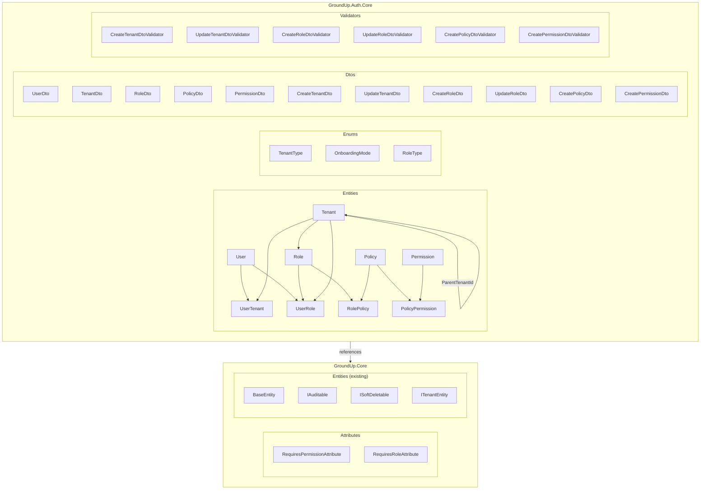
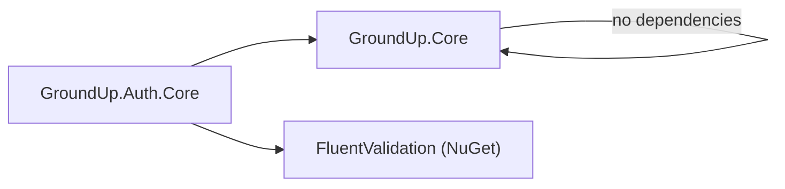
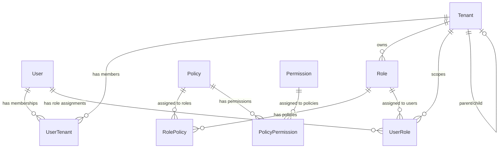

# Design Document: Phase 9A — Auth Core Entities, Enums, and Base DTOs

## Overview

Phase 9A establishes the foundational data model for the GroundUp authentication and authorization system. This phase creates the entity classes, enums, DTOs, FluentValidation validators, and security attributes that all subsequent auth phases (9B–9E) build upon.

The auth module follows a **Permission → Policy → Role** hierarchy:
- **Permissions** are granular, module-scoped authorization checks (e.g., `settings.read`)
- **Policies** group related permissions into logical bundles
- **Roles** group policies and are scoped to a tenant

Users connect to tenants via the **UserTenant** junction entity, which carries a per-tenant `ExternalUserId` mapping the IdP identity to the GroundUp user. Role assignments are also tenant-scoped via **UserRole**.

Auth types reside in a dedicated `GroundUp.Auth.Core` project so that consuming apps that don't need authentication won't have auth entities in their dependency tree. Security attributes (`RequiresPermissionAttribute`, `RequiresRoleAttribute`) remain in `GroundUp.Core` so they are available to any layer without depending on the auth module.

No EF Core configurations, repositories, services, or controllers are included in this phase.

### Design Decisions

1. **Dedicated `GroundUp.Auth.Core` project** — Auth is fully optional. Apps that don't need authentication shouldn't have auth entities in their dependency tree. Settings stays in Core because virtually every app needs settings. Auth is different — many apps (internal tools, simple APIs) don't need roles/permissions.
2. **`GroundUp.Auth.Core` references `GroundUp.Core`** — for access to `BaseEntity`, `IAuditable`, `ISoftDeletable`, and `ITenantEntity`. No other project dependencies.
3. **Junction entities have their own `BaseEntity` Id** — rather than composite keys, each junction gets a UUID v7 primary key for consistency with the framework's identity pattern. Unique composite constraints are enforced at the EF configuration level (Phase 9B).
4. **`ITenantEntity` on Role, Policy, and UserRole** — enables automatic tenant filtering in `BaseTenantRepository` for these entities.
5. **Security attributes in `GroundUp.Core/Attributes/`** — keeping them discoverable and independent of the auth module implementation. Any project that references Core can use these attributes.
6. **FluentValidation validators in `GroundUp.Auth.Core/Validators/`** — the `.csproj` references the FluentValidation NuGet package.
7. **Enums are not tenant-scoped** — `TenantType`, `OnboardingMode`, and `RoleType` are framework-level concepts, not per-tenant data.

## Architecture



### Project Dependency Diagram



### Entity Relationship Diagram



## Components and Interfaces

### Project File (`src/GroundUp.Auth.Core/GroundUp.Auth.Core.csproj`)

```xml
<Project Sdk="Microsoft.NET.Sdk">

  <PropertyGroup>
    <TargetFramework>net8.0</TargetFramework>
    <ImplicitUsings>enable</ImplicitUsings>
    <Nullable>enable</Nullable>
    <GenerateDocumentationFile>true</GenerateDocumentationFile>
  </PropertyGroup>

  <ItemGroup>
    <PackageReference Include="FluentValidation" Version="11.*" />
  </ItemGroup>

  <ItemGroup>
    <ProjectReference Include="..\GroundUp.Core\GroundUp.Core.csproj" />
  </ItemGroup>

</Project>
```

### Entities (`GroundUp.Auth.Core.Entities`)

#### User.cs

```csharp
using GroundUp.Core.Entities;

namespace GroundUp.Auth.Core.Entities;

public sealed class User : BaseEntity, IAuditable
{
    public string ExternalUserId { get; set; } = string.Empty;
    public string Email { get; set; } = string.Empty;
    public string DisplayName { get; set; } = string.Empty;
    public bool IsActive { get; set; } = true;

    public ICollection<UserTenant> UserTenants { get; set; } = new List<UserTenant>();
    public ICollection<UserRole> UserRoles { get; set; } = new List<UserRole>();

    // IAuditable
    public DateTime CreatedAt { get; set; }
    public string? CreatedBy { get; set; }
    public DateTime? UpdatedAt { get; set; }
    public string? UpdatedBy { get; set; }
}
```

#### Tenant.cs

```csharp
using GroundUp.Auth.Core.Enums;
using GroundUp.Core.Entities;

namespace GroundUp.Auth.Core.Entities;

public sealed class Tenant : BaseEntity, IAuditable, ISoftDeletable
{
    public string Name { get; set; } = string.Empty;
    public string Slug { get; set; } = string.Empty;
    public TenantType TenantType { get; set; }
    public OnboardingMode OnboardingMode { get; set; }
    public Guid? ParentTenantId { get; set; }
    public Tenant? Parent { get; set; }
    public ICollection<Tenant> Children { get; set; } = new List<Tenant>();
    public string? RealmName { get; set; }
    public string? CustomDomain { get; set; }
    public bool IsActive { get; set; } = true;

    public ICollection<UserTenant> UserTenants { get; set; } = new List<UserTenant>();
    public ICollection<Role> Roles { get; set; } = new List<Role>();

    // IAuditable
    public DateTime CreatedAt { get; set; }
    public string? CreatedBy { get; set; }
    public DateTime? UpdatedAt { get; set; }
    public string? UpdatedBy { get; set; }

    // ISoftDeletable
    public bool IsDeleted { get; set; }
    public DateTime? DeletedAt { get; set; }
    public string? DeletedBy { get; set; }
}
```

#### UserTenant.cs

```csharp
using GroundUp.Core.Entities;

namespace GroundUp.Auth.Core.Entities;

public sealed class UserTenant : BaseEntity, IAuditable
{
    public Guid UserId { get; set; }
    public User User { get; set; } = null!;
    public Guid TenantId { get; set; }
    public Tenant Tenant { get; set; } = null!;
    public string ExternalUserId { get; set; } = string.Empty;
    public bool IsActive { get; set; } = true;

    // IAuditable
    public DateTime CreatedAt { get; set; }
    public string? CreatedBy { get; set; }
    public DateTime? UpdatedAt { get; set; }
    public string? UpdatedBy { get; set; }
}
```

#### Role.cs

```csharp
using GroundUp.Auth.Core.Enums;
using GroundUp.Core.Entities;

namespace GroundUp.Auth.Core.Entities;

public sealed class Role : BaseEntity, IAuditable, ITenantEntity
{
    public string Name { get; set; } = string.Empty;
    public string? Description { get; set; }
    public RoleType RoleType { get; set; }
    public Guid TenantId { get; set; }
    public Tenant Tenant { get; set; } = null!;
    public bool IsSystem { get; set; }

    public ICollection<RolePolicy> RolePolicies { get; set; } = new List<RolePolicy>();
    public ICollection<UserRole> UserRoles { get; set; } = new List<UserRole>();

    // IAuditable
    public DateTime CreatedAt { get; set; }
    public string? CreatedBy { get; set; }
    public DateTime? UpdatedAt { get; set; }
    public string? UpdatedBy { get; set; }
}
```

#### Policy.cs

```csharp
using GroundUp.Core.Entities;

namespace GroundUp.Auth.Core.Entities;

public sealed class Policy : BaseEntity, IAuditable, ITenantEntity
{
    public string Name { get; set; } = string.Empty;
    public string? Description { get; set; }
    public Guid TenantId { get; set; }
    public Tenant Tenant { get; set; } = null!;

    public ICollection<RolePolicy> RolePolicies { get; set; } = new List<RolePolicy>();
    public ICollection<PolicyPermission> PolicyPermissions { get; set; } = new List<PolicyPermission>();

    // IAuditable
    public DateTime CreatedAt { get; set; }
    public string? CreatedBy { get; set; }
    public DateTime? UpdatedAt { get; set; }
    public string? UpdatedBy { get; set; }
}
```

#### Permission.cs

```csharp
using GroundUp.Core.Entities;

namespace GroundUp.Auth.Core.Entities;

public sealed class Permission : BaseEntity, IAuditable
{
    public string Key { get; set; } = string.Empty;
    public string Name { get; set; } = string.Empty;
    public string? Description { get; set; }
    public string Module { get; set; } = string.Empty;

    public ICollection<PolicyPermission> PolicyPermissions { get; set; } = new List<PolicyPermission>();

    // IAuditable
    public DateTime CreatedAt { get; set; }
    public string? CreatedBy { get; set; }
    public DateTime? UpdatedAt { get; set; }
    public string? UpdatedBy { get; set; }
}
```

#### RolePolicy.cs

```csharp
using GroundUp.Core.Entities;

namespace GroundUp.Auth.Core.Entities;

public sealed class RolePolicy : BaseEntity
{
    public Guid RoleId { get; set; }
    public Role Role { get; set; } = null!;
    public Guid PolicyId { get; set; }
    public Policy Policy { get; set; } = null!;
}
```

#### PolicyPermission.cs

```csharp
using GroundUp.Core.Entities;

namespace GroundUp.Auth.Core.Entities;

public sealed class PolicyPermission : BaseEntity
{
    public Guid PolicyId { get; set; }
    public Policy Policy { get; set; } = null!;
    public Guid PermissionId { get; set; }
    public Permission Permission { get; set; } = null!;
}
```

#### UserRole.cs

```csharp
using GroundUp.Core.Entities;

namespace GroundUp.Auth.Core.Entities;

public sealed class UserRole : BaseEntity, IAuditable, ITenantEntity
{
    public Guid UserId { get; set; }
    public User User { get; set; } = null!;
    public Guid RoleId { get; set; }
    public Role Role { get; set; } = null!;
    public Guid TenantId { get; set; }
    public Tenant Tenant { get; set; } = null!;

    // IAuditable
    public DateTime CreatedAt { get; set; }
    public string? CreatedBy { get; set; }
    public DateTime? UpdatedAt { get; set; }
    public string? UpdatedBy { get; set; }
}
```

### Enums (`GroundUp.Auth.Core.Enums`)

#### TenantType.cs

```csharp
namespace GroundUp.Auth.Core.Enums;

/// <summary>
/// Distinguishes standard tenants from enterprise tenants that support SSO federation.
/// </summary>
public enum TenantType
{
    /// <summary>Standard tenant with local authentication.</summary>
    Standard = 0,

    /// <summary>Enterprise tenant with SSO federation support.</summary>
    Enterprise = 1
}
```

#### OnboardingMode.cs

```csharp
namespace GroundUp.Auth.Core.Enums;

/// <summary>
/// Defines how users join a tenant.
/// </summary>
public enum OnboardingMode
{
    /// <summary>Users can only join via explicit invitation.</summary>
    InviteOnly = 0,

    /// <summary>Users can join via a shareable link.</summary>
    JoinLink = 1,

    /// <summary>Any authenticated user can join freely.</summary>
    Open = 2
}
```

#### RoleType.cs

```csharp
namespace GroundUp.Auth.Core.Enums;

/// <summary>
/// Categorizes roles by their origin and mutability.
/// </summary>
public enum RoleType
{
    /// <summary>Framework-defined, immutable role.</summary>
    System = 0,

    /// <summary>Application-defined role, managed by developers.</summary>
    Application = 1,

    /// <summary>User-created role within a tenant workspace.</summary>
    Workspace = 2
}
```

### Attributes (`GroundUp.Core.Attributes`)

These remain in `GroundUp.Core` so they are available to any layer without depending on the auth module.

#### RequiresPermissionAttribute.cs

```csharp
namespace GroundUp.Core.Attributes;

[AttributeUsage(AttributeTargets.Method, AllowMultiple = false)]
public sealed class RequiresPermissionAttribute : Attribute
{
    public IReadOnlyList<string> Permissions { get; }

    public RequiresPermissionAttribute(params string[] permissions)
    {
        Permissions = permissions;
    }
}
```

#### RequiresRoleAttribute.cs

```csharp
namespace GroundUp.Core.Attributes;

[AttributeUsage(AttributeTargets.Method, AllowMultiple = false)]
public sealed class RequiresRoleAttribute : Attribute
{
    public IReadOnlyList<string> Roles { get; }

    public RequiresRoleAttribute(params string[] roles)
    {
        Roles = roles;
    }
}
```

### DTOs (`GroundUp.Auth.Core.Dtos`)

#### Read DTOs

```csharp
// UserDto.cs
namespace GroundUp.Auth.Core.Dtos;

public record UserDto(
    Guid Id,
    string ExternalUserId,
    string Email,
    string DisplayName,
    bool IsActive);

// TenantDto.cs
using GroundUp.Auth.Core.Enums;

namespace GroundUp.Auth.Core.Dtos;

public record TenantDto(
    Guid Id,
    string Name,
    string Slug,
    TenantType TenantType,
    OnboardingMode OnboardingMode,
    Guid? ParentTenantId,
    string? RealmName,
    string? CustomDomain,
    bool IsActive);

// RoleDto.cs
using GroundUp.Auth.Core.Enums;

namespace GroundUp.Auth.Core.Dtos;

public record RoleDto(
    Guid Id,
    string Name,
    string? Description,
    RoleType RoleType,
    Guid TenantId,
    bool IsSystem);

// PolicyDto.cs
namespace GroundUp.Auth.Core.Dtos;

public record PolicyDto(
    Guid Id,
    string Name,
    string? Description,
    Guid TenantId);

// PermissionDto.cs
namespace GroundUp.Auth.Core.Dtos;

public record PermissionDto(
    Guid Id,
    string Key,
    string Name,
    string? Description,
    string Module);
```

#### Create/Update DTOs

```csharp
// CreateTenantDto.cs
using GroundUp.Auth.Core.Enums;

namespace GroundUp.Auth.Core.Dtos;

public record CreateTenantDto(
    string Name,
    string Slug,
    TenantType TenantType,
    OnboardingMode OnboardingMode,
    Guid? ParentTenantId,
    string? RealmName,
    string? CustomDomain);

// UpdateTenantDto.cs
using GroundUp.Auth.Core.Enums;

namespace GroundUp.Auth.Core.Dtos;

public record UpdateTenantDto(
    string Name,
    string Slug,
    TenantType TenantType,
    OnboardingMode OnboardingMode,
    string? RealmName,
    string? CustomDomain,
    bool IsActive);

// CreateRoleDto.cs
using GroundUp.Auth.Core.Enums;

namespace GroundUp.Auth.Core.Dtos;

public record CreateRoleDto(
    string Name,
    string? Description,
    RoleType RoleType);

// UpdateRoleDto.cs
namespace GroundUp.Auth.Core.Dtos;

public record UpdateRoleDto(
    string Name,
    string? Description);

// CreatePolicyDto.cs
namespace GroundUp.Auth.Core.Dtos;

public record CreatePolicyDto(
    string Name,
    string? Description);

// CreatePermissionDto.cs
namespace GroundUp.Auth.Core.Dtos;

public record CreatePermissionDto(
    string Key,
    string Name,
    string? Description,
    string Module);
```

### Validators (`GroundUp.Auth.Core.Validators`)

All validators use FluentValidation. The `GroundUp.Auth.Core.csproj` includes a `<PackageReference Include="FluentValidation" Version="11.*" />`.

#### CreateTenantDtoValidator.cs

```csharp
using FluentValidation;
using GroundUp.Auth.Core.Dtos;

namespace GroundUp.Auth.Core.Validators;

public sealed class CreateTenantDtoValidator : AbstractValidator<CreateTenantDto>
{
    public CreateTenantDtoValidator()
    {
        RuleFor(x => x.Name).NotEmpty().MaximumLength(200);
        RuleFor(x => x.Slug).NotEmpty().MaximumLength(100)
            .Matches(@"^[a-z0-9]+(?:-[a-z0-9]+)*$")
            .WithMessage("Slug must be lowercase alphanumeric with hyphens.");
        RuleFor(x => x.TenantType).IsInEnum();
        RuleFor(x => x.OnboardingMode).IsInEnum();
        RuleFor(x => x.RealmName).MaximumLength(200).When(x => x.RealmName is not null);
        RuleFor(x => x.CustomDomain).MaximumLength(500).When(x => x.CustomDomain is not null);
    }
}
```

#### UpdateTenantDtoValidator.cs

```csharp
using FluentValidation;
using GroundUp.Auth.Core.Dtos;

namespace GroundUp.Auth.Core.Validators;

public sealed class UpdateTenantDtoValidator : AbstractValidator<UpdateTenantDto>
{
    public UpdateTenantDtoValidator()
    {
        RuleFor(x => x.Name).NotEmpty().MaximumLength(200);
        RuleFor(x => x.Slug).NotEmpty().MaximumLength(100)
            .Matches(@"^[a-z0-9]+(?:-[a-z0-9]+)*$")
            .WithMessage("Slug must be lowercase alphanumeric with hyphens.");
        RuleFor(x => x.TenantType).IsInEnum();
        RuleFor(x => x.OnboardingMode).IsInEnum();
        RuleFor(x => x.RealmName).MaximumLength(200).When(x => x.RealmName is not null);
        RuleFor(x => x.CustomDomain).MaximumLength(500).When(x => x.CustomDomain is not null);
    }
}
```

#### CreateRoleDtoValidator.cs

```csharp
using FluentValidation;
using GroundUp.Auth.Core.Dtos;

namespace GroundUp.Auth.Core.Validators;

public sealed class CreateRoleDtoValidator : AbstractValidator<CreateRoleDto>
{
    public CreateRoleDtoValidator()
    {
        RuleFor(x => x.Name).NotEmpty().MaximumLength(200);
        RuleFor(x => x.Description).MaximumLength(1000).When(x => x.Description is not null);
        RuleFor(x => x.RoleType).IsInEnum();
    }
}
```

#### UpdateRoleDtoValidator.cs

```csharp
using FluentValidation;
using GroundUp.Auth.Core.Dtos;

namespace GroundUp.Auth.Core.Validators;

public sealed class UpdateRoleDtoValidator : AbstractValidator<UpdateRoleDto>
{
    public UpdateRoleDtoValidator()
    {
        RuleFor(x => x.Name).NotEmpty().MaximumLength(200);
        RuleFor(x => x.Description).MaximumLength(1000).When(x => x.Description is not null);
    }
}
```

#### CreatePolicyDtoValidator.cs

```csharp
using FluentValidation;
using GroundUp.Auth.Core.Dtos;

namespace GroundUp.Auth.Core.Validators;

public sealed class CreatePolicyDtoValidator : AbstractValidator<CreatePolicyDto>
{
    public CreatePolicyDtoValidator()
    {
        RuleFor(x => x.Name).NotEmpty().MaximumLength(200);
        RuleFor(x => x.Description).MaximumLength(1000).When(x => x.Description is not null);
    }
}
```

#### CreatePermissionDtoValidator.cs

```csharp
using FluentValidation;
using GroundUp.Auth.Core.Dtos;

namespace GroundUp.Auth.Core.Validators;

public sealed class CreatePermissionDtoValidator : AbstractValidator<CreatePermissionDto>
{
    public CreatePermissionDtoValidator()
    {
        RuleFor(x => x.Key).NotEmpty().MaximumLength(200)
            .Matches(@"^[a-z][a-z0-9]*(?:\.[a-z][a-z0-9]*)*$")
            .WithMessage("Permission key must be dot-separated lowercase segments (e.g., 'settings.read').");
        RuleFor(x => x.Name).NotEmpty().MaximumLength(200);
        RuleFor(x => x.Description).MaximumLength(1000).When(x => x.Description is not null);
        RuleFor(x => x.Module).NotEmpty().MaximumLength(100);
    }
}
```

## Data Models

### Entity Inheritance and Interface Implementation

| Entity | Base | IAuditable | ISoftDeletable | ITenantEntity |
|--------|------|-----------|----------------|---------------|
| User | BaseEntity | ✓ | ✗ | ✗ |
| Tenant | BaseEntity | ✓ | ✓ | ✗ |
| UserTenant | BaseEntity | ✓ | ✗ | ✗ |
| Role | BaseEntity | ✓ | ✗ | ✓ |
| Policy | BaseEntity | ✓ | ✗ | ✓ |
| Permission | BaseEntity | ✓ | ✗ | ✗ |
| RolePolicy | BaseEntity | ✗ | ✗ | ✗ |
| PolicyPermission | BaseEntity | ✗ | ✗ | ✗ |
| UserRole | BaseEntity | ✓ | ✗ | ✓ |

### Unique Constraints (enforced in Phase 9B EF configurations)

| Entity | Constraint Columns |
|--------|-------------------|
| Tenant | `Slug` (unique) |
| Permission | `Key` (unique) |
| UserTenant | (`UserId`, `TenantId`) |
| RolePolicy | (`RoleId`, `PolicyId`) |
| PolicyPermission | (`PolicyId`, `PermissionId`) |
| UserRole | (`UserId`, `RoleId`, `TenantId`) |

### String Length Constraints

| Entity | Property | Max Length |
|--------|----------|-----------|
| User | ExternalUserId | 200 |
| User | Email | 320 |
| User | DisplayName | 200 |
| Tenant | Name | 200 |
| Tenant | Slug | 100 |
| Tenant | RealmName | 200 |
| Tenant | CustomDomain | 500 |
| UserTenant | ExternalUserId | 200 |
| Role | Name | 200 |
| Role | Description | 1000 |
| Policy | Name | 200 |
| Policy | Description | 1000 |
| Permission | Key | 200 |
| Permission | Name | 200 |
| Permission | Description | 1000 |
| Permission | Module | 100 |

### Package Dependencies

**GroundUp.Core** — no new package dependencies (attributes are plain C#).

**GroundUp.Auth.Core** — new project with these dependencies:

```xml
<ItemGroup>
  <PackageReference Include="FluentValidation" Version="11.*" />
</ItemGroup>

<ItemGroup>
  <ProjectReference Include="..\GroundUp.Core\GroundUp.Core.csproj" />
</ItemGroup>
```


## Correctness Properties

*A property is a characteristic or behavior that should hold true across all valid executions of a system — essentially, a formal statement about what the system should do. Properties serve as the bridge between human-readable specifications and machine-verifiable correctness guarantees.*

### Property 1: Security attribute constructor round-trip

*For any* array of non-null strings passed to the `RequiresPermissionAttribute` or `RequiresRoleAttribute` constructor, the exposed `Permissions` (or `Roles`) read-only list SHALL contain exactly the same strings in the same order, and the count SHALL equal the input array length.

**Validates: Requirements 14.2, 14.3, 15.2, 15.3**

### Property 2: Tenant slug validation accepts valid slugs and rejects invalid ones

*For any* string that matches the pattern `^[a-z0-9]+(?:-[a-z0-9]+)*$` and has length ≤ 100, and where all other DTO fields are valid (non-empty Name ≤ 200, valid enum values), the `CreateTenantDtoValidator` and `UpdateTenantDtoValidator` SHALL produce zero validation errors. *For any* string that does NOT match the slug pattern (contains uppercase, spaces, consecutive hyphens, leading/trailing hyphens, or special characters), the validators SHALL produce at least one validation error on the Slug field.

**Validates: Requirements 18.1, 18.2**

### Property 3: Name/Description validators accept valid inputs and reject length violations

*For any* non-empty string with length ≤ 200 as Name and any string with length ≤ 1000 (or null) as Description, the `CreateRoleDtoValidator`, `UpdateRoleDtoValidator`, and `CreatePolicyDtoValidator` SHALL produce zero validation errors (given valid enum values where applicable). *For any* empty Name or Name exceeding 200 characters, the validators SHALL produce at least one validation error.

**Validates: Requirements 18.3, 18.4, 18.5**

### Property 4: Permission key validation accepts valid dot-notation keys and rejects invalid ones

*For any* string that matches the pattern `^[a-z][a-z0-9]*(?:\.[a-z][a-z0-9]*)*$` and has length ≤ 200, with valid Name (non-empty, ≤ 200) and Module (non-empty, ≤ 100), the `CreatePermissionDtoValidator` SHALL produce zero validation errors. *For any* string that does NOT match the permission key pattern (contains uppercase, starts with digit, has consecutive dots, or contains invalid characters), the validator SHALL produce at least one validation error on the Key field.

**Validates: Requirements 18.6**

## Error Handling

This phase defines data structures only — there is no runtime error handling logic. Error handling considerations for the auth module:

1. **Validator errors** — FluentValidation validators return `ValidationResult` with error messages. These are consumed by the service layer (Phase 9C+) which converts them to `OperationResult.Fail(...)`.
2. **Null navigation properties** — Navigation properties use `null!` (null-forgiving) for required relationships. EF Core populates these; accessing them before loading is a programming error, not a user error.
3. **Default values** — `IsActive = true` on User, Tenant, and UserTenant ensures new entities are active by default. Deactivation is an explicit operation.

No exceptions are thrown by any type in this phase. All types are POCOs, records, or validators with deterministic behavior.

## Testing Strategy

### Unit Tests (Example-Based)

1. **Entity default values** — Verify `IsActive` defaults to `true` on User, Tenant, UserTenant. Verify navigation collections are initialized to empty lists.
2. **Attribute reflection** — Verify `[AttributeUsage]` is correctly applied to both security attributes.
3. **Enum member values** — Verify explicit integer values for all enum members (guards against accidental reordering).

### Property-Based Tests

Property-based testing is appropriate for the validators in this phase. The validators contain regex-based validation logic where input variation reveals edge cases (unicode characters, boundary lengths, pattern matching).

**Library:** [FsCheck.Xunit](https://github.com/fscheck/FsCheck) (already compatible with the xUnit test infrastructure)

**Configuration:** Minimum 100 iterations per property test.

**Tag format:** `Feature: phase-9a-auth-entities, Property {number}: {property_text}`

| Property | Test Target | Generator Strategy |
|----------|-------------|-------------------|
| Property 1 | RequiresPermissionAttribute, RequiresRoleAttribute | Random string arrays (0–20 elements, 0–50 chars each) |
| Property 2 | CreateTenantDtoValidator, UpdateTenantDtoValidator | Valid: random slug-pattern strings. Invalid: strings with uppercase, spaces, special chars |
| Property 3 | CreateRoleDtoValidator, UpdateRoleDtoValidator, CreatePolicyDtoValidator | Valid: random strings 1–200 chars. Invalid: empty strings, strings > 200 chars |
| Property 4 | CreatePermissionDtoValidator | Valid: random dot-notation keys. Invalid: strings with uppercase, leading digits, consecutive dots |

### Integration Tests

None required for this phase — no database, no I/O, no external services.

### Build Verification

- `dotnet build groundup.sln` must complete with zero errors after all types are added.
- Both `GroundUp.Core` and `GroundUp.Auth.Core` projects must compile successfully.
- All new files must follow: file-scoped namespaces, sealed classes, XML doc comments, one class per file.
