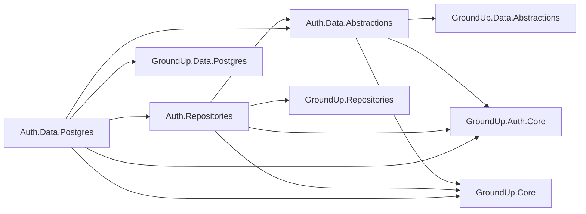
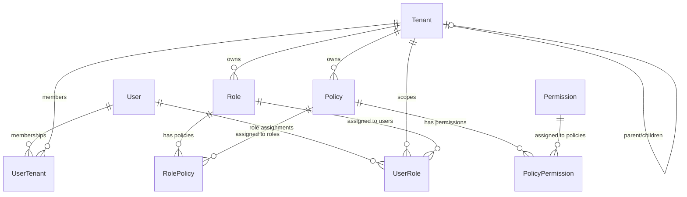

# Design Document — Phase 9B: Auth Data Layer

## Overview

Phase 9B builds the complete data access layer for the GroundUp authentication and authorization module. This includes three new projects following the established framework pattern:

1. **GroundUp.Auth.Data.Abstractions** — Repository interfaces (contracts only, no EF Core dependency)
2. **GroundUp.Auth.Repositories** — Concrete repository implementations with Mapperly mappers
3. **GroundUp.Auth.Data.Postgres** — EF Core entity configurations, AuthDbContext, migrations, and DI registration

The design follows the same layered architecture established in Phase 3A–3C (core framework) and Phase 6A–6B (settings module). Repository interfaces live in abstractions, implementations extend BaseRepository/BaseTenantRepository, and EF Core configurations use Fluent API with `IEntityTypeConfiguration<T>`.

### Key Design Decisions

- **7 repositories** (no standalone junction repos): UserRepository, TenantRepository, PermissionRepository, RoleRepository, PolicyRepository, UserRoleRepository, UserTenantRepository
- **Junction management via parent repos**: RoleRepository manages RolePolicy records; PolicyRepository manages PolicyPermission records
- **TenantRepository uses custom visibility** (not BaseTenantRepository): filters to self + direct children
- **UserTenantRepository has a system-level bypass** method for multi-tenant selection flow
- **AuthDbContext inherits GroundUpDbContext**: gets UUID v7, soft delete filters, audit interceptors for free
- **All tables prefixed with "Auth"**: avoids collisions with consuming application tables

## Architecture

```mermaid
graph TD
    subgraph "GroundUp.Auth.Data.Abstractions"
        IUserRepo[IUserRepository]
        ITenantRepo[ITenantRepository]
        IRoleRepo[IRoleRepository]
        IPolicyRepo[IPolicyRepository]
        IPermRepo[IPermissionRepository]
        IUserTenantRepo[IUserTenantRepository]
        IUserRoleRepo[IUserRoleRepository]
    end

    subgraph "GroundUp.Auth.Repositories"
        UserRepo[UserRepository]
        TenantRepo[TenantRepository]
        RoleRepo[RoleRepository]
        PolicyRepo[PolicyRepository]
        PermRepo[PermissionRepository]
        UserTenantRepo[UserTenantRepository]
        UserRoleRepo[UserRoleRepository]
        Mappers[Mapperly Mappers]
    end

    subgraph "GroundUp.Auth.Data.Postgres"
        AuthCtx[AuthDbContext]
        Configs[Entity Configurations x9]
        DI[AddGroundUpAuthPostgres]
        Migration[Initial Migration]
    end

    UserRepo --> IUserRepo
    TenantRepo --> ITenantRepo
    RoleRepo --> IRoleRepo
    PolicyRepo --> IPolicyRepo
    PermRepo --> IPermRepo
    UserTenantRepo --> IUserTenantRepo
    UserRoleRepo --> IUserRoleRepo

    UserRepo --> AuthCtx
    TenantRepo --> AuthCtx
    RoleRepo --> AuthCtx
    PolicyRepo --> AuthCtx
    PermRepo --> AuthCtx
    UserTenantRepo --> AuthCtx
    UserRoleRepo --> AuthCtx

    AuthCtx --> Configs
```



### Project Dependency Graph



## Components and Interfaces

### Repository Interfaces (Auth.Data.Abstractions)

| Interface | Extends | Entity Scope | Custom Methods |
|---|---|---|---|
| `IUserRepository` | `IBaseRepository<UserDto>` | Global | `GetByExternalUserIdAsync`, `GetByEmailAsync` |
| `ITenantRepository` | `IBaseRepository<TenantDto>` | Custom visibility | `GetBySlugAsync`, `GetChildTenantsAsync` |
| `IPermissionRepository` | `IBaseRepository<PermissionDto>` | Global | `GetByKeyAsync`, `GetByModuleAsync` |
| `IRoleRepository` | `IBaseRepository<RoleDto>` | Tenant-scoped | `GetPoliciesForRoleAsync`, `AssignPolicyAsync`, `RemovePolicyAsync` |
| `IPolicyRepository` | `IBaseRepository<PolicyDto>` | Tenant-scoped | `GetPermissionsForPolicyAsync`, `AssignPermissionAsync`, `RemovePermissionAsync` |
| `IUserTenantRepository` | `IBaseRepository<UserTenantDto>` | Tenant-scoped | `GetByUserIdAsync`, `GetAllMembershipsForUserAsync` (system bypass) |
| `IUserRoleRepository` | `IBaseRepository<UserRoleDto>` | Tenant-scoped | `GetByUserIdAsync` |

### Repository Implementations (Auth.Repositories)

| Repository | Base Class | Key Behavior |
|---|---|---|
| `UserRepository` | `BaseRepository<User, UserDto>` | Standard CRUD, custom lookup by ExternalUserId/Email |
| `TenantRepository` | `BaseRepository<Tenant, TenantDto>` | Custom queryShaper for visibility (self + children) |
| `PermissionRepository` | `BaseRepository<Permission, PermissionDto>` | Standard CRUD, lookup by Key/Module |
| `RoleRepository` | `BaseTenantRepository<Role, RoleDto>` | Auto tenant filter + RolePolicy junction management |
| `PolicyRepository` | `BaseTenantRepository<Policy, PolicyDto>` | Auto tenant filter + PolicyPermission junction management |
| `UserTenantRepository` | `BaseTenantRepository<UserTenant, UserTenantDto>` | Auto tenant filter + system bypass for all memberships |
| `UserRoleRepository` | `BaseTenantRepository<UserRole, UserRoleDto>` | Auto tenant filter + lookup by UserId |

### Mapperly Mappers (Auth.Repositories)

One static partial mapper class per entity-DTO pair:

- `AuthUserMapper` — User ↔ UserDto
- `AuthTenantMapper` — Tenant ↔ TenantDto
- `AuthRoleMapper` — Role ↔ RoleDto
- `AuthPolicyMapper` — Policy ↔ PolicyDto
- `AuthPermissionMapper` — Permission ↔ PermissionDto
- `AuthUserTenantMapper` — UserTenant ↔ UserTenantDto
- `AuthUserRoleMapper` — UserRole ↔ UserRoleDto

### AuthDbContext (Auth.Data.Postgres)

```csharp
public class AuthDbContext : GroundUpDbContext
{
    public DbSet<User> Users => Set<User>();
    public DbSet<Tenant> Tenants => Set<Tenant>();
    public DbSet<UserTenant> UserTenants => Set<UserTenant>();
    public DbSet<Role> Roles => Set<Role>();
    public DbSet<Policy> Policies => Set<Policy>();
    public DbSet<Permission> Permissions => Set<Permission>();
    public DbSet<RolePolicy> RolePolicies => Set<RolePolicy>();
    public DbSet<PolicyPermission> PolicyPermissions => Set<PolicyPermission>();
    public DbSet<UserRole> UserRoles => Set<UserRole>();

    protected override void OnModelCreating(ModelBuilder modelBuilder)
    {
        base.OnModelCreating(modelBuilder); // UUID v7 + soft delete filters
        modelBuilder.ApplyConfigurationsFromAssembly(typeof(AuthDbContext).Assembly);
    }
}
```

### DI Registration (Auth.Data.Postgres)

```csharp
public static IServiceCollection AddGroundUpAuthPostgres(
    this IServiceCollection services,
    string connectionString)
{
    // Register interceptors
    services.AddSingleton<AuditableInterceptor>();
    services.AddSingleton<SoftDeleteInterceptor>();

    // Register AuthDbContext with Npgsql
    services.AddDbContext<AuthDbContext>((sp, options) =>
    {
        options.UseNpgsql(connectionString);
        options.AddInterceptors(
            sp.GetRequiredService<AuditableInterceptor>(),
            sp.GetRequiredService<SoftDeleteInterceptor>());
    });

    // Register all repository implementations
    services.AddScoped<IUserRepository, UserRepository>();
    services.AddScoped<ITenantRepository, TenantRepository>();
    services.AddScoped<IRoleRepository, RoleRepository>();
    services.AddScoped<IPolicyRepository, PolicyRepository>();
    services.AddScoped<IPermissionRepository, PermissionRepository>();
    services.AddScoped<IUserTenantRepository, UserTenantRepository>();
    services.AddScoped<IUserRoleRepository, UserRoleRepository>();

    return services;
}
```

### Entity Configurations (Auth.Data.Postgres)

9 configuration classes, one per entity:

| Configuration | Table Name | Key Features |
|---|---|---|
| `UserConfiguration` | AuthUsers | ExternalUserId(200), Email(320), DisplayName(200), IsActive default true |
| `TenantConfiguration` | AuthTenants | Name(200), Slug(100) unique, enum conversions, self-ref FK Restrict, IsActive default true |
| `UserTenantConfiguration` | AuthUserTenants | Composite unique (UserId, TenantId), FK User Cascade, FK Tenant Restrict |
| `RoleConfiguration` | AuthRoles | Name(200), enum conversion, FK Tenant Restrict, IsSystem default false |
| `PolicyConfiguration` | AuthPolicies | Name(200), FK Tenant Restrict |
| `PermissionConfiguration` | AuthPermissions | Key(200) unique, Module(100) |
| `RolePolicyConfiguration` | AuthRolePolicies | Composite unique (RoleId, PolicyId), FK Role Cascade, FK Policy Cascade |
| `PolicyPermissionConfiguration` | AuthPolicyPermissions | Composite unique (PolicyId, PermissionId), FK Policy Cascade, FK Permission Restrict |
| `UserRoleConfiguration` | AuthUserRoles | Composite unique (UserId, RoleId, TenantId), FK User Cascade, FK Role Cascade, FK Tenant Restrict |

## Data Models

### Entity-to-Table Mapping

| Entity | Table | Interfaces | Tenant Scoped |
|---|---|---|---|
| User | AuthUsers | BaseEntity, IAuditable | No (global) |
| Tenant | AuthTenants | BaseEntity, IAuditable, ISoftDeletable | No (custom visibility) |
| Permission | AuthPermissions | BaseEntity | No (global) |
| Role | AuthRoles | BaseEntity, IAuditable, ITenantEntity | Yes |
| Policy | AuthPolicies | BaseEntity, IAuditable, ITenantEntity | Yes |
| UserTenant | AuthUserTenants | BaseEntity, IAuditable, ITenantEntity | Yes |
| UserRole | AuthUserRoles | BaseEntity, IAuditable, ITenantEntity | Yes |
| RolePolicy | AuthRolePolicies | BaseEntity, IAuditable | No (managed via parent) |
| PolicyPermission | AuthPolicyPermissions | BaseEntity, IAuditable | No (managed via parent) |

### Junction DTOs (added to GroundUp.Auth.Core)

```csharp
public record UserTenantDto(Guid Id, Guid UserId, Guid TenantId, string ExternalUserId, bool IsActive);
public record UserRoleDto(Guid Id, Guid UserId, Guid RoleId, Guid TenantId);
```

### Relationship Diagram



### Delete Behavior Summary

| Relationship | Delete Behavior | Rationale |
|---|---|---|
| Tenant → Parent (self-ref) | Restrict | Cannot delete parent while children exist |
| UserTenant → User | Cascade | Deleting user removes all memberships |
| UserTenant → Tenant | Restrict | Cannot delete tenant while memberships exist |
| Role → Tenant | Restrict | Cannot delete tenant while roles exist |
| Policy → Tenant | Restrict | Cannot delete tenant while policies exist |
| RolePolicy → Role | Cascade | Deleting role removes all policy assignments |
| RolePolicy → Policy | Cascade | Deleting policy removes all role assignments |
| PolicyPermission → Policy | Cascade | Deleting policy removes all permission assignments |
| PolicyPermission → Permission | Restrict | Cannot delete permission while assigned to policies |
| UserRole → User | Cascade | Deleting user removes all role assignments |
| UserRole → Role | Cascade | Deleting role removes all user assignments |
| UserRole → Tenant | Restrict | Cannot delete tenant while role assignments exist |

### Index Strategy

| Table | Index | Type | Purpose |
|---|---|---|---|
| AuthTenants | Slug | Unique | Lookup by slug |
| AuthTenants | ParentTenantId | Non-unique | Hierarchy queries |
| AuthPermissions | Key | Unique | Lookup by permission key |
| AuthUserTenants | (UserId, TenantId) | Unique composite | Prevent duplicate memberships |
| AuthUserTenants | UserId | Non-unique | User's memberships lookup |
| AuthUserTenants | TenantId | Non-unique | Tenant's members lookup |
| AuthRoles | TenantId | Non-unique | Tenant's roles lookup |
| AuthPolicies | TenantId | Non-unique | Tenant's policies lookup |
| AuthRolePolicies | (RoleId, PolicyId) | Unique composite | Prevent duplicate assignments |
| AuthRolePolicies | RoleId | Non-unique | Role's policies lookup |
| AuthRolePolicies | PolicyId | Non-unique | Policy's roles lookup |
| AuthPolicyPermissions | (PolicyId, PermissionId) | Unique composite | Prevent duplicate assignments |
| AuthPolicyPermissions | PolicyId | Non-unique | Policy's permissions lookup |
| AuthPolicyPermissions | PermissionId | Non-unique | Permission's policies lookup |
| AuthUserRoles | (UserId, RoleId, TenantId) | Unique composite | Prevent duplicate assignments |
| AuthUserRoles | UserId | Non-unique | User's roles lookup |
| AuthUserRoles | RoleId | Non-unique | Role's users lookup |
| AuthUserRoles | TenantId | Non-unique | Tenant's role assignments lookup |


## Correctness Properties

*A property is a characteristic or behavior that should hold true across all valid executions of a system — essentially, a formal statement about what the system should do. Properties serve as the bridge between human-readable specifications and machine-verifiable correctness guarantees.*

### Property 1: Mapper round-trip preserves entity fields

*For any* valid auth entity (User, Tenant, Role, Policy, Permission, UserTenant, UserRole), mapping to its DTO and back to an entity should preserve all mapped field values.

**Validates: Requirements 13.1, 13.2, 13.3, 13.4, 13.5, 13.6**

### Property 2: TenantRepository visibility restricts to self and direct children

*For any* tenant hierarchy and any current tenant context, TenantRepository queries (GetAllAsync, GetByIdAsync, GetBySlugAsync, GetChildTenantsAsync) shall only return tenants that are either the current tenant itself or direct children of the current tenant (where ParentTenantId == currentTenantId). Grandchildren, siblings, parents, and unrelated tenants shall never be visible.

**Validates: Requirements 10.2, 10.3, 10.4, 10.5**

### Property 3: Tenant soft delete sets deletion metadata

*For any* active tenant, when DeleteAsync is called, the tenant's IsDeleted property shall be true and DeletedAt shall be set to a UTC timestamp no earlier than the time the delete was initiated.

**Validates: Requirements 10.7**

### Property 4: UserRepository ExternalUserId lookup returns correct user

*For any* set of users with unique ExternalUserIds, querying by a specific ExternalUserId shall return exactly the user with that ExternalUserId, and querying by a non-existent ExternalUserId shall return NotFound.

**Validates: Requirements 9.2, 9.4**

### Property 5: UserRepository email lookup is case-insensitive

*For any* user with a stored email address, querying by any case variation of that email (uppercase, lowercase, mixed) shall return the same user.

**Validates: Requirements 9.3**

### Property 6: Tenant-scoped repositories enforce tenant isolation

*For any* tenant-scoped auth repository (RoleRepository, PolicyRepository, UserTenantRepository, UserRoleRepository), entities created through the repository shall have TenantId equal to ITenantContext.TenantId, and queries shall never return entities belonging to a different tenant.

**Validates: Requirements 11.5, 11.6**

### Property 7: GetAllMembershipsForUserAsync bypasses tenant filtering

*For any* user with memberships across multiple tenants, GetAllMembershipsForUserAsync shall return all memberships regardless of the current tenant context. The count of returned memberships shall equal the total number of UserTenant records for that user across all tenants.

**Validates: Requirements 7.3**

### Property 8: RoleRepository junction management round-trip

*For any* role and policy within the same tenant, AssignPolicyAsync followed by GetPoliciesForRoleAsync shall include that policy in the results, and RemovePolicyAsync followed by GetPoliciesForRoleAsync shall not include that policy. Assigning the same policy twice shall not create duplicates.

**Validates: Requirements 11.7, 4.2, 4.3, 4.4**

### Property 9: PolicyRepository junction management round-trip

*For any* policy and permission, AssignPermissionAsync followed by GetPermissionsForPolicyAsync shall include that permission in the results, and RemovePermissionAsync followed by GetPermissionsForPolicyAsync shall not include that permission. Assigning the same permission twice shall not create duplicates.

**Validates: Requirements 11.8, 5.2, 5.3, 5.4**

## Error Handling

All repository methods follow the established OperationResult pattern:

| Scenario | Result | Status Code |
|---|---|---|
| Entity found | `OperationResult<T>.Ok(dto)` | 200 |
| Entity created | `OperationResult<T>.Ok(dto, "Created", 201)` | 201 |
| Entity not found | `OperationResult<T>.NotFound()` | 404 |
| Entity not visible (wrong tenant) | `OperationResult<T>.NotFound()` | 404 (not 403, to prevent info leakage) |
| Unique constraint violation | `OperationResult<T>.Fail(..., 409, ErrorCodes.Conflict)` | 409 |
| DbUpdateException (other) | `OperationResult<T>.Fail(..., 409, ErrorCodes.Conflict)` | 409 |

### Junction Management Error Cases

| Scenario | Result |
|---|---|
| AssignPolicyAsync — role not found | `OperationResult.NotFound()` |
| AssignPolicyAsync — policy not found | `OperationResult.NotFound()` |
| AssignPolicyAsync — already assigned | `OperationResult.Ok()` (idempotent) |
| RemovePolicyAsync — assignment not found | `OperationResult.NotFound()` |
| AssignPermissionAsync — policy not found | `OperationResult.NotFound()` |
| AssignPermissionAsync — permission not found | `OperationResult.NotFound()` |
| RemovePermissionAsync — assignment not found | `OperationResult.NotFound()` |

### Cross-Tenant Access

Cross-tenant access attempts return NotFound (never Forbidden) to prevent information leakage about entity existence in other tenants. This is enforced by:
- BaseTenantRepository's ComposeTenantShaper (for Role, Policy, UserTenant, UserRole)
- TenantRepository's custom visibility queryShaper (for Tenant)

## Testing Strategy

### Unit Tests (xUnit + NSubstitute)

Unit tests verify specific examples and edge cases without a real database:

- **Mapper tests**: Verify each Mapperly mapper correctly maps all fields between entity and DTO
- **Repository constructor tests**: Verify repositories can be instantiated with mocked dependencies
- **TenantRepository visibility logic**: Test the queryShaper composition with mock IQueryable

### Property-Based Tests (xUnit + FsCheck)

Property tests verify universal correctness properties across generated inputs. Each property test runs a minimum of 100 iterations.

**Library**: FsCheck.Xunit (integrates with xUnit test runner)

**Tag format**: `Feature: phase-9b-auth-data-layer, Property {number}: {property_text}`

Properties 1 (mapper round-trip) can be tested as pure unit tests with generated data — no database needed.

Properties 2–9 require a real database (Testcontainers with Postgres) because they test EF Core query behavior, tenant filtering, and junction management through actual SQL execution.

### Integration Tests (xUnit + Testcontainers)

Integration tests verify the full stack against a real Postgres database:

- **Migration tests**: Verify the initial migration applies cleanly to a fresh database
- **DI registration tests**: Verify AddGroundUpAuthPostgres registers all expected services
- **Entity configuration tests**: Verify constraints (unique indexes, FK constraints, max lengths, default values) are enforced at the database level
- **Repository CRUD tests**: Verify standard CRUD operations work end-to-end for each repository
- **Delete behavior tests**: Verify cascade/restrict behaviors work as configured

### Test Organization

```
tests/
  GroundUp.Tests.Unit/
    Auth/
      Mappers/          — Mapper round-trip property tests
      Repositories/     — Repository unit tests with mocks
  GroundUp.Tests.Integration/
    Auth/
      Repositories/     — Full repository integration tests
      Data/             — Migration and schema tests
      DI/               — Service registration tests
```
