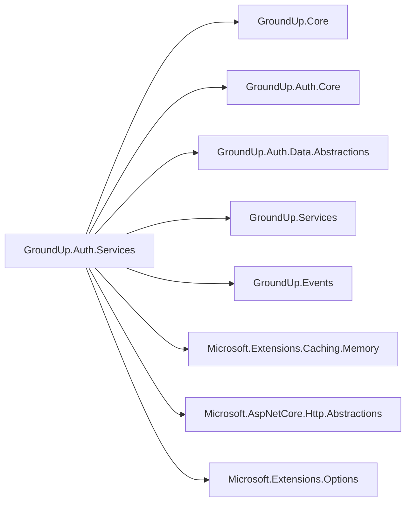

# Design Document — Phase 9C: Permission Service & Enforcement

## Overview

Phase 9C builds the authorization service layer for the GroundUp framework. It introduces the `GroundUp.Auth.Services` project containing:

1. **PermissionService** — Resolves a user's effective permissions by traversing the UserRole → Role → RolePolicy → Policy → PolicyPermission → Permission hierarchy, unioning tenant-scoped and system-level role permissions, with IMemoryCache-backed caching.
2. **AuthorizationInterceptor** — A `System.Reflection.DispatchProxy`-based proxy that intercepts service interface method calls, reads `[RequiresPermission]`/`[RequiresRole]` attributes, and returns `OperationResult.Forbidden()` when authorization fails.
3. **Identity implementations** — `JwtCurrentUser`/`JwtTenantContext` for HTTP scenarios and `SystemCurrentUser`/`SystemTenantContext` for SDK/background job scenarios.
4. **Cache invalidation handlers** — `IEventHandler<T>` implementations that evict permission cache entries when roles, policies, or permissions change.
5. **DI registration** — `AddGroundUpAuth()` for the full auth service layer and `AddAuthorized<TInterface, TImpl>()` for per-service proxy wrapping.

### Key Design Decisions

1. **DispatchProxy over Castle.DynamicProxy** — .NET's built-in `System.Reflection.DispatchProxy` avoids an external dependency and integrates cleanly with the DI container. The proxy creates a runtime implementation of the service interface that delegates to the real implementation after authorization checks pass.

2. **Permission resolution with system role support** — The permission service resolves permissions from two sources:
   - **Tenant-scoped roles**: UserRoles (current tenant) → Roles → RolePolicies → Policies → PolicyPermissions → Permissions
   - **System roles**: UserRoles where Role.RoleType == System (bypasses tenant filtering) → same chain
   - Both sets are unioned and deduplicated into a single `HashSet<string>`.

3. **[RequiresRole] only checks system roles** — Because only system roles are known at development time. Dynamic tenant-scoped roles receive permissions via policies and are checked through `[RequiresPermission]`. The role check bypasses tenant filtering and uses case-insensitive comparison.

4. **[RequiresPermission] checks the full resolved permission set** — This includes permissions from both tenant-scoped roles AND system roles, giving the most complete authorization picture.

5. **Return type gating** — Only methods returning `Task<OperationResult<T>>` or `Task<OperationResult>` are intercepted. Other return types pass through without checks, ensuring the proxy doesn't break non-standard methods.

6. **Cache strategy** — Full permission set cached per user+tenant in IMemoryCache. Key: `permissions:{userId}:{tenantId}`. Default TTL 15 min via `IOptions<AuthOptions>`. Event-driven invalidation via IEventBus handlers.

7. **No circular dependency with Settings** — Auth.Services uses `IOptions<AuthOptions>` for cache TTL. Settings uses `[RequiresPermission]` attributes from Core without referencing Auth.

8. **IUserRoleRepository extension** — `GetSystemRolesForUserAsync(Guid userId)` bypasses tenant filtering and returns UserRole records where Role.RoleType == System, including the Role name for direct comparison.

## Architecture

```mermaid
graph TD
    subgraph "GroundUp.Auth.Services"
        subgraph "Permission Resolution"
            IPermSvc[IPermissionService]
            PermSvc[PermissionService]
            PermSvc --> IPermSvc
        end

        subgraph "Authorization Proxy"
            AuthProxy[AuthorizationInterceptor : DispatchProxy]
            AddAuth[AddAuthorized&lt;T,TImpl&gt;]
        end

        subgraph "Identity"
            JwtCU[JwtCurrentUser : ICurrentUser]
            JwtTC[JwtTenantContext : ITenantContext]
            SysCU[SystemCurrentUser : ICurrentUser]
            SysTC[SystemTenantContext : ITenantContext]
        end

        subgraph "Cache Invalidation"
            URHandler[UserRoleChangedHandler]
            RPHandler[RolePolicyChangedHandler]
            PPHandler[PolicyPermissionChangedHandler]
        end

        subgraph "Configuration"
            AuthOpts[AuthOptions]
            AuthDI[AddGroundUpAuth]
        end
    end

    PermSvc --> IUserRoleRepo[IUserRoleRepository]
    PermSvc --> IRoleRepo[IRoleRepository]
    PermSvc --> IPolicyRepo[IPolicyRepository]
    PermSvc --> IMemCache[IMemoryCache]
    PermSvc --> ITenantCtx[ITenantContext]

    AuthProxy --> IPermSvc
    AuthProxy --> ICurrentUser[ICurrentUser]

    JwtCU --> IHttpCtx[IHttpContextAccessor]
    JwtTC --> IHttpCtx

    URHandler --> IMemCache
    RPHandler --> IMemCache
    RPHandler --> IUserRoleRepo
    PPHandler --> IMemCache
    PPHandler --> IUserRoleRepo
    PPHandler --> IRoleRepo
```



### Project Dependency Graph



### Authorization Flow Sequence

```mermaid
sequenceDiagram
    participant Client
    participant Proxy as AuthorizationInterceptor
    participant PermSvc as IPermissionService
    participant Cache as IMemoryCache
    participant DB as Repositories
    participant Service as Real Service

    Client->>Proxy: InvokeMethod()
    Proxy->>Proxy: Read [RequiresPermission] from interface method
    alt Has authorization attribute
        Proxy->>PermSvc: GetUserPermissionsAsync(userId)
        PermSvc->>Cache: TryGetValue(key)
        alt Cache hit
            Cache-->>PermSvc: HashSet&lt;string&gt;
        else Cache miss
            PermSvc->>DB: Resolve tenant roles + system roles
            DB-->>PermSvc: Permission keys
            PermSvc->>Cache: Set(key, permissions, TTL)
        end
        PermSvc-->>Proxy: HashSet&lt;string&gt;
        alt All permissions satisfied
            Proxy->>Service: Invoke real method
            Service-->>Proxy: OperationResult&lt;T&gt;
            Proxy-->>Client: OperationResult&lt;T&gt;
        else Missing permissions
            Proxy-->>Client: OperationResult&lt;T&gt;.Forbidden()
        end
    else No attribute
        Proxy->>Service: Invoke real method (no check)
        Service-->>Proxy: Result
        Proxy-->>Client: Result
    end
```

## Components and Interfaces

### IPermissionService

```csharp
namespace GroundUp.Auth.Services;

/// <summary>
/// Resolves a user's effective permissions within the current tenant context.
/// Combines tenant-scoped role permissions with system-level role permissions.
/// Results are cached per user+tenant combination.
/// </summary>
public interface IPermissionService
{
    /// <summary>
    /// Checks whether the user holds a specific permission in the current tenant.
    /// </summary>
    Task<bool> HasPermissionAsync(Guid userId, string permissionKey, CancellationToken cancellationToken = default);

    /// <summary>
    /// Checks whether the user holds at least one of the specified permissions in the current tenant.
    /// </summary>
    Task<bool> HasAnyPermissionAsync(Guid userId, IEnumerable<string> permissionKeys, CancellationToken cancellationToken = default);

    /// <summary>
    /// Returns the complete deduplicated set of permission keys the user holds in the current tenant.
    /// </summary>
    Task<HashSet<string>> GetUserPermissionsAsync(Guid userId, CancellationToken cancellationToken = default);

    /// <summary>
    /// Checks whether the user holds a specific system-level role (case-insensitive).
    /// </summary>
    Task<bool> HasSystemRoleAsync(Guid userId, string roleName, CancellationToken cancellationToken = default);

    /// <summary>
    /// Checks whether the user holds at least one of the specified system-level roles (case-insensitive).
    /// </summary>
    Task<bool> HasAnySystemRoleAsync(Guid userId, IEnumerable<string> roleNames, CancellationToken cancellationToken = default);
}
```

### PermissionService

```csharp
namespace GroundUp.Auth.Services;

/// <summary>
/// Resolves permissions by traversing the role hierarchy and caching results.
/// </summary>
public sealed class PermissionService : IPermissionService
{
    private readonly IUserRoleRepository _userRoleRepository;
    private readonly IRoleRepository _roleRepository;
    private readonly IPolicyRepository _policyRepository;
    private readonly ITenantContext _tenantContext;
    private readonly IMemoryCache _cache;
    private readonly IOptions<AuthOptions> _options;

    // Cache key format: "permissions:{userId}:{tenantId}"
    // Resolution: tenant roles + system roles → policies → permissions → deduplicated HashSet<string>
}
```

### AuthorizationInterceptor (DispatchProxy)

```csharp
namespace GroundUp.Auth.Services.Authorization;

/// <summary>
/// DispatchProxy-based interceptor that enforces [RequiresPermission] and [RequiresRole]
/// attributes on service interface methods. Returns OperationResult.Forbidden() when
/// authorization fails. Only intercepts methods returning Task&lt;OperationResult&lt;T&gt;&gt;
/// or Task&lt;OperationResult&gt;.
/// </summary>
public sealed class AuthorizationInterceptor<TInterface> : DispatchProxy
    where TInterface : class
{
    // Set via static factory after proxy creation
    private TInterface _target = null!;
    private IPermissionService _permissionService = null!;
    private ICurrentUser _currentUser = null!;

    protected override object? Invoke(MethodInfo? targetMethod, object?[]? args)
    {
        // 1. Check return type — only intercept Task<OperationResult<T>> or Task<OperationResult>
        // 2. Read [RequiresPermission] or [RequiresRole] from interface method
        // 3. If no attribute, pass through
        // 4. If attribute present, check permissions/roles
        // 5. Return Forbidden() or delegate to target
    }

    /// <summary>
    /// Factory method to create a proxy wrapping the target implementation.
    /// </summary>
    public static TInterface Create(TInterface target, IPermissionService permissionService, ICurrentUser currentUser)
    {
        var proxy = Create<TInterface, AuthorizationInterceptor<TInterface>>();
        var interceptor = (AuthorizationInterceptor<TInterface>)(object)proxy;
        interceptor._target = target;
        interceptor._permissionService = permissionService;
        interceptor._currentUser = currentUser;
        return proxy;
    }
}
```

### AuthorizationServiceCollectionExtensions

```csharp
namespace GroundUp.Auth.Services.Authorization;

/// <summary>
/// DI extension for registering services with authorization proxy wrapping.
/// </summary>
public static class AuthorizationServiceCollectionExtensions
{
    /// <summary>
    /// Registers a service with the DispatchProxy authorization wrapper.
    /// The proxy intercepts calls and enforces [RequiresPermission]/[RequiresRole] attributes.
    /// </summary>
    public static IServiceCollection AddAuthorized<TInterface, TImplementation>(this IServiceCollection services)
        where TInterface : class
        where TImplementation : class, TInterface
    {
        services.AddScoped<TImplementation>();
        services.AddScoped<TInterface>(sp =>
        {
            var target = sp.GetRequiredService<TImplementation>();
            var permissionService = sp.GetRequiredService<IPermissionService>();
            var currentUser = sp.GetRequiredService<ICurrentUser>();
            return AuthorizationInterceptor<TInterface>.Create(target, permissionService, currentUser);
        });
        return services;
    }
}
```

### Identity Implementations

```csharp
// JwtCurrentUser.cs
namespace GroundUp.Auth.Services.Identity;

public sealed class JwtCurrentUser : ICurrentUser
{
    private readonly IHttpContextAccessor _httpContextAccessor;
    private readonly IOptions<AuthOptions> _options;

    public Guid UserId => ParseGuidClaim(_options.Value.UserIdClaimType);
    public string? Email => GetClaim(_options.Value.EmailClaimType);
    public string? DisplayName => GetClaim(_options.Value.DisplayNameClaimType);
}

// JwtTenantContext.cs
namespace GroundUp.Auth.Services.Identity;

public sealed class JwtTenantContext : ITenantContext
{
    private readonly IHttpContextAccessor _httpContextAccessor;
    private readonly IOptions<AuthOptions> _options;

    public Guid TenantId => ParseGuidClaim(_options.Value.TenantIdClaimType);
}

// SystemCurrentUser.cs
namespace GroundUp.Auth.Services.Identity;

public sealed class SystemCurrentUser : ICurrentUser
{
    public Guid UserId { get; }
    public string? Email { get; }
    public string? DisplayName { get; }

    public SystemCurrentUser(Guid userId, string? email = null, string? displayName = null)
    {
        UserId = userId;
        Email = email;
        DisplayName = displayName;
    }
}

// SystemTenantContext.cs
namespace GroundUp.Auth.Services.Identity;

public sealed class SystemTenantContext : ITenantContext
{
    public Guid TenantId { get; }

    public SystemTenantContext(Guid tenantId)
    {
        TenantId = tenantId;
    }
}
```

### AuthOptions

```csharp
namespace GroundUp.Auth.Services.Configuration;

/// <summary>
/// Configuration options for the GroundUp auth service layer.
/// Bound from the "GroundUp:Auth" configuration section.
/// </summary>
public sealed class AuthOptions
{
    /// <summary>Cache TTL for resolved permission sets, in minutes. Default: 15.</summary>
    public int PermissionCacheTtlMinutes { get; set; } = 15;

    /// <summary>JWT claim type for user ID. Default: "sub".</summary>
    public string UserIdClaimType { get; set; } = "sub";

    /// <summary>JWT claim type for email. Default: "email".</summary>
    public string EmailClaimType { get; set; } = "email";

    /// <summary>JWT claim type for display name. Default: "name".</summary>
    public string DisplayNameClaimType { get; set; } = "name";

    /// <summary>JWT claim type for tenant ID. Default: "tenant_id".</summary>
    public string TenantIdClaimType { get; set; } = "tenant_id";
}
```

### Cache Invalidation Handlers

```csharp
// UserRoleChangedHandler.cs — handles EntityCreatedEvent<UserRoleDto> and EntityDeletedEvent<UserRoleDto>
// Evicts: permissions:{userRoleDto.UserId}:{userRoleDto.TenantId}

// RolePolicyChangedHandler.cs — handles EntityCreatedEvent<RolePolicyDto> and EntityDeletedEvent<RolePolicyDto>
// Queries IUserRoleRepository for all users holding the affected role
// Evicts: permissions:{userId}:{tenantId} for each affected user

// PolicyPermissionChangedHandler.cs — handles EntityCreatedEvent<PolicyPermissionDto> and EntityDeletedEvent<PolicyPermissionDto>
// Queries IRoleRepository for roles containing the affected policy
// Then queries IUserRoleRepository for all users holding those roles
// Evicts: permissions:{userId}:{tenantId} for each affected user
```

Note: `RolePolicyDto` and `PolicyPermissionDto` are new DTOs needed for event payloads. They will be added to `GroundUp.Auth.Core/Dtos/`:

```csharp
public record RolePolicyDto(Guid Id, Guid RoleId, Guid PolicyId);
public record PolicyPermissionDto(Guid Id, Guid PolicyId, Guid PermissionId);
```

### AddGroundUpAuth Extension

```csharp
namespace GroundUp.Auth.Services;

public static class AuthServiceCollectionExtensions
{
    /// <summary>
    /// Registers all auth service layer components: IPermissionService, ICurrentUser,
    /// ITenantContext, cache invalidation handlers, and AuthOptions configuration.
    /// </summary>
    public static IServiceCollection AddGroundUpAuth(this IServiceCollection services, IConfiguration configuration)
    {
        // Bind AuthOptions from "GroundUp:Auth" section
        services.Configure<AuthOptions>(configuration.GetSection("GroundUp:Auth"));

        // Register IMemoryCache if not already registered
        services.AddMemoryCache();

        // Register IHttpContextAccessor if not already registered
        services.AddHttpContextAccessor();

        // Register permission service
        services.AddScoped<IPermissionService, PermissionService>();

        // Register JWT-based identity (default for HTTP scenarios)
        services.AddScoped<ICurrentUser, JwtCurrentUser>();
        services.AddScoped<ITenantContext, JwtTenantContext>();

        // Register cache invalidation event handlers
        services.AddScoped<IEventHandler<EntityCreatedEvent<UserRoleDto>>, UserRoleChangedHandler>();
        services.AddScoped<IEventHandler<EntityDeletedEvent<UserRoleDto>>, UserRoleChangedHandler>();
        services.AddScoped<IEventHandler<EntityCreatedEvent<RolePolicyDto>>, RolePolicyChangedHandler>();
        services.AddScoped<IEventHandler<EntityDeletedEvent<RolePolicyDto>>, RolePolicyChangedHandler>();
        services.AddScoped<IEventHandler<EntityCreatedEvent<PolicyPermissionDto>>, PolicyPermissionChangedHandler>();
        services.AddScoped<IEventHandler<EntityDeletedEvent<PolicyPermissionDto>>, PolicyPermissionChangedHandler>();

        return services;
    }

    /// <summary>
    /// Overload accepting an explicit configuration action for AuthOptions.
    /// </summary>
    public static IServiceCollection AddGroundUpAuth(this IServiceCollection services, Action<AuthOptions> configure)
    {
        services.Configure(configure);
        services.AddMemoryCache();
        services.AddHttpContextAccessor();
        services.AddScoped<IPermissionService, PermissionService>();
        services.AddScoped<ICurrentUser, JwtCurrentUser>();
        services.AddScoped<ITenantContext, JwtTenantContext>();
        // ... same handler registrations
        return services;
    }
}
```

### IUserRoleRepository Extension (new method)

Added to `IUserRoleRepository` in `GroundUp.Auth.Data.Abstractions`:

```csharp
/// <summary>
/// Retrieves all system-level role assignments for a user, bypassing tenant filtering.
/// Returns UserRole records where the associated Role has RoleType == System.
/// Includes the Role name for direct comparison without additional lookups.
/// </summary>
/// <param name="userId">The user identifier.</param>
/// <param name="cancellationToken">Cancellation token.</param>
/// <returns>A list of user-role DTOs for system roles, regardless of tenant context.</returns>
Task<OperationResult<List<UserRoleDto>>> GetSystemRolesForUserAsync(
    Guid userId,
    CancellationToken cancellationToken = default);
```

The implementation in `UserRoleRepository` will bypass the tenant filter (similar to `GetAllMembershipsForUserAsync` in `UserTenantRepository`) and include an eager load of the Role entity to access `Role.Name`.

**Note on Role name access**: Since `UserRoleDto` currently only has `(Id, UserId, RoleId, TenantId)`, the permission service will need the role name for `[RequiresRole]` checks. Two options:
- Option A: Add a `RoleName` property to `UserRoleDto` — populated via projection in the system roles query.
- Option B: Separate query to get role names after getting system role IDs.

We choose **Option A** — extend `UserRoleDto` to include an optional `RoleName`:

```csharp
public record UserRoleDto(Guid Id, Guid UserId, Guid RoleId, Guid TenantId, string? RoleName = null);
```

The `RoleName` is populated only by `GetSystemRolesForUserAsync` (via Include/projection). Standard `GetByUserIdAsync` can leave it null since it's not needed for permission resolution (only for role name checks).

### File Organization

```
src/GroundUp.Auth.Services/
├── GroundUp.Auth.Services.csproj
├── IPermissionService.cs
├── PermissionService.cs
├── Authorization/
│   ├── AuthorizationInterceptor.cs
│   └── AuthorizationServiceCollectionExtensions.cs
├── Identity/
│   ├── JwtCurrentUser.cs
│   ├── JwtTenantContext.cs
│   ├── SystemCurrentUser.cs
│   └── SystemTenantContext.cs
├── Configuration/
│   └── AuthOptions.cs
├── EventHandlers/
│   ├── UserRoleChangedHandler.cs
│   ├── RolePolicyChangedHandler.cs
│   └── PolicyPermissionChangedHandler.cs
└── AuthServiceCollectionExtensions.cs
```

## Data Models

### Permission Resolution Data Flow

```
User (userId)
  ├── UserRoles (tenant-scoped, where TenantId == currentTenantId)
  │     └── Role
  │           └── RolePolicies
  │                 └── Policy
  │                       └── PolicyPermissions
  │                             └── Permission.Key
  │
  └── UserRoles (system, where Role.RoleType == System, any tenant)
        └── Role
              └── RolePolicies
                    └── Policy
                          └── PolicyPermissions
                                └── Permission.Key

Result: Union of all Permission.Key values → deduplicated HashSet<string>
```

### Cache Data Model

| Key Format | Value Type | TTL | Eviction Triggers |
|---|---|---|---|
| `permissions:{userId}:{tenantId}` | `HashSet<string>` | Configurable (default 15 min) | UserRole created/deleted, RolePolicy created/deleted, PolicyPermission created/deleted |

### New DTOs (added to GroundUp.Auth.Core)

| DTO | Properties | Purpose |
|---|---|---|
| `RolePolicyDto` | `Id`, `RoleId`, `PolicyId` | Event payload for RolePolicy changes |
| `PolicyPermissionDto` | `Id`, `PolicyId`, `PermissionId` | Event payload for PolicyPermission changes |

### Updated DTOs

| DTO | Change | Reason |
|---|---|---|
| `UserRoleDto` | Add optional `RoleName` parameter | System role name comparison in `[RequiresRole]` checks |

### AuthOptions Configuration Schema

```json
{
  "GroundUp": {
    "Auth": {
      "PermissionCacheTtlMinutes": 15,
      "UserIdClaimType": "sub",
      "EmailClaimType": "email",
      "DisplayNameClaimType": "name",
      "TenantIdClaimType": "tenant_id"
    }
  }
}
```

### Project File (GroundUp.Auth.Services.csproj)

```xml
<Project Sdk="Microsoft.NET.Sdk">

  <PropertyGroup>
    <TargetFramework>net8.0</TargetFramework>
    <ImplicitUsings>enable</ImplicitUsings>
    <Nullable>enable</Nullable>
    <GenerateDocumentationFile>true</GenerateDocumentationFile>
  </PropertyGroup>

  <ItemGroup>
    <PackageReference Include="Microsoft.Extensions.Caching.Memory" Version="8.*" />
    <PackageReference Include="Microsoft.AspNetCore.Http.Abstractions" Version="2.*" />
    <PackageReference Include="Microsoft.Extensions.Options" Version="8.*" />
    <PackageReference Include="Microsoft.Extensions.Options.ConfigurationExtensions" Version="8.*" />
  </ItemGroup>

  <ItemGroup>
    <ProjectReference Include="..\GroundUp.Core\GroundUp.Core.csproj" />
    <ProjectReference Include="..\GroundUp.Auth.Core\GroundUp.Auth.Core.csproj" />
    <ProjectReference Include="..\GroundUp.Auth.Data.Abstractions\GroundUp.Auth.Data.Abstractions.csproj" />
    <ProjectReference Include="..\GroundUp.Services\GroundUp.Services.csproj" />
    <ProjectReference Include="..\GroundUp.Events\GroundUp.Events.csproj" />
  </ItemGroup>

</Project>
```


## Correctness Properties

*A property is a characteristic or behavior that should hold true across all valid executions of a system — essentially, a formal statement about what the system should do. Properties serve as the bridge between human-readable specifications and machine-verifiable correctness guarantees.*

### Property 1: Permission resolution produces the correct union of tenant and system role permissions

*For any* user with a set of tenant-scoped roles and a set of system roles, `GetUserPermissionsAsync` SHALL return exactly the union of all permission keys reachable through the tenant-scoped role hierarchy (UserRoles → Roles → RolePolicies → Policies → PolicyPermissions → Permissions) and all permission keys reachable through the system role hierarchy. `HasPermissionAsync(userId, key)` SHALL return true if and only if `key` is in this resolved set. `HasAnyPermissionAsync(userId, keys)` SHALL return true if and only if the intersection of `keys` with the resolved set is non-empty.

**Validates: Requirements 1.1, 1.2, 1.3, 1.4**

### Property 2: System role permissions transcend tenant boundaries

*For any* user with system-level role assignments (RoleType.System), the permissions granted by those system roles SHALL appear in the resolved permission set regardless of which tenant is the current context, and regardless of whether the user has a UserTenant membership in the current tenant.

**Validates: Requirements 1.5, 1.8**

### Property 3: Permission set deduplication invariant

*For any* user whose tenant-scoped roles and system roles grant overlapping permission keys, `GetUserPermissionsAsync` SHALL return a set where each permission key appears exactly once. The count of the returned set SHALL equal the count of distinct permission keys across all reachable paths.

**Validates: Requirements 1.6**

### Property 4: Authorization proxy enforces AND semantics for [RequiresPermission]

*For any* service interface method decorated with `[RequiresPermission(perm1, perm2, ...)]` and any user with a resolved permission set P, the proxy SHALL invoke the underlying method if and only if `{perm1, perm2, ...} ⊆ P`. When the subset condition is not met, the proxy SHALL return `OperationResult<T>.Forbidden()` without invoking the underlying method.

**Validates: Requirements 4.1, 4.2, 4.3**

### Property 5: Authorization proxy enforces OR semantics for [RequiresRole] using system roles only

*For any* service interface method decorated with `[RequiresRole(role1, role2, ...)]` and any user with system-level roles S, the proxy SHALL invoke the underlying method if and only if the intersection of `{role1, role2, ...}` with S (compared case-insensitively) is non-empty. Tenant-scoped roles SHALL NOT satisfy a `[RequiresRole]` check. When no system role matches, the proxy SHALL return `OperationResult<T>.Forbidden()`.

**Validates: Requirements 5.1, 5.2, 5.3, 5.5**

### Property 6: Role name comparison is case-insensitive

*For any* role name string and any case variation of that string (uppercase, lowercase, mixed), the `[RequiresRole]` check and `HasSystemRoleAsync`/`HasAnySystemRoleAsync` SHALL treat them as equivalent. A user holding a system role named "Admin" SHALL satisfy `[RequiresRole("admin")]`, `[RequiresRole("ADMIN")]`, and `[RequiresRole("Admin")]`.

**Validates: Requirements 5.6**

### Property 7: Proxy pass-through for undecorated or non-OperationResult methods

*For any* service interface method that either (a) has no `[RequiresPermission]` or `[RequiresRole]` attribute, or (b) has a return type that is not `Task<OperationResult<T>>` or `Task<OperationResult>`, the proxy SHALL invoke the underlying method unconditionally regardless of the current user's permissions or roles.

**Validates: Requirements 4.6, 6.3**

### Property 8: JWT claim extraction round-trip

*For any* valid Guid value set as the configured UserIdClaimType claim in HttpContext.User, `JwtCurrentUser.UserId` SHALL return that exact Guid. *For any* string value set as the configured EmailClaimType claim, `JwtCurrentUser.Email` SHALL return that exact string. *For any* valid Guid value set as the configured TenantIdClaimType claim, `JwtTenantContext.TenantId` SHALL return that exact Guid.

**Validates: Requirements 8.1, 8.2, 8.3, 8.6, 9.1, 9.4**

### Property 9: System identity constructor round-trip

*For any* Guid `userId`, optional string `email`, and optional string `displayName` passed to the `SystemCurrentUser` constructor, the `UserId`, `Email`, and `DisplayName` properties SHALL return those exact values. *For any* Guid `tenantId` passed to the `SystemTenantContext` constructor, the `TenantId` property SHALL return that exact value.

**Validates: Requirements 10.1, 10.2**

## Error Handling

### Authorization Proxy Error Responses

| Scenario | Return Value | Notes |
|---|---|---|
| User lacks required permissions | `OperationResult<T>.Forbidden("Forbidden")` | Generic message, no permission details leaked |
| User lacks required system role | `OperationResult<T>.Forbidden("Forbidden")` | Generic message, no role details leaked |
| User lacks required permissions (non-generic) | `OperationResult.Forbidden("Forbidden")` | For `Task<OperationResult>` methods |
| No ICurrentUser.UserId (Guid.Empty) | `OperationResult<T>.Forbidden("Forbidden")` | Unauthenticated user treated as unauthorized |
| Method has no auth attribute | Pass-through | No error possible from proxy |
| Method has non-OperationResult return type | Pass-through | No interception |

### Permission Service Error Responses

| Scenario | Behavior | Notes |
|---|---|---|
| User has no roles | Returns empty `HashSet<string>` | Not an error — valid state |
| Repository call fails | Exception propagates | Infrastructure errors are not caught |
| Cache unavailable | Falls through to DB resolution | IMemoryCache is resilient by design |

### Identity Implementation Error Responses

| Scenario | Behavior | Notes |
|---|---|---|
| No HttpContext available | `UserId = Guid.Empty`, `Email = null`, `DisplayName = null`, `TenantId = Guid.Empty` | Graceful degradation |
| Claim value is not a valid Guid | `Guid.Empty` returned | `Guid.TryParse` with fallback |
| Claim type not present in token | Property returns default (null or Guid.Empty) | No exception |

### Cache Invalidation Error Handling

Cache invalidation handlers follow the fire-and-forget pattern established by `BaseService.PublishEventSafelyAsync`. If a handler fails to evict a cache entry (e.g., repository query fails during user lookup), the cache entry will naturally expire at TTL. This is acceptable because:
- Stale permissions are bounded by the TTL (default 15 min)
- Cache invalidation is best-effort optimization, not a correctness requirement
- Handler failures are logged but do not propagate to the caller

## Testing Strategy

### Unit Tests (xUnit + NSubstitute)

Unit tests verify specific examples, edge cases, and error conditions with mocked dependencies:

**PermissionService tests:**
- Verify permission resolution calls repositories in correct order
- Verify cache is populated on first call and used on subsequent calls
- Verify cache key format is `permissions:{userId}:{tenantId}`
- Verify empty permission set returned when user has no roles
- Verify configurable TTL is applied to cache entries

**AuthorizationInterceptor tests:**
- Verify Forbidden returned when user lacks required permissions
- Verify method invoked when user has all required permissions
- Verify Forbidden returned when user lacks required system role
- Verify method invoked when user has at least one required system role
- Verify pass-through for methods without auth attributes
- Verify pass-through for methods with non-OperationResult return types
- Verify attribute is read from interface, not implementation
- Verify correct generic type parameter in Forbidden response

**Identity tests:**
- Verify JwtCurrentUser returns Guid.Empty when no HttpContext
- Verify JwtCurrentUser returns null for missing claims
- Verify JwtTenantContext returns Guid.Empty when no tenant claim
- Verify SystemCurrentUser/SystemTenantContext expose constructor values

**Cache invalidation handler tests:**
- Verify UserRoleChangedHandler evicts correct cache key
- Verify RolePolicyChangedHandler queries affected users and evicts their cache entries
- Verify PolicyPermissionChangedHandler cascades through roles to find affected users

**DI registration tests:**
- Verify AddGroundUpAuth registers all expected services
- Verify AddAuthorized wraps service with proxy
- Verify standard AddScoped does not wrap with proxy

### Property-Based Tests (xUnit + FsCheck)

Property-based testing is appropriate for this phase. The permission resolution logic involves set operations (union, deduplication, subset checks) where input variation reveals edge cases. The proxy enforcement logic involves set membership checks where random permission/role combinations test boundary conditions.

**Library:** FsCheck.Xunit

**Configuration:** Minimum 100 iterations per property test.

**Tag format:** `Feature: phase-9c-permission-service, Property {number}: {property_text}`

| Property | Test Target | Generator Strategy |
|----------|-------------|-------------------|
| Property 1 | PermissionService | Generate random permission graphs (users, roles, policies, permissions with random assignments). Mock repositories to return the generated data. Compute expected permissions by graph traversal. Verify service returns matching set. |
| Property 2 | PermissionService | Generate users with system roles. Set current tenant to a different tenant than where system roles are assigned. Verify system role permissions still appear. |
| Property 3 | PermissionService | Generate permission graphs with intentional overlaps (same permission reachable via multiple paths). Verify result count equals distinct key count. |
| Property 4 | AuthorizationInterceptor | Generate random required permission sets (1-5 permissions) and random user permission sets (0-10 permissions). Verify proxy allows iff required ⊆ user. |
| Property 5 | AuthorizationInterceptor | Generate random required role sets (1-3 roles) and random user system role sets (0-5 roles). Verify proxy allows iff intersection is non-empty (case-insensitive). |
| Property 6 | AuthorizationInterceptor / PermissionService | Generate random role name strings. Apply random case transformations. Verify case-insensitive matching. |
| Property 7 | AuthorizationInterceptor | Generate random user permission states. Invoke undecorated methods. Verify always passes through. |
| Property 8 | JwtCurrentUser / JwtTenantContext | Generate random Guids and strings. Set as claims. Verify properties return exact values. |
| Property 9 | SystemCurrentUser / SystemTenantContext | Generate random Guids and optional strings. Construct instances. Verify properties match. |

### Integration Tests (xUnit + Testcontainers)

Integration tests verify end-to-end behavior with a real Postgres database:

- **Permission resolution end-to-end**: Seed a full permission hierarchy, resolve permissions, verify correct set
- **System role bypass**: Seed system roles across tenants, verify resolution in different tenant contexts
- **Cache invalidation end-to-end**: Seed data, resolve (populates cache), modify assignments, verify cache is invalidated and re-resolution produces updated results
- **GetSystemRolesForUserAsync**: Seed system and tenant-scoped roles, verify only system roles returned regardless of tenant context
- **AddAuthorized integration**: Register a real service with AddAuthorized, invoke through proxy, verify enforcement works end-to-end

### Test Organization

```
tests/
  GroundUp.Tests.Unit/
    Auth/
      Services/
        PermissionServiceTests.cs
        AuthorizationInterceptorTests.cs
        AuthorizationInterceptorPropertyTests.cs
        PermissionServicePropertyTests.cs
      Identity/
        JwtCurrentUserTests.cs
        JwtTenantContextTests.cs
        SystemCurrentUserTests.cs
        SystemTenantContextTests.cs
        IdentityPropertyTests.cs
      EventHandlers/
        UserRoleChangedHandlerTests.cs
        RolePolicyChangedHandlerTests.cs
        PolicyPermissionChangedHandlerTests.cs
      DI/
        AuthServiceRegistrationTests.cs
  GroundUp.Tests.Integration/
    Auth/
      Services/
        PermissionResolutionTests.cs
        SystemRoleResolutionTests.cs
        CacheInvalidationTests.cs
        AuthorizationProxyIntegrationTests.cs
      Repositories/
        UserRoleSystemRolesTests.cs
```
