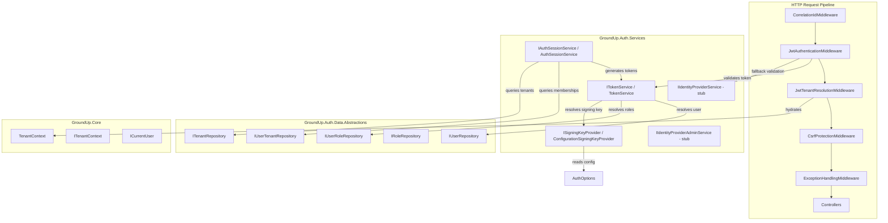
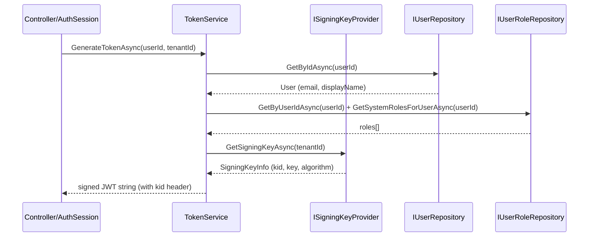
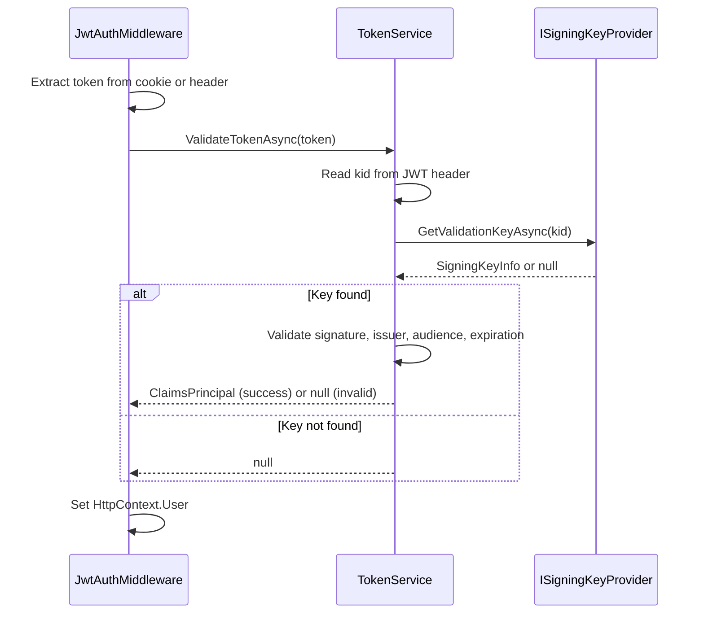
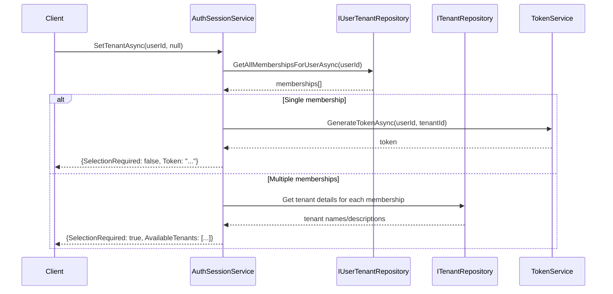
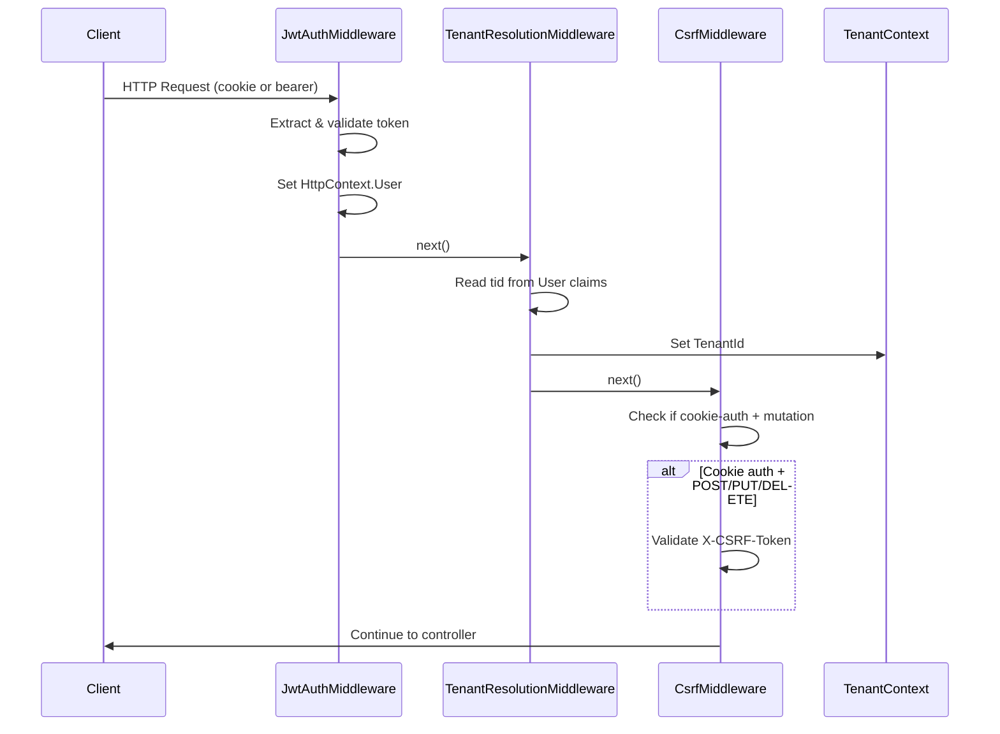

# Design Document — Phase 9D: JWT Token Service & Auth Session

## Overview

Phase 9D introduces the JWT token lifecycle (generate, validate, refresh), auth session management (tenant selection), authentication middleware, CSRF protection, and identity provider interface stubs into the GroundUp framework. This phase replaces the temporary `X-Tenant-Id` header-based tenant resolution with JWT claim-based resolution and establishes cookie-based authentication with enterprise security defaults.

### Key Design Decisions

1. **Token claims are minimal**: `sub`, `tid`, `email`, `name`, `roles[]` only. Permissions are resolved server-side via `IPermissionService` with in-memory caching — never embedded in the token.
2. **Signing algorithm**: FIPS-approved, default HMAC-SHA256, configurable per key via `SigningKeyInfo.Algorithm`.
3. **Per-tenant key isolation** via `ISigningKeyProvider` abstraction with `kid` header in JWT.
4. **Default `ConfigurationSigningKeyProvider`** uses `AuthOptions.JwtSigningKey` for all tenants (single-key mode).
5. **Cookie takes precedence** over Authorization header when both are present.
6. **Dual auth scheme**: GroundUp tokens validated first, then IdP tokens (IdP is no-op until Phase 10).
7. **Tenant resolution from JWT `tid` claim** replaces `X-Tenant-Id` header entirely.
8. **CSRF protection** uses ASP.NET Core's built-in anti-forgery with `X-CSRF-Token` header, enforced only on cookie-authenticated state-changing requests.
9. **`IIdentityProviderService` and `IIdentityProviderAdminService`** are interface stubs only — Phase 10 implements against Keycloak.
10. **`ISigningKeyProvider` is internal infrastructure** — not exposed via API or SDK layer. Public interface so consumers can implement it, but never called from controllers.

### Project Placement

| Component | Project |
|---|---|
| DTOs (SetTenantRequestDto, SetTenantResponseDto, etc.) | `GroundUp.Auth.Core` |
| Interfaces (ITokenService, IAuthSessionService, ISigningKeyProvider, IIdentityProviderService, IIdentityProviderAdminService) | `GroundUp.Auth.Services` |
| Implementations (TokenService, AuthSessionService, ConfigurationSigningKeyProvider) | `GroundUp.Auth.Services` |
| Middleware (JwtAuthenticationMiddleware, JwtTenantResolutionMiddleware, CsrfProtectionMiddleware) | `GroundUp.Api` |
| AuthOptions extensions | `GroundUp.Auth.Services` (existing file) |
| DI registration changes | `GroundUp.Auth.Services` (existing `AuthServiceCollectionExtensions`) |
| Middleware pipeline changes | `GroundUp.Api` (existing `GroundUpApplicationBuilderExtensions`) |

## Architecture

### High-Level Component Diagram



## Detailed Design

### 1. DTOs (GroundUp.Auth.Core/Dtos)

```csharp
namespace GroundUp.Auth.Core.Dtos;

/// <summary>Request to select a tenant for the current session.</summary>
public record SetTenantRequestDto(Guid? TenantId);

/// <summary>Response from tenant selection — either a token or a list of available tenants.</summary>
public record SetTenantResponseDto(bool SelectionRequired, List<TenantListItemDto>? AvailableTenants, string? Token);

/// <summary>Tenant summary for the selection list.</summary>
public record TenantListItemDto(Guid Id, string Name, string? Description);

/// <summary>Token response from an external identity provider.</summary>
public record TokenResponseDto(string AccessToken, string? RefreshToken, int ExpiresIn, string? IdToken);

/// <summary>User info from an external identity provider.</summary>
public record ExternalUserInfo(string ExternalUserId, string Email, string? DisplayName, IDictionary<string, string>? Attributes);

/// <summary>Signing key material with metadata.</summary>
public record SigningKeyInfo(string KeyId, byte[] KeyMaterial, string Algorithm = "HS256");
```

### 2. ISigningKeyProvider Interface

```csharp
namespace GroundUp.Auth.Services;

/// <summary>
/// Abstraction for resolving JWT signing keys. Supports per-tenant key isolation.
/// Consumers may implement this to integrate with external key management systems.
/// This is internal infrastructure — never exposed via API or SDK layer.
/// </summary>
public interface ISigningKeyProvider
{
    /// <summary>Resolves the signing key for a specific tenant. Falls back to default if no tenant-specific key.</summary>
    Task<SigningKeyInfo> GetSigningKeyAsync(Guid tenantId);

    /// <summary>Resolves a validation key by its key ID (from JWT kid header).</summary>
    Task<SigningKeyInfo?> GetValidationKeyAsync(string kid);
}
```

### 3. ConfigurationSigningKeyProvider (Default Implementation)

```csharp
namespace GroundUp.Auth.Services.Token;

/// <summary>
/// Default signing key provider that uses AuthOptions.JwtSigningKey for all tenants.
/// Single-key mode — suitable for applications that don't need per-tenant key isolation.
/// </summary>
public sealed class ConfigurationSigningKeyProvider : ISigningKeyProvider
{
    private readonly IOptions<AuthOptions> _options;
    private readonly SigningKeyInfo _defaultKey;

    public ConfigurationSigningKeyProvider(IOptions<AuthOptions> options)
    {
        _options = options;
        var keyBytes = Encoding.UTF8.GetBytes(options.Value.JwtSigningKey);
        _defaultKey = new SigningKeyInfo("default", keyBytes, "HS256");
    }

    public Task<SigningKeyInfo> GetSigningKeyAsync(Guid tenantId) => Task.FromResult(_defaultKey);
    public Task<SigningKeyInfo?> GetValidationKeyAsync(string kid) =>
        Task.FromResult<SigningKeyInfo?>(kid == "default" ? _defaultKey : null);
}
```

### 4. ITokenService Interface

```csharp
namespace GroundUp.Auth.Services;

public interface ITokenService
{
    /// <summary>Generates a signed JWT for the specified user and tenant.</summary>
    Task<string?> GenerateTokenAsync(Guid userId, Guid tenantId, IEnumerable<Claim>? additionalClaims = null);

    /// <summary>Validates a JWT and returns the ClaimsPrincipal, or null if invalid.</summary>
    Task<ClaimsPrincipal?> ValidateTokenAsync(string token);
}
```

### 5. TokenService Implementation

```csharp
namespace GroundUp.Auth.Services.Token;

public sealed class TokenService : ITokenService
{
    private readonly IUserRepository _userRepository;
    private readonly IUserRoleRepository _userRoleRepository;
    private readonly ISigningKeyProvider _signingKeyProvider;
    private readonly IOptions<AuthOptions> _options;

    // Constructor injection...

    public async Task<string?> GenerateTokenAsync(Guid userId, Guid tenantId, IEnumerable<Claim>? additionalClaims = null)
    {
        // 1. Resolve user (return null if not found)
        // 2. Resolve roles for user in tenant (tenant-scoped + system roles)
        // 3. Get signing key from ISigningKeyProvider for tenantId
        // 4. Build claims: sub, tid, email, name, roles[]
        // 5. Add additionalClaims if provided
        // 6. Create JWT with kid header, sign with resolved key
        // 7. Set issuer, audience, expiration from AuthOptions
        // 8. Return signed token string
    }

    public async Task<ClaimsPrincipal?> ValidateTokenAsync(string token)
    {
        // 1. Read kid from JWT header (without full validation)
        // 2. Resolve validation key from ISigningKeyProvider.GetValidationKeyAsync(kid)
        // 3. If key not found, return null
        // 4. Validate signature, issuer, audience, expiration
        // 5. Return ClaimsPrincipal on success, null on any failure
        // 6. Never throw — all failures return null
    }
}
```

### 6. IAuthSessionService Interface

```csharp
namespace GroundUp.Auth.Services;

public interface IAuthSessionService
{
    /// <summary>Selects a tenant for the user. Auto-selects if single tenant, returns list if multiple.</summary>
    Task<OperationResult<SetTenantResponseDto>> SetTenantAsync(Guid userId, Guid? tenantId);

    /// <summary>Refreshes a token with fresh roles. Re-validates tenant membership.</summary>
    Task<OperationResult<string>> RefreshTokenAsync(Guid userId, Guid tenantId);
}
```

### 7. AuthSessionService Implementation

```csharp
namespace GroundUp.Auth.Services.Token;

public sealed class AuthSessionService : IAuthSessionService
{
    private readonly IUserTenantRepository _userTenantRepository;
    private readonly ITenantRepository _tenantRepository;
    private readonly ITokenService _tokenService;

    public async Task<OperationResult<SetTenantResponseDto>> SetTenantAsync(Guid userId, Guid? tenantId)
    {
        // 1. Query all tenant memberships for user via IUserTenantRepository
        // 2. If no memberships → return Forbidden
        // 3. If tenantId is null:
        //    a. If exactly 1 membership → auto-select, generate token, return with SelectionRequired=false
        //    b. If multiple → query tenant details, return with SelectionRequired=true + list
        // 4. If tenantId specified:
        //    a. Validate user belongs to that tenant
        //    b. If not → return Forbidden
        //    c. Generate token scoped to that tenant, return with SelectionRequired=false
    }

    public async Task<OperationResult<string>> RefreshTokenAsync(Guid userId, Guid tenantId)
    {
        // 1. Re-validate user still belongs to tenant
        // 2. If not → return Forbidden
        // 3. Generate new token with fresh roles
        // 4. Return token string
    }
}
```

### 8. AuthOptions Extensions

New properties added to the existing `AuthOptions` class:

```csharp
// Existing properties (from 9C):
// PermissionCacheTtlMinutes, UserIdClaimType, EmailClaimType, DisplayNameClaimType, TenantIdClaimType

// New properties for 9D:
public string JwtSigningKey { get; set; } = string.Empty;
public string Issuer { get; set; } = "GroundUp";
public string Audience { get; set; } = "GroundUp";
public int TokenExpirationMinutes { get; set; } = 60;
public string CookieName { get; set; } = "AuthToken";
public bool CookieSecure { get; set; } = true;
public SameSiteMode CookieSameSite { get; set; } = SameSiteMode.Strict;
```

### 9. JwtAuthenticationMiddleware

```csharp
namespace GroundUp.Api.Middleware;

/// <summary>
/// Validates GroundUp-issued JWT tokens from cookies or Authorization headers.
/// Cookie takes precedence. Falls back to IdP validation if registered.
/// </summary>
public sealed class JwtAuthenticationMiddleware
{
    // Pipeline:
    // 1. Try read token from cookie (AuthOptions.CookieName)
    // 2. If no cookie, try read from Authorization: Bearer header
    // 3. If token found:
    //    a. Validate via ITokenService.ValidateTokenAsync
    //    b. If valid → set HttpContext.User
    //    c. If invalid → try IIdentityProviderService.ValidateTokenAsync (if registered)
    //    d. If IdP valid → call GetUserInfoAsync, build ClaimsPrincipal, set HttpContext.User
    // 4. If no token or all validation fails → proceed with anonymous identity
    // 5. If JwtSigningKey not configured → skip all validation (auth not set up)
}
```

### 10. JwtTenantResolutionMiddleware

```csharp
namespace GroundUp.Api.Middleware;

/// <summary>
/// Resolves tenant from authenticated JWT tid claim and hydrates TenantContext.
/// Replaces the X-Tenant-Id header approach entirely.
/// </summary>
public sealed class JwtTenantResolutionMiddleware
{
    // Pipeline:
    // 1. Check HttpContext.User for tid claim (using AuthOptions.TenantIdClaimType)
    // 2. If present and valid Guid → set TenantContext.TenantId
    // 3. If not present or not authenticated → TenantContext.TenantId = Guid.Empty
    // 4. Call next middleware
}
```

### 11. CsrfProtectionMiddleware

```csharp
namespace GroundUp.Api.Middleware;

/// <summary>
/// Validates anti-forgery tokens on state-changing requests when using cookie auth.
/// Skipped for bearer token auth (not vulnerable to CSRF).
/// </summary>
public sealed class CsrfProtectionMiddleware
{
    // Pipeline:
    // 1. If request method is GET/HEAD/OPTIONS → skip (safe methods)
    // 2. Determine if auth is cookie-based:
    //    - Check if token was read from cookie (not Authorization header)
    //    - If bearer auth → skip CSRF validation
    // 3. If cookie-based + state-changing method (POST/PUT/DELETE):
    //    a. Read X-CSRF-Token header
    //    b. Validate via IAntiforgery
    //    c. If invalid/missing → return 403 Forbidden
    // 4. Call next middleware
}
```

### 12. IIdentityProviderService (Stub Interface)

```csharp
namespace GroundUp.Auth.Services;

/// <summary>
/// Abstraction for external identity provider operations.
/// Phase 10 implements this against Keycloak.
/// </summary>
public interface IIdentityProviderService
{
    Task<TokenResponseDto?> ExchangeCodeForTokensAsync(string code, string redirectUri, string? realm = null);
    Task<bool> ValidateTokenAsync(string token);
    Task<ExternalUserInfo?> GetUserInfoAsync(string accessToken);
}
```

### 13. IIdentityProviderAdminService (Stub Interface)

```csharp
namespace GroundUp.Auth.Services;

/// <summary>
/// Abstraction for external identity provider administrative operations.
/// Phase 10 implements this against Keycloak.
/// </summary>
public interface IIdentityProviderAdminService
{
    Task<string> CreateUserAsync(string email, string displayName);
    Task DeleteUserAsync(string externalUserId);
    Task CreateRealmAsync(string realmName, object config);
    Task ConfigureFederationAsync(string realmName, object idpConfig);
}
```

### 14. DI Registration Changes

Extend existing `AddGroundUpAuth()`:

```csharp
private static void RegisterCoreServices(IServiceCollection services)
{
    // Existing registrations (from 9C)...

    // New 9D registrations:
    services.AddScoped<ITokenService, TokenService>();
    services.AddScoped<IAuthSessionService, AuthSessionService>();
    services.TryAddScoped<ISigningKeyProvider, ConfigurationSigningKeyProvider>();
    // TryAdd so consumers can register their own ISigningKeyProvider before calling AddGroundUpAuth
}
```

### 15. Middleware Pipeline Changes

Update `UseGroundUpMiddleware()` in `GroundUp.Api`:

```csharp
public static IApplicationBuilder UseGroundUpMiddleware(this IApplicationBuilder app)
{
    app.UseMiddleware<CorrelationIdMiddleware>();
    app.UseMiddleware<JwtAuthenticationMiddleware>();      // NEW
    app.UseMiddleware<JwtTenantResolutionMiddleware>();    // REPLACES old TenantResolutionMiddleware
    app.UseMiddleware<CsrfProtectionMiddleware>();         // NEW
    app.UseMiddleware<ExceptionHandlingMiddleware>();
    return app;
}
```

Remove the old `TenantResolutionMiddleware` that reads from `X-Tenant-Id` header.

## Sequence Diagrams

### Token Generation Flow



### Token Validation Flow



### Tenant Selection Flow



### Request Authentication Flow



## Correctness Properties

1. **Token round-trip**: For any valid userId and tenantId, `ValidateTokenAsync(GenerateTokenAsync(userId, tenantId))` returns a ClaimsPrincipal with matching sub and tid claims.
2. **Key isolation**: A token signed with Tenant A's key cannot be validated using Tenant B's key.
3. **Expiration enforcement**: A token with expiration in the past always returns null from ValidateTokenAsync.
4. **Tenant membership invariant**: SetTenantAsync never issues a token for a tenant the user doesn't belong to.
5. **Cookie precedence**: When both cookie and header contain tokens, the cookie token is always used.
6. **CSRF bypass for bearer**: Bearer-authenticated requests are never rejected for missing CSRF tokens.
7. **Tenant resolution determinism**: For any authenticated request with a tid claim, TenantContext.TenantId equals the tid claim value.

## Testing Strategy

### Unit Tests
- TokenService: generation with correct claims, validation success/failure cases, kid header presence, expired token rejection, wrong key rejection
- AuthSessionService: single tenant auto-select, multi-tenant list, explicit selection, forbidden on non-membership, refresh with re-validation
- ConfigurationSigningKeyProvider: returns default key for any tenant, resolves by kid
- JwtAuthenticationMiddleware: cookie extraction, header extraction, cookie precedence, anonymous passthrough, missing signing key skip
- JwtTenantResolutionMiddleware: tid claim extraction, Guid.Empty on unauthenticated
- CsrfProtectionMiddleware: skip on GET, skip on bearer auth, enforce on cookie + POST, reject missing token

### Integration Tests
- End-to-end: generate token → make authenticated request → verify ICurrentUser and ITenantContext populated
- Tenant selection: seed user with multiple tenants → verify selection flow
- Token refresh: modify roles → refresh → verify new token has updated roles
- CSRF: cookie-authenticated POST without CSRF token → 403

### Property-Based Tests
- Token round-trip property (generate → validate → claims match)
- Key isolation property (cross-tenant validation fails)
- Tenant membership property (SetTenant never issues for non-member)
