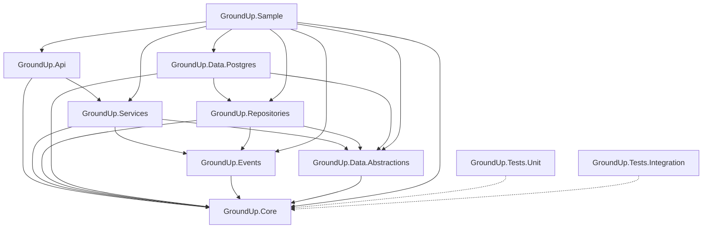
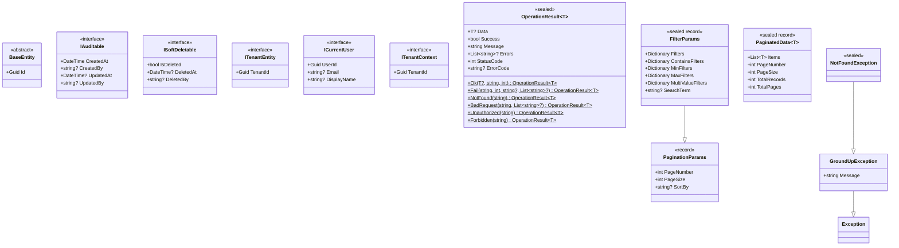

# Design Document: Phase 1 — Solution Structure & Core Types

## Overview

Phase 1 establishes the structural foundation of the GroundUp framework monorepo. It creates the .NET solution file, ten initial projects with correct inter-project references and NuGet dependencies, an ARCHITECTURE.md documentation file, and the foundational types in GroundUp.Core that all downstream phases depend on.

This phase produces no business logic — only the skeleton and shared type definitions. The output must compile cleanly with `dotnet build groundup.sln` and provide the exact types that Phase 2 (Event Bus) and Phase 3 (Base Repository & Data Layer) will consume.

### Key Design Decisions

1. **Framework, not application.** All projects except GroundUp.Sample are class libraries distributed as NuGet packages. GroundUp.Api is a class library (not a web project) so base controllers and middleware are reusable without forcing a web host.
2. **SDK-first naming.** Only the API layer uses `.Api` in its name (`GroundUp.Api`). All other projects use `GroundUp.*` because they work in SDK-only scenarios without an API layer.
3. **YAGNI.** Only types needed by Phase 2 and Phase 3 are built. No service base classes, no repository implementations, no middleware — just the structural skeleton and Core types.
4. **OperationResult is the ONE result type.** No ApiResponse, no other wrappers. Business logic never throws exceptions — it returns `OperationResult.Fail(...)`.
5. **Opt-in behaviors via interfaces.** IAuditable, ISoftDeletable, and ITenantEntity are opt-in. Entities that don't implement them get none of that behavior.

## Architecture

### Dependency Graph



### Layering Rules

| Layer | Project | Depends On |
|-------|---------|------------|
| API | GroundUp.Api | Services, Core |
| Services | GroundUp.Services | Data.Abstractions, Events, Core |
| Repositories | GroundUp.Repositories | Data.Abstractions, Events, Core |
| Data (Postgres) | GroundUp.Data.Postgres | Repositories, Data.Abstractions, Core |
| Data Abstractions | GroundUp.Data.Abstractions | Core |
| Events | GroundUp.Events | Core |
| Core | GroundUp.Core | (none) |

**Hard rules enforced by project references:**
- Core has zero project references and zero NuGet dependencies.
- Events depends only on Core with zero NuGet dependencies.
- No upward dependencies — Data.Postgres never references Services or Api.
- Cross-layer communication flows strictly downward through interfaces.

### Solution Folder Organization

```
groundup.sln
├── src/                          (solution folder)
│   ├── GroundUp.Core
│   ├── GroundUp.Events
│   ├── GroundUp.Data.Abstractions
│   ├── GroundUp.Repositories
│   ├── GroundUp.Data.Postgres
│   ├── GroundUp.Services
│   └── GroundUp.Api
├── samples/                      (solution folder)
│   └── GroundUp.Sample
└── tests/                        (solution folder)
    ├── GroundUp.Tests.Unit
    └── GroundUp.Tests.Integration
```

## Components and Interfaces

### Project Specifications

#### GroundUp.Core (`src/GroundUp.Core/GroundUp.Core.csproj`)

Class library targeting `net8.0`. Nullable reference types enabled. XML documentation generation enabled. Zero NuGet dependencies. Zero project references.

Contains all foundational types shared across every layer:

| Type | Kind | Purpose |
|------|------|---------|
| `BaseEntity` | abstract class | Root entity with `Guid Id` |
| `IAuditable` | interface | Opt-in audit fields (CreatedAt, CreatedBy, UpdatedAt, UpdatedBy) |
| `ISoftDeletable` | interface | Opt-in soft delete (IsDeleted, DeletedAt, DeletedBy) |
| `ITenantEntity` | interface | Declares tenant ownership (`Guid TenantId`) |
| `ICurrentUser` | interface | Authenticated user identity abstraction |
| `ITenantContext` | interface | Current tenant identity abstraction |
| `OperationResult<T>` | sealed class | The ONE result type with static factory methods |
| `GroundUpException` | class | Base exception for infrastructure/cross-cutting errors |
| `NotFoundException` | sealed class | Entity not found (maps to 404) |
| `PaginationParams` | record | Page number, page size (with max guard), sort direction |
| `PaginatedData<T>` | record | Paged result wrapper with computed TotalPages |
| `FilterParams` | record | Extends PaginationParams with filtering dictionaries |
| `ErrorCodes` | static sealed class | String constants for standardized error codes |

#### GroundUp.Events (`src/GroundUp.Events/GroundUp.Events.csproj`)

Class library targeting `net8.0`. Nullable reference types enabled. References: GroundUp.Core only. Zero NuGet dependencies. Placeholder project for Phase 2 — contains only a marker file or empty namespace in Phase 1.

#### GroundUp.Data.Abstractions (`src/GroundUp.Data.Abstractions/GroundUp.Data.Abstractions.csproj`)

Class library targeting `net8.0`. Nullable reference types enabled. References: GroundUp.Core only. Placeholder for Phase 3 repository interfaces.

#### GroundUp.Repositories (`src/GroundUp.Repositories/GroundUp.Repositories.csproj`)

Class library targeting `net8.0`. Nullable reference types enabled. References: GroundUp.Core, GroundUp.Data.Abstractions, GroundUp.Events. Placeholder for Phase 3 base repository implementations.

#### GroundUp.Data.Postgres (`src/GroundUp.Data.Postgres/GroundUp.Data.Postgres.csproj`)

Class library targeting `net8.0`. Nullable reference types enabled. References: GroundUp.Core, GroundUp.Data.Abstractions, GroundUp.Repositories. NuGet dependencies: `Microsoft.EntityFrameworkCore` (8.x), `Npgsql.EntityFrameworkCore.PostgreSQL` (8.x). Placeholder for Phase 3 EF Core setup.

#### GroundUp.Services (`src/GroundUp.Services/GroundUp.Services.csproj`)

Class library targeting `net8.0`. Nullable reference types enabled. References: GroundUp.Core, GroundUp.Data.Abstractions, GroundUp.Events. NuGet dependency: `FluentValidation` (11.x). Placeholder for Phase 3 base service.

#### GroundUp.Api (`src/GroundUp.Api/GroundUp.Api.csproj`)

Class library (NOT a web project) targeting `net8.0`. Nullable reference types enabled. References: GroundUp.Core, GroundUp.Services. Placeholder for Phase 3 base controllers and middleware.

#### GroundUp.Sample (`samples/GroundUp.Sample/GroundUp.Sample.csproj`)

ASP.NET Core web application targeting `net8.0`. Nullable reference types enabled. References all seven src projects. Contains a minimal `Program.cs` that compiles and runs (empty pipeline for now).

#### GroundUp.Tests.Unit (`tests/GroundUp.Tests.Unit/GroundUp.Tests.Unit.csproj`)

xUnit test project targeting `net8.0`. Nullable reference types enabled. NuGet dependencies: `xunit`, `xunit.runner.visualstudio`, `Microsoft.NET.Test.Sdk`, `NSubstitute`, `FluentAssertions`. References GroundUp.Core (and other src projects as needed).

#### GroundUp.Tests.Integration (`tests/GroundUp.Tests.Integration/GroundUp.Tests.Integration.csproj`)

xUnit test project targeting `net8.0`. Nullable reference types enabled. NuGet dependencies: `xunit`, `xunit.runner.visualstudio`, `Microsoft.NET.Test.Sdk`, `Testcontainers.PostgreSql`, `Microsoft.AspNetCore.Mvc.Testing`. References GroundUp.Core (and other src projects as needed).

### Core Type Interfaces

#### BaseEntity

```csharp
namespace GroundUp.Core.Entities;

/// <summary>
/// Abstract base entity providing a UUID v7 identity for all framework entities.
/// </summary>
public abstract class BaseEntity
{
    /// <summary>
    /// Unique identifier. Generated as UUID v7 (sequential, sortable) by default.
    /// </summary>
    public Guid Id { get; set; }
}
```

#### IAuditable

```csharp
namespace GroundUp.Core.Entities;

/// <summary>
/// Opt-in interface for automatic audit field population.
/// Entities implementing this interface will have their audit fields
/// set automatically by the EF Core SaveChanges interceptor.
/// </summary>
public interface IAuditable
{
    DateTime CreatedAt { get; set; }
    string? CreatedBy { get; set; }
    DateTime? UpdatedAt { get; set; }
    string? UpdatedBy { get; set; }
}
```

#### ISoftDeletable

```csharp
namespace GroundUp.Core.Entities;

/// <summary>
/// Opt-in interface for soft delete behavior.
/// Entities implementing this interface will have delete operations
/// converted to soft deletes by the EF Core interceptor, and a global
/// query filter will exclude soft-deleted records from queries.
/// </summary>
public interface ISoftDeletable
{
    bool IsDeleted { get; set; }
    DateTime? DeletedAt { get; set; }
    string? DeletedBy { get; set; }
}
```

#### ITenantEntity

```csharp
namespace GroundUp.Core.Entities;

/// <summary>
/// Declares tenant ownership for automatic tenant filtering
/// in BaseTenantRepository.
/// </summary>
public interface ITenantEntity
{
    Guid TenantId { get; set; }
}
```

#### ICurrentUser

```csharp
namespace GroundUp.Core.Abstractions;

/// <summary>
/// Provides the authenticated user's identity to all layers
/// without depending on the authentication module.
/// </summary>
public interface ICurrentUser
{
    Guid UserId { get; }
    string? Email { get; }
    string? DisplayName { get; }
}
```

#### ITenantContext

```csharp
namespace GroundUp.Core.Abstractions;

/// <summary>
/// Provides the current tenant identity for automatic tenant filtering
/// in BaseTenantRepository.
/// </summary>
public interface ITenantContext
{
    Guid TenantId { get; }
}
```

#### OperationResult&lt;T&gt;

```csharp
namespace GroundUp.Core.Results;

/// <summary>
/// The single standardized result type for all layers.
/// Use static factory methods to create instances.
/// Business logic returns OperationResult.Fail instead of throwing exceptions.
/// </summary>
public sealed class OperationResult<T>
{
    public T? Data { get; init; }
    public bool Success { get; init; } = true;
    public string Message { get; init; } = "Success";
    public List<string>? Errors { get; init; }
    public int StatusCode { get; init; } = 200;
    public string? ErrorCode { get; init; }

    public static OperationResult<T> Ok(T? data, string message = "Success", int statusCode = 200);
    public static OperationResult<T> Fail(string message, int statusCode, string? errorCode = null, List<string>? errors = null);
    public static OperationResult<T> NotFound(string message = "Item not found");
    public static OperationResult<T> BadRequest(string message, List<string>? errors = null);
    public static OperationResult<T> Unauthorized(string message = "Unauthorized");
    public static OperationResult<T> Forbidden(string message = "Forbidden");
}
```

#### Exception Hierarchy

```csharp
namespace GroundUp.Core.Exceptions;

/// <summary>
/// Base exception for GroundUp infrastructure and cross-cutting errors.
/// Maps to HTTP 500 by default in ExceptionHandlingMiddleware.
/// </summary>
public class GroundUpException : Exception
{
    public GroundUpException(string message) : base(message) { }
    public GroundUpException(string message, Exception innerException) : base(message, innerException) { }
}

/// <summary>
/// Thrown when an entity is not found by ID.
/// Maps to HTTP 404 in ExceptionHandlingMiddleware.
/// </summary>
public sealed class NotFoundException : GroundUpException
{
    public NotFoundException(string message) : base(message) { }
}
```

#### PaginationParams

```csharp
namespace GroundUp.Core.Models;

/// <summary>
/// Carries pagination and sorting parameters for repository queries.
/// PageSize is capped at MaxPageSize (default 100). PageNumber defaults to 1.
/// </summary>
public record PaginationParams
{
    public const int DefaultMaxPageSize = 100;

    private int _pageNumber = 1;
    private int _pageSize = 10;

    public int PageNumber
    {
        get => _pageNumber;
        init => _pageNumber = value < 1 ? 1 : value;
    }

    public int PageSize
    {
        get => _pageSize;
        init => _pageSize = value > DefaultMaxPageSize ? DefaultMaxPageSize : (value < 1 ? 1 : value);
    }

    public string? SortBy { get; init; }
}
```

#### PaginatedData&lt;T&gt;

```csharp
namespace GroundUp.Core.Models;

/// <summary>
/// Wraps a page of results with pagination metadata.
/// TotalPages is computed from TotalRecords and PageSize.
/// </summary>
public sealed record PaginatedData<T>
{
    public required List<T> Items { get; init; }
    public required int PageNumber { get; init; }
    public required int PageSize { get; init; }
    public required int TotalRecords { get; init; }
    public int TotalPages => PageSize > 0 ? (int)Math.Ceiling((double)TotalRecords / PageSize) : 0;
}
```

#### FilterParams

```csharp
namespace GroundUp.Core.Models;

/// <summary>
/// Extends PaginationParams with filtering capabilities:
/// exact match, contains, min/max range, multi-value (IN clause), and free-text search.
/// </summary>
public sealed record FilterParams : PaginationParams
{
    public Dictionary<string, string> Filters { get; init; } = new();
    public Dictionary<string, string> ContainsFilters { get; init; } = new();
    public Dictionary<string, string> MinFilters { get; init; } = new();
    public Dictionary<string, string> MaxFilters { get; init; } = new();
    public Dictionary<string, List<string>> MultiValueFilters { get; init; } = new();
    public string? SearchTerm { get; init; }
}
```

#### ErrorCodes

```csharp
namespace GroundUp.Core;

/// <summary>
/// Standardized error code constants used across all modules.
/// </summary>
public static class ErrorCodes
{
    public const string NotFound = "NOT_FOUND";
    public const string ValidationFailed = "VALIDATION_FAILED";
    public const string Unauthorized = "UNAUTHORIZED";
    public const string Forbidden = "FORBIDDEN";
    public const string Conflict = "CONFLICT";
    public const string InternalError = "INTERNAL_ERROR";
}
```

## Data Models

Phase 1 does not introduce any database entities or persistence. All types live in GroundUp.Core as in-memory C# types. The data model for this phase is the type hierarchy itself:



### Namespace Organization

```
GroundUp.Core/
├── Abstractions/
│   ├── ICurrentUser.cs
│   └── ITenantContext.cs
├── Entities/
│   ├── BaseEntity.cs
│   ├── IAuditable.cs
│   ├── ISoftDeletable.cs
│   └── ITenantEntity.cs
├── Exceptions/
│   ├── GroundUpException.cs
│   └── NotFoundException.cs
├── Models/
│   ├── FilterParams.cs
│   ├── PaginatedData.cs
│   └── PaginationParams.cs
├── Results/
│   └── OperationResult.cs
└── ErrorCodes.cs
```

## Correctness Properties

*A property is a characteristic or behavior that should hold true across all valid executions of a system — essentially, a formal statement about what the system should do. Properties serve as the bridge between human-readable specifications and machine-verifiable correctness guarantees.*

Most of Phase 1's acceptance criteria are structural/smoke checks (project references, csproj settings, file existence). Six properties emerge from the types that have meaningful input-dependent behavior:

### Property 1: Ok factory preserves data and marks success

*For any* value of type T, calling `OperationResult<T>.Ok(data, message, statusCode)` SHALL produce a result where `Success` is `true`, `Data` equals the input data, `Message` equals the input message, and `StatusCode` equals the input status code.

**Validates: Requirements 18.2**

### Property 2: Fail factory preserves error details and marks failure

*For any* message string, status code integer, optional error code string, and optional error list, calling `OperationResult<T>.Fail(message, statusCode, errorCode, errors)` SHALL produce a result where `Success` is `false`, `Message` equals the input message, `StatusCode` equals the input status code, `ErrorCode` equals the input error code, and `Errors` equals the input error list.

**Validates: Requirements 18.3**

### Property 3: Failure shorthand factories produce correct status codes

*For any* message string, calling `NotFound(message)` SHALL produce `StatusCode` 404, calling `BadRequest(message)` SHALL produce `StatusCode` 400, calling `Unauthorized(message)` SHALL produce `StatusCode` 401, and calling `Forbidden(message)` SHALL produce `StatusCode` 403. All SHALL have `Success` equal to `false`.

**Validates: Requirements 18.4, 18.5, 18.6, 18.7**

### Property 4: Exception constructors preserve message

*For any* non-null string message, constructing a `GroundUpException(message)` or `NotFoundException(message)` SHALL store the message such that the `Message` property returns the same string.

**Validates: Requirements 19.3**

### Property 5: PaginationParams clamps values to valid ranges

*For any* integer values for PageNumber and PageSize, the resulting `PaginationParams` SHALL have `PageNumber >= 1` and `1 <= PageSize <= DefaultMaxPageSize` (100).

**Validates: Requirements 20.2, 20.3**

### Property 6: PaginatedData computes TotalPages correctly

*For any* positive `PageSize` and non-negative `TotalRecords`, `PaginatedData<T>.TotalPages` SHALL equal `⌈TotalRecords / PageSize⌉` (ceiling division). When `PageSize` is 0, `TotalPages` SHALL be 0.

**Validates: Requirements 20.5**

## Error Handling

Phase 1 establishes the error handling primitives but does not implement any error handling middleware or pipelines (those come in Phase 3).

### Error Handling Types Created

| Type | Purpose | HTTP Status Code (future mapping) |
|------|---------|-----------------------------------|
| `OperationResult<T>.Fail(...)` | Business logic errors — the primary error path | Determined by `StatusCode` property |
| `GroundUpException` | Base infrastructure exception | 500 |
| `NotFoundException` | Entity not found by ID | 404 |

### Design Rationale

- **OperationResult for business logic.** Services return `OperationResult.Fail(...)` instead of throwing exceptions. This makes error paths explicit, composable, and testable without try/catch.
- **Typed exceptions for infrastructure.** Cross-cutting concerns (middleware, interceptors) use the exception hierarchy. Each exception type maps to a specific HTTP status code in the future ExceptionHandlingMiddleware (Phase 3).
- **Minimal hierarchy in Phase 1.** Only `GroundUpException` and `NotFoundException` are created now. Additional exception types (`ForbiddenAccessException`, `ConflictException`, `ValidationException`, `BusinessRuleException`) will be added when Phase 3 builds the exception handling middleware that maps them.

### Validation Approach

- Input validation will use FluentValidation (Phase 3), with validators running in the service layer before repository calls.
- Phase 1 only includes the `FluentValidation` NuGet reference in GroundUp.Services — no validators are implemented yet.

## Testing Strategy

### Dual Testing Approach

- **Unit tests (xUnit + NSubstitute):** Verify specific behavior of Core types — factory methods, clamping logic, computed properties, exception construction.
- **Property-based tests (FsCheck via FsCheck.Xunit):** Verify universal properties across randomized inputs for OperationResult, PaginationParams, PaginatedData, and exception types.

Both are complementary: unit tests catch concrete edge cases, property tests verify general correctness across the input space.

### Property-Based Testing Configuration

- **Library:** FsCheck.Xunit (integrates with xUnit test runner)
- **Minimum iterations:** 100 per property test
- **Tag format:** `Feature: phase1-solution-structure, Property {number}: {property_text}`
- Each correctness property maps to exactly one `[Property]` test method

### Test Categories

| Category | What's Tested | Test Type |
|----------|---------------|-----------|
| OperationResult factory methods | Ok/Fail/NotFound/BadRequest/Unauthorized/Forbidden produce correct results | Property-based (Properties 1–3) |
| Exception construction | Message preservation across exception hierarchy | Property-based (Property 4) |
| PaginationParams clamping | PageNumber >= 1, PageSize within [1, MaxPageSize] | Property-based (Property 5) |
| PaginatedData computation | TotalPages = ⌈TotalRecords / PageSize⌉ | Property-based (Property 6) |
| Project structure | csproj references, target framework, NuGet deps | Smoke tests (manual or CI build verification) |
| Documentation | XML doc comments, ARCHITECTURE.md content | Manual review |

### What Is NOT Tested

- Project structure and csproj configuration are verified by `dotnet build groundup.sln` succeeding — no automated tests needed beyond the build.
- ARCHITECTURE.md content quality is verified by human review.
- Placeholder projects (Events, Data.Abstractions, Repositories, Data.Postgres, Services, Api) have no logic to test in Phase 1.

### Test Project Setup

Unit and property-based tests live in `GroundUp.Tests.Unit`. The test project references `GroundUp.Core` and includes:
- `xunit` + `xunit.runner.visualstudio` + `Microsoft.NET.Test.Sdk` for test execution
- `NSubstitute` for mocking (not needed in Phase 1 but scaffolded)
- `FluentAssertions` for readable assertions
- `FsCheck.Xunit` for property-based testing

Integration tests (`GroundUp.Tests.Integration`) are scaffolded but empty in Phase 1 — no database or HTTP pipeline exists yet.
