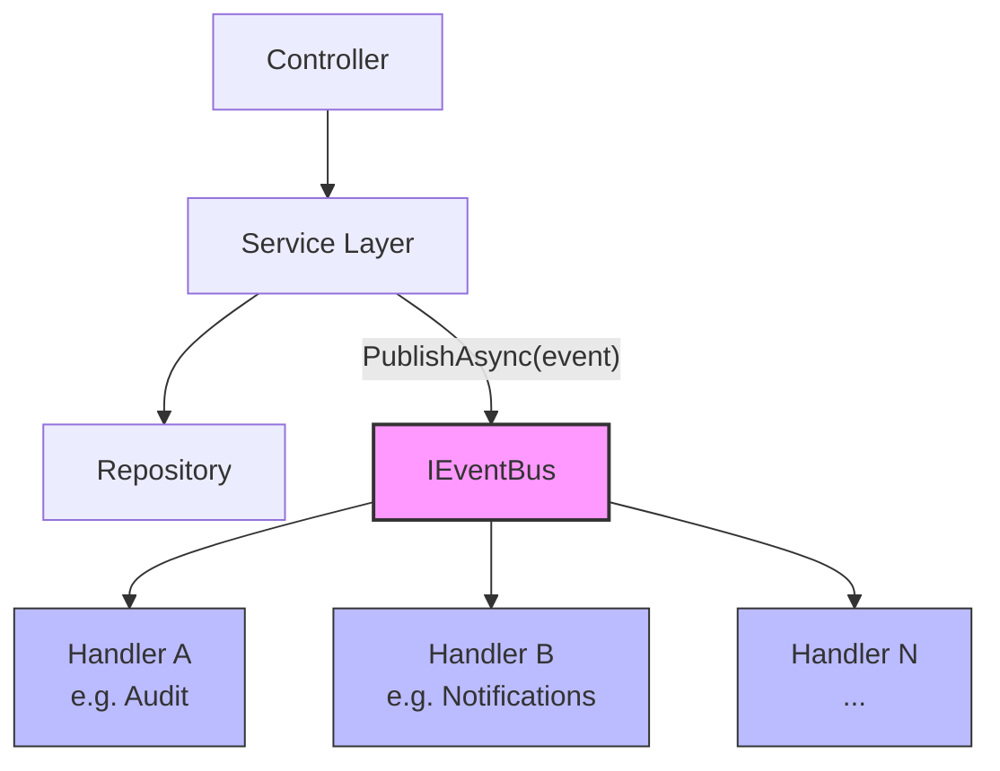
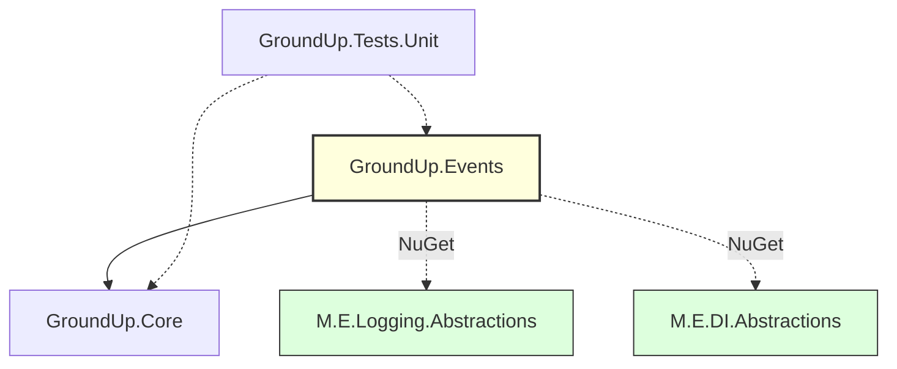
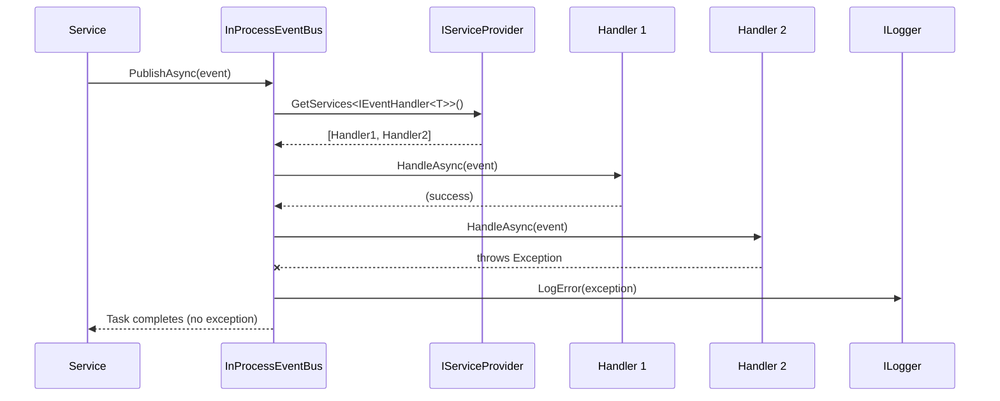
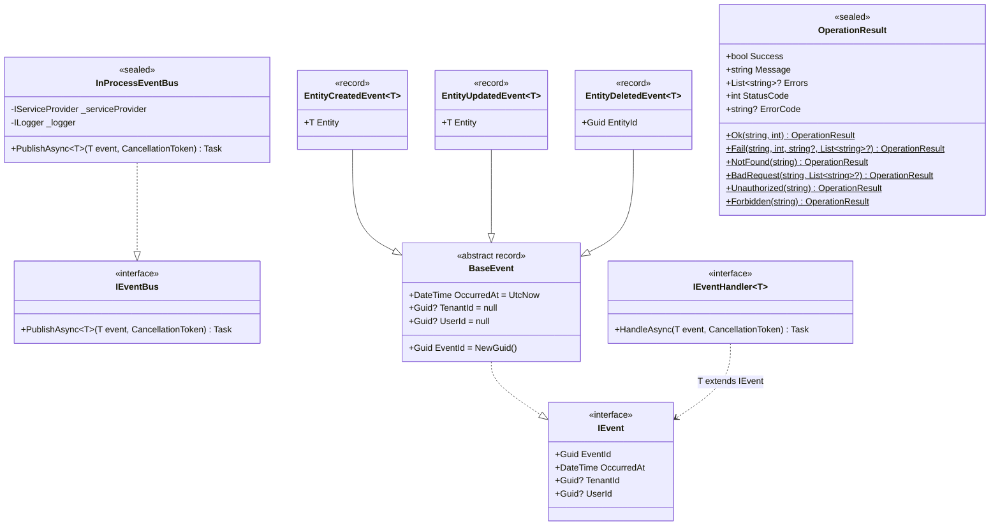

# Design Document: Phase 2 — Event Bus & Non-Generic OperationResult

## Overview

Phase 2 adds the event bus abstraction and in-process implementation to the GroundUp.Events project, plus a non-generic `OperationResult` to GroundUp.Core for void operations. The event bus provides a side-channel for loose coupling between modules — services publish domain events after completing their work, and other modules (Audit, Notifications, etc.) subscribe without the publisher needing to know about them.

The event bus sits alongside the traditional call chain (Controller → Service → Repository) as a parallel notification mechanism. It is not a replacement for the call chain — it handles after-the-fact notifications where the publisher doesn't need to know or care about subscribers.

### Key Design Decisions

1. **In-process first.** `InProcessEventBus` resolves handlers from DI and calls them sequentially in the same process. No external infrastructure (RabbitMQ, Kafka) is needed. Future distributed implementations (`GroundUp.Events.RabbitMQ`, etc.) will implement the same `IEventBus` interface.
2. **Fire-and-forget semantics.** Handler failures are caught, logged, and swallowed. The publisher's operation is never rolled back because a handler failed. This is intentional — the event bus is for side effects (audit, notifications), not for operations that must succeed atomically with the publisher.
3. **Records for events.** All event types are C# records, giving immutability and value equality for free. `BaseEvent` is an abstract record so concrete events inherit `with` expression support.
4. **Non-generic OperationResult for void operations.** Methods like `DeleteAsync` that don't return data need a result type that carries success/failure status without a `Data` property. The non-generic `OperationResult` mirrors the factory methods of `OperationResult<T>` without the generic parameter.
5. **Minimal NuGet dependencies.** GroundUp.Events adds only `Microsoft.Extensions.Logging.Abstractions` and `Microsoft.Extensions.DependencyInjection.Abstractions` — the lightest possible footprint for DI resolution and structured logging.
6. **Future discoverability.** All event types live under the `GroundUp.Events` namespace. A future event registry/catalog can scan for `IEvent` implementations via reflection. This is NOT built in Phase 2 but the namespace convention enables it.

## Architecture

### Where the Event Bus Fits



The service layer publishes events after a successful operation. The event bus resolves all registered `IEventHandler<T>` implementations from the DI container and invokes them sequentially. Handler failures are isolated — they never propagate back to the service or caller.

### Dependency Graph (Phase 2 additions highlighted)



### Handler Resolution Flow



## Components and Interfaces

### GroundUp.Events Project Structure

```
src/GroundUp.Events/
├── IEvent.cs
├── IEventBus.cs
├── IEventHandler.cs
├── BaseEvent.cs
├── EntityCreatedEvent.cs
├── EntityUpdatedEvent.cs
├── EntityDeletedEvent.cs
├── InProcessEventBus.cs
└── EventsServiceCollectionExtensions.cs
```

### Interface Definitions

#### IEvent

```csharp
namespace GroundUp.Events;

/// <summary>
/// Base interface for all domain events in the GroundUp framework.
/// Carries event identity and multi-tenant context metadata.
/// </summary>
public interface IEvent
{
    /// <summary>
    /// Unique identifier for this event instance.
    /// </summary>
    Guid EventId { get; }

    /// <summary>
    /// UTC timestamp when the event occurred.
    /// </summary>
    DateTime OccurredAt { get; }

    /// <summary>
    /// The tenant context in which the event occurred. Null if not in a tenant context.
    /// </summary>
    Guid? TenantId { get; }

    /// <summary>
    /// The user who triggered the event. Null if triggered by a system process.
    /// </summary>
    Guid? UserId { get; }
}
```

#### IEventBus

```csharp
namespace GroundUp.Events;

/// <summary>
/// Defines the contract for publishing domain events to registered handlers.
/// Implementations may dispatch events in-process, via message broker, or both.
/// </summary>
public interface IEventBus
{
    /// <summary>
    /// Publishes an event to all registered handlers for the event type.
    /// </summary>
    /// <typeparam name="T">The event type.</typeparam>
    /// <param name="event">The event instance to publish.</param>
    /// <param name="cancellationToken">Cancellation token.</param>
    /// <returns>A task that completes when all handlers have been invoked.</returns>
    Task PublishAsync<T>(T @event, CancellationToken cancellationToken = default) where T : IEvent;
}
```

#### IEventHandler&lt;T&gt;

```csharp
namespace GroundUp.Events;

/// <summary>
/// Defines a handler for a specific event type. Implement this interface
/// to subscribe to events published via <see cref="IEventBus"/>.
/// </summary>
/// <typeparam name="T">The event type to handle.</typeparam>
public interface IEventHandler<in T> where T : IEvent
{
    /// <summary>
    /// Handles the specified event.
    /// </summary>
    /// <param name="event">The event to handle.</param>
    /// <param name="cancellationToken">Cancellation token.</param>
    /// <returns>A task representing the asynchronous operation.</returns>
    Task HandleAsync(T @event, CancellationToken cancellationToken = default);
}
```

### Concrete Types

#### BaseEvent

```csharp
namespace GroundUp.Events;

/// <summary>
/// Abstract base record for all domain events. Provides sensible defaults
/// for <see cref="EventId"/> and <see cref="OccurredAt"/>.
/// Concrete events inherit from this record and add domain-specific properties.
/// </summary>
public abstract record BaseEvent : IEvent
{
    /// <inheritdoc />
    public Guid EventId { get; init; } = Guid.NewGuid();

    /// <inheritdoc />
    public DateTime OccurredAt { get; init; } = DateTime.UtcNow;

    /// <inheritdoc />
    public Guid? TenantId { get; init; }

    /// <inheritdoc />
    public Guid? UserId { get; init; }
}
```

#### Entity Lifecycle Events

```csharp
namespace GroundUp.Events;

/// <summary>
/// Published when an entity is created. Carries the full created entity data.
/// </summary>
/// <typeparam name="T">The type of the created entity or DTO.</typeparam>
public record EntityCreatedEvent<T> : BaseEvent
{
    /// <summary>
    /// The created entity data.
    /// </summary>
    public required T Entity { get; init; }
}

/// <summary>
/// Published when an entity is updated. Carries the updated entity data.
/// </summary>
/// <typeparam name="T">The type of the updated entity or DTO.</typeparam>
public record EntityUpdatedEvent<T> : BaseEvent
{
    /// <summary>
    /// The updated entity data.
    /// </summary>
    public required T Entity { get; init; }
}

/// <summary>
/// Published when an entity is deleted. Carries the deleted entity's identifier.
/// </summary>
/// <typeparam name="T">The type parameter for consistency with other lifecycle events.</typeparam>
public record EntityDeletedEvent<T> : BaseEvent
{
    /// <summary>
    /// The unique identifier of the deleted entity.
    /// </summary>
    public required Guid EntityId { get; init; }
}
```

#### InProcessEventBus

```csharp
namespace GroundUp.Events;

/// <summary>
/// In-process event bus that resolves handlers from the DI container
/// and invokes them sequentially. Handler exceptions are caught, logged,
/// and swallowed — they never propagate to the publisher.
/// </summary>
public sealed class InProcessEventBus : IEventBus
{
    private readonly IServiceProvider _serviceProvider;
    private readonly ILogger<InProcessEventBus> _logger;

    /// <summary>
    /// Initializes a new instance of <see cref="InProcessEventBus"/>.
    /// </summary>
    /// <param name="serviceProvider">The DI container for resolving handlers.</param>
    /// <param name="logger">Logger for recording handler failures.</param>
    public InProcessEventBus(IServiceProvider serviceProvider, ILogger<InProcessEventBus> logger)
    {
        _serviceProvider = serviceProvider;
        _logger = logger;
    }

    /// <inheritdoc />
    public async Task PublishAsync<T>(T @event, CancellationToken cancellationToken = default) where T : IEvent
    {
        var handlers = _serviceProvider.GetServices<IEventHandler<T>>();

        foreach (var handler in handlers)
        {
            try
            {
                await handler.HandleAsync(@event, cancellationToken);
            }
            catch (Exception ex)
            {
                _logger.LogError(ex,
                    "Event handler {HandlerType} failed for event {EventType} (EventId: {EventId})",
                    handler.GetType().Name,
                    typeof(T).Name,
                    @event.EventId);
            }
        }
    }
}
```

#### EventsServiceCollectionExtensions

```csharp
namespace GroundUp.Events;

/// <summary>
/// Extension methods for registering GroundUp event bus services
/// with the dependency injection container.
/// </summary>
public static class EventsServiceCollectionExtensions
{
    /// <summary>
    /// Registers the in-process event bus as a singleton implementation of <see cref="IEventBus"/>.
    /// </summary>
    /// <param name="services">The service collection.</param>
    /// <returns>The service collection for method chaining.</returns>
    public static IServiceCollection AddGroundUpEvents(this IServiceCollection services)
    {
        services.AddSingleton<IEventBus, InProcessEventBus>();
        return services;
    }
}
```

### GroundUp.Core Addition: Non-Generic OperationResult

```csharp
namespace GroundUp.Core.Results;

/// <summary>
/// Non-generic result type for void operations (e.g., DeleteAsync) that carry
/// success/failure status without a data payload. Mirrors the factory methods
/// of <see cref="OperationResult{T}"/> without the generic parameter.
/// </summary>
public sealed class OperationResult
{
    /// <summary>
    /// Whether the operation succeeded.
    /// </summary>
    public bool Success { get; init; } = true;

    /// <summary>
    /// A human-readable message describing the result.
    /// </summary>
    public string Message { get; init; } = "Success";

    /// <summary>
    /// A list of error details when the operation fails. Null on success.
    /// </summary>
    public List<string>? Errors { get; init; }

    /// <summary>
    /// The HTTP status code associated with this result.
    /// </summary>
    public int StatusCode { get; init; } = 200;

    /// <summary>
    /// A machine-readable error code from <see cref="ErrorCodes"/>. Null on success.
    /// </summary>
    public string? ErrorCode { get; init; }

    /// <summary>
    /// Creates a successful result with an optional message.
    /// </summary>
    public static OperationResult Ok(string message = "Success", int statusCode = 200) =>
        new() { Success = true, Message = message, StatusCode = statusCode };

    /// <summary>
    /// Creates a failure result with the specified details.
    /// </summary>
    public static OperationResult Fail(string message, int statusCode, string? errorCode = null, List<string>? errors = null) =>
        new() { Success = false, Message = message, StatusCode = statusCode, ErrorCode = errorCode, Errors = errors };

    /// <summary>
    /// Creates a 404 Not Found failure result.
    /// </summary>
    public static OperationResult NotFound(string message = "Item not found") =>
        Fail(message, 404, ErrorCodes.NotFound);

    /// <summary>
    /// Creates a 400 Bad Request failure result.
    /// </summary>
    public static OperationResult BadRequest(string message, List<string>? errors = null) =>
        Fail(message, 400, ErrorCodes.ValidationFailed, errors);

    /// <summary>
    /// Creates a 401 Unauthorized failure result.
    /// </summary>
    public static OperationResult Unauthorized(string message = "Unauthorized") =>
        Fail(message, 401, ErrorCodes.Unauthorized);

    /// <summary>
    /// Creates a 403 Forbidden failure result.
    /// </summary>
    public static OperationResult Forbidden(string message = "Forbidden") =>
        Fail(message, 403, ErrorCodes.Forbidden);
}
```

### GroundUp.Events csproj Updates

```xml
<Project Sdk="Microsoft.NET.Sdk">
  <PropertyGroup>
    <TargetFramework>net8.0</TargetFramework>
    <ImplicitUsings>enable</ImplicitUsings>
    <Nullable>enable</Nullable>
    <GenerateDocumentationFile>true</GenerateDocumentationFile>
  </PropertyGroup>

  <ItemGroup>
    <PackageReference Include="Microsoft.Extensions.DependencyInjection.Abstractions" Version="8.*" />
    <PackageReference Include="Microsoft.Extensions.Logging.Abstractions" Version="8.*" />
  </ItemGroup>

  <ItemGroup>
    <ProjectReference Include="..\GroundUp.Core\GroundUp.Core.csproj" />
  </ItemGroup>
</Project>
```

## Data Models

Phase 2 does not introduce any database entities or persistence. All types are in-memory C# types. The data model is the event type hierarchy:



### Namespace Organization

```
GroundUp.Events/
├── IEvent.cs                              # GroundUp.Events
├── IEventBus.cs                           # GroundUp.Events
├── IEventHandler.cs                       # GroundUp.Events
├── BaseEvent.cs                           # GroundUp.Events
├── EntityCreatedEvent.cs                  # GroundUp.Events
├── EntityUpdatedEvent.cs                  # GroundUp.Events
├── EntityDeletedEvent.cs                  # GroundUp.Events
├── InProcessEventBus.cs                   # GroundUp.Events
└── EventsServiceCollectionExtensions.cs   # GroundUp.Events

GroundUp.Core/
└── Results/
    ├── OperationResult.cs                 # GroundUp.Core.Results (existing generic)
    └── OperationResult.NonGeneric.cs      # GroundUp.Core.Results (new non-generic)
```

All event types live in the flat `GroundUp.Events` namespace. This keeps `using` statements simple and enables future registry scanning — a registry can find all `IEvent` implementations by scanning the `GroundUp.Events` assembly.


## Correctness Properties

*A property is a characteristic or behavior that should hold true across all valid executions of a system — essentially, a formal statement about what the system should do. Properties serve as the bridge between human-readable specifications and machine-verifiable correctness guarantees.*

Most of Phase 2's acceptance criteria are structural/smoke checks (interface existence, csproj configuration, XML docs, namespace conventions). These are verified by successful compilation and code review. Six properties emerge from the types and behaviors that have meaningful input-dependent behavior.

### Property 1: BaseEvent EventId uniqueness

*For any* two independently constructed BaseEvent-derived instances, each SHALL have a non-empty EventId (not `Guid.Empty`), and the two EventIds SHALL be distinct.

**Validates: Requirements 4.2**

### Property 2: All registered handlers are invoked

*For any* event and any set of N registered `IEventHandler<T>` implementations (where N >= 0), calling `PublishAsync` SHALL invoke `HandleAsync` on every registered handler exactly once.

**Validates: Requirements 6.2, 6.3**

### Property 3: Handler fault isolation

*For any* event and any set of registered handlers where one or more handlers throw exceptions, `PublishAsync` SHALL: (a) invoke every handler regardless of prior handler failures, (b) log each exception via `ILogger`, and (c) complete the `Task` without propagating any exception to the caller.

**Validates: Requirements 6.4, 6.5**

### Property 4: Non-generic OperationResult Ok factory preserves inputs

*For any* message string and status code integer, calling `OperationResult.Ok(message, statusCode)` SHALL produce a result where `Success` is `true`, `Message` equals the input message, and `StatusCode` equals the input status code.

**Validates: Requirements 9.2**

### Property 5: Non-generic OperationResult Fail factory preserves inputs

*For any* message string, status code integer, optional error code string, and optional error list, calling `OperationResult.Fail(message, statusCode, errorCode, errors)` SHALL produce a result where `Success` is `false`, `Message` equals the input message, `StatusCode` equals the input status code, `ErrorCode` equals the input error code, and `Errors` equals the input error list.

**Validates: Requirements 9.3**

### Property 6: Non-generic OperationResult shorthand factories produce correct status codes

*For any* message string, calling `NotFound(message)` SHALL produce `StatusCode` 404, calling `BadRequest(message)` SHALL produce `StatusCode` 400, calling `Unauthorized(message)` SHALL produce `StatusCode` 401, and calling `Forbidden(message)` SHALL produce `StatusCode` 403. All SHALL have `Success` equal to `false`.

**Validates: Requirements 9.4**

## Error Handling

### Event Bus Error Strategy

The event bus uses a **catch-and-log** strategy for handler failures. This is a deliberate design choice:

| Scenario | Behavior | Rationale |
|----------|----------|-----------|
| Handler throws any exception | Catch, log via `ILogger.LogError`, continue to next handler | Event handlers are side effects (audit, notifications). A notification failure should never roll back the business operation that triggered it. |
| No handlers registered | Complete silently | Publishing to zero subscribers is valid — the publisher doesn't know or care who's listening. |
| CancellationToken cancelled | Propagated to handlers via parameter | Handlers should respect cancellation, but the bus doesn't enforce it. |

### Structured Log Format

Handler failures are logged with structured properties for observability:

```
LogError(exception,
    "Event handler {HandlerType} failed for event {EventType} (EventId: {EventId})",
    handler.GetType().Name,
    typeof(T).Name,
    @event.EventId);
```

This enables filtering in log aggregation tools by handler type, event type, or specific event instance.

### Non-Generic OperationResult Error Handling

The non-generic `OperationResult` follows the same pattern as `OperationResult<T>`:
- Business logic errors return `OperationResult.Fail(...)` — never throw exceptions.
- Shorthand factories (`NotFound`, `BadRequest`, `Unauthorized`, `Forbidden`) map to standard HTTP status codes.
- Error codes use constants from `ErrorCodes` for machine-readable categorization.

### What Is NOT Handled in Phase 2

- **Retry logic.** Handlers that fail are not retried. Retry policies belong in the handler implementation or a future background job system.
- **Dead letter / poison events.** Failed events are not persisted for later reprocessing. This is a future concern for distributed event bus implementations.
- **Transaction coordination.** The event bus does not participate in database transactions. Events are published after the service completes its work — they are not part of the unit of work.

## Testing Strategy

### Dual Testing Approach

- **Property-based tests (FsCheck.Xunit):** Verify universal properties across randomized inputs for OperationResult (non-generic) factory methods, BaseEvent defaults, and InProcessEventBus handler invocation/fault isolation.
- **Unit tests (xUnit + NSubstitute):** Verify specific examples — DI registration, sequential handler ordering, zero-handler edge case, EntityCreatedEvent handler receipt.

Both are complementary: property tests verify general correctness across the input space, unit tests catch concrete edge cases and verify integration points.

### Property-Based Testing Configuration

- **Library:** FsCheck.Xunit (already in the test project from Phase 1)
- **Minimum iterations:** 100 per property test
- **Tag format:** `Feature: phase2-event-bus, Property {number}: {property_text}`
- Each correctness property maps to exactly one `[Property]` test method

### Test Plan

| Test | Type | Property | What's Verified |
|------|------|----------|-----------------|
| BaseEvent EventId is non-empty and unique | Property | 1 | Two independently created events have distinct non-empty EventIds |
| All registered handlers invoked | Property | 2 | For N handlers, all N receive the event |
| Handler fault isolation | Property | 3 | Throwing handlers don't prevent other handlers from running; PublishAsync doesn't throw |
| Non-generic OperationResult.Ok preserves inputs | Property | 4 | Ok(message, statusCode) → Success=true, inputs preserved |
| Non-generic OperationResult.Fail preserves inputs | Property | 5 | Fail(message, statusCode, errorCode, errors) → Success=false, inputs preserved |
| Non-generic OperationResult shorthand factories | Property | 6 | NotFound→404, BadRequest→400, Unauthorized→401, Forbidden→403 |
| EntityCreatedEvent handler receives event | Unit | — | Publish EntityCreatedEvent, verify handler gets the exact event |
| Handler exception is logged | Unit | — | Throwing handler → ILogger.LogError called with exception details |
| Multiple handlers all receive event | Unit | — | Register 3 handlers, verify all 3 invoked |
| Zero handlers completes without error | Unit | — | Publish with no handlers registered, no exception |
| AddGroundUpEvents registers singleton IEventBus | Unit | — | Resolve IEventBus from built ServiceProvider, verify InProcessEventBus |
| AddGroundUpEvents returns IServiceCollection | Unit | — | Return value is the same IServiceCollection instance |
| BaseEvent OccurredAt defaults to UtcNow | Unit | — | OccurredAt is within a small window of DateTime.UtcNow |
| BaseEvent TenantId and UserId default to null | Unit | — | Both are null on a freshly created event |

### Test Project Changes

The test project (`GroundUp.Tests.Unit`) needs a project reference to `GroundUp.Events` added to its csproj. Test files will be organized under an `Events/` folder:

```
tests/GroundUp.Tests.Unit/
├── Core/
│   ├── ExceptionPropertyTests.cs              (existing)
│   ├── OperationResultPropertyTests.cs        (existing)
│   ├── OperationResultNonGenericPropertyTests.cs  (new)
│   ├── PaginatedDataPropertyTests.cs          (existing)
│   └── PaginationParamsPropertyTests.cs       (existing)
└── Events/
    ├── BaseEventTests.cs                      (new)
    ├── InProcessEventBusPropertyTests.cs      (new)
    └── InProcessEventBusTests.cs              (new)
```

### What Is NOT Tested

- Interface definitions (IEvent, IEventBus, IEventHandler) — verified by compilation.
- XML documentation comments — verified by code review and `<GenerateDocumentationFile>` compiler warnings.
- File-scoped namespaces, sealed modifiers, one-class-per-file — verified by code review.
- NuGet dependency constraints — verified by csproj inspection.
- Entity lifecycle event record structure (EntityCreatedEvent, EntityUpdatedEvent, EntityDeletedEvent) — verified by compilation. Their behavior is inherited from BaseEvent which IS tested.
