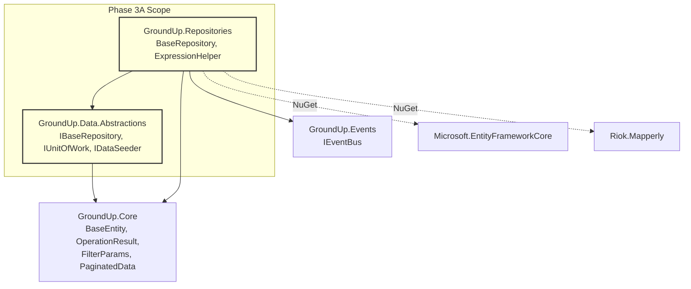
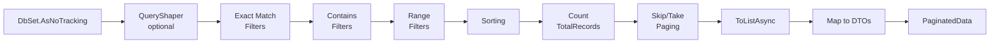
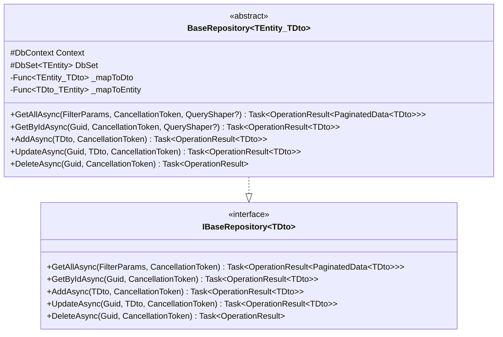

# Design Document: Phase 3A — Data Abstractions & Repository Foundation

## Overview

Phase 3A builds the repository interfaces in GroundUp.Data.Abstractions and the base repository implementation (including ExpressionHelper) in GroundUp.Repositories. This is the first of six sub-phases that together deliver the full data access layer. Phase 3A focuses exclusively on the abstractions and base implementation — EF Core provider setup (DbContext, interceptors, Postgres), services, controllers, and the sample app are deferred to later sub-phases (3B through 3F).

The repository layer is the data access boundary of the framework. All public methods return `OperationResult<T>` or `OperationResult` (non-generic) — business logic errors are never communicated via exceptions. Unexpected exceptions (e.g., network failures, EF Core bugs) propagate naturally to middleware; the repository only catches expected failures like `DbUpdateException` (mapped to `OperationResult.Fail` with Conflict).

### Key Design Decisions

1. **BaseRepository\<TEntity, TDto\> is abstract.** Derived repositories provide Mapperly-generated mapping delegates via constructor parameters. No runtime reflection, no AutoMapper — mapping is compile-time source-generated.

2. **Mapperly mapping delegates, not interfaces.** The constructor accepts `Func<TEntity, TDto>` and `Func<TDto, TEntity>` delegates. Derived repositories pass their Mapperly-generated static methods. This avoids an `IMapper<TEntity, TDto>` interface that would add indirection without value.

3. **QueryShaper pattern.** `Func<IQueryable<TEntity>, IQueryable<TEntity>>?` — an optional delegate that derived repositories pass to `GetAllAsync` and `GetByIdAsync` for query customization (e.g., `.Include()` for navigation properties, extra filters). Applied before filtering in GetAllAsync and before the FirstOrDefaultAsync in GetByIdAsync.

4. **Soft delete via typeof check.** `DeleteAsync` checks `typeof(ISoftDeletable).IsAssignableFrom(typeof(TEntity))` once to decide between soft and hard delete. This is a compile-time-resolvable type check (JIT optimizes it away), not a per-query runtime reflection pattern. Acceptable because it's a one-time branching decision, not a per-entity check.

5. **ExpressionHelper is database-agnostic.** Uses `System.Linq.Expressions` to build `Expression<Func<T, bool>>` predicates from string property names and values. The expressions translate to SQL via EF Core's query provider — no provider-specific code.

6. **No catch-all exception handling.** Repository methods only catch `DbUpdateException` (mapped to 409 Conflict). All other exceptions propagate to the exception handling middleware. This keeps the repository honest — it doesn't swallow unexpected failures.

7. **No events in the repository.** Domain events (`EntityCreatedEvent`, etc.) are published by `BaseService` in Phase 3D. The repository is purely data access — it has no dependency on `IEventBus` at runtime (though the project reference to Events exists for future use by derived repositories).

8. **GetAllAsync pipeline order.** QueryShaper → filters → sorting → count → paging. Count is taken after filtering but before paging so `TotalRecords` reflects the filtered result set.

9. **AddAsync returns 201.** `OperationResult<TDto>.Ok(dto, "Created", 201)` — the service/controller layer can use the status code directly.

10. **UpdateAsync finds-then-updates.** Loads the tracked entity by ID, applies DTO values via the mapping delegate, then saves. If the entity doesn't exist, returns `OperationResult.NotFound`. This ensures EF Core change tracking works correctly.

## Architecture

### Where Phase 3A Fits



### GetAllAsync Pipeline



### BaseRepository Class Hierarchy



## Components and Interfaces

### GroundUp.Data.Abstractions Project Structure

```
src/GroundUp.Data.Abstractions/
├── IBaseRepository.cs
├── IUnitOfWork.cs
└── IDataSeeder.cs
```

### GroundUp.Repositories Project Structure

```
src/GroundUp.Repositories/
├── BaseRepository.cs
└── ExpressionHelper.cs
```

### Interface Definitions

#### IBaseRepository\<TDto\>

```csharp
namespace GroundUp.Data.Abstractions;

/// <summary>
/// Generic repository interface defining the standard CRUD contract.
/// All methods return <see cref="OperationResult{T}"/> or <see cref="OperationResult"/>
/// — business logic errors are communicated via result objects, never exceptions.
/// </summary>
/// <typeparam name="TDto">The DTO type exposed to the service layer.</typeparam>
public interface IBaseRepository<TDto> where TDto : class
{
    /// <summary>
    /// Retrieves a paginated, filtered, and sorted list of DTOs.
    /// </summary>
    Task<OperationResult<PaginatedData<TDto>>> GetAllAsync(
        FilterParams filterParams,
        CancellationToken cancellationToken = default);

    /// <summary>
    /// Retrieves a single DTO by its unique identifier.
    /// Returns <see cref="OperationResult{T}.NotFound"/> if the entity does not exist.
    /// </summary>
    Task<OperationResult<TDto>> GetByIdAsync(
        Guid id,
        CancellationToken cancellationToken = default);

    /// <summary>
    /// Creates a new entity from the provided DTO and persists it.
    /// Returns the created DTO with any database-generated values (e.g., ID).
    /// </summary>
    Task<OperationResult<TDto>> AddAsync(
        TDto dto,
        CancellationToken cancellationToken = default);

    /// <summary>
    /// Updates an existing entity identified by <paramref name="id"/> with values from the DTO.
    /// Returns <see cref="OperationResult{T}.NotFound"/> if the entity does not exist.
    /// </summary>
    Task<OperationResult<TDto>> UpdateAsync(
        Guid id,
        TDto dto,
        CancellationToken cancellationToken = default);

    /// <summary>
    /// Deletes an entity by its unique identifier. Performs a soft delete if the entity
    /// implements <see cref="ISoftDeletable"/>; otherwise performs a hard delete.
    /// Returns <see cref="OperationResult.NotFound"/> if the entity does not exist.
    /// </summary>
    Task<OperationResult> DeleteAsync(
        Guid id,
        CancellationToken cancellationToken = default);
}
```

#### IUnitOfWork

```csharp
namespace GroundUp.Data.Abstractions;

/// <summary>
/// Provides transactional execution of multiple repository operations.
/// The consuming code passes a delegate containing the operations to execute
/// within a single database transaction.
/// </summary>
public interface IUnitOfWork
{
    /// <summary>
    /// Executes the provided delegate within a database transaction.
    /// Commits on success, rolls back on failure.
    /// </summary>
    Task<OperationResult> ExecuteInTransactionAsync(
        Func<CancellationToken, Task> operation,
        CancellationToken cancellationToken = default);
}
```

#### IDataSeeder

```csharp
namespace GroundUp.Data.Abstractions;

/// <summary>
/// Interface for reference data seeding on application startup.
/// Implementations must be idempotent — calling <see cref="SeedAsync"/> multiple times
/// produces the same result as calling it once.
/// </summary>
public interface IDataSeeder
{
    /// <summary>
    /// Execution order for this seeder. Lower values execute first.
    /// Use this to control dependencies between seeders (e.g., roles before users).
    /// </summary>
    int Order { get; }

    /// <summary>
    /// Seeds reference data. Must be idempotent.
    /// </summary>
    Task SeedAsync(CancellationToken cancellationToken = default);
}
```

### Concrete Types

#### ExpressionHelper

```csharp
namespace GroundUp.Repositories;

/// <summary>
/// Builds LINQ expressions dynamically from string property names and values.
/// Used by <see cref="BaseRepository{TEntity, TDto}"/> to translate
/// <see cref="FilterParams"/> dictionaries into queryable predicates.
/// All expressions are database-agnostic — they translate to SQL via EF Core's query provider.
/// </summary>
public static class ExpressionHelper
{
    /// <summary>
    /// Builds an exact-match predicate for the specified property.
    /// String properties use case-insensitive comparison.
    /// Non-string properties (Guid, int, DateTime, bool, enum) parse the value and compare for equality.
    /// Returns an always-true predicate if the property does not exist on <typeparamref name="T"/>.
    /// </summary>
    public static Expression<Func<T, bool>> BuildPredicate<T>(string propertyName, string value);

    /// <summary>
    /// Builds a substring-match (contains) predicate for the specified string property.
    /// Uses case-insensitive comparison.
    /// Returns an always-true predicate if the property does not exist or is not a string.
    /// </summary>
    public static Expression<Func<T, bool>> BuildContainsPredicate<T>(string propertyName, string value);

    /// <summary>
    /// Builds a range predicate (>= min AND/OR <= max) for the specified property.
    /// Supports numeric and comparable types.
    /// Returns an always-true predicate if the property does not exist.
    /// </summary>
    public static Expression<Func<T, bool>> BuildRangePredicate<T>(
        string propertyName, string? minValue, string? maxValue);

    /// <summary>
    /// Builds a date range predicate for the specified DateTime property.
    /// Parses date strings and applies >= min AND/OR <= max comparisons.
    /// Returns an always-true predicate if the property does not exist,
    /// is not a DateTime, or if date strings are unparseable.
    /// </summary>
    public static Expression<Func<T, bool>> BuildDateRangePredicate<T>(
        string propertyName, string? minDate, string? maxDate);

    /// <summary>
    /// Applies dynamic sorting to the queryable based on a sort expression.
    /// Format: "PropertyName" for ascending, "PropertyName desc" for descending.
    /// Returns the queryable unchanged if the property does not exist or the expression is null/empty.
    /// </summary>
    public static IQueryable<T> ApplySorting<T>(IQueryable<T> query, string? sortExpression);
}
```

#### BaseRepository\<TEntity, TDto\>

```csharp
namespace GroundUp.Repositories;

/// <summary>
/// Abstract base repository providing generic CRUD operations with filtering,
/// sorting, paging, and soft delete awareness. Derived repositories provide
/// Mapperly-generated mapping delegates via constructor parameters.
/// </summary>
/// <typeparam name="TEntity">The EF Core entity type. Must extend <see cref="BaseEntity"/>.</typeparam>
/// <typeparam name="TDto">The DTO type exposed to the service layer.</typeparam>
public abstract class BaseRepository<TEntity, TDto> : IBaseRepository<TDto>
    where TEntity : BaseEntity
    where TDto : class
{
    /// <summary>
    /// The EF Core database context.
    /// </summary>
    protected DbContext Context { get; }

    /// <summary>
    /// The DbSet for the entity type. Available to derived repositories
    /// for custom query operations.
    /// </summary>
    protected DbSet<TEntity> DbSet { get; }

    private readonly Func<TEntity, TDto> _mapToDto;
    private readonly Func<TDto, TEntity> _mapToEntity;

    /// <summary>
    /// Initializes a new instance of <see cref="BaseRepository{TEntity, TDto}"/>.
    /// </summary>
    /// <param name="context">The EF Core database context.</param>
    /// <param name="mapToDto">Mapperly-generated entity-to-DTO mapping delegate.</param>
    /// <param name="mapToEntity">Mapperly-generated DTO-to-entity mapping delegate.</param>
    protected BaseRepository(
        DbContext context,
        Func<TEntity, TDto> mapToDto,
        Func<TDto, TEntity> mapToEntity)
    {
        Context = context;
        DbSet = context.Set<TEntity>();
        _mapToDto = mapToDto;
        _mapToEntity = mapToEntity;
    }

    /// <inheritdoc />
    public virtual async Task<OperationResult<PaginatedData<TDto>>> GetAllAsync(
        FilterParams filterParams,
        CancellationToken cancellationToken = default)
    {
        return await GetAllAsync(filterParams, queryShaper: null, cancellationToken);
    }

    /// <summary>
    /// Retrieves a paginated, filtered, and sorted list of DTOs with optional query customization.
    /// </summary>
    /// <param name="filterParams">Filtering, sorting, and pagination parameters.</param>
    /// <param name="queryShaper">Optional delegate to customize the query (e.g., Include navigation properties).</param>
    /// <param name="cancellationToken">Cancellation token.</param>
    protected virtual async Task<OperationResult<PaginatedData<TDto>>> GetAllAsync(
        FilterParams filterParams,
        Func<IQueryable<TEntity>, IQueryable<TEntity>>? queryShaper,
        CancellationToken cancellationToken = default)
    {
        // Pipeline: AsNoTracking → QueryShaper → Filters → Sorting → Count → Paging → Map
        IQueryable<TEntity> query = DbSet.AsNoTracking();

        if (queryShaper is not null)
            query = queryShaper(query);

        // Apply exact-match filters
        foreach (var (key, value) in filterParams.Filters)
            query = query.Where(ExpressionHelper.BuildPredicate<TEntity>(key, value));

        // Apply contains filters
        foreach (var (key, value) in filterParams.ContainsFilters)
            query = query.Where(ExpressionHelper.BuildContainsPredicate<TEntity>(key, value));

        // Apply range filters (combine min and max for same property)
        var rangeProperties = filterParams.MinFilters.Keys
            .Union(filterParams.MaxFilters.Keys);
        foreach (var prop in rangeProperties)
        {
            filterParams.MinFilters.TryGetValue(prop, out var min);
            filterParams.MaxFilters.TryGetValue(prop, out var max);
            query = query.Where(ExpressionHelper.BuildRangePredicate<TEntity>(prop, min, max));
        }

        // Apply sorting
        if (!string.IsNullOrWhiteSpace(filterParams.SortBy))
            query = ExpressionHelper.ApplySorting(query, filterParams.SortBy);

        // Count after filtering, before paging
        var totalRecords = await query.CountAsync(cancellationToken);

        // Apply paging
        var items = await query
            .Skip((filterParams.PageNumber - 1) * filterParams.PageSize)
            .Take(filterParams.PageSize)
            .ToListAsync(cancellationToken);

        var dtos = items.Select(_mapToDto).ToList();

        var paginatedData = new PaginatedData<TDto>
        {
            Items = dtos,
            PageNumber = filterParams.PageNumber,
            PageSize = filterParams.PageSize,
            TotalRecords = totalRecords
        };

        return OperationResult<PaginatedData<TDto>>.Ok(paginatedData);
    }

    /// <inheritdoc />
    public virtual async Task<OperationResult<TDto>> GetByIdAsync(
        Guid id,
        CancellationToken cancellationToken = default)
    {
        return await GetByIdAsync(id, queryShaper: null, cancellationToken);
    }

    /// <summary>
    /// Retrieves a single DTO by ID with optional query customization.
    /// </summary>
    protected virtual async Task<OperationResult<TDto>> GetByIdAsync(
        Guid id,
        Func<IQueryable<TEntity>, IQueryable<TEntity>>? queryShaper,
        CancellationToken cancellationToken = default)
    {
        IQueryable<TEntity> query = DbSet.AsNoTracking();

        if (queryShaper is not null)
            query = queryShaper(query);

        var entity = await query.FirstOrDefaultAsync(e => e.Id == id, cancellationToken);

        if (entity is null)
            return OperationResult<TDto>.NotFound();

        return OperationResult<TDto>.Ok(_mapToDto(entity));
    }

    /// <inheritdoc />
    public virtual async Task<OperationResult<TDto>> AddAsync(
        TDto dto,
        CancellationToken cancellationToken = default)
    {
        try
        {
            var entity = _mapToEntity(dto);
            DbSet.Add(entity);
            await Context.SaveChangesAsync(cancellationToken);
            return OperationResult<TDto>.Ok(_mapToDto(entity), "Created", 201);
        }
        catch (DbUpdateException)
        {
            return OperationResult<TDto>.Fail(
                "A conflict occurred while saving the entity.",
                409,
                ErrorCodes.Conflict);
        }
    }

    /// <inheritdoc />
    public virtual async Task<OperationResult<TDto>> UpdateAsync(
        Guid id,
        TDto dto,
        CancellationToken cancellationToken = default)
    {
        try
        {
            var entity = await DbSet.FindAsync(new object[] { id }, cancellationToken);

            if (entity is null)
                return OperationResult<TDto>.NotFound();

            // Map DTO values onto the tracked entity
            var updated = _mapToEntity(dto);
            Context.Entry(entity).CurrentValues.SetValues(updated);

            await Context.SaveChangesAsync(cancellationToken);
            return OperationResult<TDto>.Ok(_mapToDto(entity));
        }
        catch (DbUpdateException)
        {
            return OperationResult<TDto>.Fail(
                "A conflict occurred while updating the entity.",
                409,
                ErrorCodes.Conflict);
        }
    }

    /// <inheritdoc />
    public virtual async Task<OperationResult> DeleteAsync(
        Guid id,
        CancellationToken cancellationToken = default)
    {
        var entity = await DbSet.FindAsync(new object[] { id }, cancellationToken);

        if (entity is null)
            return OperationResult.NotFound();

        if (typeof(ISoftDeletable).IsAssignableFrom(typeof(TEntity)))
        {
            var softDeletable = (ISoftDeletable)entity;
            softDeletable.IsDeleted = true;
            softDeletable.DeletedAt = DateTime.UtcNow;
        }
        else
        {
            DbSet.Remove(entity);
        }

        await Context.SaveChangesAsync(cancellationToken);
        return OperationResult.Ok();
    }
}
```

### NuGet Dependencies

#### GroundUp.Repositories.csproj (updated)

```xml
<Project Sdk="Microsoft.NET.Sdk">
  <PropertyGroup>
    <TargetFramework>net8.0</TargetFramework>
    <ImplicitUsings>enable</ImplicitUsings>
    <Nullable>enable</Nullable>
  </PropertyGroup>

  <ItemGroup>
    <PackageReference Include="Microsoft.EntityFrameworkCore" Version="8.*" />
    <PackageReference Include="Riok.Mapperly" Version="4.*" />
  </ItemGroup>

  <ItemGroup>
    <ProjectReference Include="..\GroundUp.Core\GroundUp.Core.csproj" />
    <ProjectReference Include="..\GroundUp.Data.Abstractions\GroundUp.Data.Abstractions.csproj" />
    <ProjectReference Include="..\GroundUp.Events\GroundUp.Events.csproj" />
  </ItemGroup>
</Project>
```

No provider-specific packages (no Npgsql, no SqlServer). The Riok.Mapperly reference is needed so that consuming code can define Mapperly mappers in projects that reference GroundUp.Repositories.

## Data Models

Phase 3A does not introduce new database entities. It operates on the existing `BaseEntity` hierarchy from Core and builds the infrastructure for derived repositories to work with any entity type.

### Type Relationships

```mermaid
classDiagram
    class BaseEntity {
        <<abstract>>
        +Guid Id
    }

    class ISoftDeletable {
        <<interface>>
        +bool IsDeleted
        +DateTime? DeletedAt
        +string? DeletedBy
    }

    class IBaseRepository~TDto~ {
        <<interface>>
        +GetAllAsync(FilterParams, CancellationToken)
        +GetByIdAsync(Guid, CancellationToken)
        +AddAsync(TDto, CancellationToken)
        +UpdateAsync(Guid, TDto, CancellationToken)
        +DeleteAsync(Guid, CancellationToken)
    }

    class IUnitOfWork {
        <<interface>>
        +ExecuteInTransactionAsync(Func, CancellationToken)
    }

    class IDataSeeder {
        <<interface>>
        +int Order
        +SeedAsync(CancellationToken)
    }

    class BaseRepository~TEntity_TDto~ {
        <<abstract>>
        #DbContext Context
        #DbSet~TEntity~ DbSet
        -Func~TEntity_TDto~ _mapToDto
        -Func~TDto_TEntity~ _mapToEntity
    }

    class ExpressionHelper {
        <<static>>
        +BuildPredicate~T~(string, string) Expression
        +BuildContainsPredicate~T~(string, string) Expression
        +BuildRangePredicate~T~(string, string?, string?) Expression
        +BuildDateRangePredicate~T~(string, string?, string?) Expression
        +ApplySorting~T~(IQueryable, string?) IQueryable
    }

    class FilterParams {
        <<sealed record>>
        +Dictionary Filters
        +Dictionary ContainsFilters
        +Dictionary MinFilters
        +Dictionary MaxFilters
        +string? SortBy
    }

    class PaginatedData~T~ {
        <<sealed record>>
        +List~T~ Items
        +int PageNumber
        +int PageSize
        +int TotalRecords
        +int TotalPages
    }

    class OperationResult~T~ {
        <<sealed>>
        +T? Data
        +bool Success
        +int StatusCode
    }

    BaseRepository ..|> IBaseRepository
    BaseRepository --> ExpressionHelper : uses
    BaseRepository --> FilterParams : accepts
    BaseRepository --> PaginatedData : returns
    BaseRepository --> OperationResult : returns
    BaseRepository --> BaseEntity : TEntity extends
    BaseRepository ..> ISoftDeletable : checks in DeleteAsync
</classDiagram>
```

### ExpressionHelper Type Support Matrix

| Property Type | BuildPredicate | BuildContainsPredicate | BuildRangePredicate | BuildDateRangePredicate |
|---------------|---------------|----------------------|--------------------|-----------------------|
| `string` | Case-insensitive equality | Case-insensitive contains | N/A (use Contains) | N/A |
| `Guid` | Parse + equality | Always-true | N/A | N/A |
| `int` | Parse + equality | Always-true | >= min, <= max | N/A |
| `DateTime` | Parse + equality | Always-true | N/A | >= min, <= max |
| `bool` | Parse + equality | Always-true | N/A | N/A |
| `enum` | Parse + equality | Always-true | N/A | N/A |
| Invalid property | Always-true | Always-true | Always-true | Always-true |


## Correctness Properties

*A property is a characteristic or behavior that should hold true across all valid executions of a system — essentially, a formal statement about what the system should do. Properties serve as the bridge between human-readable specifications and machine-verifiable correctness guarantees.*

Phase 3A's testable properties focus on ExpressionHelper — the pure-function component that builds LINQ expressions from string inputs. ExpressionHelper methods are ideal for property-based testing: they are pure functions with clear input/output behavior, the input space is large (any string property name × any string value), and input variation reveals edge cases (case sensitivity, type parsing, invalid properties).

BaseRepository CRUD methods are tested with example-based unit tests using EF Core InMemory because they require a DbContext and database state — property-based testing would add complexity (generating valid DbContext states) without proportional value.

### Property 1: BuildPredicate string exact-match round-trip

*For any* non-null string value, building a predicate with `BuildPredicate<T>("StringProperty", value)`, compiling it, and invoking it against an entity whose StringProperty equals the value (case-insensitively) SHALL return `true`, and invoking it against an entity whose StringProperty does NOT equal the value (case-insensitively) SHALL return `false`.

**Validates: Requirements 4.3, 16.7**

### Property 2: BuildPredicate Guid exact-match round-trip

*For any* Guid value, building a predicate with `BuildPredicate<T>("GuidProperty", guid.ToString())`, compiling it, and invoking it against an entity whose GuidProperty equals the Guid SHALL return `true`, and invoking it against an entity with a different GuidProperty SHALL return `false`.

**Validates: Requirements 4.4**

### Property 3: Invalid property name produces safe default

*For any* string that does not match a property name on the target type, calling `BuildPredicate`, `BuildContainsPredicate`, `BuildRangePredicate`, or `BuildDateRangePredicate` SHALL return a predicate that evaluates to `true` for all entities, and calling `ApplySorting` SHALL return the queryable with the same elements in the same order.

**Validates: Requirements 4.5, 5.3, 6.5, 7.3, 8.4**

### Property 4: BuildContainsPredicate substring match

*For any* non-null string value and any entity whose string property contains that value (case-insensitively), `BuildContainsPredicate<T>("StringProperty", value)` compiled and invoked SHALL return `true`. For any entity whose string property does NOT contain the value, it SHALL return `false`.

**Validates: Requirements 5.2**

### Property 5: BuildRangePredicate range correctness

*For any* numeric property value and any optional min/max bounds, `BuildRangePredicate<T>("IntProperty", min, max)` compiled and invoked SHALL return `true` if and only if the property value satisfies `(min is null OR value >= min) AND (max is null OR value <= max)`.

**Validates: Requirements 6.2, 6.3, 6.4**

### Property 6: BuildDateRangePredicate date range correctness

*For any* DateTime property value and any valid min/max date strings, `BuildDateRangePredicate<T>("DateProperty", minDate, maxDate)` compiled and invoked SHALL return `true` if and only if the property value satisfies `(minDate is null OR value >= parsedMin) AND (maxDate is null OR value <= parsedMax)`.

**Validates: Requirements 7.2**

### Property 7: ApplySorting order correctness

*For any* list of entities and any valid property name, `ApplySorting(query, "PropertyName")` SHALL return entities ordered ascending by that property, and `ApplySorting(query, "PropertyName desc")` SHALL return entities ordered descending by that property.

**Validates: Requirements 8.2, 8.3**

## Error Handling

### Repository Error Strategy

The repository layer handles only expected, recoverable failures. Unexpected exceptions propagate to middleware.

| Scenario | Behavior | Result |
|----------|----------|--------|
| Entity not found (GetByIdAsync, UpdateAsync, DeleteAsync) | Return NotFound result | `OperationResult<T>.NotFound()` or `OperationResult.NotFound()` |
| DbUpdateException on AddAsync | Catch, return Conflict | `OperationResult<T>.Fail("...", 409, ErrorCodes.Conflict)` |
| DbUpdateException on UpdateAsync | Catch, return Conflict | `OperationResult<T>.Fail("...", 409, ErrorCodes.Conflict)` |
| Invalid property name in ExpressionHelper | Return always-true predicate | No filtering applied — safe degradation |
| Invalid sort expression in ExpressionHelper | Return queryable unchanged | No sorting applied — safe degradation |
| Unparseable date string in BuildDateRangePredicate | Return always-true predicate | No filtering applied — safe degradation |
| Any other exception (network, EF Core internal, etc.) | **Not caught** — propagates to middleware | Exception handling middleware returns 500 |

### Design Rationale

1. **No catch-all.** A blanket `catch (Exception)` in repository methods would hide bugs. If EF Core throws an `InvalidOperationException` because of a misconfigured entity, that's a developer error that should surface immediately — not be silently converted to a 500 OperationResult.

2. **DbUpdateException is expected.** Unique constraint violations and concurrency conflicts produce `DbUpdateException`. These are legitimate business scenarios (e.g., duplicate email) that the service layer needs to handle. Mapping them to 409 Conflict is appropriate.

3. **ExpressionHelper degrades gracefully.** Invalid property names and unparseable values produce always-true predicates rather than throwing. This is intentional — a typo in a filter parameter shouldn't crash the request. The query simply returns unfiltered results for that criterion.

### Error Codes Used

| Error Code | Constant | HTTP Status | Used By |
|------------|----------|-------------|---------|
| `NOT_FOUND` | `ErrorCodes.NotFound` | 404 | GetByIdAsync, UpdateAsync, DeleteAsync |
| `CONFLICT` | `ErrorCodes.Conflict` | 409 | AddAsync, UpdateAsync (DbUpdateException) |

## Testing Strategy

### Dual Testing Approach

- **Property-based tests (FsCheck.Xunit):** Verify universal properties of ExpressionHelper — the pure-function component where input variation reveals edge cases. 100+ iterations per property.
- **Unit tests (xUnit + EF Core InMemory):** Verify BaseRepository CRUD behavior with concrete database state. Example-based tests for success paths, not-found cases, soft delete logic, and DbUpdateException handling.

Both are complementary: property tests verify ExpressionHelper correctness across the full input space, unit tests verify BaseRepository integration with EF Core.

### Property-Based Testing Configuration

- **Library:** FsCheck.Xunit (already in the test project)
- **Minimum iterations:** 100 per property test
- **Tag format:** `Feature: phase3a-repository-foundation, Property {number}: {property_text}`
- Each correctness property maps to one `[Property]` test method

### Test Plan

| Test | Type | Property | What's Verified |
|------|------|----------|-----------------|
| BuildPredicate string exact-match round-trip | Property | 1 | Case-insensitive string equality predicate correctness |
| BuildPredicate Guid exact-match round-trip | Property | 2 | Guid parsing and equality predicate correctness |
| Invalid property name → safe default | Property | 3 | All ExpressionHelper methods degrade gracefully for invalid properties |
| BuildContainsPredicate substring match | Property | 4 | Case-insensitive substring predicate correctness |
| BuildRangePredicate range correctness | Property | 5 | Numeric range predicate with optional min/max |
| BuildDateRangePredicate date range correctness | Property | 6 | DateTime range predicate with parsed date strings |
| ApplySorting order correctness | Property | 7 | Ascending and descending sorting by property name |
| GetByIdAsync returns Ok when entity exists | Unit | — | Entity found → mapped DTO in Ok result |
| GetByIdAsync returns NotFound when entity missing | Unit | — | No entity → NotFound result |
| AddAsync persists entity and returns Ok with 201 | Unit | — | Entity saved, DTO returned with 201 status |
| AddAsync returns 409 Conflict on DbUpdateException | Unit | — | Duplicate key → Conflict result |
| UpdateAsync applies changes and returns Ok | Unit | — | Entity updated, DTO returned |
| UpdateAsync returns NotFound when entity missing | Unit | — | No entity → NotFound result |
| UpdateAsync returns 409 Conflict on DbUpdateException | Unit | — | Concurrency conflict → Conflict result |
| DeleteAsync soft-deletes ISoftDeletable entity | Unit | — | IsDeleted=true, DeletedAt set, entity still in DB |
| DeleteAsync hard-deletes non-ISoftDeletable entity | Unit | — | Entity removed from DB |
| DeleteAsync returns NotFound when entity missing | Unit | — | No entity → NotFound result |

### Test Infrastructure

BaseRepository tests require a concrete derived class and a DbContext. The test project will include:

- **TestEntity** — a simple entity extending `BaseEntity` with a `Name` string property
- **SoftDeletableTestEntity** — extends `BaseEntity` and implements `ISoftDeletable`
- **TestDto** — a simple DTO class with `Id` and `Name`
- **TestDbContext** — an EF Core DbContext configured with `UseInMemoryDatabase` for isolated testing
- **TestRepository** — a concrete class extending `BaseRepository<TestEntity, TestDto>` that passes identity mapping delegates

These test helpers are internal to the test project and not part of the framework.

### Test Project Changes

The test project needs:
- Project reference to `GroundUp.Repositories`
- NuGet reference to `Microsoft.EntityFrameworkCore.InMemory` (for unit tests only — integration tests use Testcontainers)

```
tests/GroundUp.Tests.Unit/
├── Core/
│   └── (existing tests)
├── Events/
│   └── (existing tests)
└── Repositories/
    ├── ExpressionHelperPropertyTests.cs    (new — property-based tests)
    ├── ExpressionHelperTests.cs            (new — example-based edge cases)
    ├── BaseRepositoryTests.cs              (new — CRUD unit tests)
    └── TestHelpers/
        ├── TestEntity.cs                   (new)
        ├── SoftDeletableTestEntity.cs      (new)
        ├── TestDto.cs                      (new)
        ├── TestDbContext.cs                (new)
        └── TestRepository.cs              (new)
```

### What Is NOT Tested

- Interface definitions (IBaseRepository, IUnitOfWork, IDataSeeder) — verified by compilation
- XML documentation comments — verified by code review and `<GenerateDocumentationFile>` compiler warnings
- File-scoped namespaces, sealed/static modifiers, one-class-per-file — verified by code review
- NuGet dependency constraints — verified by csproj inspection
- AsNoTracking() usage — verified by code review (EF Core InMemory doesn't differentiate tracked vs untracked)
- QueryShaper parameter acceptance — verified by compilation (the overload exists and compiles)
