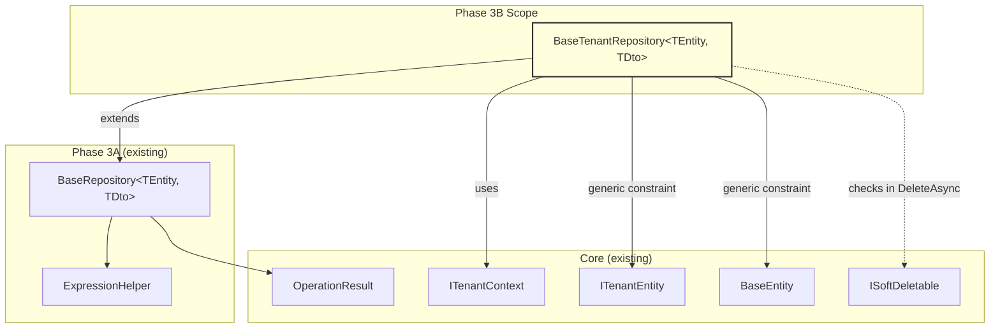
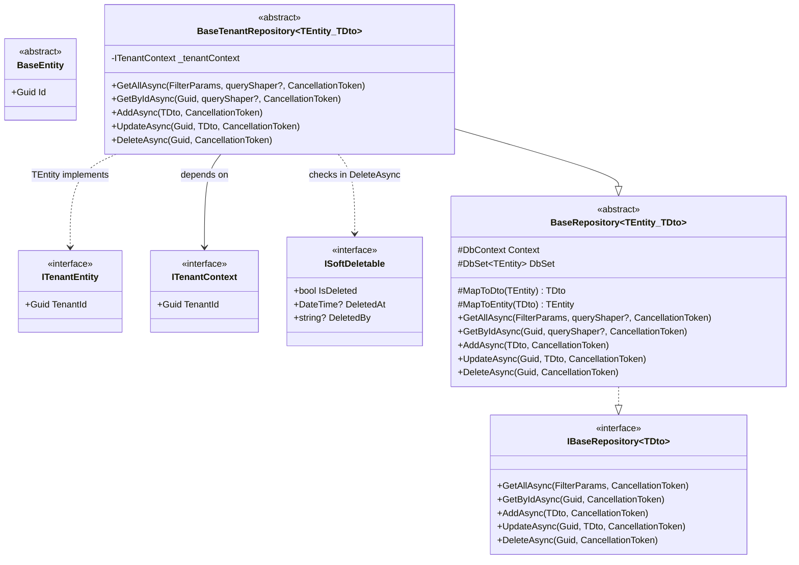
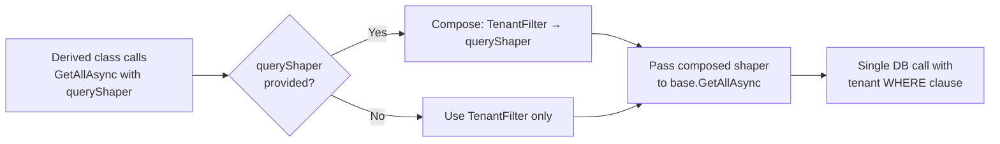
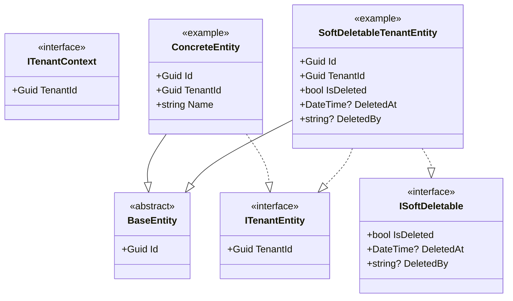

# Design Document: Phase 3B — Tenant Repository

## Overview

Phase 3B adds `BaseTenantRepository<TEntity, TDto>` to the GroundUp.Repositories project. This single abstract class extends `BaseRepository<TEntity, TDto>` (built in Phase 3A) with automatic tenant isolation — every query is filtered by the current tenant, and every mutation verifies tenant ownership before proceeding.

The design centers on three principles:

1. **Compile-time safety.** The generic constraint `where TEntity : BaseEntity, ITenantEntity` ensures only tenant-aware entities can be used. No runtime `typeof` or `IsAssignableFrom` checks for tenant enforcement.

2. **TenantShaper composition.** Tenant filtering reuses the existing `queryShaper` mechanism from BaseRepository. BaseTenantRepository creates a TenantShaper that prepends a `Where(e => e.TenantId == tenantId)` clause, then delegates to any derived class queryShaper. This means GetAllAsync and GetByIdAsync each execute a single database call with the tenant filter baked into the query.

3. **Transparent isolation.** Consuming code writes normal repository calls. AddAsync auto-stamps TenantId. UpdateAsync and DeleteAsync verify tenant ownership before proceeding. Cross-tenant access returns NotFound — the caller never knows the entity exists in another tenant.

### Key Design Decisions

1. **Generic constraint over runtime check.** `where TEntity : BaseEntity, ITenantEntity` is enforced at compile time. The previous GroundUp implementation used `typeof(ITenantEntity).IsAssignableFrom(typeof(TEntity))` at runtime — that's gone. If you try to use BaseTenantRepository with a non-tenant entity, the compiler rejects it.

2. **TenantShaper wraps derived queryShaper.** BaseTenantRepository overrides the protected `GetAllAsync` and `GetByIdAsync` overloads that accept a `queryShaper` parameter. It composes a new delegate: tenant filter first, then the derived class's queryShaper (if any). This preserves the single-database-call pipeline from BaseRepository — no extra round trips.

3. **AddAsync overrides base, stamps TenantId.** The override maps the DTO to an entity, sets `entity.TenantId = _tenantContext.TenantId` (overwriting any pre-set value to prevent spoofing), then delegates to `base.AddAsync`. However, since base.AddAsync also maps DTO→entity internally, the override instead directly adds the entity and saves — avoiding a double-map.

4. **UpdateAsync loads tracked entity, verifies tenant, applies changes.** Uses `FindAsync` to get a tracked entity (same as base), checks `entity.TenantId == _tenantContext.TenantId`, then applies DTO values and preserves the original TenantId. Single tracked query — no AsNoTracking fetch followed by a second tracked fetch.

5. **DeleteAsync loads entity, verifies tenant, then soft/hard deletes.** Same pattern as UpdateAsync for the ownership check. Soft delete logic uses the same `ISoftDeletable` check as BaseRepository but through the generic constraint — the entity is already known to be `ITenantEntity`, and `ISoftDeletable` is checked separately.

6. **Cross-tenant access returns NotFound, not Forbidden.** Returning 403 would leak information about entity existence in other tenants. NotFound is the correct response — the entity effectively doesn't exist for this tenant.

7. **ITenantContext is a constructor dependency.** Stored as a private readonly field. This follows the existing pattern where BaseRepository takes DbContext and mapping delegates via constructor. BaseTenantRepository adds ITenantContext to the parameter list.

## Architecture

### Where Phase 3B Fits



### Class Hierarchy



### TenantShaper Composition Flow



## Components and Interfaces

### Project Structure Changes

```
src/GroundUp.Repositories/
├── BaseRepository.cs          (existing — unchanged)
├── BaseTenantRepository.cs    (new)
└── ExpressionHelper.cs        (existing — unchanged)
```

### BaseTenantRepository\<TEntity, TDto\>

```csharp
namespace GroundUp.Repositories;

/// <summary>
/// Abstract base repository that extends <see cref="BaseRepository{TEntity, TDto}"/>
/// with automatic tenant isolation. Every query is filtered by the current tenant,
/// and every mutation verifies tenant ownership before proceeding.
/// <para>
/// The generic constraint <c>where TEntity : BaseEntity, ITenantEntity</c> enforces
/// at compile time that only tenant-aware entities can be used — no runtime type checks.
/// </para>
/// <para>
/// Tenant filtering is applied via the queryShaper mechanism: a TenantShaper wraps
/// any derived class queryShaper, prepending a Where clause that filters by
/// <see cref="ITenantContext.TenantId"/>. This preserves the single-database-call
/// pipeline from BaseRepository.
/// </para>
/// </summary>
/// <typeparam name="TEntity">The EF Core entity type. Must extend <see cref="BaseEntity"/>
/// and implement <see cref="ITenantEntity"/>.</typeparam>
/// <typeparam name="TDto">The DTO type exposed to the service layer.</typeparam>
public abstract class BaseTenantRepository<TEntity, TDto> : BaseRepository<TEntity, TDto>
    where TEntity : BaseEntity, ITenantEntity
    where TDto : class
{
    private readonly ITenantContext _tenantContext;

    /// <summary>
    /// Initializes a new instance of <see cref="BaseTenantRepository{TEntity, TDto}"/>.
    /// </summary>
    /// <param name="context">The EF Core database context.</param>
    /// <param name="tenantContext">Provides the current tenant identity for automatic filtering.</param>
    /// <param name="mapToDto">Mapperly-generated entity-to-DTO mapping delegate.</param>
    /// <param name="mapToEntity">Mapperly-generated DTO-to-entity mapping delegate.</param>
    protected BaseTenantRepository(
        DbContext context,
        ITenantContext tenantContext,
        Func<TEntity, TDto> mapToDto,
        Func<TDto, TEntity> mapToEntity)
        : base(context, mapToDto, mapToEntity)
    {
        _tenantContext = tenantContext;
    }

    /// <summary>
    /// Retrieves a paginated, filtered, and sorted list of DTOs scoped to the current tenant.
    /// Composes a TenantShaper that applies the tenant filter before any derived class queryShaper.
    /// </summary>
    protected override async Task<OperationResult<PaginatedData<TDto>>> GetAllAsync(
        FilterParams filterParams,
        Func<IQueryable<TEntity>, IQueryable<TEntity>>? queryShaper,
        CancellationToken cancellationToken = default)
    {
        var tenantShaper = ComposeTenantShaper(queryShaper);
        return await base.GetAllAsync(filterParams, tenantShaper, cancellationToken);
    }

    /// <summary>
    /// Retrieves a single DTO by ID scoped to the current tenant.
    /// If the entity exists but belongs to a different tenant, returns NotFound.
    /// </summary>
    protected override async Task<OperationResult<TDto>> GetByIdAsync(
        Guid id,
        Func<IQueryable<TEntity>, IQueryable<TEntity>>? queryShaper,
        CancellationToken cancellationToken = default)
    {
        var tenantShaper = ComposeTenantShaper(queryShaper);
        return await base.GetByIdAsync(id, tenantShaper, cancellationToken);
    }

    /// <summary>
    /// Creates a new entity with TenantId automatically set to the current tenant.
    /// Overwrites any pre-set TenantId to prevent tenant spoofing.
    /// </summary>
    public override async Task<OperationResult<TDto>> AddAsync(
        TDto dto,
        CancellationToken cancellationToken = default)
    {
        try
        {
            var entity = MapToEntity(dto);
            entity.TenantId = _tenantContext.TenantId;
            DbSet.Add(entity);
            await Context.SaveChangesAsync(cancellationToken);
            return OperationResult<TDto>.Ok(MapToDto(entity), "Created", 201);
        }
        catch (DbUpdateException)
        {
            return OperationResult<TDto>.Fail(
                "A conflict occurred while saving the entity.",
                409,
                ErrorCodes.Conflict);
        }
    }

    /// <summary>
    /// Updates an existing entity after verifying it belongs to the current tenant.
    /// Returns NotFound if the entity does not exist or belongs to a different tenant.
    /// Preserves the original TenantId — it cannot be changed via the DTO.
    /// </summary>
    public override async Task<OperationResult<TDto>> UpdateAsync(
        Guid id,
        TDto dto,
        CancellationToken cancellationToken = default)
    {
        try
        {
            var entity = await DbSet.FindAsync(new object[] { id }, cancellationToken);

            if (entity is null || entity.TenantId != _tenantContext.TenantId)
                return OperationResult<TDto>.NotFound();

            var updated = MapToEntity(dto);
            Context.Entry(entity).CurrentValues.SetValues(updated);

            // Preserve original TenantId — cannot be changed via DTO
            entity.TenantId = _tenantContext.TenantId;

            await Context.SaveChangesAsync(cancellationToken);
            return OperationResult<TDto>.Ok(MapToDto(entity));
        }
        catch (DbUpdateException)
        {
            return OperationResult<TDto>.Fail(
                "A conflict occurred while updating the entity.",
                409,
                ErrorCodes.Conflict);
        }
    }

    /// <summary>
    /// Deletes an entity after verifying it belongs to the current tenant.
    /// Returns NotFound if the entity does not exist or belongs to a different tenant.
    /// Performs soft delete for ISoftDeletable entities, hard delete otherwise.
    /// </summary>
    public override async Task<OperationResult> DeleteAsync(
        Guid id,
        CancellationToken cancellationToken = default)
    {
        var entity = await DbSet.FindAsync(new object[] { id }, cancellationToken);

        if (entity is null || entity.TenantId != _tenantContext.TenantId)
            return OperationResult.NotFound();

        if (typeof(ISoftDeletable).IsAssignableFrom(typeof(TEntity)))
        {
            var softDeletable = (ISoftDeletable)entity;
            softDeletable.IsDeleted = true;
            softDeletable.DeletedAt = DateTime.UtcNow;
        }
        else
        {
            DbSet.Remove(entity);
        }

        await Context.SaveChangesAsync(cancellationToken);
        return OperationResult.Ok();
    }

    /// <summary>
    /// Composes a TenantShaper that applies the tenant filter first,
    /// then delegates to the derived class queryShaper (if provided).
    /// </summary>
    private Func<IQueryable<TEntity>, IQueryable<TEntity>> ComposeTenantShaper(
        Func<IQueryable<TEntity>, IQueryable<TEntity>>? queryShaper)
    {
        var tenantId = _tenantContext.TenantId;

        if (queryShaper is null)
            return q => q.Where(e => e.TenantId == tenantId);

        return q => queryShaper(q.Where(e => e.TenantId == tenantId));
    }
}
```

### Key Implementation Details

**ComposeTenantShaper:** Captures `_tenantContext.TenantId` into a local variable before building the lambda. This ensures the tenant ID is evaluated once at call time, not deferred to query execution (where the context might have changed in edge cases with async flows).

**AddAsync override:** Cannot delegate to `base.AddAsync` because the base method maps DTO→entity internally, and we need to set TenantId on the entity after mapping. The override duplicates the map-add-save pattern but adds the TenantId stamp. This is a deliberate trade-off: slight code duplication vs. a clean, single-responsibility override.

**UpdateAsync tenant preservation:** After `SetValues(updated)`, the TenantId is explicitly reset to `_tenantContext.TenantId`. This handles the case where the DTO-to-entity mapping produces an entity with a different TenantId (e.g., the DTO doesn't carry TenantId, so it maps to `Guid.Empty`).

**DeleteAsync:** Fully overrides base to add the tenant ownership check. The soft delete logic is identical to BaseRepository — `typeof(ISoftDeletable).IsAssignableFrom(typeof(TEntity))` is a compile-time-resolvable check.

## Data Models

Phase 3B does not introduce new database entities or DTOs. It operates on the existing type hierarchy:

### Type Relationships



### Test Helpers (new for Phase 3B)

The test project needs tenant-aware test entities and repositories:

| Type | Purpose |
|------|---------|
| `TenantTestEntity` | Extends `BaseEntity`, implements `ITenantEntity`. Has `Name` and `TenantId`. |
| `SoftDeletableTenantTestEntity` | Extends `BaseEntity`, implements `ITenantEntity` and `ISoftDeletable`. |
| `TenantTestDto` | DTO with `Id`, `Name`, `TenantId`. |
| `TenantTestRepository` | Concrete `BaseTenantRepository<TenantTestEntity, TenantTestDto>` for testing. |
| `SoftDeletableTenantTestRepository` | Concrete `BaseTenantRepository<SoftDeletableTenantTestEntity, TenantTestDto>` for soft delete tests. |

The existing `TestDbContext` will be extended to include `DbSet` properties for the new tenant entities.


## Correctness Properties

*A property is a characteristic or behavior that should hold true across all valid executions of a system — essentially, a formal statement about what the system should do. Properties serve as the bridge between human-readable specifications and machine-verifiable correctness guarantees.*

Phase 3B's testable properties focus on tenant isolation invariants — the core security guarantee of BaseTenantRepository. These are ideal for property-based testing: the behavior must hold for ALL tenant IDs and ALL entity states, the input space is large (any Guid pair × any entity set), and input variation reveals edge cases (empty Guid, same Guid for both tenants, entities with default TenantId).

### Property 1: GetAllAsync tenant isolation invariant

*For any* two distinct tenant IDs (tenantA, tenantB) and any set of entities where some belong to tenantA and some to tenantB, calling GetAllAsync with ITenantContext.TenantId set to tenantA SHALL return zero entities whose TenantId equals tenantB.

**Validates: Requirements 3.1, 3.3, 13.1**

### Property 2: GetByIdAsync cross-tenant access invariant

*For any* entity with a TenantId that differs from ITenantContext.TenantId, calling GetByIdAsync with that entity's ID SHALL return OperationResult.NotFound — the entity is invisible to the other tenant.

**Validates: Requirements 4.1, 4.3, 13.2**

### Property 3: AddAsync tenant assignment invariant

*For any* valid DTO with any TenantId value (including Guid.Empty, a random Guid, or the current tenant's Guid), calling AddAsync SHALL produce a persisted entity whose TenantId equals ITenantContext.TenantId, and the returned DTO SHALL also have TenantId equal to ITenantContext.TenantId.

**Validates: Requirements 5.1, 5.2, 5.4, 13.3**

### Property 4: UpdateAsync TenantId preservation invariant

*For any* existing entity belonging to the current tenant and any DTO containing any TenantId value, calling UpdateAsync SHALL preserve the entity's original TenantId — the TenantId in the persisted entity after the update SHALL equal ITenantContext.TenantId, not the DTO's TenantId.

**Validates: Requirements 6.4**

## Error Handling

### Repository Error Strategy

BaseTenantRepository follows the same error strategy as BaseRepository — only expected, recoverable failures are caught. Unexpected exceptions propagate to middleware.

| Scenario | Behavior | Result |
|----------|----------|--------|
| Entity not found (GetByIdAsync) | Tenant filter excludes it → base returns NotFound | `OperationResult<TDto>.NotFound()` |
| Entity belongs to different tenant (GetByIdAsync) | Tenant filter excludes it → base returns NotFound | `OperationResult<TDto>.NotFound()` |
| Entity belongs to different tenant (UpdateAsync) | Tenant check fails → return NotFound | `OperationResult<TDto>.NotFound()` |
| Entity belongs to different tenant (DeleteAsync) | Tenant check fails → return NotFound | `OperationResult.NotFound()` |
| Entity not found (UpdateAsync, DeleteAsync) | FindAsync returns null → return NotFound | `OperationResult<TDto>.NotFound()` / `OperationResult.NotFound()` |
| DbUpdateException on AddAsync | Catch, return Conflict | `OperationResult<TDto>.Fail("...", 409, ErrorCodes.Conflict)` |
| DbUpdateException on UpdateAsync | Catch, return Conflict | `OperationResult<TDto>.Fail("...", 409, ErrorCodes.Conflict)` |
| Any other exception | **Not caught** — propagates to middleware | Exception handling middleware returns 500 |

### Design Rationale

1. **Cross-tenant access returns NotFound, not Forbidden.** Returning 403 would confirm the entity exists in another tenant — an information leak. NotFound is the correct response: from the caller's perspective, the entity doesn't exist in their tenant.

2. **No catch-all.** Same principle as BaseRepository. Only `DbUpdateException` is caught (mapped to 409 Conflict). All other exceptions propagate.

3. **Tenant check in UpdateAsync/DeleteAsync uses FindAsync, not a query with TenantShaper.** For reads (GetAllAsync, GetByIdAsync), the TenantShaper is composed into the query pipeline. For mutations (UpdateAsync, DeleteAsync), we need a tracked entity, so we use `FindAsync` + explicit tenant check. This is a single database call — FindAsync hits the DB once, and the tenant check is an in-memory comparison.

### Error Codes Used

| Error Code | Constant | HTTP Status | Used By |
|------------|----------|-------------|---------|
| `NOT_FOUND` | `ErrorCodes.NotFound` | 404 | GetByIdAsync, UpdateAsync, DeleteAsync (entity missing or wrong tenant) |
| `CONFLICT` | `ErrorCodes.Conflict` | 409 | AddAsync, UpdateAsync (DbUpdateException) |

## Testing Strategy

### Dual Testing Approach

- **Property-based tests (FsCheck.Xunit):** Verify universal tenant isolation invariants across many generated inputs. 100+ iterations per property. These test the core security guarantee — tenant boundaries hold for ALL tenant IDs and entity states.
- **Unit tests (xUnit + EF Core InMemory):** Verify specific CRUD behavior with concrete database state. Example-based tests for success paths, not-found cases, cross-tenant rejection, soft delete logic, queryShaper composition, and FilterParams integration.

Both are complementary: property tests verify isolation invariants across the full input space, unit tests verify specific behavioral scenarios.

### Property-Based Testing Configuration

- **Library:** FsCheck.Xunit (already in the test project)
- **Minimum iterations:** 100 per property test
- **Tag format:** `Feature: phase3b-tenant-repository, Property {number}: {property_text}`
- Each correctness property maps to one `[Property]` test method
- Tests use EF Core InMemory with a fresh database per iteration

### Test Plan

| Test | Type | Property | What's Verified |
|------|------|----------|-----------------|
| GetAllAsync isolation invariant | Property | 1 | No cross-tenant entities in list results |
| GetByIdAsync cross-tenant access invariant | Property | 2 | Cross-tenant GetById returns NotFound |
| AddAsync tenant assignment invariant | Property | 3 | Persisted entity always has correct TenantId |
| UpdateAsync TenantId preservation invariant | Property | 4 | TenantId cannot be changed via update |
| GetAllAsync returns only current tenant entities | Unit | — | Multi-tenant seed, verify filtered results |
| GetAllAsync returns empty when no tenant entities | Unit | — | Other-tenant seed only, verify empty |
| GetAllAsync applies tenant filter before queryShaper | Unit | — | QueryShaper + tenant filter composition |
| GetAllAsync with FilterParams and paging | Unit | — | Tenant filter + paging integration |
| GetByIdAsync returns Ok for own tenant entity | Unit | — | Happy path |
| GetByIdAsync returns NotFound for other tenant entity | Unit | — | Cross-tenant rejection |
| GetByIdAsync returns NotFound for non-existent entity | Unit | — | Standard not-found |
| GetByIdAsync with queryShaper and tenant filter | Unit | — | Composition verification |
| AddAsync sets TenantId to context TenantId | Unit | — | TenantId assignment |
| AddAsync overwrites pre-set TenantId | Unit | — | Anti-spoofing |
| AddAsync returns Ok with correct TenantId in DTO | Unit | — | Return value verification |
| UpdateAsync returns Ok for own tenant entity | Unit | — | Happy path |
| UpdateAsync returns NotFound for other tenant entity | Unit | — | Cross-tenant rejection |
| UpdateAsync returns NotFound for non-existent entity | Unit | — | Standard not-found |
| UpdateAsync preserves original TenantId | Unit | — | TenantId immutability |
| DeleteAsync returns Ok for own tenant entity | Unit | — | Happy path (hard delete) |
| DeleteAsync returns NotFound for other tenant entity | Unit | — | Cross-tenant rejection |
| DeleteAsync returns NotFound for non-existent entity | Unit | — | Standard not-found |
| DeleteAsync soft-deletes ISoftDeletable tenant entity | Unit | — | Soft delete behavior |
| DeleteAsync hard-deletes non-ISoftDeletable tenant entity | Unit | — | Hard delete behavior |

### Test Infrastructure

Phase 3B tests extend the existing Phase 3A test helpers with tenant-aware variants:

```
tests/GroundUp.Tests.Unit/Repositories/
├── TestHelpers/
│   ├── TestEntity.cs                          (existing)
│   ├── SoftDeletableTestEntity.cs             (existing)
│   ├── TestDto.cs                             (existing)
│   ├── TestDbContext.cs                        (existing — extended)
│   ├── TestRepository.cs                      (existing)
│   ├── SoftDeletableTestRepository.cs         (existing)
│   ├── TenantTestEntity.cs                    (new)
│   ├── SoftDeletableTenantTestEntity.cs       (new)
│   ├── TenantTestDto.cs                       (new)
│   ├── TenantTestRepository.cs                (new)
│   └── SoftDeletableTenantTestRepository.cs   (new)
├── BaseRepositoryTests.cs                     (existing)
├── BaseTenantRepositoryTests.cs               (new)
├── BaseTenantRepositoryPropertyTests.cs       (new)
├── ExpressionHelperPropertyTests.cs           (existing)
└── ExpressionHelperTests.cs                   (existing)
```

**New test helpers:**

- `TenantTestEntity` — extends `BaseEntity`, implements `ITenantEntity`. Properties: `Name`, `TenantId`.
- `SoftDeletableTenantTestEntity` — extends `BaseEntity`, implements `ITenantEntity` and `ISoftDeletable`. Properties: `Name`, `TenantId`, `IsDeleted`, `DeletedAt`, `DeletedBy`.
- `TenantTestDto` — DTO with `Id`, `Name`, `TenantId`.
- `TenantTestRepository` — concrete `BaseTenantRepository<TenantTestEntity, TenantTestDto>` with identity mapping delegates.
- `SoftDeletableTenantTestRepository` — concrete `BaseTenantRepository<SoftDeletableTenantTestEntity, TenantTestDto>` for soft delete tests.
- `TestDbContext` — extended with `DbSet<TenantTestEntity>` and `DbSet<SoftDeletableTenantTestEntity>`.

**ITenantContext for tests:** Use NSubstitute to create a mock `ITenantContext` that returns a configurable `TenantId`. This is consistent with the project's testing conventions (NSubstitute, not Moq).

### What Is NOT Tested

- Class structure (abstract, not sealed, file-scoped namespace) — verified by code review
- XML documentation comments — verified by code review and `<GenerateDocumentationFile>` compiler warnings
- Generic constraints — verified by compilation (using a non-ITenantEntity type would fail to compile)
- Single database call guarantee — verified by design (TenantShaper is composed into the query pipeline)
- Constructor parameter passing to base — verified by compilation
- DbUpdateException handling in AddAsync/UpdateAsync — verified by code review (same pattern as BaseRepository, difficult to trigger with InMemory provider)
