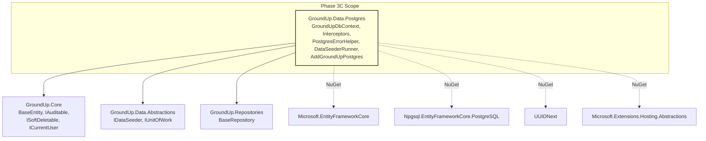
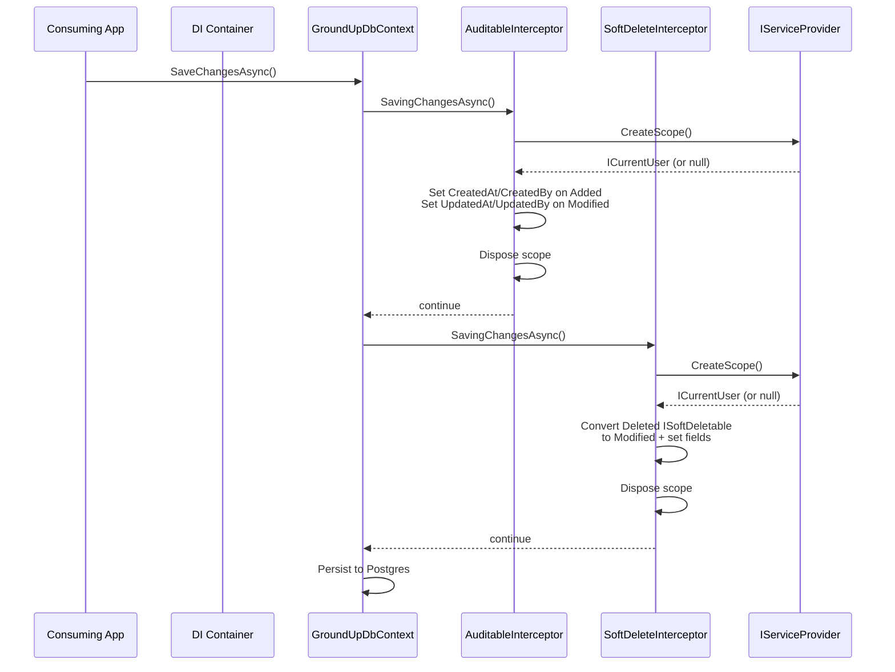
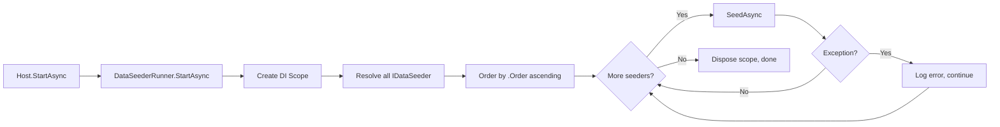

# Design Document: Phase 3C — EF Core & Postgres

## Overview

Phase 3C builds the EF Core infrastructure in GroundUp.Data.Postgres — the ONLY project in the framework containing Postgres-specific code. This phase delivers the abstract `GroundUpDbContext` that consuming applications inherit from, `SaveChangesInterceptor` implementations for automatic audit field population and soft delete conversion, global query filters for `ISoftDeletable` entities, UUID v7 default value generation via the UUIDNext NuGet package, Postgres-specific unique constraint violation detection, a `DataSeederRunner` hosted service, and the `AddGroundUpPostgres<TContext>` registration extension method.

### Key Design Decisions

1. **GroundUpDbContext is abstract.** Consuming applications create their own DbContext inheriting from `GroundUpDbContext`. This allows them to define their own `DbSet<T>` properties and entity configurations while inheriting framework conventions (UUID v7 generation, soft delete query filters). The constructor accepts `DbContextOptions` (not `DbContextOptions<GroundUpDbContext>`) so derived contexts can pass their own typed options.

2. **Interceptors are singletons that resolve scoped services.** `AuditableInterceptor` and `SoftDeleteInterceptor` are registered as singletons (EF Core requirement for interceptors added via `AddInterceptors`). They accept `IServiceProvider` and create a scope per `SavingChangesAsync` call to resolve `ICurrentUser`. This avoids captive dependency issues — the singleton interceptor never holds a reference to a scoped service beyond the SaveChanges call.

3. **Dynamic global query filters via reflection.** `OnModelCreating` scans the model for all entity types implementing `ISoftDeletable` and applies `HasQueryFilter(e => !e.IsDeleted)` using reflection to build the lambda expression dynamically. This means consuming applications don't need to manually configure soft delete filters — any entity implementing `ISoftDeletable` gets the filter automatically.

4. **UUID v7 via UUIDNext package.** .NET 8 lacks `Guid.CreateVersion7()` (added in .NET 9). The UUIDNext NuGet package provides sequential, sortable UUID v7 generation. A custom `ValueGenerator<Guid>` wraps `UUIDNext.Uuid.NewDatabaseFriendly(Database.PostgreSql)` and is configured as the default value generator for all `BaseEntity.Id` properties.

5. **SoftDeleteInterceptor is a safety net.** `BaseRepository.DeleteAsync` already handles soft delete explicitly. The interceptor catches direct `DbContext.Remove()` calls that bypass the repository — e.g., cascade deletes or consuming application code that uses the DbContext directly. Both paths produce the same result: `IsDeleted = true`, `DeletedAt = DateTime.UtcNow`, `DeletedBy` from `ICurrentUser`.

6. **PostgresErrorHelper is static and sealed.** It inspects `DbUpdateException.InnerException` for `Npgsql.PostgresException` with `SqlState == "23505"` (unique violation). This is the only place in the framework that references Npgsql types directly. `BaseRepository` can call this helper to provide meaningful conflict messages.

7. **DataSeederRunner uses IHostedService, not IHostedLifecycleService.** `StartAsync` creates a DI scope, resolves all `IDataSeeder` implementations, orders by `Order`, and runs `SeedAsync` sequentially. Errors are logged but don't prevent other seeders from running — a failing seeder shouldn't block application startup.

8. **AddGroundUpPostgres\<TContext\> is the single registration entry point.** It registers the DbContext with Npgsql, adds interceptors as singletons, and registers `DataSeederRunner` as a hosted service. The generic constraint `where TContext : GroundUpDbContext` ensures only contexts inheriting from the framework base can be registered.

## Architecture

### Where Phase 3C Fits



### Interceptor Lifecycle



### DataSeederRunner Startup Flow



## Components and Interfaces

### GroundUp.Data.Postgres Project Structure

```
src/GroundUp.Data.Postgres/
├── GroundUpDbContext.cs
├── UuidV7ValueGenerator.cs
├── PostgresErrorHelper.cs
├── DataSeederRunner.cs
├── PostgresServiceCollectionExtensions.cs
├── Interceptors/
│   ├── AuditableInterceptor.cs
│   └── SoftDeleteInterceptor.cs
└── GroundUp.Data.Postgres.csproj
```

### GroundUpDbContext

```csharp
namespace GroundUp.Data.Postgres;

/// <summary>
/// Abstract base DbContext that consuming applications inherit from.
/// Configures UUID v7 default value generation for BaseEntity.Id,
/// applies global query filters for ISoftDeletable entities,
/// and calls base.OnModelCreating before applying framework conventions.
/// </summary>
public abstract class GroundUpDbContext : DbContext
{
    protected GroundUpDbContext(DbContextOptions options) : base(options) { }

    protected override void OnModelCreating(ModelBuilder modelBuilder)
    {
        // 1. Call base so derived context entity configurations are registered first
        base.OnModelCreating(modelBuilder);

        // 2. Configure UUID v7 default value generation for all BaseEntity.Id properties
        foreach (var entityType in modelBuilder.Model.GetEntityTypes())
        {
            if (typeof(BaseEntity).IsAssignableFrom(entityType.ClrType))
            {
                modelBuilder.Entity(entityType.ClrType)
                    .Property(nameof(BaseEntity.Id))
                    .HasValueGenerator<UuidV7ValueGenerator>();
            }
        }

        // 3. Apply global query filters for ISoftDeletable entities
        foreach (var entityType in modelBuilder.Model.GetEntityTypes())
        {
            if (typeof(ISoftDeletable).IsAssignableFrom(entityType.ClrType))
            {
                ApplySoftDeleteFilter(modelBuilder, entityType.ClrType);
            }
        }
    }

    /// <summary>
    /// Builds and applies a HasQueryFilter(e => !e.IsDeleted) expression
    /// dynamically for the given entity type using reflection.
    /// </summary>
    private static void ApplySoftDeleteFilter(ModelBuilder modelBuilder, Type entityType)
    {
        // Build: (TEntity e) => !e.IsDeleted
        var parameter = Expression.Parameter(entityType, "e");
        var property = Expression.Property(parameter, nameof(ISoftDeletable.IsDeleted));
        var condition = Expression.Not(property);
        var lambda = Expression.Lambda(condition, parameter);

        modelBuilder.Entity(entityType).HasQueryFilter(lambda);
    }
}
```

### UuidV7ValueGenerator

```csharp
namespace GroundUp.Data.Postgres;

/// <summary>
/// EF Core value generator that produces UUID v7 values using the UUIDNext package.
/// Configured as the default value generator for BaseEntity.Id properties.
/// Generates sequential, sortable identifiers suitable for Postgres primary keys.
/// </summary>
public sealed class UuidV7ValueGenerator : ValueGenerator<Guid>
{
    public override bool GeneratesTemporaryValues => false;

    public override Guid Next(EntityEntry entry)
        => UUIDNext.Uuid.NewDatabaseFriendly(UUIDNext.Database.PostgreSql);
}
```

### AuditableInterceptor

```csharp
namespace GroundUp.Data.Postgres.Interceptors;

/// <summary>
/// SaveChanges interceptor that auto-populates IAuditable fields.
/// Sets CreatedAt/CreatedBy on Added entities and UpdatedAt/UpdatedBy on Modified entities.
/// Registered as a singleton; resolves ICurrentUser from a new DI scope per call.
/// </summary>
public sealed class AuditableInterceptor : SaveChangesInterceptor
{
    private readonly IServiceProvider _serviceProvider;

    public AuditableInterceptor(IServiceProvider serviceProvider)
    {
        _serviceProvider = serviceProvider;
    }

    public override async ValueTask<InterceptionResult<int>> SavingChangesAsync(
        DbContextEventData eventData,
        InterceptionResult<int> result,
        CancellationToken cancellationToken = default)
    {
        if (eventData.Context is null)
            return await base.SavingChangesAsync(eventData, result, cancellationToken);

        using var scope = _serviceProvider.CreateScope();
        var currentUser = scope.ServiceProvider.GetService<ICurrentUser>();
        var userId = currentUser?.UserId.ToString();
        var utcNow = DateTime.UtcNow;

        foreach (var entry in eventData.Context.ChangeTracker.Entries<IAuditable>())
        {
            switch (entry.State)
            {
                case EntityState.Added:
                    entry.Entity.CreatedAt = utcNow;
                    entry.Entity.CreatedBy = userId;
                    break;

                case EntityState.Modified:
                    entry.Entity.UpdatedAt = utcNow;
                    entry.Entity.UpdatedBy = userId;
                    break;
            }
        }

        return await base.SavingChangesAsync(eventData, result, cancellationToken);
    }
}
```

### SoftDeleteInterceptor

```csharp
namespace GroundUp.Data.Postgres.Interceptors;

/// <summary>
/// SaveChanges interceptor that converts Remove() calls on ISoftDeletable entities
/// to soft deletes. Acts as a safety net for direct DbContext usage —
/// BaseRepository already handles soft delete explicitly.
/// Registered as a singleton; resolves ICurrentUser from a new DI scope per call.
/// </summary>
public sealed class SoftDeleteInterceptor : SaveChangesInterceptor
{
    private readonly IServiceProvider _serviceProvider;

    public SoftDeleteInterceptor(IServiceProvider serviceProvider)
    {
        _serviceProvider = serviceProvider;
    }

    public override async ValueTask<InterceptionResult<int>> SavingChangesAsync(
        DbContextEventData eventData,
        InterceptionResult<int> result,
        CancellationToken cancellationToken = default)
    {
        if (eventData.Context is null)
            return await base.SavingChangesAsync(eventData, result, cancellationToken);

        using var scope = _serviceProvider.CreateScope();
        var currentUser = scope.ServiceProvider.GetService<ICurrentUser>();
        var userId = currentUser?.UserId.ToString();
        var utcNow = DateTime.UtcNow;

        foreach (var entry in eventData.Context.ChangeTracker.Entries<ISoftDeletable>())
        {
            if (entry.State != EntityState.Deleted)
                continue;

            entry.State = EntityState.Modified;
            entry.Entity.IsDeleted = true;
            entry.Entity.DeletedAt = utcNow;
            entry.Entity.DeletedBy = userId;
        }

        return await base.SavingChangesAsync(eventData, result, cancellationToken);
    }
}
```

### PostgresErrorHelper

```csharp
namespace GroundUp.Data.Postgres;

/// <summary>
/// Static helper for detecting Postgres-specific database errors.
/// This is the ONLY place in the framework that references Npgsql types directly.
/// </summary>
public static class PostgresErrorHelper
{
    /// <summary>
    /// Determines whether the specified <see cref="DbUpdateException"/> was caused
    /// by a Postgres unique constraint violation (SqlState 23505).
    /// </summary>
    /// <param name="exception">The DbUpdateException to inspect.</param>
    /// <returns>True if the inner exception is a PostgresException with SqlState "23505".</returns>
    public static bool IsUniqueConstraintViolation(DbUpdateException? exception)
    {
        if (exception?.InnerException is not Npgsql.PostgresException pgEx)
            return false;

        return pgEx.SqlState == "23505";
    }
}
```

### DataSeederRunner

```csharp
namespace GroundUp.Data.Postgres;

/// <summary>
/// Hosted service that discovers all <see cref="IDataSeeder"/> implementations
/// from DI, orders them by <see cref="IDataSeeder.Order"/>, and runs
/// <see cref="IDataSeeder.SeedAsync"/> on each during application startup.
/// Errors in individual seeders are logged but do not prevent other seeders from running.
/// </summary>
public sealed class DataSeederRunner : IHostedService
{
    private readonly IServiceProvider _serviceProvider;
    private readonly ILogger<DataSeederRunner> _logger;

    public DataSeederRunner(IServiceProvider serviceProvider, ILogger<DataSeederRunner> logger)
    {
        _serviceProvider = serviceProvider;
        _logger = logger;
    }

    public async Task StartAsync(CancellationToken cancellationToken)
    {
        using var scope = _serviceProvider.CreateScope();
        var seeders = scope.ServiceProvider
            .GetServices<IDataSeeder>()
            .OrderBy(s => s.Order);

        foreach (var seeder in seeders)
        {
            try
            {
                _logger.LogInformation(
                    "Running data seeder {SeederType} (Order: {Order})",
                    seeder.GetType().Name,
                    seeder.Order);

                await seeder.SeedAsync(cancellationToken);
            }
            catch (Exception ex)
            {
                _logger.LogError(
                    ex,
                    "Data seeder {SeederType} failed",
                    seeder.GetType().Name);
            }
        }
    }

    public Task StopAsync(CancellationToken cancellationToken) => Task.CompletedTask;
}
```

### PostgresServiceCollectionExtensions

```csharp
namespace GroundUp.Data.Postgres;

/// <summary>
/// Extension methods for registering GroundUp Postgres infrastructure
/// with the dependency injection container.
/// </summary>
public static class PostgresServiceCollectionExtensions
{
    /// <summary>
    /// Registers the GroundUp Postgres infrastructure: DbContext with Npgsql,
    /// audit and soft delete interceptors, and the data seeder runner.
    /// </summary>
    /// <typeparam name="TContext">
    /// The consuming application's DbContext type. Must inherit from <see cref="GroundUpDbContext"/>.
    /// </typeparam>
    /// <param name="services">The service collection.</param>
    /// <param name="connectionString">The Postgres connection string.</param>
    /// <returns>The service collection for method chaining.</returns>
    public static IServiceCollection AddGroundUpPostgres<TContext>(
        this IServiceCollection services,
        string connectionString)
        where TContext : GroundUpDbContext
    {
        // Register interceptors as singletons
        services.AddSingleton<AuditableInterceptor>();
        services.AddSingleton<SoftDeleteInterceptor>();

        // Register DbContext with Npgsql and interceptors
        services.AddDbContext<TContext>((sp, options) =>
        {
            options.UseNpgsql(connectionString);
            options.AddInterceptors(
                sp.GetRequiredService<AuditableInterceptor>(),
                sp.GetRequiredService<SoftDeleteInterceptor>());
        });

        // Register DataSeederRunner as hosted service
        services.AddHostedService<DataSeederRunner>();

        return services;
    }
}
```

## Data Models

Phase 3C does not introduce new database entities. It operates on the existing entity hierarchy from Core (`BaseEntity`, `IAuditable`, `ISoftDeletable`) and provides the EF Core infrastructure that makes those interfaces functional at the database level.

### Type Relationships

```mermaid
classDiagram
    class GroundUpDbContext {
        <<abstract>>
        #OnModelCreating(ModelBuilder)
        -ApplySoftDeleteFilter(ModelBuilder, Type)
    }

    class DbContext {
        <<Microsoft.EntityFrameworkCore>>
    }

    class UuidV7ValueGenerator {
        <<sealed>>
        +Next(EntityEntry) Guid
        +GeneratesTemporaryValues bool
    }

    class AuditableInterceptor {
        <<sealed>>
        -IServiceProvider _serviceProvider
        +SavingChangesAsync() ValueTask
    }

    class SoftDeleteInterceptor {
        <<sealed>>
        -IServiceProvider _serviceProvider
        +SavingChangesAsync() ValueTask
    }

    class PostgresErrorHelper {
        <<static, sealed>>
        +IsUniqueConstraintViolation(DbUpdateException?) bool
    }

    class DataSeederRunner {
        <<sealed>>
        -IServiceProvider _serviceProvider
        -ILogger _logger
        +StartAsync(CancellationToken) Task
        +StopAsync(CancellationToken) Task
    }

    class IDataSeeder {
        <<interface>>
        +int Order
        +SeedAsync(CancellationToken) Task
    }

    class BaseEntity {
        <<abstract>>
        +Guid Id
    }

    class IAuditable {
        <<interface>>
        +DateTime CreatedAt
        +string? CreatedBy
        +DateTime? UpdatedAt
        +string? UpdatedBy
    }

    class ISoftDeletable {
        <<interface>>
        +bool IsDeleted
        +DateTime? DeletedAt
        +string? DeletedBy
    }

    class ICurrentUser {
        <<interface>>
        +Guid UserId
        +string? Email
        +string? DisplayName
    }

    GroundUpDbContext --|> DbContext
    GroundUpDbContext --> UuidV7ValueGenerator : configures
    GroundUpDbContext --> ISoftDeletable : applies query filter
    GroundUpDbContext --> BaseEntity : configures Id generation
    AuditableInterceptor --> IAuditable : populates fields
    AuditableInterceptor --> ICurrentUser : resolves from scope
    SoftDeleteInterceptor --> ISoftDeletable : converts deletes
    SoftDeleteInterceptor --> ICurrentUser : resolves from scope
    DataSeederRunner --> IDataSeeder : discovers and runs
    PostgresErrorHelper ..> DbUpdateException : inspects
```



### NuGet Dependencies (Updated .csproj)

```xml
<Project Sdk="Microsoft.NET.Sdk">
  <PropertyGroup>
    <TargetFramework>net8.0</TargetFramework>
    <ImplicitUsings>enable</ImplicitUsings>
    <Nullable>enable</Nullable>
  </PropertyGroup>

  <ItemGroup>
    <PackageReference Include="Microsoft.EntityFrameworkCore" Version="8.0.*" />
    <PackageReference Include="Npgsql.EntityFrameworkCore.PostgreSQL" Version="8.0.*" />
    <PackageReference Include="UUIDNext" Version="*" />
    <PackageReference Include="Microsoft.Extensions.Hosting.Abstractions" Version="8.*" />
  </ItemGroup>

  <ItemGroup>
    <ProjectReference Include="..\GroundUp.Core\GroundUp.Core.csproj" />
    <ProjectReference Include="..\GroundUp.Data.Abstractions\GroundUp.Data.Abstractions.csproj" />
    <ProjectReference Include="..\GroundUp.Repositories\GroundUp.Repositories.csproj" />
  </ItemGroup>
</Project>
```


## Error Handling

### Interceptor Error Strategy

Interceptors operate within the SaveChanges pipeline. Errors in interceptors propagate as exceptions from `SaveChangesAsync` — they are not caught within the interceptor itself.

| Scenario | Behavior | Result |
|----------|----------|--------|
| ICurrentUser not resolvable from scope | Interceptor sets timestamp fields, leaves user fields (CreatedBy, UpdatedBy, DeletedBy) as null | Graceful degradation — audit timestamps still recorded |
| DbContext is null in eventData | Interceptor skips processing, delegates to base | No-op — safe passthrough |
| Entity not implementing IAuditable in Added/Modified state | AuditableInterceptor ignores it (ChangeTracker.Entries\<IAuditable\> filters automatically) | No modification |
| Entity not implementing ISoftDeletable in Deleted state | SoftDeleteInterceptor ignores it (ChangeTracker.Entries\<ISoftDeletable\> filters automatically) | Hard delete proceeds normally |

### PostgresErrorHelper Error Strategy

| Scenario | Behavior | Result |
|----------|----------|--------|
| Null DbUpdateException | Returns false | Safe — no exception thrown |
| InnerException is not PostgresException | Returns false | Safe — only matches Npgsql types |
| PostgresException with SqlState != "23505" | Returns false | Only unique constraint violations match |
| PostgresException with SqlState == "23505" | Returns true | Caller can provide meaningful conflict message |

### DataSeederRunner Error Strategy

| Scenario | Behavior | Result |
|----------|----------|--------|
| Seeder throws exception | Log error, continue to next seeder | Other seeders still run — application starts |
| No IDataSeeder implementations registered | StartAsync completes without error | Empty enumeration — no-op |
| Cancellation requested | CancellationToken passed to each seeder's SeedAsync | Seeders can respect cancellation |

### Design Rationale

1. **Interceptors don't catch exceptions.** If setting audit fields or converting a soft delete fails, that's a bug that should surface immediately — not be silently swallowed. The exception propagates to the caller's `SaveChangesAsync` catch block.

2. **ICurrentUser resolution is best-effort.** In scenarios without authentication (e.g., background jobs, seeder startup), there's no user context. The interceptors handle this gracefully by leaving user fields null while still recording timestamps.

3. **DataSeederRunner is fault-tolerant.** A failing seeder (e.g., network issue reaching the database) shouldn't prevent other seeders from running. The error is logged for investigation, and the application continues starting up.

## Testing Strategy

### Why Property-Based Testing Does Not Apply

Phase 3C's components are primarily EF Core configuration, SaveChanges interceptors, a hosted service orchestrator, and a static error helper. These are **not suitable for property-based testing** because:

- **Interceptors** require EF Core ChangeTracker state setup — they are not pure functions. The input space (entity states: Added, Modified, Deleted, Unchanged) is small and enumerable. Example-based tests cover all meaningful combinations.
- **PostgresErrorHelper** has exactly 4 distinct input cases (null, PostgresException with 23505, PostgresException with other code, non-PostgresException inner exception). PBT adds no value over exhaustive example tests.
- **DataSeederRunner** is orchestration logic that resolves services from DI and calls them in order. The behavior doesn't vary meaningfully with random input — it varies with the number and ordering of seeders, which is best tested with specific scenarios.
- **GroundUpDbContext** configuration is verified by creating a context and checking that conventions are applied. This is integration-style testing, not property testing.

### Unit Test Plan

All tests use **xUnit + NSubstitute** consistent with existing conventions. Tests are organized in `tests/GroundUp.Tests.Unit/Data/Postgres/`.

#### AuditableInterceptor Tests

| Test | Validates |
|------|-----------|
| `SavingChangesAsync_AddedAuditableEntity_SetsCreatedAtAndCreatedBy` | Req 2.4 |
| `SavingChangesAsync_ModifiedAuditableEntity_SetsUpdatedAtAndUpdatedBy` | Req 2.5 |
| `SavingChangesAsync_NonAuditableEntity_DoesNotModify` | Req 2.4 (negative) |
| `SavingChangesAsync_NoCurrentUser_SetsTimestampsLeavesUserFieldsNull` | Req 2.6 |

Test approach: Create a real `DbContext` (InMemory provider) with test entities implementing `IAuditable`. Add/modify entities, then invoke the interceptor's `SavingChangesAsync` with a `DbContextEventData` pointing to the context. Mock `IServiceProvider` to return a scope with (or without) `ICurrentUser`.

#### SoftDeleteInterceptor Tests

| Test | Validates |
|------|-----------|
| `SavingChangesAsync_DeletedSoftDeletableEntity_ConvertsToModifiedAndSetsFields` | Req 3.3 |
| `SavingChangesAsync_DeletedNonSoftDeletableEntity_DoesNotModifyState` | Req 3.3 (negative) |
| `SavingChangesAsync_WithCurrentUser_SetsDeletedBy` | Req 3.4 |
| `SavingChangesAsync_NoCurrentUser_SetsIsDeletedAndDeletedAtLeavesDeletedByNull` | Req 3.5 |

Test approach: Same pattern as AuditableInterceptor — real InMemory DbContext, mock IServiceProvider.

#### PostgresErrorHelper Tests

| Test | Validates |
|------|-----------|
| `IsUniqueConstraintViolation_PostgresException23505_ReturnsTrue` | Req 6.3 |
| `IsUniqueConstraintViolation_PostgresExceptionDifferentCode_ReturnsFalse` | Req 6.4 |
| `IsUniqueConstraintViolation_NoInnerException_ReturnsFalse` | Req 6.4 |
| `IsUniqueConstraintViolation_Null_ReturnsFalse` | Req 6.5 |

Test approach: Construct `DbUpdateException` instances with various inner exceptions. `PostgresException` is constructed via reflection or Npgsql test utilities since its constructor is not public.

#### DataSeederRunner Tests

| Test | Validates |
|------|-----------|
| `StartAsync_MultipleSeeders_ExecutesInOrderAscending` | Req 7.3 |
| `StartAsync_SeederThrows_LogsErrorAndContinues` | Req 7.4 |
| `StartAsync_NoSeeders_CompletesWithoutError` | Req 7.3 (edge) |
| `StopAsync_CompletesImmediately` | Req 7.5 |

Test approach: Register mock `IDataSeeder` implementations with different `Order` values. Use `NSubstitute` to track call order and simulate exceptions. Mock `ILogger<DataSeederRunner>` to verify error logging.

#### GroundUpDbContext Tests (via derived test context)

| Test | Validates |
|------|-----------|
| `OnModelCreating_SoftDeletableEntity_AppliesQueryFilter` | Req 1.3, 5.2 |
| `OnModelCreating_QueryExcludesSoftDeletedEntities` | Req 5.3 |
| `OnModelCreating_IgnoreQueryFilters_ReturnsSoftDeletedEntities` | Req 5.4 |
| `OnModelCreating_BaseEntity_GeneratesUuidV7OnAdd` | Req 4.3 |
| `OnModelCreating_BaseEntity_PreservesPreSetId` | Req 4.4 |

Test approach: Create a concrete test DbContext inheriting from `GroundUpDbContext` with InMemory provider. Add entities and verify behavior. Note: UUID v7 value generation may not trigger with InMemory provider — if so, verify the value generator is configured on the model rather than testing the generated value.

### Test File Organization

```
tests/GroundUp.Tests.Unit/
└── Data/
    └── Postgres/
        ├── AuditableInterceptorTests.cs
        ├── SoftDeleteInterceptorTests.cs
        ├── PostgresErrorHelperTests.cs
        ├── DataSeederRunnerTests.cs
        ├── GroundUpDbContextTests.cs
        └── TestHelpers/
            ├── AuditableTestEntity.cs
            ├── SoftDeletableAuditableTestEntity.cs
            └── TestGroundUpDbContext.cs
```

### Test Dependencies

The unit test project will need an additional project reference to `GroundUp.Data.Postgres` and a package reference to `Npgsql.EntityFrameworkCore.PostgreSQL` (for constructing `PostgresException` in tests). The existing `Microsoft.EntityFrameworkCore.InMemory` package is already referenced.
