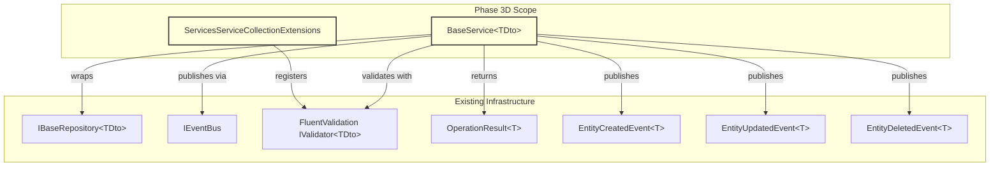
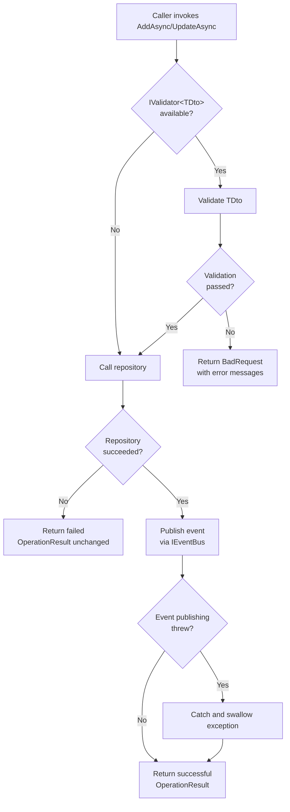
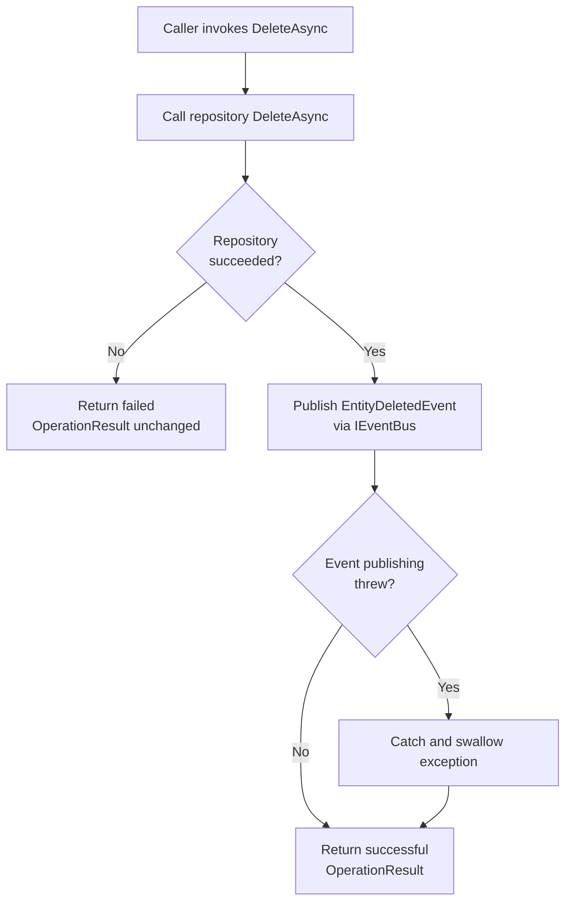
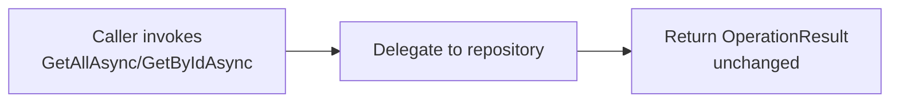

# Design Document: Phase 3D — Service Layer

## Overview

Phase 3D builds the base service layer in `GroundUp.Services` — the business logic and security boundary of the framework. This phase delivers two production types:

1. **`BaseService<TDto>`** — an abstract generic service that wraps `IBaseRepository<TDto>` with a Validate → Persist → Publish pipeline for mutations and pure pass-through for reads.
2. **`ServicesServiceCollectionExtensions`** — a DI extension method (`AddGroundUpServices`) that scans an assembly for FluentValidation `IValidator<T>` implementations and registers them as scoped services.

The design centers on three principles:

1. **Fail-fast validation.** FluentValidation runs before any repository call on AddAsync and UpdateAsync. If validation fails, the repository is never touched and the caller gets a structured `OperationResult.BadRequest` with all error messages. Validation is optional — if no `IValidator<TDto>` is registered, the pipeline skips straight to persistence.

2. **Fire-and-forget events.** After a successful repository operation, `IEventBus.PublishAsync` is called for entity lifecycle events (`EntityCreatedEvent<TDto>`, `EntityUpdatedEvent<TDto>`, `EntityDeletedEvent<TDto>`). Exceptions from event publishing are caught and swallowed — a failing event handler never breaks the primary CRUD flow.

3. **Zero-overhead reads.** `GetAllAsync` and `GetByIdAsync` delegate directly to the repository with no validation and no event publishing. They are pure pass-through methods.

### Key Design Decisions

1. **BaseService operates on TDto, not TEntity.** The service layer never sees EF Core entities. It receives DTOs from the repository and passes DTOs to the repository. This keeps the service layer database-agnostic and consistent with the layered architecture (Services → Data.Abstractions interfaces, which traffic in DTOs).

2. **Single generic parameter `TDto`.** Unlike `BaseRepository<TEntity, TDto>` which needs both the entity and DTO types, BaseService only needs `TDto` because it interacts exclusively through `IBaseRepository<TDto>` — the repository interface hides the entity type.

3. **Constructor injection with nullable validator.** `IValidator<TDto>?` is nullable in the constructor. When the DI container has no registered validator for a given TDto, the consuming code passes `null`. This avoids requiring a no-op validator registration for every DTO type.

4. **Protected repository property.** The `IBaseRepository<TDto>` is exposed as a `protected` property so derived services can access it for custom queries or operations beyond the standard CRUD. The `IEventBus` is also protected for the same reason.

5. **Virtual methods for all CRUD operations.** Every public method is `virtual` so derived services can override specific operations to add business logic (e.g., custom authorization checks, cross-service orchestration) while inheriting the default pipeline for operations that don't need customization.

6. **Event publishing catches all exceptions.** The try/catch around `IEventBus.PublishAsync` uses a bare `catch (Exception)` — not a specific exception type. This is intentional: event handlers are side effects, and ANY failure (including `OutOfMemoryException` in extreme cases) should not corrupt the primary operation result. The `InProcessEventBus` already catches handler exceptions internally, but BaseService adds a second safety net for transport-level failures (e.g., a future RabbitMQ event bus that throws on connection failure).

7. **AddGroundUpServices scans a provided assembly.** The extension method accepts an `Assembly` parameter rather than scanning the calling assembly automatically. This gives consuming applications explicit control over which assembly to scan — important when validators live in a different project than the startup code.

## Architecture

### Where Phase 3D Fits



### Request Flow — AddAsync / UpdateAsync



### Request Flow — DeleteAsync



### Request Flow — GetAllAsync / GetByIdAsync



## Components and Interfaces

### Project Structure Changes

```
src/GroundUp.Services/
├── BaseService.cs                              (new)
├── ServicesServiceCollectionExtensions.cs       (new)
└── GroundUp.Services.csproj                    (modified — add DI Abstractions NuGet)
```

### BaseService\<TDto\>

```csharp
namespace GroundUp.Services;

/// <summary>
/// Abstract base service that wraps <see cref="IBaseRepository{TDto}"/> with
/// a Validate → Persist → Publish pipeline for mutations and pure pass-through
/// for reads. Derived services inherit CRUD orchestration, FluentValidation,
/// and entity lifecycle event publishing without boilerplate.
/// </summary>
/// <typeparam name="TDto">The DTO type exposed to callers. Must be a reference type.</typeparam>
public abstract class BaseService<TDto> where TDto : class
{
    /// <summary>
    /// The repository used for data persistence operations.
    /// Exposed as protected so derived services can access it for custom queries.
    /// </summary>
    protected IBaseRepository<TDto> Repository { get; }

    /// <summary>
    /// The event bus used for publishing entity lifecycle events.
    /// Exposed as protected so derived services can publish custom events.
    /// </summary>
    protected IEventBus EventBus { get; }

    private readonly IValidator<TDto>? _validator;

    /// <summary>
    /// Initializes a new instance of <see cref="BaseService{TDto}"/>.
    /// </summary>
    /// <param name="repository">The repository for data persistence.</param>
    /// <param name="eventBus">The event bus for publishing lifecycle events.</param>
    /// <param name="validator">
    /// Optional FluentValidation validator. When null, validation is skipped
    /// for AddAsync and UpdateAsync operations.
    /// </param>
    protected BaseService(
        IBaseRepository<TDto> repository,
        IEventBus eventBus,
        IValidator<TDto>? validator = null)
    {
        Repository = repository;
        EventBus = eventBus;
        _validator = validator;
    }

    public virtual Task<OperationResult<PaginatedData<TDto>>> GetAllAsync(
        FilterParams filterParams,
        CancellationToken cancellationToken = default)
        => Repository.GetAllAsync(filterParams, cancellationToken);

    public virtual Task<OperationResult<TDto>> GetByIdAsync(
        Guid id,
        CancellationToken cancellationToken = default)
        => Repository.GetByIdAsync(id, cancellationToken);

    public virtual async Task<OperationResult<TDto>> AddAsync(
        TDto dto,
        CancellationToken cancellationToken = default)
    {
        if (_validator is not null)
        {
            var validationResult = await _validator.ValidateAsync(dto, cancellationToken);
            if (!validationResult.IsValid)
            {
                var errors = validationResult.Errors
                    .Select(e => e.ErrorMessage)
                    .ToList();
                return OperationResult<TDto>.BadRequest("Validation failed", errors);
            }
        }

        var result = await Repository.AddAsync(dto, cancellationToken);

        if (result.Success)
        {
            try
            {
                await EventBus.PublishAsync(
                    new EntityCreatedEvent<TDto> { Entity = result.Data! },
                    cancellationToken);
            }
            catch (Exception)
            {
                // Fire-and-forget: event publishing failures do not affect the operation result
            }
        }

        return result;
    }

    public virtual async Task<OperationResult<TDto>> UpdateAsync(
        Guid id,
        TDto dto,
        CancellationToken cancellationToken = default)
    {
        if (_validator is not null)
        {
            var validationResult = await _validator.ValidateAsync(dto, cancellationToken);
            if (!validationResult.IsValid)
            {
                var errors = validationResult.Errors
                    .Select(e => e.ErrorMessage)
                    .ToList();
                return OperationResult<TDto>.BadRequest("Validation failed", errors);
            }
        }

        var result = await Repository.UpdateAsync(id, dto, cancellationToken);

        if (result.Success)
        {
            try
            {
                await EventBus.PublishAsync(
                    new EntityUpdatedEvent<TDto> { Entity = result.Data! },
                    cancellationToken);
            }
            catch (Exception)
            {
                // Fire-and-forget: event publishing failures do not affect the operation result
            }
        }

        return result;
    }

    public virtual async Task<OperationResult> DeleteAsync(
        Guid id,
        CancellationToken cancellationToken = default)
    {
        var result = await Repository.DeleteAsync(id, cancellationToken);

        if (result.Success)
        {
            try
            {
                await EventBus.PublishAsync(
                    new EntityDeletedEvent<TDto> { EntityId = id },
                    cancellationToken);
            }
            catch (Exception)
            {
                // Fire-and-forget: event publishing failures do not affect the operation result
            }
        }

        return result;
    }
}
```

### ServicesServiceCollectionExtensions

```csharp
namespace GroundUp.Services;

/// <summary>
/// Extension methods for registering GroundUp service layer dependencies
/// in the Microsoft DI container.
/// </summary>
public static class ServicesServiceCollectionExtensions
{
    /// <summary>
    /// Scans the specified assembly for FluentValidation <see cref="IValidator{T}"/>
    /// implementations and registers them as scoped services in the DI container.
    /// </summary>
    /// <param name="services">The service collection to add validators to.</param>
    /// <param name="assembly">The assembly to scan for validator implementations.</param>
    /// <returns>The <see cref="IServiceCollection"/> for method chaining.</returns>
    public static IServiceCollection AddGroundUpServices(
        this IServiceCollection services,
        Assembly assembly)
    {
        services.AddValidatorsFromAssembly(assembly, ServiceLifetime.Scoped);
        return services;
    }
}
```

This uses FluentValidation's built-in `AddValidatorsFromAssembly` extension method, which scans for all types implementing `IValidator<T>` and registers them with the specified lifetime.

### NuGet Package Addition

`GroundUp.Services.csproj` needs one new NuGet reference:

```xml
<PackageReference Include="Microsoft.Extensions.DependencyInjection.Abstractions" Version="8.*" />
```

This provides `IServiceCollection` and the extension method infrastructure. FluentValidation's `AddValidatorsFromAssembly` is already available through the existing FluentValidation package (it includes `FluentValidation.DependencyInjectionExtensions`).

### Key Implementation Details

**Validation error extraction:** `validationResult.Errors.Select(e => e.ErrorMessage).ToList()` extracts just the human-readable error messages from FluentValidation's `ValidationFailure` objects. The `PropertyName`, `ErrorCode`, and other metadata are intentionally dropped — `OperationResult.Errors` is a `List<string>`, keeping the API simple. If richer validation metadata is needed in the future, `OperationResult` can be extended.

**Event data source:** For `EntityCreatedEvent` and `EntityUpdatedEvent`, the `Entity` property is set to `result.Data!` — the DTO returned by the repository after persistence. This ensures the event carries the post-persistence state (including any database-generated values like timestamps). The null-forgiving operator (`!`) is safe here because we only enter this branch when `result.Success` is true, which guarantees `Data` is populated.

**DeleteAsync event carries only the ID:** `EntityDeletedEvent<TDto>` carries `EntityId = id` (the Guid passed to DeleteAsync), not the full entity data. The entity may have been hard-deleted from the database by the time the event publishes, so carrying the full DTO would require an extra read before deletion. The ID is sufficient for event handlers to react.

## Data Models

Phase 3D does not introduce new database entities or DTOs. It operates entirely through the existing `IBaseRepository<TDto>` interface and the existing event records from `GroundUp.Events`.

### Type Dependencies

| Type | Project | Role in Phase 3D |
|------|---------|-----------------|
| `IBaseRepository<TDto>` | Data.Abstractions | Injected into BaseService constructor; all CRUD delegated here |
| `IEventBus` | Events | Injected into BaseService constructor; lifecycle events published here |
| `IValidator<TDto>` | FluentValidation | Optionally injected; validates DTOs before Add/Update |
| `OperationResult<T>` | Core | Return type for all service methods |
| `OperationResult` | Core | Return type for DeleteAsync |
| `FilterParams` | Core | Parameter for GetAllAsync |
| `PaginatedData<T>` | Core | Wrapped in OperationResult for GetAllAsync |
| `EntityCreatedEvent<T>` | Events | Published after successful AddAsync |
| `EntityUpdatedEvent<T>` | Events | Published after successful UpdateAsync |
| `EntityDeletedEvent<T>` | Events | Published after successful DeleteAsync |
| `IServiceCollection` | Microsoft.Extensions.DependencyInjection.Abstractions | Parameter for AddGroundUpServices |

### Test Helpers (new for Phase 3D)

The test project needs a concrete service and a test DTO for testing BaseService:

| Type | Purpose |
|------|---------|
| `ServiceTestDto` | Simple DTO record with `Id` and `Name` properties for testing |
| `TestService` | Concrete `BaseService<ServiceTestDto>` that exposes the base pipeline for testing |
| `ServiceTestDtoValidator` | FluentValidation validator for `ServiceTestDto` used in validator-registration tests |


## Correctness Properties

*A property is a characteristic or behavior that should hold true across all valid executions of a system — essentially, a formal statement about what the system should do. Properties serve as the bridge between human-readable specifications and machine-verifiable correctness guarantees.*

Phase 3D has two testable properties, both focused on the validation error mapping pipeline. The core question: does BaseService faithfully transfer every FluentValidation error message into the `OperationResult.Errors` list without loss, reordering, or corruption?

This is well-suited for property-based testing because:
- The input space is large: any number of error messages (1 to many), any string content (empty, whitespace, special characters, Unicode, very long strings).
- The property is universal: it must hold for ALL possible validation error sets, not just specific examples.
- Input variation reveals edge cases: single-error lists, duplicate messages, messages with newlines or null characters.

The remaining acceptance criteria (pass-through reads, event publishing, fire-and-forget, DI registration) are behavioral checks best covered by example-based unit tests with mocks — they don't vary meaningfully with input.

### Property 1: AddAsync validation error mapping is lossless and order-preserving

*For any* non-empty list of validation error messages, when a validator fails with those errors, `AddAsync` SHALL return an `OperationResult` where:
- `Success` is `false`
- `StatusCode` is `400`
- `ErrorCode` is `ErrorCodes.ValidationFailed`
- `Message` is `"Validation failed"`
- `Errors` contains exactly the same error messages in the same order

**Validates: Requirements 4.3, 7.1, 7.2, 7.3, 7.4, 16.1**

### Property 2: UpdateAsync validation error mapping is lossless and order-preserving

*For any* non-empty list of validation error messages, when a validator fails with those errors, `UpdateAsync` SHALL return an `OperationResult` where:
- `Success` is `false`
- `StatusCode` is `400`
- `ErrorCode` is `ErrorCodes.ValidationFailed`
- `Message` is `"Validation failed"`
- `Errors` contains exactly the same error messages in the same order

**Validates: Requirements 5.3, 7.1, 7.2, 7.3, 7.4, 16.2**

## Error Handling

### Service Error Strategy

BaseService follows the GroundUp convention: business logic errors are communicated via `OperationResult`, never exceptions. The only exceptions BaseService catches are from `IEventBus.PublishAsync` — and those are swallowed intentionally.

| Scenario | Behavior | Result |
|----------|----------|--------|
| Validation fails (AddAsync/UpdateAsync) | Extract error messages, return BadRequest | `OperationResult<TDto>.BadRequest("Validation failed", errors)` |
| Repository returns failure | Pass through unchanged | Whatever the repository returned |
| Repository returns NotFound | Pass through unchanged | `OperationResult<TDto>.NotFound()` or `OperationResult.NotFound()` |
| Event publishing throws | Catch and swallow | Return the successful repository result |
| Any other exception | **Not caught** — propagates to middleware | Exception handling middleware returns 500 |

### Design Rationale

1. **Validation errors are not exceptions.** FluentValidation returns a `ValidationResult` object — BaseService checks `IsValid` and maps errors to `OperationResult.BadRequest`. No exceptions are thrown or caught in the validation path.

2. **Repository failures pass through.** BaseService does not interpret or transform repository failure results. If the repository returns a 409 Conflict or 404 NotFound, the service returns the same result to the caller. This preserves the repository's error semantics without adding a translation layer.

3. **Event publishing is the only caught exception.** The try/catch around `IEventBus.PublishAsync` is intentional and narrow. Event handlers are side effects — they should never break the primary operation. The `InProcessEventBus` already catches handler exceptions internally, but BaseService adds a safety net for transport-level failures (e.g., a future distributed event bus that throws on connection failure).

4. **No catch-all.** BaseService does not catch `Exception` broadly. Only the event publishing path has a catch block. All other exceptions (e.g., `NullReferenceException`, `InvalidOperationException`) propagate to the exception handling middleware, which maps them to 500 responses.

### Error Codes Used

| Error Code | Constant | HTTP Status | Used By |
|------------|----------|-------------|---------|
| `VALIDATION_FAILED` | `ErrorCodes.ValidationFailed` | 400 | AddAsync, UpdateAsync (validation failure) |

All other error codes (NOT_FOUND, CONFLICT, etc.) originate from the repository layer and pass through BaseService unchanged.

## Testing Strategy

### Dual Testing Approach

- **Property-based tests (FsCheck.Xunit):** Verify the validation error mapping invariant — for all possible sets of validation errors, every message appears in the OperationResult.Errors list in order. 100+ iterations per property. These test the one universal property in Phase 3D.
- **Unit tests (xUnit + NSubstitute):** Verify specific behavioral scenarios — pass-through reads, event publishing after success, no events on failure, fire-and-forget exception handling, DI registration. Example-based tests with mocked dependencies.

Both are complementary: property tests verify the error mapping holds across the full input space, unit tests verify the orchestration pipeline behaves correctly for specific scenarios.

### Property-Based Testing Configuration

- **Library:** FsCheck.Xunit (already in the test project)
- **Minimum iterations:** 100 per property test
- **Tag format:** `Feature: phase3d-service-layer, Property {number}: {property_text}`
- Each correctness property maps to one `[Property]` test method
- Tests use NSubstitute mocks for IBaseRepository, IEventBus, and IValidator

### Test Plan

| Test | Type | Property | What's Verified |
|------|------|----------|-----------------|
| AddAsync validation error mapping | Property | 1 | All error messages preserved in order for AddAsync |
| UpdateAsync validation error mapping | Property | 2 | All error messages preserved in order for UpdateAsync |
| AddAsync returns Ok when validation passes and repo succeeds | Unit | — | Happy path |
| AddAsync publishes EntityCreatedEvent after success | Unit | — | Event publishing |
| AddAsync returns BadRequest when validation fails | Unit | — | Validation failure path |
| AddAsync does NOT call repository when validation fails | Unit | — | Fail-fast behavior |
| AddAsync does NOT publish event when validation fails | Unit | — | No side effects on failure |
| AddAsync skips validation when no validator provided | Unit | — | Null validator path |
| AddAsync does NOT publish event when repository fails | Unit | — | No event on repo failure |
| AddAsync returns success even when event bus throws | Unit | — | Fire-and-forget |
| UpdateAsync returns Ok when validation passes and repo succeeds | Unit | — | Happy path |
| UpdateAsync publishes EntityUpdatedEvent after success | Unit | — | Event publishing |
| UpdateAsync returns BadRequest when validation fails | Unit | — | Validation failure path |
| UpdateAsync does NOT call repository when validation fails | Unit | — | Fail-fast behavior |
| UpdateAsync does NOT publish event when validation fails | Unit | — | No side effects on failure |
| UpdateAsync skips validation when no validator provided | Unit | — | Null validator path |
| UpdateAsync does NOT publish event when repository fails | Unit | — | No event on repo failure |
| UpdateAsync returns success even when event bus throws | Unit | — | Fire-and-forget |
| DeleteAsync returns Ok when repository succeeds | Unit | — | Happy path |
| DeleteAsync publishes EntityDeletedEvent with correct EntityId | Unit | — | Event publishing |
| DeleteAsync does NOT publish event when repository fails | Unit | — | No event on repo failure |
| DeleteAsync returns NotFound when repository returns NotFound | Unit | — | Pass-through failure |
| DeleteAsync returns success even when event bus throws | Unit | — | Fire-and-forget |
| GetAllAsync returns repository result unchanged | Unit | — | Pass-through |
| GetAllAsync does NOT invoke validator | Unit | — | No validation on reads |
| GetAllAsync does NOT invoke event bus | Unit | — | No events on reads |
| GetByIdAsync returns repository result unchanged | Unit | — | Pass-through |
| GetByIdAsync does NOT invoke validator | Unit | — | No validation on reads |
| GetByIdAsync does NOT invoke event bus | Unit | — | No events on reads |
| AddGroundUpServices registers validators from assembly | Unit | — | DI registration |
| AddGroundUpServices returns IServiceCollection for chaining | Unit | — | Method chaining |
| AddGroundUpServices completes without error when no validators exist | Unit | — | Empty assembly path |

### Test Infrastructure

Phase 3D tests use NSubstitute mocks (not EF Core InMemory) because BaseService interacts with `IBaseRepository<TDto>` — an interface, not a concrete repository. No database is involved.

```
tests/GroundUp.Tests.Unit/Services/
├── TestHelpers/
│   ├── ServiceTestDto.cs                       (new — simple DTO record)
│   ├── TestService.cs                          (new — concrete BaseService<ServiceTestDto>)
│   └── ServiceTestDtoValidator.cs              (new — FluentValidation validator for DI tests)
├── BaseServiceTests.cs                         (new — unit tests)
├── BaseServicePropertyTests.cs                 (new — property-based tests)
└── ServicesServiceCollectionExtensionsTests.cs  (new — DI registration tests)
```

**Test helpers:**

- `ServiceTestDto` — `public record ServiceTestDto(Guid Id, string Name)` — minimal DTO for testing.
- `TestService` — Concrete `BaseService<ServiceTestDto>` that simply calls the base constructor. Exists only to make the abstract class instantiable for testing.
- `ServiceTestDtoValidator` — A FluentValidation `AbstractValidator<ServiceTestDto>` with a simple rule (e.g., `Name` must not be empty). Used in the `AddGroundUpServices` DI registration tests to verify assembly scanning finds it.

**Mocking strategy:**
- `IBaseRepository<ServiceTestDto>` — NSubstitute mock. Configured to return specific `OperationResult` values per test.
- `IEventBus` — NSubstitute mock. Configured to verify `PublishAsync` calls or to throw exceptions for fire-and-forget tests.
- `IValidator<ServiceTestDto>` — NSubstitute mock for most tests. Configured to return passing or failing `ValidationResult` objects. The real `ServiceTestDtoValidator` is only used in the DI registration tests.

### What Is NOT Tested

- Class structure (abstract, not sealed, file-scoped namespace) — verified by code review
- XML documentation comments — verified by code review
- Generic constraint (`where TDto : class`) — verified by compilation
- Virtual method modifier — verified by code review (and by the fact that derived classes can override)
- Protected property accessibility — verified by `TestService` accessing it (compilation check)
- NuGet package references — verified by `dotnet build`
