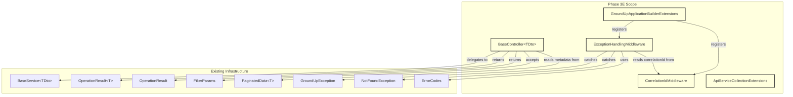
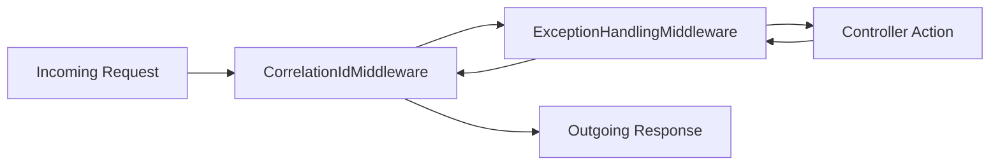
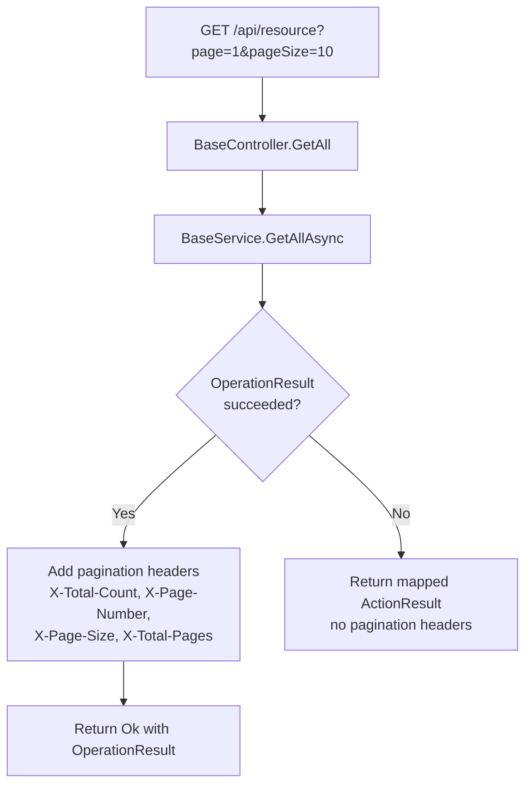
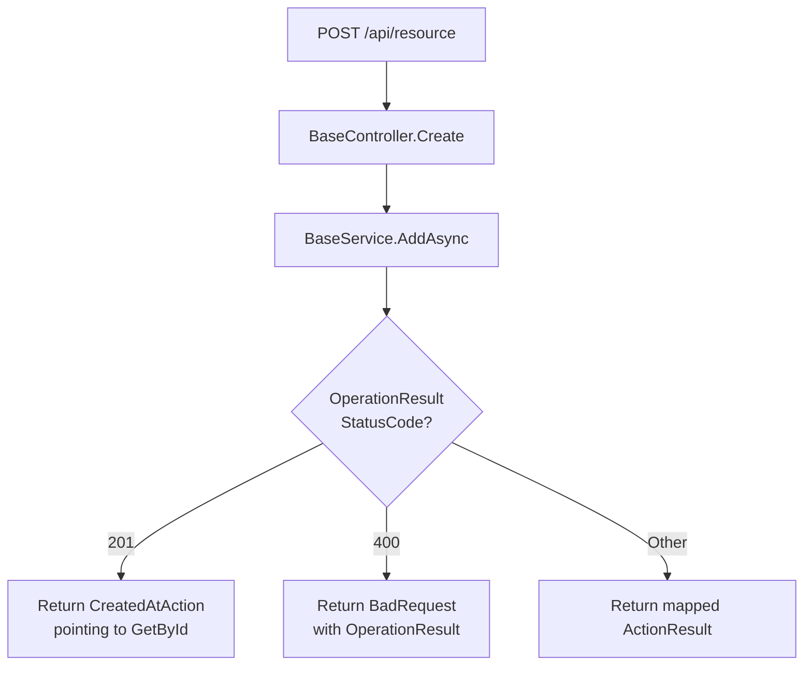
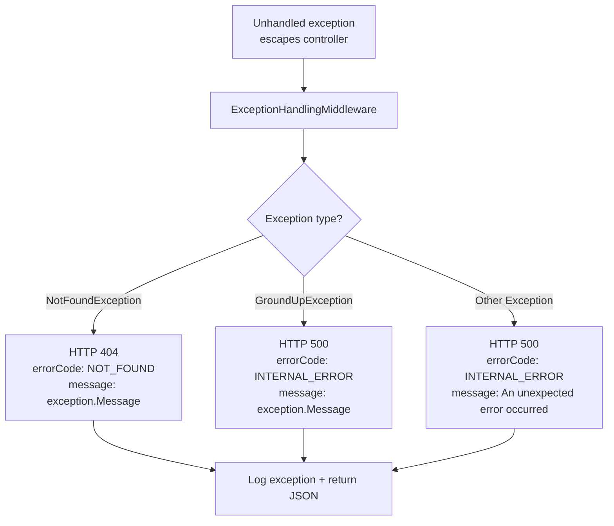

# Design Document: Phase 3E — API Layer & Middleware

## Overview

Phase 3E builds the API layer in `GroundUp.Api` — the thin HTTP adapter that sits on top of the service layer. This phase delivers four production types and two extension methods:

1. **`BaseController<TDto>`** — an abstract generic controller wrapping `BaseService<TDto>` with standard CRUD endpoints (GET all, GET by id, POST, PUT, DELETE) and a private helper that maps `OperationResult.StatusCode` to the appropriate `ActionResult`.
2. **`ExceptionHandlingMiddleware`** — catches unhandled exceptions that escape the controller layer and maps them to structured JSON error responses using the typed exception hierarchy.
3. **`CorrelationIdMiddleware`** — reads or generates a correlation ID per request, stores it in `HttpContext.Items`, and adds it to response headers.
4. **`ApiServiceCollectionExtensions.AddGroundUpApi()`** — DI extension method for registering API-layer services.
5. **`GroundUpApplicationBuilderExtensions.UseGroundUpMiddleware()`** — middleware pipeline extension that registers CorrelationIdMiddleware first and ExceptionHandlingMiddleware second.

### Key Design Decisions

1. **GroundUp.Api is a class library, not a web project.** It uses `Sdk="Microsoft.NET.Sdk"` with a `<FrameworkReference Include="Microsoft.AspNetCore.App" />` to access ASP.NET Core types (ControllerBase, ActionResult, middleware pipeline) without being a web project. This lets consuming applications reference it as a NuGet package without pulling in web host infrastructure.

2. **Controllers are thin HTTP adapters.** Zero business logic, zero security checks. Every endpoint delegates to `BaseService<TDto>` and converts the `OperationResult` to an `ActionResult`. The private `ToActionResult` helper centralizes the status code mapping so all endpoints are consistent.

3. **OperationResult IS the response body.** The controller returns the `OperationResult<T>` (or `OperationResult`) directly as the response body — it is not unwrapped or transformed. This keeps the API response structure consistent and predictable for consumers. The `OperationResult` already contains `Success`, `Message`, `Data`, `Errors`, `StatusCode`, and `ErrorCode` — everything a client needs.

4. **Middleware ordering matters.** `CorrelationIdMiddleware` runs first (outermost) so that the correlation ID is available in `HttpContext.Items` before `ExceptionHandlingMiddleware` catches any exception. This ensures every error response includes the correlation ID for traceability.

5. **Exception mapping uses typed checks, not string matching.** `ExceptionHandlingMiddleware` uses `is NotFoundException` and `is GroundUpException` pattern matching — never string matching on exception messages. This follows the framework's anti-pattern rules and is robust against message changes.

6. **Generic exceptions hide internal details.** When an unhandled `Exception` (not a `GroundUpException` subclass) is caught, the middleware returns a generic "An unexpected error occurred" message. The raw exception message and stack trace are logged but never exposed in the response body, preventing information leakage.

7. **Pagination headers on list endpoints.** The GET all endpoint adds `X-Total-Count`, `X-Page-Number`, `X-Page-Size`, and `X-Total-Pages` response headers from `PaginatedData<T>` metadata. This lets clients implement pagination without parsing the response body. Headers are only added on success — failed responses get no pagination headers.

8. **POST returns CreatedAtAction.** On a successful 201 from `AddAsync`, the POST endpoint returns `CreatedAtAction` pointing to the GET by id endpoint. This provides the standard REST `Location` header for the newly created resource.

9. **Virtual methods for all endpoints.** Every public endpoint method is `virtual` so derived controllers can override specific operations (e.g., adding custom response headers, transforming the response) while inheriting the default pipeline for others.

10. **Error response structure uses camelCase.** The `ExceptionHandlingMiddleware` error response JSON uses camelCase property naming (`message`, `errorCode`, `correlationId`) consistent with ASP.NET Core's default `JsonSerializerOptions`.

## Architecture

### Where Phase 3E Fits



### Middleware Pipeline Order



CorrelationIdMiddleware is outermost — it sets the correlation ID before any other middleware runs. ExceptionHandlingMiddleware wraps the controller layer — it catches exceptions and includes the correlation ID in error responses.

### Request Flow — GET All



### Request Flow — POST



### Request Flow — Exception Handling



## Components and Interfaces

### Project Structure Changes

```
src/GroundUp.Api/
├── Controllers/
│   └── BaseController.cs                           (new)
├── Middleware/
│   ├── ExceptionHandlingMiddleware.cs               (new)
│   └── CorrelationIdMiddleware.cs                   (new)
├── ApiServiceCollectionExtensions.cs                (new)
├── GroundUpApplicationBuilderExtensions.cs          (new)
└── GroundUp.Api.csproj                             (modified — add FrameworkReference)
```

### GroundUp.Api.csproj Changes

```xml
<Project Sdk="Microsoft.NET.Sdk">

  <PropertyGroup>
    <TargetFramework>net8.0</TargetFramework>
    <ImplicitUsings>enable</ImplicitUsings>
    <Nullable>enable</Nullable>
  </PropertyGroup>

  <ItemGroup>
    <FrameworkReference Include="Microsoft.AspNetCore.App" />
  </ItemGroup>

  <ItemGroup>
    <ProjectReference Include="..\GroundUp.Core\GroundUp.Core.csproj" />
    <ProjectReference Include="..\GroundUp.Services\GroundUp.Services.csproj" />
  </ItemGroup>

</Project>
```

The `FrameworkReference` to `Microsoft.AspNetCore.App` provides access to `ControllerBase`, `ActionResult`, `IApplicationBuilder`, `HttpContext`, `IMiddleware`, and all other ASP.NET Core types without NuGet package references.

### BaseController\<TDto\>

```csharp
namespace GroundUp.Api.Controllers;

[ApiController]
[Route("api/[controller]")]
public abstract class BaseController<TDto> : ControllerBase where TDto : class
{
    protected BaseService<TDto> Service { get; }

    protected BaseController(BaseService<TDto> service)
    {
        Service = service;
    }

    [HttpGet]
    public virtual async Task<ActionResult<OperationResult<PaginatedData<TDto>>>> GetAll(
        [FromQuery] FilterParams filterParams,
        CancellationToken cancellationToken = default)
    {
        var result = await Service.GetAllAsync(filterParams, cancellationToken);

        if (result.Success && result.Data is not null)
        {
            Response.Headers["X-Total-Count"] = result.Data.TotalRecords.ToString();
            Response.Headers["X-Page-Number"] = result.Data.PageNumber.ToString();
            Response.Headers["X-Page-Size"] = result.Data.PageSize.ToString();
            Response.Headers["X-Total-Pages"] = result.Data.TotalPages.ToString();
        }

        return ToActionResult(result);
    }

    [HttpGet("{id}")]
    public virtual async Task<ActionResult<OperationResult<TDto>>> GetById(
        Guid id,
        CancellationToken cancellationToken = default)
    {
        var result = await Service.GetByIdAsync(id, cancellationToken);
        return ToActionResult(result);
    }

    [HttpPost]
    public virtual async Task<ActionResult<OperationResult<TDto>>> Create(
        [FromBody] TDto dto,
        CancellationToken cancellationToken = default)
    {
        var result = await Service.AddAsync(dto, cancellationToken);

        if (result.Success && result.StatusCode == 201)
            return CreatedAtAction(nameof(GetById), new { id = /* extracted from result */ }, result);

        return ToActionResult(result);
    }

    [HttpPut("{id}")]
    public virtual async Task<ActionResult<OperationResult<TDto>>> Update(
        Guid id,
        [FromBody] TDto dto,
        CancellationToken cancellationToken = default)
    {
        var result = await Service.UpdateAsync(id, dto, cancellationToken);
        return ToActionResult(result);
    }

    [HttpDelete("{id}")]
    public virtual async Task<ActionResult<OperationResult>> Delete(
        Guid id,
        CancellationToken cancellationToken = default)
    {
        var result = await Service.DeleteAsync(id, cancellationToken);
        return ToActionResult(result);
    }

    private ActionResult ToActionResult<T>(OperationResult<T> result)
    {
        return result.StatusCode switch
        {
            200 => Ok(result),
            201 => StatusCode(201, result),
            400 => BadRequest(result),
            401 => Unauthorized(),
            403 => StatusCode(403, result),
            404 => NotFound(result),
            _ => new ObjectResult(result) { StatusCode = result.StatusCode }
        };
    }

    private ActionResult ToActionResult(OperationResult result)
    {
        return result.StatusCode switch
        {
            200 => Ok(result),
            201 => StatusCode(201, result),
            400 => BadRequest(result),
            401 => Unauthorized(),
            403 => StatusCode(403, result),
            404 => NotFound(result),
            _ => new ObjectResult(result) { StatusCode = result.StatusCode }
        };
    }
}
```

**Implementation notes:**

- The `ToActionResult` helper uses a `switch` expression on `StatusCode`. The explicitly mapped codes (200, 201, 400, 401, 403, 404) use ASP.NET Core's built-in helper methods for correct response types. The default case uses `ObjectResult` with the status code set directly — this handles any future status codes (409 Conflict, 422 Unprocessable Entity, etc.) without requiring code changes.
- The 401 case returns `Unauthorized()` (no body) because ASP.NET Core's `UnauthorizedResult` doesn't accept a body parameter. This is consistent with HTTP semantics — 401 responses typically include a `WWW-Authenticate` header, not a body.
- The POST endpoint checks for `StatusCode == 201` specifically because `BaseService.AddAsync` returns 201 on success (via the repository). If the status code is 201, it returns `CreatedAtAction` pointing to `GetById` with the new resource's ID. For any other status code (e.g., 400 validation failure), it falls through to `ToActionResult`.
- Both generic and non-generic overloads of `ToActionResult` follow the same mapping. The non-generic version is used by `Delete` (which returns `OperationResult` without data).

### ExceptionHandlingMiddleware

```csharp
namespace GroundUp.Api.Middleware;

public sealed class ExceptionHandlingMiddleware
{
    private readonly RequestDelegate _next;
    private readonly ILogger<ExceptionHandlingMiddleware> _logger;

    public ExceptionHandlingMiddleware(
        RequestDelegate next,
        ILogger<ExceptionHandlingMiddleware> logger)
    {
        _next = next;
        _logger = logger;
    }

    public async Task InvokeAsync(HttpContext context)
    {
        try
        {
            await _next(context);
        }
        catch (Exception ex)
        {
            _logger.LogError(ex, "Unhandled exception occurred");
            await HandleExceptionAsync(context, ex);
        }
    }

    private static async Task HandleExceptionAsync(HttpContext context, Exception exception)
    {
        var (statusCode, message, errorCode) = exception switch
        {
            NotFoundException nfe => (404, nfe.Message, ErrorCodes.NotFound),
            GroundUpException gue => (500, gue.Message, ErrorCodes.InternalError),
            _ => (500, "An unexpected error occurred", ErrorCodes.InternalError)
        };

        var correlationId = context.Items.TryGetValue("CorrelationId", out var id)
            ? id?.ToString()
            : null;

        var response = new
        {
            message,
            errorCode,
            correlationId
        };

        context.Response.StatusCode = statusCode;
        context.Response.ContentType = "application/json";

        await context.Response.WriteAsJsonAsync(response);
    }
}
```

**Implementation notes:**

- The `switch` expression on exception type uses pattern matching (`is NotFoundException`, `is GroundUpException`). Order matters: `NotFoundException` is checked first because it inherits from `GroundUpException`. If the order were reversed, all `NotFoundException` instances would match the `GroundUpException` case.
- The correlation ID is read from `HttpContext.Items["CorrelationId"]` — set by `CorrelationIdMiddleware` earlier in the pipeline. If no correlation ID is available (e.g., middleware ordering is wrong), the field is `null`.
- `WriteAsJsonAsync` uses ASP.NET Core's default `JsonSerializerOptions`, which produces camelCase property names. The anonymous type `{ message, errorCode, correlationId }` serializes to `{"message":"...","errorCode":"...","correlationId":"..."}`.
- The full exception (message + stack trace) is logged via `_logger.LogError(ex, ...)` before the sanitized response is sent. This ensures developers can diagnose issues from logs without exposing internals to API consumers.

### CorrelationIdMiddleware

```csharp
namespace GroundUp.Api.Middleware;

public sealed class CorrelationIdMiddleware
{
    public const string HeaderName = "X-Correlation-Id";

    private readonly RequestDelegate _next;

    public CorrelationIdMiddleware(RequestDelegate next)
    {
        _next = next;
    }

    public async Task InvokeAsync(HttpContext context)
    {
        var correlationId = context.Request.Headers.TryGetValue(HeaderName, out var values)
            && !string.IsNullOrWhiteSpace(values.FirstOrDefault())
            ? values.First()!
            : Guid.NewGuid().ToString();

        context.Items["CorrelationId"] = correlationId;

        context.Response.OnStarting(() =>
        {
            context.Response.Headers[HeaderName] = correlationId;
            return Task.CompletedTask;
        });

        await _next(context);
    }
}
```

**Implementation notes:**

- The header name `X-Correlation-Id` is defined as a `public const string HeaderName` to avoid magic strings. Both the middleware and tests reference this constant.
- `Response.OnStarting` is used to add the response header. This callback fires just before response headers are sent to the client, ensuring the header is added even if the response is modified by later middleware or the controller.
- When the incoming request has the header, its value is used as-is. When the header is missing or empty/whitespace, a new `Guid.NewGuid().ToString()` is generated.
- The correlation ID is stored in `HttpContext.Items["CorrelationId"]` — a per-request dictionary accessible to all middleware and controllers in the pipeline.

### ApiServiceCollectionExtensions

```csharp
namespace GroundUp.Api;

public static class ApiServiceCollectionExtensions
{
    public static IServiceCollection AddGroundUpApi(this IServiceCollection services)
    {
        return services;
    }
}
```

Currently a placeholder that returns the service collection for method chaining. As the API layer grows (e.g., adding custom JSON serializer options, API versioning, Swagger configuration), registrations will be added here. The method exists now so consuming applications can call `services.AddGroundUpApi()` from day one and pick up new registrations automatically as the framework evolves.

### GroundUpApplicationBuilderExtensions

```csharp
namespace GroundUp.Api;

public static class GroundUpApplicationBuilderExtensions
{
    public static IApplicationBuilder UseGroundUpMiddleware(this IApplicationBuilder app)
    {
        app.UseMiddleware<CorrelationIdMiddleware>();
        app.UseMiddleware<ExceptionHandlingMiddleware>();
        return app;
    }
}
```

**Ordering rationale:** `CorrelationIdMiddleware` is registered first so it runs outermost in the pipeline. When `ExceptionHandlingMiddleware` catches an exception, the correlation ID is already in `HttpContext.Items` and can be included in the error response.

## Data Models

Phase 3E does not introduce new database entities or DTOs. It operates entirely through the existing types from Core and Services.

### Type Dependencies

| Type | Project | Role in Phase 3E |
|------|---------|-----------------|
| `BaseService<TDto>` | Services | Injected into BaseController; all CRUD delegated here |
| `OperationResult<T>` | Core | Return type from service methods; response body for endpoints |
| `OperationResult` | Core | Return type for DeleteAsync; response body for DELETE endpoint |
| `FilterParams` | Core | Query string parameter for GET all endpoint |
| `PaginatedData<T>` | Core | Wrapped in OperationResult; pagination metadata read for headers |
| `GroundUpException` | Core | Caught by ExceptionHandlingMiddleware → HTTP 500 |
| `NotFoundException` | Core | Caught by ExceptionHandlingMiddleware → HTTP 404 |
| `ErrorCodes` | Core | Machine-readable error codes in middleware error responses |

### Error Response Model

The `ExceptionHandlingMiddleware` returns an anonymous object serialized as JSON:

| Field | Type | Description |
|-------|------|-------------|
| `message` | `string` | Human-readable error description |
| `errorCode` | `string` | Machine-readable code from `ErrorCodes` (e.g., `"NOT_FOUND"`, `"INTERNAL_ERROR"`) |
| `correlationId` | `string?` | The correlation ID from `HttpContext.Items`, or `null` if unavailable |

### Test Helpers (new for Phase 3E)

| Type | Purpose |
|------|---------|
| `ControllerTestDto` | Simple DTO record with `Id` and `Name` properties for testing BaseController |
| `TestController` | Concrete `BaseController<ControllerTestDto>` that exposes the base endpoints for testing |
| `TestBaseService` | Concrete `BaseService<ControllerTestDto>` needed to instantiate TestController |


## Correctness Properties

*A property is a characteristic or behavior that should hold true across all valid executions of a system — essentially, a formal statement about what the system should do. Properties serve as the bridge between human-readable specifications and machine-verifiable correctness guarantees.*

Phase 3E has three testable properties. Two focus on the `ToActionResult` helper — the central mapping function that converts `OperationResult.StatusCode` to the correct HTTP status code on the `ActionResult`. One focuses on `CorrelationIdMiddleware` — verifying that any correlation ID provided in the request header is propagated unchanged.

**Why PBT applies here:**

1. **ToActionResult mapping (generic and non-generic):** The input space is the full range of HTTP status codes (200–599). The property is universal: for ANY status code, the resulting `ActionResult` must carry that same status code. Running 100+ iterations with random status codes tests the switch expression's default branch and verifies no status code is silently dropped or remapped. This is a pure function — no I/O, no side effects, negligible cost per iteration.

2. **Correlation ID propagation:** The input space is all possible non-empty strings. The property is universal: for ANY non-empty string provided as the `X-Correlation-Id` header, the middleware must store and return that exact string unchanged. Running 100+ iterations with random strings (including special characters, Unicode, very long strings) tests edge cases that example-based tests would miss.

### Property 1: Generic OperationResult-to-ActionResult status code preservation

*For any* `OperationResult<T>` with a `StatusCode` value in the range 200–599, the `ToActionResult` helper SHALL produce an `ActionResult` whose HTTP status code equals the `OperationResult.StatusCode`.

**Validates: Requirements 8.2, 8.3, 8.4, 8.5, 8.6, 8.7, 8.8, 19.1**

### Property 2: Non-generic OperationResult-to-ActionResult status code preservation

*For any* non-generic `OperationResult` with a `StatusCode` value in the range 200–599, the `ToActionResult` helper SHALL produce an `ActionResult` whose HTTP status code equals the `OperationResult.StatusCode`.

**Validates: Requirements 8.9, 19.2**

### Property 3: Correlation ID header propagation

*For any* non-empty string value provided as the `X-Correlation-Id` request header, the `CorrelationIdMiddleware` SHALL store that exact value in `HttpContext.Items["CorrelationId"]` and add that exact value to the response `X-Correlation-Id` header.

**Validates: Requirements 10.3, 10.5, 10.6, 20.1**

## Error Handling

### Controller Error Strategy

BaseController follows the GroundUp convention: it never throws exceptions for business logic. All service results are `OperationResult` instances, and the `ToActionResult` helper maps them to the correct HTTP response. The controller itself has no try/catch blocks — unhandled exceptions propagate to `ExceptionHandlingMiddleware`.

| Scenario | Behavior | HTTP Response |
|----------|----------|---------------|
| Service returns 200 Ok | `ToActionResult` → `OkObjectResult` | 200 with OperationResult body |
| Service returns 201 Created | POST: `CreatedAtAction`; others: `StatusCode(201, result)` | 201 with OperationResult body |
| Service returns 400 BadRequest | `ToActionResult` → `BadRequestObjectResult` | 400 with OperationResult body |
| Service returns 401 Unauthorized | `ToActionResult` → `UnauthorizedResult` | 401 (no body) |
| Service returns 403 Forbidden | `ToActionResult` → `ObjectResult` with 403 | 403 with OperationResult body |
| Service returns 404 NotFound | `ToActionResult` → `NotFoundObjectResult` | 404 with OperationResult body |
| Service returns other code (e.g., 409) | `ToActionResult` → `ObjectResult` with that code | {code} with OperationResult body |
| Unhandled exception | Propagates to ExceptionHandlingMiddleware | See middleware mapping below |

### Middleware Error Strategy

`ExceptionHandlingMiddleware` is the last line of defense. It catches exceptions that escape the controller layer and maps them to structured JSON responses.

| Exception Type | HTTP Status | Error Code | Message |
|---------------|-------------|------------|---------|
| `NotFoundException` | 404 | `NOT_FOUND` | Exception message (safe — developer-controlled) |
| `GroundUpException` | 500 | `INTERNAL_ERROR` | Exception message (safe — developer-controlled) |
| Any other `Exception` | 500 | `INTERNAL_ERROR` | `"An unexpected error occurred"` (generic — hides internals) |

**Design rationale:**

1. **NotFoundException gets its own message.** `NotFoundException` is thrown by framework code with developer-controlled messages like "Entity with ID {id} not found". These are safe to expose because they don't contain stack traces or internal implementation details.

2. **GroundUpException gets its own message.** Same reasoning — `GroundUpException` messages are developer-controlled and safe to expose.

3. **Generic exceptions get a generic message.** Any exception not in the `GroundUpException` hierarchy could contain sensitive information (database connection strings, file paths, internal state). The middleware returns a fixed generic message and logs the real exception for developer debugging.

4. **All exceptions are logged.** `_logger.LogError(ex, "Unhandled exception occurred")` captures the full exception (message, stack trace, inner exceptions) in structured logs. The correlation ID is available in the log context for tracing.

### Error Codes Used

| Error Code | Constant | HTTP Status | Used By |
|------------|----------|-------------|---------|
| `NOT_FOUND` | `ErrorCodes.NotFound` | 404 | ExceptionHandlingMiddleware (NotFoundException) |
| `INTERNAL_ERROR` | `ErrorCodes.InternalError` | 500 | ExceptionHandlingMiddleware (GroundUpException, generic Exception) |

All other error codes (`VALIDATION_FAILED`, `UNAUTHORIZED`, `FORBIDDEN`, `CONFLICT`) originate from the service/repository layers and pass through the controller via `OperationResult` — the middleware never sees them unless an exception is thrown.

## Testing Strategy

### Dual Testing Approach

- **Property-based tests (FsCheck.Xunit):** Verify the three universal properties — `ToActionResult` status code preservation (generic and non-generic) and correlation ID propagation. 100+ iterations per property. These test the mappings that must hold across the full input space.
- **Unit tests (xUnit + NSubstitute):** Verify specific behavioral scenarios — endpoint delegation, pagination headers, exception mapping, middleware pass-through, DI extension methods. Example-based tests with mocked dependencies.

Both are complementary: property tests verify the mappings hold across all inputs, unit tests verify the orchestration and integration behavior for specific scenarios.

### Property-Based Testing Configuration

- **Library:** FsCheck.Xunit (already in the test project)
- **Minimum iterations:** 100 per property test
- **Tag format:** `Feature: phase3e-api-layer, Property {number}: {property_text}`
- Each correctness property maps to one `[Property]` test method

**Testing the private `ToActionResult` helper:** Since `ToActionResult` is private, the property tests exercise it indirectly through the public endpoint methods. For the generic overload, the test calls `GetById` with a mocked service returning an `OperationResult<T>` with a random status code, then verifies the `ActionResult` has the matching HTTP status code. For the non-generic overload, the test calls `Delete` with a mocked service returning an `OperationResult` with a random status code.

### Test Plan

| Test | Type | Property | What's Verified |
|------|------|----------|-----------------|
| Generic ToActionResult status code preservation | Property | 1 | For all status codes 200–599, ActionResult matches OperationResult.StatusCode |
| Non-generic ToActionResult status code preservation | Property | 2 | For all status codes 200–599, ActionResult matches OperationResult.StatusCode |
| Correlation ID header propagation | Property | 3 | For all non-empty strings, middleware propagates value unchanged |
| GET all delegates to service and returns Ok with pagination headers | Unit | — | Delegation + pagination headers on success |
| GET all does NOT add pagination headers on failure | Unit | — | No headers on failure |
| GET by id delegates to service and returns Ok on success | Unit | — | Delegation + Ok result |
| GET by id returns NotFound on 404 | Unit | — | NotFound mapping |
| POST delegates to service and returns Created on 201 | Unit | — | Delegation + CreatedAtAction |
| POST returns BadRequest on 400 | Unit | — | BadRequest mapping |
| PUT delegates to service and returns Ok on success | Unit | — | Delegation + Ok result |
| PUT returns NotFound on 404 | Unit | — | NotFound mapping |
| PUT returns BadRequest on 400 | Unit | — | BadRequest mapping |
| DELETE delegates to service and returns Ok on success | Unit | — | Delegation + Ok result |
| DELETE returns NotFound on 404 | Unit | — | NotFound mapping |
| StatusCode 200 → OkObjectResult | Unit | — | Specific type check |
| StatusCode 201 → 201 result | Unit | — | Specific type check |
| StatusCode 400 → BadRequestObjectResult | Unit | — | Specific type check |
| StatusCode 401 → UnauthorizedResult | Unit | — | Specific type check |
| StatusCode 403 → 403 result | Unit | — | Specific type check |
| StatusCode 404 → NotFoundObjectResult | Unit | — | Specific type check |
| Unmapped StatusCode (e.g., 409) → ObjectResult with correct code | Unit | — | Default branch |
| NotFoundException → HTTP 404 with NOT_FOUND | Unit | — | Exception mapping |
| GroundUpException → HTTP 500 with INTERNAL_ERROR | Unit | — | Exception mapping |
| Generic Exception → HTTP 500 with generic message | Unit | — | Exception mapping + info hiding |
| Generic Exception does NOT expose raw message | Unit | — | Security check |
| Error response contains correlationId | Unit | — | Correlation ID in error response |
| Error response Content-Type is application/json | Unit | — | Content-Type header |
| Middleware calls next delegate when no exception | Unit | — | Pass-through behavior |
| Incoming X-Correlation-Id header is used | Unit | — | Header reading |
| Missing header generates new GUID | Unit | — | GUID generation |
| Correlation ID stored in HttpContext.Items | Unit | — | Items storage |
| Correlation ID added to response headers | Unit | — | Response header |
| Middleware calls next delegate | Unit | — | Pass-through behavior |

### Test Infrastructure

Phase 3E tests need access to ASP.NET Core types (`ControllerBase`, `HttpContext`, `DefaultHttpContext`, `ActionResult`). The test project needs:

1. A `FrameworkReference` to `Microsoft.AspNetCore.App` (or a reference to `Microsoft.AspNetCore.Mvc.Testing` — but since we're unit testing controllers directly, the FrameworkReference is simpler).
2. A project reference to `GroundUp.Api`.

```
tests/GroundUp.Tests.Unit/
├── Api/
│   ├── TestHelpers/
│   │   ├── ControllerTestDto.cs                    (new — simple DTO record)
│   │   └── TestController.cs                       (new — concrete BaseController<ControllerTestDto>)
│   ├── BaseControllerTests.cs                      (new — unit tests for CRUD endpoints)
│   ├── BaseControllerPropertyTests.cs              (new — property-based tests for ToActionResult)
│   ├── ExceptionHandlingMiddlewareTests.cs         (new — unit tests for exception mapping)
│   └── CorrelationIdMiddlewareTests.cs             (new — unit + property tests for correlation ID)
```

**Test helpers:**

- `ControllerTestDto` — `public record ControllerTestDto(Guid Id, string Name)` — minimal DTO for testing.
- `TestController` — Concrete `BaseController<ControllerTestDto>` that simply calls the base constructor. Exists only to make the abstract class instantiable for testing.

**Mocking strategy:**

- `BaseService<ControllerTestDto>` — NSubstitute mock (BaseService is abstract, so we substitute it). Configured to return specific `OperationResult` values per test.
- `ILogger<ExceptionHandlingMiddleware>` — NSubstitute mock for verifying log calls.
- `HttpContext` — Use ASP.NET Core's `DefaultHttpContext` (a real implementation, not a mock) for middleware tests. It provides a fully functional `HttpContext` with `Request`, `Response`, `Items`, and `Headers`.

**Controller test setup:** For controller unit tests, the `TestController` is instantiated with a mocked `BaseService`. The controller's `ControllerContext` is set with a `DefaultHttpContext` so that `Response.Headers` is available for pagination header assertions.

### What Is NOT Tested

- Class structure (abstract/sealed, file-scoped namespace) — verified by code review
- XML documentation comments — verified by code review
- Attribute presence ([ApiController], [Route], [HttpGet], etc.) — verified by code review
- Generic constraint (`where TDto : class`) — verified by compilation
- Virtual method modifier — verified by code review
- Protected property accessibility — verified by `TestController` accessing it (compilation check)
- FrameworkReference in csproj — verified by `dotnet build`
- Middleware registration order in `UseGroundUpMiddleware` — verified by code review (the method body is two lines)
- `AddGroundUpApi` placeholder — verified by compilation (returns `services`)
