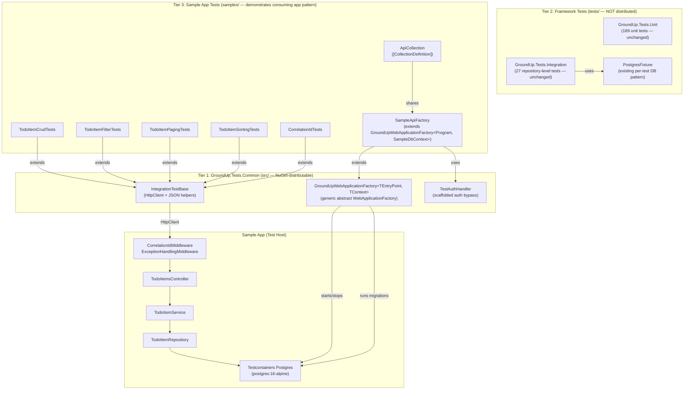
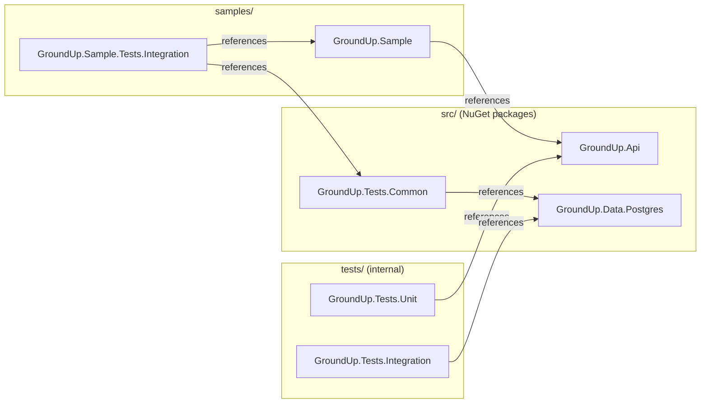

# Design Document: Phase 4 — Testing Foundation (HTTP Integration Test Infrastructure)

## Overview

This design describes the HTTP-level integration test infrastructure for the GroundUp framework. It introduces a **three-tier architecture** that cleanly separates framework test infrastructure (NuGet-distributable), framework-internal tests, and sample application tests:

1. **`GroundUp.Tests.Common`** — A new framework project (`src/`) published as a NuGet package containing reusable base test classes that any consuming application can reference to set up its own integration tests.
2. **`GroundUp.Tests.Unit` + `GroundUp.Tests.Integration`** — The existing framework test projects (`tests/`) that test GroundUp's own code. Not distributed as NuGet packages.
3. **`GroundUp.Sample.Tests.Integration`** — A new sample test project (`samples/`) that demonstrates how a consuming application uses `GroundUp.Tests.Common` to build its own integration test suite.

This separation reflects a key architectural insight: the sample application represents a real consuming app. A real app would consume GroundUp as NuGet packages and would NOT have access to the framework's internal test projects. However, consuming apps SHOULD be able to access reusable base test classes so they can leverage them in their own test projects.

The infrastructure exercises the full HTTP stack — from HTTP request through middleware, controllers, services, and repositories down to a real Postgres database via Testcontainers — and validates the Sample app's TodoItem CRUD endpoints end-to-end.

## Architecture



### Three-Tier Dependency Flow



### Key Design Decisions

1. **Three-tier separation mirrors real-world consumption.** `GroundUp.Tests.Common` lives in `src/` because it's framework infrastructure distributed as a NuGet package — just like `GroundUp.Api` or `GroundUp.Data.Postgres`. The sample test project lives in `samples/` because it represents a consuming application's test project. This means a real app would follow the exact same pattern: reference `GroundUp.Tests.Common`, subclass the generic factory, write tests.

2. **Generic `GroundUpWebApplicationFactory<TContext>` enables any consuming app.** The factory takes a `DbContext` type parameter constrained to `GroundUpDbContext`. It handles Testcontainers lifecycle, connection string replacement, and migration execution generically. Consuming apps subclass it with their own `DbContext` to get a fully configured test host.

3. **Existing `tests/GroundUp.Tests.Integration/` is NOT modified.** The existing 27 repository-level integration tests using `PostgresFixture` remain exactly as they are. They test the framework's own repository code (BaseRepository, ExpressionHelper, etc.) and have nothing to do with the sample app's HTTP tests.

4. **Separate xUnit collections avoid lifecycle conflicts.** The existing `PostgresFixture` uses a "Postgres" collection with per-test databases. The new `SampleApiFactory` uses an "Api" collection with a single shared database. Keeping them in separate collections (and separate projects) avoids any lifecycle interference.

5. **Migrations via `context.Database.Migrate()` instead of `EnsureCreated()`.** The existing `PostgresFixture` uses `EnsureCreated()` for per-test databases. The HTTP test factory uses `Migrate()` to match production behavior and validate that migrations work correctly.

6. **Single shared container per collection.** All HTTP integration tests share one Postgres container (via `ICollectionFixture<SampleApiFactory>`) to minimize Docker overhead. Each test creates its own data, so tests remain independent without needing per-test databases.

7. **`TestAuthHandler` is registered but not enforced.** The handler is wired into the DI container so the infrastructure is ready for Phase 9. Since no `[Authorize]` attributes exist yet, it has no effect on current tests.

8. **Solution folder placement.** `GroundUp.Tests.Common` goes under the `src/` solution folder (it's framework code). `GroundUp.Sample.Tests.Integration` goes under the `samples/` solution folder (it's sample app code).

9. **Program class visibility.** `WebApplicationFactory<TEntryPoint>` requires the entry point class to be accessible. Apps using top-level statements (like the Sample app) generate an `internal` Program class. The standard solution is to add `public partial class Program { }` at the bottom of `Program.cs`. This is a requirement for any consuming app using the test infrastructure.

## Components and Interfaces

### Tier 1: GroundUp.Tests.Common (NuGet-distributable framework test infrastructure)

#### GroundUpWebApplicationFactory\<TEntryPoint, TContext\>

```csharp
// Location: src/GroundUp.Tests.Common/Fixtures/GroundUpWebApplicationFactory.cs
namespace GroundUp.Tests.Common.Fixtures;

/// <summary>
/// Generic abstract WebApplicationFactory that starts a Testcontainers Postgres instance,
/// replaces the DbContext registration with one pointing to the container, and runs EF Core migrations.
/// Consuming applications subclass this with their own entry point and DbContext types.
/// </summary>
/// <typeparam name="TEntryPoint">
/// The consuming application's entry point class (typically Program).
/// Must be public — apps using top-level statements need: public partial class Program { }
/// </typeparam>
/// <typeparam name="TContext">
/// The consuming application's DbContext type. Must inherit from GroundUpDbContext.
/// </typeparam>
public abstract class GroundUpWebApplicationFactory<TEntryPoint, TContext>
    : WebApplicationFactory<TEntryPoint>, IAsyncLifetime
    where TEntryPoint : class
    where TContext : GroundUpDbContext
{
    // Manages Testcontainers Postgres lifecycle
    // Overrides ConfigureWebHost to replace DbContext registration
    // Runs EF Core migrations on startup via TContext
    // Registers TestAuthHandler (inactive)
    // Virtual hook for subclasses to add additional service configuration
}
```

**Responsibilities:**
- Start a `postgres:16-alpine` Testcontainers instance in `InitializeAsync()`
- Override `ConfigureWebHost()` to replace the DbContext registration with one pointing to the Testcontainers connection string
- Apply EF Core migrations via `TContext.Database.Migrate()`
- Register `TestAuthHandler` as an authentication scheme (not enforced)
- Provide a `virtual void ConfigureTestServices(IServiceCollection services)` hook for subclasses to add additional service registrations
- Stop and dispose the container in `DisposeAsync()`

**Connection string replacement strategy:** Use `ConfigureWebHost` → `ConfigureTestServices` to remove ONLY the `DbContextOptions<TContext>` registration (via `services.RemoveAll<DbContextOptions<TContext>>()`) and re-register the DbContext with the Testcontainers connection string using `services.AddDbContext<TContext>()` directly (NOT `AddGroundUpPostgres`). This avoids double-registering the `AuditableInterceptor`, `SoftDeleteInterceptor`, and `DataSeederRunner` that were already registered by the consuming app's `AddGroundUpPostgres()` call. The new DbContext registration reuses the already-registered interceptors from the service provider.

**Generic constraints:**
- `where TEntryPoint : class` — required by `WebApplicationFactory<T>`
- `where TContext : GroundUpDbContext` — ensures only GroundUp-compatible DbContexts can be used, which guarantees the migration and interceptor infrastructure works correctly

#### IntegrationTestBase

```csharp
// Location: src/GroundUp.Tests.Common/Fixtures/IntegrationTestBase.cs
namespace GroundUp.Tests.Common.Fixtures;

/// <summary>
/// Abstract base class for HTTP integration tests. Provides an HttpClient
/// and JSON serialization helpers. Test classes inherit from this and pass
/// an HttpClient created from their factory.
/// </summary>
public abstract class IntegrationTestBase
{
    protected HttpClient Client { get; }

    protected IntegrationTestBase(HttpClient client)
    {
        Client = client;
    }

    // JSON helpers
    protected static StringContent ToJsonContent<T>(T obj);
    protected static async Task<OperationResult<T>?> ReadResultAsync<T>(HttpResponseMessage response);
    protected static async Task<OperationResult?> ReadResultAsync(HttpResponseMessage response);
}
```

**Responsibilities:**
- Accept an `HttpClient` via constructor (the test class creates it from its factory via `factory.CreateClient()`)
- Provide `ToJsonContent<T>()` — serializes an object to `StringContent` with `application/json` content type using `System.Text.Json` with `JsonSerializerOptions { PropertyNamingPolicy = JsonNamingPolicy.CamelCase }`
- Provide `ReadResultAsync<T>()` — deserializes response body to `OperationResult<T>` using camelCase JSON options
- Provide `ReadResultAsync()` — deserializes response body to non-generic `OperationResult`

**JSON serialization options:** Use `JsonSerializerOptions` with `PropertyNamingPolicy = CamelCase` and `PropertyNameCaseInsensitive = true` to match ASP.NET Core's default JSON serialization behavior.

**Constructor accepts `HttpClient`** (not a factory type) so that it works with any `WebApplicationFactory<T>` subclass regardless of the entry point type. The test class is responsible for creating the client from its factory.

#### TestAuthHandler

```csharp
// Location: src/GroundUp.Tests.Common/Fixtures/TestAuthHandler.cs
namespace GroundUp.Tests.Common.Fixtures;

/// <summary>
/// Authentication handler that auto-authenticates all requests with a default test user.
/// Registered but not enforced until [Authorize] attributes are added in Phase 9.
/// </summary>
public sealed class TestAuthHandler : AuthenticationHandler<AuthenticationSchemeOptions>
{
    public const string SchemeName = "TestScheme";

    // Returns AuthenticateResult.Success with a default test user ClaimsPrincipal
    // Contains claims: sub=test-user-id, name=Test User, email=test@example.com
}
```

**Responsibilities:**
- Implement `HandleAuthenticateAsync()` returning `AuthenticateResult.Success()`
- Create a `ClaimsPrincipal` with a `ClaimsIdentity` containing default test user claims
- Expose `SchemeName` as a constant for registration

#### GroundUp.Tests.Common Project File

```xml
<!-- Location: src/GroundUp.Tests.Common/GroundUp.Tests.Common.csproj -->
<Project Sdk="Microsoft.NET.Sdk">
  <PropertyGroup>
    <TargetFramework>net8.0</TargetFramework>
    <ImplicitUsings>enable</ImplicitUsings>
    <Nullable>enable</Nullable>
  </PropertyGroup>

  <ItemGroup>
    <FrameworkReference Include="Microsoft.AspNetCore.App" />
  </ItemGroup>

  <ItemGroup>
    <PackageReference Include="Microsoft.AspNetCore.Mvc.Testing" Version="8.*" />
    <PackageReference Include="Testcontainers.PostgreSql" Version="3.*" />
    <PackageReference Include="xunit" Version="2.5.3" />
  </ItemGroup>

  <ItemGroup>
    <ProjectReference Include="..\GroundUp.Core\GroundUp.Core.csproj" />
    <ProjectReference Include="..\GroundUp.Data.Postgres\GroundUp.Data.Postgres.csproj" />
  </ItemGroup>
</Project>
```

**Dependencies rationale:**
- `Microsoft.AspNetCore.Mvc.Testing` — provides `WebApplicationFactory<Program>`
- `Testcontainers.PostgreSql` — Postgres container management
- `xunit` — for `IAsyncLifetime` interface
- `GroundUp.Core` — for `OperationResult<T>` used in JSON helpers
- `GroundUp.Data.Postgres` — for `GroundUpDbContext` constraint and `AddGroundUpPostgres<TContext>()` extension

### Tier 2: Existing Framework Tests (unchanged)

| Project | Location | Purpose | Status |
|---|---|---|---|
| `GroundUp.Tests.Unit` | `tests/GroundUp.Tests.Unit/` | 189 unit tests for framework base classes | Unchanged |
| `GroundUp.Tests.Integration` | `tests/GroundUp.Tests.Integration/` | 27 repository-level integration tests | Unchanged |

These projects test the framework's own code (BaseRepository, ExpressionHelper, etc.) and are NOT published as NuGet packages. They remain exactly as they are.

### Tier 3: GroundUp.Sample.Tests.Integration (sample app's integration tests)

#### SampleApiFactory

```csharp
// Location: samples/GroundUp.Sample.Tests.Integration/Fixtures/SampleApiFactory.cs
namespace GroundUp.Sample.Tests.Integration.Fixtures;

/// <summary>
/// Concrete WebApplicationFactory for the Sample app. Extends the generic
/// GroundUpWebApplicationFactory with Program and SampleDbContext. This class demonstrates
/// the pattern consuming applications follow to set up their own integration tests.
/// </summary>
public sealed class SampleApiFactory : GroundUpWebApplicationFactory<Program, SampleDbContext>
{
    // Inherits all Testcontainers lifecycle, connection string replacement,
    // migration execution, and TestAuthHandler registration from the base class.
    // May override ConfigureTestServices() for sample-specific registrations.
}
```

**Responsibilities:**
- Extend `GroundUpWebApplicationFactory<Program, SampleDbContext>` — that's it. The base class handles everything.
- Optionally override `ConfigureTestServices()` if the sample app needs additional test-specific service registrations.

This class is intentionally minimal. It serves as documentation showing consuming apps how simple it is to set up their own test factory.

#### ApiCollection

```csharp
// Location: samples/GroundUp.Sample.Tests.Integration/Fixtures/ApiCollection.cs
namespace GroundUp.Sample.Tests.Integration.Fixtures;

[CollectionDefinition("Api")]
public sealed class ApiCollection : ICollectionFixture<SampleApiFactory> { }
```

All HTTP integration test classes use `[Collection("Api")]` to share the single `SampleApiFactory` instance.

#### Test Classes

| Class | Location | Purpose |
|---|---|---|
| `TodoItemCrudTests` | `samples/GroundUp.Sample.Tests.Integration/Http/TodoItemCrudTests.cs` | Create, GetById, Update, Delete flows |
| `TodoItemFilterTests` | `samples/GroundUp.Sample.Tests.Integration/Http/TodoItemFilterTests.cs` | Title filtering via query params |
| `TodoItemPagingTests` | `samples/GroundUp.Sample.Tests.Integration/Http/TodoItemPagingTests.cs` | PageSize, PageNumber, pagination headers |
| `TodoItemSortingTests` | `samples/GroundUp.Sample.Tests.Integration/Http/TodoItemSortingTests.cs` | SortBy ascending/descending |
| `CorrelationIdTests` | `samples/GroundUp.Sample.Tests.Integration/Http/CorrelationIdTests.cs` | X-Correlation-Id echo and generation |

All test classes:
- Inherit from `IntegrationTestBase` (from `GroundUp.Tests.Common`)
- Use `[Collection("Api")]`
- Accept `SampleApiFactory` via constructor and pass `factory.CreateClient()` to the base class
- Follow naming convention: `MethodName_Scenario_ExpectedResult`
- Create their own test data with uniquely-generated identifiers (GUID-suffixed titles) and filter queries to only match their own data (no shared seed data, no order dependency)

#### GroundUp.Sample.Tests.Integration Project File

```xml
<!-- Location: samples/GroundUp.Sample.Tests.Integration/GroundUp.Sample.Tests.Integration.csproj -->
<Project Sdk="Microsoft.NET.Sdk">
  <PropertyGroup>
    <TargetFramework>net8.0</TargetFramework>
    <ImplicitUsings>enable</ImplicitUsings>
    <Nullable>enable</Nullable>
    <IsPackable>false</IsPackable>
    <IsTestProject>true</IsTestProject>
  </PropertyGroup>

  <ItemGroup>
    <FrameworkReference Include="Microsoft.AspNetCore.App" />
  </ItemGroup>

  <ItemGroup>
    <PackageReference Include="coverlet.collector" Version="6.0.0" />
    <PackageReference Include="FluentAssertions" Version="6.*" />
    <PackageReference Include="FsCheck.Xunit" Version="3.*" />
    <PackageReference Include="Microsoft.NET.Test.Sdk" Version="17.8.0" />
    <PackageReference Include="xunit" Version="2.5.3" />
    <PackageReference Include="xunit.runner.visualstudio" Version="2.5.3" />
  </ItemGroup>

  <ItemGroup>
    <ProjectReference Include="..\..\src\GroundUp.Tests.Common\GroundUp.Tests.Common.csproj" />
    <ProjectReference Include="..\GroundUp.Sample\GroundUp.Sample.csproj" />
  </ItemGroup>

  <ItemGroup>
    <Using Include="Xunit" />
  </ItemGroup>
</Project>
```

**Dependencies rationale:**
- `GroundUp.Tests.Common` — provides `GroundUpWebApplicationFactory<TContext>`, `IntegrationTestBase`, `TestAuthHandler`
- `GroundUp.Sample` — the app under test (provides `Program` entry point and `SampleDbContext`)
- `FsCheck.Xunit` — property-based testing for correctness properties
- `FluentAssertions` — assertion library
- Standard xUnit test project packages

## Data Models

### Request/Response Flow

```
HTTP Request (JSON)
    ↓
TodoItemsController (thin adapter)
    ↓
TodoItemService (BaseService<TodoItemDto>)
    ↓
TodoItemRepository (BaseRepository → SampleDbContext)
    ↓
Postgres (Testcontainers)
    ↓
OperationResult<T> (response wrapper)
    ↓
HTTP Response (JSON)
```

### TodoItemDto (used in HTTP payloads)

```json
{
  "id": "guid",
  "title": "string",
  "description": "string | null",
  "isComplete": false,
  "dueDate": "datetime | null"
}
```

### OperationResult\<T\> (response envelope)

```json
{
  "data": { ... },
  "success": true,
  "message": "Success",
  "errors": null,
  "statusCode": 200,
  "errorCode": null
}
```

### PaginatedData\<T\> (for GET all responses)

```json
{
  "items": [ ... ],
  "pageNumber": 1,
  "pageSize": 10,
  "totalRecords": 42,
  "totalPages": 5
}
```

### Pagination Headers (on GET all responses)

| Header | Type | Description |
|---|---|---|
| `X-Total-Count` | int | Total records matching the query |
| `X-Page-Number` | int | Current page number (1-based) |
| `X-Page-Size` | int | Items per page |
| `X-Total-Pages` | int | Total pages (⌈totalRecords / pageSize⌉) |

## Correctness Properties

*A property is a characteristic or behavior that should hold true across all valid executions of a system — essentially, a formal statement about what the system should do. Properties serve as the bridge between human-readable specifications and machine-verifiable correctness guarantees.*

### Property 1: CRUD Round-Trip Preservation

*For any* valid TodoItem with a non-empty title and optional description, creating it via POST to `api/todoitems` and then retrieving it via GET by its returned ID should yield a response whose `Title` and `Description` match the original payload. Furthermore, *for any* valid update payload with a different title, sending a PUT and then retrieving via GET should yield a response reflecting the updated values.

**Validates: Requirements 4.1, 4.2, 6.1, 6.2, 6.3, 7.1, 7.2, 7.3**

### Property 2: Correlation ID Echo

*For any* non-empty string used as an `X-Correlation-Id` request header value, the HTTP response from any endpoint should include an `X-Correlation-Id` header with the exact same string value.

**Validates: Requirements 12.1**

## Error Handling

### Factory Startup Failures

- If Docker is not running or the Testcontainers container fails to start, `InitializeAsync()` will throw, causing xUnit to skip all tests in the "Api" collection with a clear error message.
- If EF Core migrations fail (schema mismatch, missing migrations), the migration call throws during factory initialization, failing fast before any tests run.

### HTTP Error Responses

The integration tests validate error scenarios through the existing middleware pipeline:
- **404 Not Found**: Returned when GET/PUT/DELETE targets a non-existent or soft-deleted GUID. The `ExceptionHandlingMiddleware` catches `NotFoundException` and returns a structured JSON error with `errorCode: "NOT_FOUND"` and the correlation ID.
- **Soft Delete behavior**: DELETE on a TodoItem sets `IsDeleted = true` (via `ISoftDeletable`). Subsequent GET returns 404 because the global query filter excludes soft-deleted entities.

### Test Isolation Failures

Each test creates its own data with uniquely-generated identifiers and does not depend on other tests' state. If a test fails to clean up (e.g., due to an exception), it does not affect other tests because:
- All tests create items with GUID-suffixed titles (e.g., `"Todo_abc123..."`) ensuring uniqueness
- Tests that query lists (paging, sorting, filtering) use `ContainsFilters[Title]` with their unique prefix to isolate results from other tests' data
- Soft-deleted items are filtered out by the global query filter
- The shared database accumulates data but tests only assert on items they created and filtered for

## Testing Strategy

### Dual Testing Approach

- **Integration tests (example-based)**: Verify the full HTTP stack works correctly with representative scenarios. Each CRUD operation, filtering, paging, sorting, and correlation ID behavior gets dedicated example-based tests.
- **Property tests**: Verify universal properties that should hold across all valid inputs — specifically the CRUD round-trip and correlation ID echo properties.

### Property-Based Testing Configuration

- **Library**: [FsCheck.Xunit](https://github.com/fscheck/FsCheck) — the standard PBT library for .NET/xUnit
- **Minimum iterations**: 100 per property test
- **Tag format**: `Feature: phase4-testing-foundation, Property {number}: {property_text}`
- Each correctness property maps to a single `[Property]` test method
- Custom `Arbitrary<T>` generators produce valid TodoItem payloads (non-empty titles, optional descriptions)

### Test Organization

```
src/GroundUp.Tests.Common/                          ← NEW (NuGet-distributable)
├── GroundUp.Tests.Common.csproj
└── Fixtures/
    ├── GroundUpWebApplicationFactory.cs             ← generic abstract factory
    ├── IntegrationTestBase.cs                       ← abstract base with HttpClient + helpers
    └── TestAuthHandler.cs                           ← scaffolded auth handler

tests/GroundUp.Tests.Unit/                           ← UNCHANGED (189 unit tests)
tests/GroundUp.Tests.Integration/                    ← UNCHANGED (27 repository-level tests)
├── Fixtures/
│   ├── PostgresFixture.cs                           ← existing — repository-level tests
│   └── OrderTestData.cs                             ← existing
└── Filtering/
    └── OrderFilteringTests.cs                       ← existing

samples/GroundUp.Sample.Tests.Integration/           ← NEW (sample app's integration tests)
├── GroundUp.Sample.Tests.Integration.csproj
├── Fixtures/
│   ├── SampleApiFactory.cs                          ← extends GroundUpWebApplicationFactory<SampleDbContext>
│   └── ApiCollection.cs                             ← xUnit collection definition
└── Http/
    ├── TodoItemCrudTests.cs                         ← create, get, update, delete
    ├── TodoItemFilterTests.cs                       ← title filtering
    ├── TodoItemPagingTests.cs                       ← pagination
    ├── TodoItemSortingTests.cs                      ← sort ascending/descending
    └── CorrelationIdTests.cs                        ← correlation ID echo/generation
```

### Solution File Changes

| Project | Solution Folder | Action |
|---|---|---|
| `GroundUp.Tests.Common` | `src/` | ADD — framework infrastructure |
| `GroundUp.Sample.Tests.Integration` | `samples/` | ADD — sample app tests |
| `GroundUp.Tests.Unit` | `tests/` | UNCHANGED |
| `GroundUp.Tests.Integration` | `tests/` | UNCHANGED |

### Package Dependencies by Project

**`GroundUp.Tests.Common`** (framework — distributed as NuGet):
- `Microsoft.AspNetCore.Mvc.Testing` 8.* — `WebApplicationFactory`
- `Testcontainers.PostgreSql` 3.* — Postgres container management
- `xunit` 2.5.3 — `IAsyncLifetime` interface
- Project references: `GroundUp.Core`, `GroundUp.Data.Postgres`

**`GroundUp.Sample.Tests.Integration`** (sample app — not distributed):
- `FsCheck.Xunit` 3.* — property-based testing
- `FluentAssertions` 6.* — assertion library
- `Microsoft.NET.Test.Sdk` 17.8.0 — test runner
- `xunit` 2.5.3 + `xunit.runner.visualstudio` 2.5.3 — test framework
- `coverlet.collector` 6.0.0 — code coverage
- Project references: `GroundUp.Tests.Common`, `GroundUp.Sample`

### Test Naming Convention

All tests follow `MethodName_Scenario_ExpectedResult`:
- `Create_ValidTodoItem_Returns201WithGuidAndLocation`
- `GetAll_AfterCreatingItems_ReturnsPaginatedResultsWithHeaders`
- `GetById_ExistingItem_Returns200WithMatchingData`
- `Update_ExistingItem_Returns200WithUpdatedValues`
- `Delete_ExistingItem_Returns200AndSubsequentGetReturns404`
- `GetAll_WithTitleFilter_ReturnsOnlyMatchingItems`
- `GetAll_WithPageSize2_ReturnsCorrectPageAndHeaders`
- `GetAll_WithSortByTitle_ReturnsItemsInAscendingOrder`
- `Request_WithCorrelationId_EchoesCorrelationIdInResponse`
- `Request_WithoutCorrelationId_GeneratesCorrelationIdInResponse`
