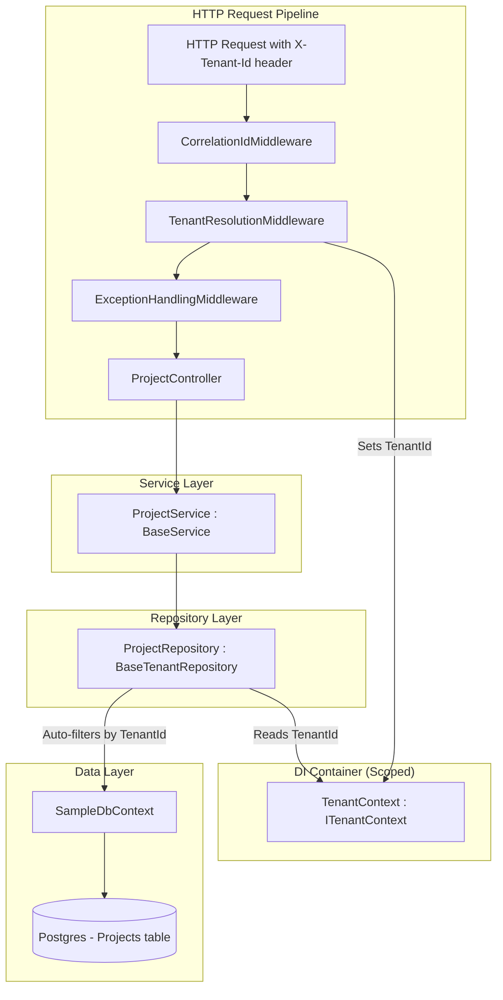
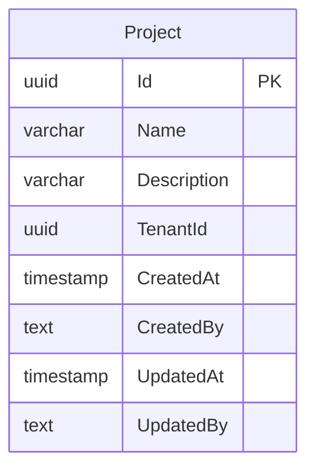

# Design Document: Phase 5 — Multi-Tenancy

## Overview

Phase 5 proves that `BaseTenantRepository` correctly isolates data by tenant end-to-end. The framework already has `ITenantContext` (interface), `ITenantEntity`, and `BaseTenantRepository` with compile-time generic constraints, automatic query filtering, auto-stamping, and cross-tenant guards. What's missing is a concrete runtime `TenantContext` implementation and end-to-end proof that isolation holds under real HTTP requests against a real Postgres database.

This phase delivers three things:

1. **TenantContext** — a sealed, scoped value holder in `GroundUp.Core` that implements `ITenantContext`. No HTTP dependency. Usable in API, SDK, console, and background job contexts.
2. **TenantResolutionMiddleware** — middleware in `GroundUp.Api` that reads `X-Tenant-Id` from the HTTP request header and hydrates `TenantContext.TenantId`. This is a temporary development/testing mechanism; Phase 9 replaces it with JWT-based resolution.
3. **Project entity + integration tests** — a tenant-scoped sample entity exercising the full stack (entity → DTO → mapper → repository → service → controller), with HTTP-level integration tests proving cross-tenant data is invisible, unmodifiable, and undeletable.

### Design Decisions

| Decision | Rationale |
|---|---|
| TenantContext in GroundUp.Core, not GroundUp.Api | No HTTP dependency — works in SDK, console, background jobs. Middleware sets the value; downstream code reads it. |
| Sealed class with settable TenantId | Single implementation, no inheritance needed. Settable so middleware/infrastructure can hydrate it. |
| Header-based resolution is temporary | Clearly documented. Phase 9 replaces with JWT claims. Keeps Phase 5 focused on proving isolation. |
| Project entity (not extending existing entities) | Clean tenant-scoped entity that doesn't complicate existing TodoItem/Customer/Order patterns. |
| NotFound (not Forbidden) for cross-tenant access | Prevents information leakage about entity existence in other tenants. Already implemented in BaseTenantRepository. |

## Architecture



**Middleware ordering** within `UseGroundUpMiddleware()`:
1. `CorrelationIdMiddleware` — generates/reads correlation ID (already exists)
2. `TenantResolutionMiddleware` — parses `X-Tenant-Id` header, sets `TenantContext.TenantId` **(new)**
3. `ExceptionHandlingMiddleware` — catches unhandled exceptions (already exists)

Tenant resolution runs before exception handling so that if a downstream component throws, the tenant context is already populated for any logging or error handling that needs it.

## Components and Interfaces

### 1. TenantContext (GroundUp.Core)

**File:** `src/GroundUp.Core/TenantContext.cs`

```csharp
namespace GroundUp.Core;

/// <summary>
/// Scoped value holder implementing ITenantContext. Infrastructure code
/// (middleware, SDK bootstrapping, background job setup) sets TenantId;
/// downstream code (repositories, services) reads it.
/// <para>
/// This class has no HTTP dependency — it works in any hosting context.
/// In HTTP scenarios, TenantResolutionMiddleware hydrates it from the request.
/// </para>
/// </summary>
public sealed class TenantContext : Abstractions.ITenantContext
{
    /// <summary>
    /// The current tenant's unique identifier.
    /// Defaults to Guid.Empty when no tenant has been resolved.
    /// </summary>
    public Guid TenantId { get; set; }
}
```

**Key points:**
- Sealed — no inheritance needed
- Settable `TenantId` — the `ITenantContext` interface exposes only the getter; `TenantContext` adds the setter so middleware can hydrate it
- Defaults to `Guid.Empty` — C# struct default
- No constructor parameters, no dependencies
- Registered as scoped so each request/scope gets its own instance

### 2. TenantResolutionMiddleware (GroundUp.Api)

**File:** `src/GroundUp.Api/Middleware/TenantResolutionMiddleware.cs`

```csharp
namespace GroundUp.Api.Middleware;

/// <summary>
/// Reads the tenant identity from the incoming HTTP request and sets
/// TenantContext.TenantId. In Phase 5 this reads from the X-Tenant-Id
/// header (temporary development/testing mechanism). In Phase 9 this
/// will be replaced by JWT-based tenant resolution.
/// </summary>
public sealed class TenantResolutionMiddleware
{
    public const string HeaderName = "X-Tenant-Id";
    private readonly RequestDelegate _next;

    public TenantResolutionMiddleware(RequestDelegate next) { ... }

    public async Task InvokeAsync(HttpContext context, TenantContext tenantContext)
    {
        if (context.Request.Headers.TryGetValue(HeaderName, out var values)
            && Guid.TryParse(values.FirstOrDefault(), out var tenantId))
        {
            tenantContext.TenantId = tenantId;
        }
        // If header is missing or invalid, TenantId stays Guid.Empty

        await _next(context);
    }
}
```

**Key points:**
- Resolves `TenantContext` (concrete type) from DI via method injection — this is the standard ASP.NET Core middleware pattern for scoped services
- Uses `Guid.TryParse` — invalid/missing header silently leaves `TenantId` as `Guid.Empty`
- No 400/401 response for missing tenant — that's a Phase 9 concern (authentication)
- Clearly documented as temporary

### 3. UseGroundUpMiddleware Update

**File:** `src/GroundUp.Api/GroundUpApplicationBuilderExtensions.cs`

The `TenantResolutionMiddleware` is added between `CorrelationIdMiddleware` and `ExceptionHandlingMiddleware`:

```csharp
public static IApplicationBuilder UseGroundUpMiddleware(this IApplicationBuilder app)
{
    app.UseMiddleware<CorrelationIdMiddleware>();
    app.UseMiddleware<TenantResolutionMiddleware>();
    app.UseMiddleware<ExceptionHandlingMiddleware>();
    return app;
}
```

### 4. TenantContext DI Registration

**File:** `src/GroundUp.Api/ApiServiceCollectionExtensions.cs`

`AddGroundUpApi()` registers `TenantContext` as a scoped service for both the concrete type and the `ITenantContext` interface:

```csharp
public static IServiceCollection AddGroundUpApi(this IServiceCollection services)
{
    services.AddScoped<TenantContext>();
    services.AddScoped<ITenantContext>(sp => sp.GetRequiredService<TenantContext>());
    return services;
}
```

This dual registration ensures:
- Middleware resolves the concrete `TenantContext` to set `TenantId`
- Repositories resolve `ITenantContext` to read `TenantId`
- Both resolve to the same scoped instance

### 5. Project Entity (Sample App)

**File:** `samples/GroundUp.Sample/Entities/Project.cs`

```csharp
namespace GroundUp.Sample.Entities;

public class Project : BaseEntity, ITenantEntity, IAuditable
{
    public string Name { get; set; } = string.Empty;
    public string? Description { get; set; }

    // ITenantEntity
    public Guid TenantId { get; set; }

    // IAuditable
    public DateTime CreatedAt { get; set; }
    public string? CreatedBy { get; set; }
    public DateTime? UpdatedAt { get; set; }
    public string? UpdatedBy { get; set; }
}
```

### 6. ProjectDto

**File:** `samples/GroundUp.Sample/Dtos/ProjectDto.cs`

```csharp
namespace GroundUp.Sample.Dtos;

public class ProjectDto
{
    public Guid Id { get; set; }
    public string Name { get; set; } = string.Empty;
    public string? Description { get; set; }
}
```

Follows the same pattern as `TodoItemDto` — no `TenantId` in the DTO. The repository auto-stamps it.

### 7. ProjectMapper

**File:** `samples/GroundUp.Sample/Mappers/ProjectMapper.cs`

```csharp
namespace GroundUp.Sample.Mappers;

[Mapper]
public static partial class ProjectMapper
{
    public static partial ProjectDto ToDto(Project entity);
    public static partial Project ToEntity(ProjectDto dto);
}
```

### 8. ProjectRepository

**File:** `samples/GroundUp.Sample/Repositories/ProjectRepository.cs`

```csharp
namespace GroundUp.Sample.Repositories;

public class ProjectRepository : BaseTenantRepository<Project, ProjectDto>
{
    public ProjectRepository(SampleDbContext context, ITenantContext tenantContext)
        : base(context, tenantContext, ProjectMapper.ToDto, ProjectMapper.ToEntity)
    {
    }
}
```

Extends `BaseTenantRepository` (not `BaseRepository`) — this is the key difference from `TodoItemRepository`. The tenant context is injected and passed to the base class, which handles all filtering and stamping automatically.

### 9. ProjectService

**File:** `samples/GroundUp.Sample/Services/ProjectService.cs`

```csharp
namespace GroundUp.Sample.Services;

public class ProjectService : BaseService<ProjectDto>
{
    public ProjectService(
        IBaseRepository<ProjectDto> repository,
        IEventBus eventBus,
        IValidator<ProjectDto>? validator = null)
        : base(repository, eventBus, validator)
    {
    }
}
```

Identical pattern to `TodoItemService`. No tenant-specific logic needed — `BaseTenantRepository` handles isolation transparently.

### 10. ProjectController

**File:** `samples/GroundUp.Sample/Controllers/ProjectsController.cs`

```csharp
namespace GroundUp.Sample.Controllers;

public class ProjectsController : BaseController<ProjectDto>
{
    public ProjectsController(BaseService<ProjectDto> service) : base(service) { }

    [HttpGet]
    public override Task<ActionResult<OperationResult<PaginatedData<ProjectDto>>>> GetAll(...) => base.GetAll(...);

    [HttpGet("{id}")]
    public override Task<ActionResult<OperationResult<ProjectDto>>> GetById(...) => base.GetById(...);

    [HttpPost]
    public override Task<ActionResult<OperationResult<ProjectDto>>> Create(...) => base.Create(...);

    [HttpPut("{id}")]
    public override Task<ActionResult<OperationResult<ProjectDto>>> Update(...) => base.Update(...);

    [HttpDelete("{id}")]
    public override Task<ActionResult<OperationResult>> Delete(...) => base.Delete(...);
}
```

Same one-line override pattern as `TodoItemsController`.

### 11. SampleDbContext Update

Add `DbSet<Project>` and Fluent API configuration:

```csharp
public DbSet<Project> Projects => Set<Project>();

// In OnModelCreating:
modelBuilder.Entity<Project>(entity =>
{
    entity.HasKey(e => e.Id);
    entity.Property(e => e.Name).IsRequired().HasMaxLength(200);
    entity.Property(e => e.Description).HasMaxLength(1000);
    entity.HasIndex(e => e.TenantId);
});
```

The `TenantId` index is important for query performance — every query filters by tenant.

### 12. Program.cs DI Registrations

```csharp
// Project — tenant-scoped pattern (BaseTenantRepository handles isolation)
builder.Services.AddScoped<IBaseRepository<ProjectDto>, ProjectRepository>();
builder.Services.AddScoped<BaseService<ProjectDto>, ProjectService>();
```

Note: `TenantContext` / `ITenantContext` registration happens inside `AddGroundUpApi()`, not in the sample app's `Program.cs`.

### 13. Integration Tests

**File:** `samples/GroundUp.Sample.Tests.Integration/Http/TenantIsolationTests.cs`

```csharp
[Collection("Api")]
public sealed class TenantIsolationTests : IntegrationTestBase
{
    private static readonly Guid TenantA = Guid.NewGuid();
    private static readonly Guid TenantB = Guid.NewGuid();
    private const string Endpoint = "/api/projects";

    public TenantIsolationTests(SampleApiFactory factory) : base(factory.CreateClient()) { }

    // Helper: creates an HttpClient with X-Tenant-Id header set
    private HttpClient CreateTenantClient(SampleApiFactory factory, Guid tenantId) { ... }
}
```

Each test:
- Uses unique `TenantA` / `TenantB` GUIDs (static per class, unique per test run)
- Sets `X-Tenant-Id` header on each request
- Creates data with GUID-suffixed names for isolation from other tests
- Verifies the specific isolation behavior (read, update, delete, GetAll)

The tests use `factory.CreateClient()` and add the `X-Tenant-Id` header per-request via `HttpRequestMessage`, or use a helper that creates a client with a default request header.

## Data Models

### Project Table (Postgres)

| Column | Type | Constraints |
|---|---|---|
| Id | uuid | PK, default UUID v7 |
| Name | varchar(200) | NOT NULL |
| Description | varchar(1000) | nullable |
| TenantId | uuid | NOT NULL, indexed |
| CreatedAt | timestamp | NOT NULL (auto-set by AuditableInterceptor) |
| CreatedBy | text | nullable (auto-set by AuditableInterceptor) |
| UpdatedAt | timestamp | nullable (auto-set by AuditableInterceptor) |
| UpdatedBy | text | nullable (auto-set by AuditableInterceptor) |

### Entity Relationship



Project is a standalone entity with no foreign keys. It exists solely to prove tenant isolation through the full stack.

### ProjectDto

```
ProjectDto
├── Id: Guid
├── Name: string
└── Description: string?
```

No `TenantId` in the DTO — the repository auto-stamps it from `ITenantContext` on create and preserves it on update. This prevents tenant spoofing via the API.


## Correctness Properties

*A property is a characteristic or behavior that should hold true across all valid executions of a system — essentially, a formal statement about what the system should do. Properties serve as the bridge between human-readable specifications and machine-verifiable correctness guarantees.*

### Property 1: Middleware parses valid GUID headers

*For any* valid GUID value set as the `X-Tenant-Id` HTTP request header, the `TenantResolutionMiddleware` SHALL parse the header and set `TenantContext.TenantId` to that exact GUID.

**Validates: Requirements 1a.2**

### Property 2: Middleware ignores invalid headers

*For any* string that is not a valid GUID representation (including empty strings, whitespace, and arbitrary text), when set as the `X-Tenant-Id` HTTP request header, the `TenantResolutionMiddleware` SHALL leave `TenantContext.TenantId` as `Guid.Empty`.

**Validates: Requirements 1a.3**

### Property 3: Tenant read isolation

*For any* two distinct tenant IDs and *for any* valid Project data, creating a Project as tenant A and then querying (both GetAll and GetById) as tenant B SHALL never return that Project. GetAll returns zero matching items; GetById returns 404 NotFound.

**Validates: Requirements 3.2, 3.3, 3.4**

### Property 4: Tenant write isolation

*For any* two distinct tenant IDs and *for any* valid Project, creating a Project as tenant A and then attempting to update or delete it as tenant B SHALL return 404 NotFound, and the Project SHALL remain unchanged and accessible to tenant A.

**Validates: Requirements 4.1, 4.2**

### Property 5: TenantId auto-stamp

*For any* valid Project DTO and *for any* tenant identity, when the Project is created through the API with a given `X-Tenant-Id` header, the persisted entity's `TenantId` SHALL equal the tenant identity from the header, regardless of any TenantId value that may have been present in the DTO.

**Validates: Requirements 4.3**

## Error Handling

### Middleware Error Handling

| Scenario | Behavior |
|---|---|
| Missing `X-Tenant-Id` header | `TenantContext.TenantId` stays `Guid.Empty`. No error response. |
| Invalid GUID in `X-Tenant-Id` header | `TenantContext.TenantId` stays `Guid.Empty`. No error response. |
| Valid GUID in `X-Tenant-Id` header | `TenantContext.TenantId` set to parsed value. |

The middleware does not return 400 or 401 for missing/invalid tenant headers. In Phase 5, the framework allows requests without a tenant context (for non-tenant-scoped endpoints like TodoItems). Phase 9 (Authentication) will enforce tenant identity via JWT claims.

### Repository Error Handling

All cross-tenant access errors are handled by `BaseTenantRepository` (already implemented):

| Scenario | Behavior |
|---|---|
| GetAll with tenant filter | Returns only current tenant's records. Other tenants' data is invisible. |
| GetById for another tenant's entity | Returns `OperationResult.NotFound()` — not Forbidden, to prevent information leakage. |
| Update another tenant's entity | Returns `OperationResult.NotFound()` — entity appears not to exist. |
| Delete another tenant's entity | Returns `OperationResult.NotFound()` — entity appears not to exist. |
| Add with any TenantId in DTO | TenantId is overwritten with `ITenantContext.TenantId` — prevents spoofing. |

### Controller Error Handling

`BaseController` maps `OperationResult` status codes to HTTP responses (already implemented):
- `NotFound` → HTTP 404
- `Ok` → HTTP 200
- `Created` → HTTP 201

No new error handling logic is needed in controllers.

## Testing Strategy

### Unit Tests

Unit tests verify the TenantContext and TenantResolutionMiddleware in isolation:

| Test | Description |
|---|---|
| `TenantContext_DefaultTenantId_IsGuidEmpty` | New instance has `TenantId == Guid.Empty` |
| `TenantContext_SetTenantId_ReturnsSameValue` | Setting and reading `TenantId` round-trips correctly |
| `TenantResolutionMiddleware_ValidHeader_SetsTenantId` | Property test: for any valid GUID header, TenantContext.TenantId matches |
| `TenantResolutionMiddleware_InvalidHeader_LeavesGuidEmpty` | Property test: for any non-GUID string, TenantContext.TenantId stays Guid.Empty |
| `TenantResolutionMiddleware_MissingHeader_LeavesGuidEmpty` | No header → TenantId stays Guid.Empty |

### Integration Tests (HTTP-level)

Integration tests prove tenant isolation end-to-end against real Postgres via Testcontainers:

| Test | Description |
|---|---|
| `SameTenant_Create_ThenGetAll_ReturnsProject` | Tenant A creates, Tenant A GetAll → project present |
| `CrossTenant_GetAll_ReturnsEmpty` | Tenant A creates, Tenant B GetAll → zero items |
| `CrossTenant_GetById_Returns404` | Tenant A creates, Tenant B GetById → 404 |
| `CrossTenant_Update_Returns404_DataUnchanged` | Tenant A creates, Tenant B Update → 404, Tenant A verifies unchanged |
| `CrossTenant_Delete_Returns404_DataStillExists` | Tenant A creates, Tenant B Delete → 404, Tenant A verifies still exists |
| `MultiTenant_GetAll_ReturnsOnlyOwnData` | Both tenants create, Tenant A GetAll → only Tenant A's projects |

### Property-Based Testing Configuration

- **Library:** [FsCheck.Xunit](https://github.com/fscheck/FsCheck) (well-established PBT library for .NET/xUnit)
- **Minimum iterations:** 100 per property test
- **Tag format:** `Feature: phase5-multi-tenancy, Property {number}: {property_text}`

Property tests for the middleware (Properties 1 and 2) run as unit tests with generated inputs. Properties 3, 4, and 5 are validated by the integration tests — each integration test exercises the property with unique GUID pairs per test run, and the underlying `BaseTenantRepository` behavior is already covered by 24 unit tests with property-like coverage.

### Test Infrastructure

- Tests use existing `SampleApiFactory` and `IntegrationTestBase`
- `[Collection("Api")]` shares the Testcontainers Postgres instance
- Each test creates data with `Guid.NewGuid()` suffixed names for isolation
- Tenant identity is set via `X-Tenant-Id` header on `HttpRequestMessage`
- Helper method creates `HttpRequestMessage` with tenant header pre-set
