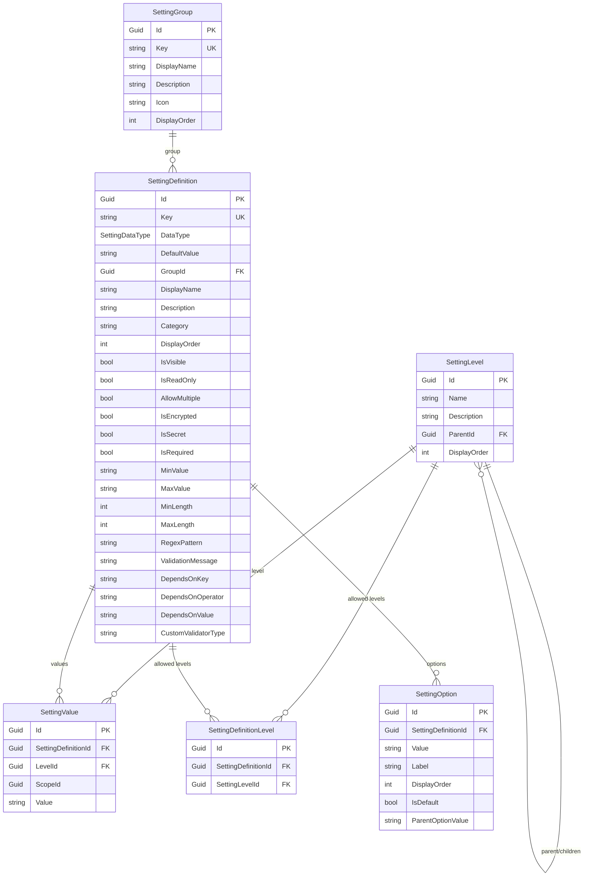

# Design Document: Phase 6A — Settings Module: Core Entities and Data Layer

## Overview

Phase 6A establishes the foundational data model for a data-driven cascading multi-tenant settings infrastructure within the GroundUp framework. Rather than hardcoding cascade levels as an enum, the design treats levels as first-class entities forming a self-referencing tree — enabling each consuming application to define its own hierarchy (e.g., User → Team → Department → Tenant → System).

The settings infrastructure is fully data-driven: all UI metadata, validation rules, conditional dependencies, and encryption flags are stored in `SettingDefinition` records. Consuming applications add their own settings by inserting `SettingDefinition` rows, not by writing code. This phase delivers:

- **6 entities** in `GroundUp.Core/Entities/Settings/`: SettingLevel, SettingGroup, SettingDefinition, SettingOption, SettingValue, SettingDefinitionLevel
- **1 enum** in `GroundUp.Core/Enums/`: SettingDataType
- **1 interface** in `GroundUp.Core/Abstractions/`: ISettingEncryptionProvider
- **1 constants class** in `GroundUp.Core/Constants/`: SettingDependencyOperator
- **5 DTO records** in `GroundUp.Core/Dtos/Settings/`: one per entity (SettingDefinitionLevel has no DTO — it's a junction table)
- **6 EF Core configurations** in `GroundUp.Data.Postgres/Configurations/Settings/`: one per entity
- **1 DbContext modification**: add `ApplyConfigurationsFromAssembly` to `GroundUpDbContext.OnModelCreating`

Phase 6A does NOT include cascading resolution logic (6B), caching (6C), API endpoints (6C), integration tests for cascading behavior (6D), or data seeders (6C).

## Architecture

### Layer Placement

```
GroundUp.Core (no dependencies)
├── Entities/Settings/       ← 6 entity classes
├── Dtos/Settings/           ← 5 DTO records
├── Enums/                   ← SettingDataType enum
├── Abstractions/            ← ISettingEncryptionProvider interface
└── Constants/               ← SettingDependencyOperator static class

GroundUp.Data.Postgres (depends on Core)
├── Configurations/Settings/ ← 6 IEntityTypeConfiguration<T> classes
└── GroundUpDbContext.cs     ← Modified to auto-discover configurations
```

### Entity Relationship Diagram



### Design Decisions and Rationale

1. **SettingLevel as entity tree (not enum)**: Consuming applications define their own hierarchy depth and names. A hardcoded enum would force all consumers into the same structure. The self-referencing `ParentId` tree allows arbitrary depth while keeping resolution simple — walk up the parent chain.

2. **SettingGroup as first-class entity**: Composite settings (like a database connection = host + port + username + password) need a grouping mechanism with its own UI metadata (icon, display name, ordering). A simple `Category` string on SettingDefinition wouldn't support this richness.

3. **All metadata in SettingDefinition**: The definition stores everything needed to render a settings UI — display info, validation rules, conditional dependencies, encryption flags. This means consuming apps never need to write UI-specific code for individual settings.

4. **String-typed Value column**: All values are stored as strings in `SettingValue.Value`. The `DataType` enum on the definition tells the service layer how to deserialize. This avoids multiple typed columns and keeps the schema simple.

5. **SettingDefinitionLevel junction table**: Rather than allowing any setting at any level, this junction table explicitly declares which levels each setting can be overridden at. This enables enforcement at the service layer (Phase 6B).

6. **ISettingEncryptionProvider interface**: The framework doesn't dictate an encryption algorithm. Consuming apps implement this interface with their own strategy (AES, AWS KMS, Azure Key Vault, etc.). The `IsEncrypted` flag on SettingDefinition triggers encryption/decryption through this provider.

7. **SettingDependencyOperator as constants (not enum)**: String constants are simpler for comparison operations stored in the database. An enum would require conversion and wouldn't add type safety since the operator is stored alongside arbitrary key/value strings.

8. **ApplyConfigurationsFromAssembly for auto-discovery**: Adding this single call to `GroundUpDbContext.OnModelCreating` means all `IEntityTypeConfiguration<T>` implementations in the `GroundUp.Data.Postgres` assembly are automatically registered. Consuming apps that inherit from `GroundUpDbContext` get the settings schema for free without declaring `DbSet<T>` properties.

9. **DeleteBehavior choices**:
   - `Restrict` on SettingLevel self-reference: prevents accidentally deleting a level that has children, preserving hierarchy integrity.
   - `SetNull` on SettingDefinition → SettingGroup: deleting a group orphans its definitions rather than deleting them — settings are too important to cascade-delete.
   - `Cascade` on SettingDefinition → SettingOption/SettingValue/SettingDefinitionLevel: deleting a definition should clean up all its dependent data.
   - `Restrict` on SettingValue → SettingLevel: prevents deleting a level while values reference it.
   - `Cascade` on SettingDefinitionLevel → SettingLevel: deleting a level removes its junction entries (the definition itself survives).

## Components and Interfaces

### Entities (GroundUp.Core/Entities/Settings/)

All entities extend `BaseEntity` (UUID v7 Id), are `sealed`, use file-scoped namespaces, and have XML doc comments on all public members.

| Entity | Implements | Purpose |
|--------|-----------|---------|
| `SettingLevel` | `BaseEntity`, `IAuditable` | Named tier in the cascade hierarchy; self-referencing tree via `ParentId` |
| `SettingGroup` | `BaseEntity`, `IAuditable` | Logical grouping of related setting definitions with UI metadata |
| `SettingDefinition` | `BaseEntity`, `IAuditable` | Complete declaration of a single setting: key, data type, defaults, UI metadata, validation, dependencies, encryption |
| `SettingOption` | `BaseEntity` | Selectable option for select/multi-select settings; supports cascading via `ParentOptionValue` |
| `SettingValue` | `BaseEntity`, `IAuditable` | Actual stored value at a specific level and scope; unique on (DefinitionId, LevelId, ScopeId) |
| `SettingDefinitionLevel` | `BaseEntity` | Junction table declaring which levels a definition can be overridden at; unique on (DefinitionId, LevelId) |

### Enum (GroundUp.Core/Enums/)

| Enum | Members | Purpose |
|------|---------|---------|
| `SettingDataType` | String=0, Int=1, Long=2, Decimal=3, Bool=4, DateTime=5, Date=6, Json=7 | Tells the service layer how to deserialize the string Value column |

### Interface (GroundUp.Core/Abstractions/)

| Interface | Methods | Purpose |
|-----------|---------|---------|
| `ISettingEncryptionProvider` | `string Encrypt(string plaintext)`, `string Decrypt(string ciphertext)` | Contract for consuming apps to provide encryption/decryption of sensitive setting values at rest |

### Constants (GroundUp.Core/Constants/)

| Class | Constants | Purpose |
|-------|-----------|---------|
| `SettingDependencyOperator` | `Equals`, `NotEquals`, `Contains`, `In` | String constants for conditional dependency operators, avoiding magic strings |

### DTOs (GroundUp.Core/Dtos/Settings/)

All DTOs are `record` classes with XML doc comments. They mirror entity properties minus navigation collections and audit fields.

| DTO | Properties |
|-----|-----------|
| `SettingLevelDto` | Id, Name, Description, ParentId, DisplayOrder |
| `SettingGroupDto` | Id, Key, DisplayName, Description, Icon, DisplayOrder |
| `SettingDefinitionDto` | Id, Key, DataType, DefaultValue, GroupId, DisplayName, Description, Category, DisplayOrder, IsVisible, IsReadOnly, AllowMultiple, IsEncrypted, IsSecret, IsRequired, MinValue, MaxValue, MinLength, MaxLength, RegexPattern, ValidationMessage, DependsOnKey, DependsOnOperator, DependsOnValue, CustomValidatorType |
| `SettingOptionDto` | Id, SettingDefinitionId, Value, Label, DisplayOrder, IsDefault, ParentOptionValue |
| `SettingValueDto` | Id, SettingDefinitionId, LevelId, ScopeId, Value |

### EF Core Configurations (GroundUp.Data.Postgres/Configurations/Settings/)

Each configuration implements `IEntityTypeConfiguration<T>`, uses Fluent API exclusively, and resides in a `Settings` subfolder.

| Configuration | Key Constraints |
|--------------|----------------|
| `SettingLevelConfiguration` | Table "SettingLevels"; Name required max 100; self-ref FK with Restrict; DisplayOrder default 0 |
| `SettingGroupConfiguration` | Table "SettingGroups"; Key required max 200 unique index; DisplayName required max 200; DisplayOrder default 0 |
| `SettingDefinitionConfiguration` | Table "SettingDefinitions"; Key required max 200 unique index; DataType as int; GroupId FK SetNull; all boolean defaults; all string max lengths |
| `SettingOptionConfiguration` | Table "SettingOptions"; DefinitionId FK Cascade; Value required max 1000; Label required max 200; DisplayOrder default 0; IsDefault default false |
| `SettingValueConfiguration` | Table "SettingValues"; DefinitionId FK Cascade; LevelId FK Restrict; Value max 4000; unique composite index on (DefinitionId, LevelId, ScopeId) |
| `SettingDefinitionLevelConfiguration` | Table "SettingDefinitionLevels"; DefinitionId FK Cascade; LevelId FK Cascade; unique composite index on (DefinitionId, LevelId) |

### DbContext Modification

The existing `GroundUpDbContext.OnModelCreating` will be modified to call `modelBuilder.ApplyConfigurationsFromAssembly(typeof(GroundUpDbContext).Assembly)` before the existing UUID v7 and soft delete filter loops. This auto-discovers all `IEntityTypeConfiguration<T>` implementations in the `GroundUp.Data.Postgres` assembly, including the 6 new settings configurations.

The call is placed **after** `base.OnModelCreating(modelBuilder)` (which lets derived contexts register first) and **before** the UUID v7 / soft delete loops (which need to see all entity types including those registered by configurations).

## Data Models

### SettingLevel

```csharp
namespace GroundUp.Core.Entities.Settings;

/// <summary>
/// Represents a named tier in the cascade hierarchy (e.g., "System", "Tenant", "User").
/// Forms a self-referencing tree via <see cref="ParentId"/>.
/// The root level has a null ParentId. Resolution walks UP the parent chain.
/// </summary>
public sealed class SettingLevel : BaseEntity, IAuditable
{
    /// <summary>The level name (e.g., "System", "Tenant", "User").</summary>
    public string Name { get; set; } = string.Empty;

    /// <summary>Optional description of this level.</summary>
    public string? Description { get; set; }

    /// <summary>
    /// Foreign key to the parent level. Null indicates the root level.
    /// </summary>
    public Guid? ParentId { get; set; }

    /// <summary>Navigation to the parent level.</summary>
    public SettingLevel? Parent { get; set; }

    /// <summary>Navigation to child levels.</summary>
    public ICollection<SettingLevel> Children { get; set; } = new List<SettingLevel>();

    /// <summary>Display ordering for UI rendering.</summary>
    public int DisplayOrder { get; set; }

    // IAuditable
    public DateTime CreatedAt { get; set; }
    public string? CreatedBy { get; set; }
    public DateTime? UpdatedAt { get; set; }
    public string? UpdatedBy { get; set; }
}
```

### SettingGroup

```csharp
namespace GroundUp.Core.Entities.Settings;

/// <summary>
/// Logically groups related setting definitions into a composite object
/// (e.g., a "DatabaseConnection" group containing Host, Port, Username, Password).
/// </summary>
public sealed class SettingGroup : BaseEntity, IAuditable
{
    /// <summary>Programmatic identifier (e.g., "DatabaseConnection"). Unique.</summary>
    public string Key { get; set; } = string.Empty;

    /// <summary>Display name for UI rendering.</summary>
    public string DisplayName { get; set; } = string.Empty;

    /// <summary>Optional description.</summary>
    public string? Description { get; set; }

    /// <summary>Optional CSS class or icon name for UI rendering.</summary>
    public string? Icon { get; set; }

    /// <summary>Display ordering for UI rendering.</summary>
    public int DisplayOrder { get; set; }

    /// <summary>Navigation to all definitions in this group.</summary>
    public ICollection<SettingDefinition> Settings { get; set; } = new List<SettingDefinition>();

    // IAuditable
    public DateTime CreatedAt { get; set; }
    public string? CreatedBy { get; set; }
    public DateTime? UpdatedAt { get; set; }
    public string? UpdatedBy { get; set; }
}
```

### SettingDefinition

```csharp
namespace GroundUp.Core.Entities.Settings;

/// <summary>
/// Declares a single setting's key, data type, default value, UI metadata,
/// validation rules, conditional dependencies, and encryption flags.
/// Stores ALL metadata needed to render a settings UI.
/// </summary>
public sealed class SettingDefinition : BaseEntity, IAuditable
{
    // Identity
    public string Key { get; set; } = string.Empty;
    public SettingDataType DataType { get; set; }
    public string? DefaultValue { get; set; }

    // Group relationship
    public Guid? GroupId { get; set; }
    public SettingGroup? Group { get; set; }

    // UI metadata
    public string DisplayName { get; set; } = string.Empty;
    public string? Description { get; set; }
    public string? Category { get; set; }
    public int DisplayOrder { get; set; }
    public bool IsVisible { get; set; } = true;
    public bool IsReadOnly { get; set; }

    // Multi-value
    public bool AllowMultiple { get; set; }

    // Encryption
    public bool IsEncrypted { get; set; }
    public bool IsSecret { get; set; }

    // Validation
    public bool IsRequired { get; set; }
    public string? MinValue { get; set; }
    public string? MaxValue { get; set; }
    public int? MinLength { get; set; }
    public int? MaxLength { get; set; }
    public string? RegexPattern { get; set; }
    public string? ValidationMessage { get; set; }

    // Conditional dependencies
    public string? DependsOnKey { get; set; }
    public string? DependsOnOperator { get; set; }
    public string? DependsOnValue { get; set; }

    // Custom validation
    public string? CustomValidatorType { get; set; }

    // Navigation collections
    public ICollection<SettingOption> Options { get; set; } = new List<SettingOption>();
    public ICollection<SettingValue> Values { get; set; } = new List<SettingValue>();
    public ICollection<SettingDefinitionLevel> AllowedLevels { get; set; } = new List<SettingDefinitionLevel>();

    // IAuditable
    public DateTime CreatedAt { get; set; }
    public string? CreatedBy { get; set; }
    public DateTime? UpdatedAt { get; set; }
    public string? UpdatedBy { get; set; }
}
```

### SettingOption

```csharp
namespace GroundUp.Core.Entities.Settings;

/// <summary>
/// A selectable option for a setting definition of select or multi-select type.
/// Supports cascading options via <see cref="ParentOptionValue"/>.
/// </summary>
public sealed class SettingOption : BaseEntity
{
    public Guid SettingDefinitionId { get; set; }
    public SettingDefinition SettingDefinition { get; set; } = null!;

    public string Value { get; set; } = string.Empty;
    public string Label { get; set; } = string.Empty;
    public int DisplayOrder { get; set; }
    public bool IsDefault { get; set; }
    public string? ParentOptionValue { get; set; }
}
```

### SettingValue

```csharp
namespace GroundUp.Core.Entities.Settings;

/// <summary>
/// Stores the actual value of a setting at a specific level and scope.
/// Unique on (SettingDefinitionId, LevelId, ScopeId).
/// </summary>
public sealed class SettingValue : BaseEntity, IAuditable
{
    public Guid SettingDefinitionId { get; set; }
    public SettingDefinition SettingDefinition { get; set; } = null!;

    public Guid LevelId { get; set; }
    public SettingLevel Level { get; set; } = null!;

    public Guid? ScopeId { get; set; }
    public string? Value { get; set; }

    // IAuditable
    public DateTime CreatedAt { get; set; }
    public string? CreatedBy { get; set; }
    public DateTime? UpdatedAt { get; set; }
    public string? UpdatedBy { get; set; }
}
```

### SettingDefinitionLevel

```csharp
namespace GroundUp.Core.Entities.Settings;

/// <summary>
/// Junction entity declaring which cascade levels a setting definition
/// can be overridden at. Unique on (SettingDefinitionId, SettingLevelId).
/// </summary>
public sealed class SettingDefinitionLevel : BaseEntity
{
    public Guid SettingDefinitionId { get; set; }
    public SettingDefinition SettingDefinition { get; set; } = null!;

    public Guid SettingLevelId { get; set; }
    public SettingLevel SettingLevel { get; set; } = null!;
}
```

### SettingDataType Enum

```csharp
namespace GroundUp.Core.Enums;

/// <summary>
/// Supported data types for setting values. Determines how the string
/// Value column is deserialized into a CLR type.
/// </summary>
public enum SettingDataType
{
    /// <summary>Plain text string (System.String).</summary>
    String = 0,
    /// <summary>32-bit integer (System.Int32).</summary>
    Int = 1,
    /// <summary>64-bit integer (System.Int64).</summary>
    Long = 2,
    /// <summary>Decimal number (System.Decimal).</summary>
    Decimal = 3,
    /// <summary>Boolean true/false (System.Boolean).</summary>
    Bool = 4,
    /// <summary>Date and time (System.DateTime).</summary>
    DateTime = 5,
    /// <summary>Date only (System.DateOnly).</summary>
    Date = 6,
    /// <summary>Arbitrary JSON structure (System.Text.Json).</summary>
    Json = 7
}
```

## Correctness Properties

Property-based testing is **not applicable** to Phase 6A. This phase is entirely a data model and schema definition — entity classes, DTOs, an enum, an interface, constants, and EF Core Fluent API configurations. Every acceptance criterion falls into one of two categories:

1. **Structural/SMOKE checks**: Does the class exist? Is it sealed? Does it extend BaseEntity? Does it have the right properties with the right types? These are compile-time or single-assertion reflection checks with no input variation.

2. **EF configuration/INTEGRATION checks**: Does the EF model metadata have the correct table name, column max lengths, unique indexes, foreign key relationships, and delete behaviors? These are deterministic model inspection checks with no input variation.

There are no pure functions, no data transformations, no business logic, and no input spaces to explore. PBT would add cost without finding any bugs that a simple example-based test wouldn't catch. The appropriate testing strategies are:

- **Reflection-based unit tests** for entity structure (sealed, base class, interfaces, property types)
- **EF model metadata inspection tests** for configuration correctness (table names, column constraints, indexes, FK behaviors)
- **Compilation** as the ultimate smoke test for the entire phase

## Error Handling

Phase 6A defines only data structures — there is no runtime error handling in entity classes, DTOs, enums, or EF configurations. Error handling will be addressed in subsequent phases:

- **Phase 6B (Resolution Logic)**: Will handle errors like "setting not found", "value at disallowed level", "encryption provider not registered", and "invalid data type conversion". These will return `OperationResult.Fail(...)` per framework convention.
- **Phase 6C (API Layer)**: Will handle HTTP-level errors, validation failures via FluentValidation, and API response formatting.

For Phase 6A, the only error scenarios are:

1. **Database constraint violations**: The unique indexes on `SettingDefinition.Key`, `SettingGroup.Key`, `SettingValue(DefinitionId, LevelId, ScopeId)`, and `SettingDefinitionLevel(DefinitionId, LevelId)` will throw `DbUpdateException` with Postgres unique violation error codes. The existing `PostgresErrorHelper` in `GroundUp.Data.Postgres` already handles these at the repository level.

2. **Foreign key violations**: Attempting to delete a SettingLevel that has child levels or SettingValues referencing it will throw `DbUpdateException` due to `DeleteBehavior.Restrict`. This is intentional — the service layer (Phase 6B) will check for references before attempting deletion.

3. **Required column violations**: Attempting to save a SettingDefinition without a Key or DisplayName will throw `DbUpdateException`. The service layer (Phase 6B) will validate inputs via FluentValidation before reaching the database.

## Testing Strategy

### Approach

Phase 6A testing focuses on **structural correctness** and **schema correctness** — verifying that the data model is defined correctly before any business logic is built on top of it.

### Unit Tests (GroundUp.Tests.Unit)

**Entity structure tests** using reflection to verify:
- Each entity class is `sealed`
- Each entity extends `BaseEntity`
- Entities that should implement `IAuditable` do so (SettingLevel, SettingGroup, SettingDefinition, SettingValue)
- Entities that should NOT implement `IAuditable` don't (SettingOption, SettingDefinitionLevel)
- All expected properties exist with correct types (including nullability)
- Navigation collections are initialized (not null by default)
- SettingDataType enum has exactly 8 members with correct integer values
- SettingDependencyOperator constants have correct string values
- ISettingEncryptionProvider declares Encrypt and Decrypt methods with correct signatures

**DTO structure tests** using reflection to verify:
- Each DTO is a `record` type
- Each DTO has the expected properties with correct types
- DTOs do not contain navigation properties or audit fields

### Integration Tests (GroundUp.Tests.Integration)

**EF model metadata tests** that build the EF model and inspect it:
- All 6 settings tables are registered in the model (SettingLevels, SettingGroups, SettingDefinitions, SettingOptions, SettingValues, SettingDefinitionLevels)
- Table names are correct
- Column max lengths match requirements
- Required columns are marked as required
- Unique indexes exist on the correct columns
- Foreign key relationships have correct delete behaviors
- Default values are configured for boolean and integer properties
- SettingDataType is stored as integer (not string)
- The self-referencing FK on SettingLevel is correctly configured

**DbContext auto-discovery test**:
- Create a minimal test DbContext inheriting from GroundUpDbContext (without declaring settings DbSets)
- Build the model and verify all 6 settings entity types are present
- This validates Requirement 17 (auto-registration)

### Compilation Test

- `dotnet build groundup.sln` completes with zero errors (Requirement 18)
- This is the first test to run and gates all other testing

### Test Naming Convention

Following project convention: `MethodName_Scenario_ExpectedResult`

Examples:
- `SettingLevel_IsSealed_ReturnsTrue`
- `SettingLevel_ExtendsBaseEntity_ReturnsTrue`
- `SettingLevel_ImplementsIAuditable_ReturnsTrue`
- `SettingDefinitionConfiguration_KeyColumn_HasUniqueIndex`
- `SettingValueConfiguration_CompositeIndex_ExistsOnDefinitionIdLevelIdScopeId`
- `GroundUpDbContext_OnModelCreating_RegistersAllSettingsEntities`

