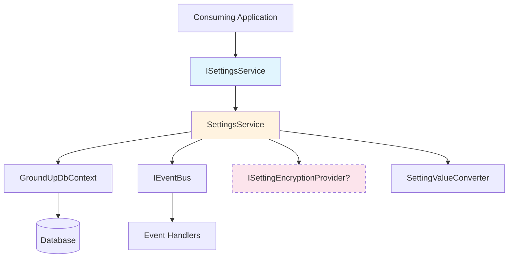
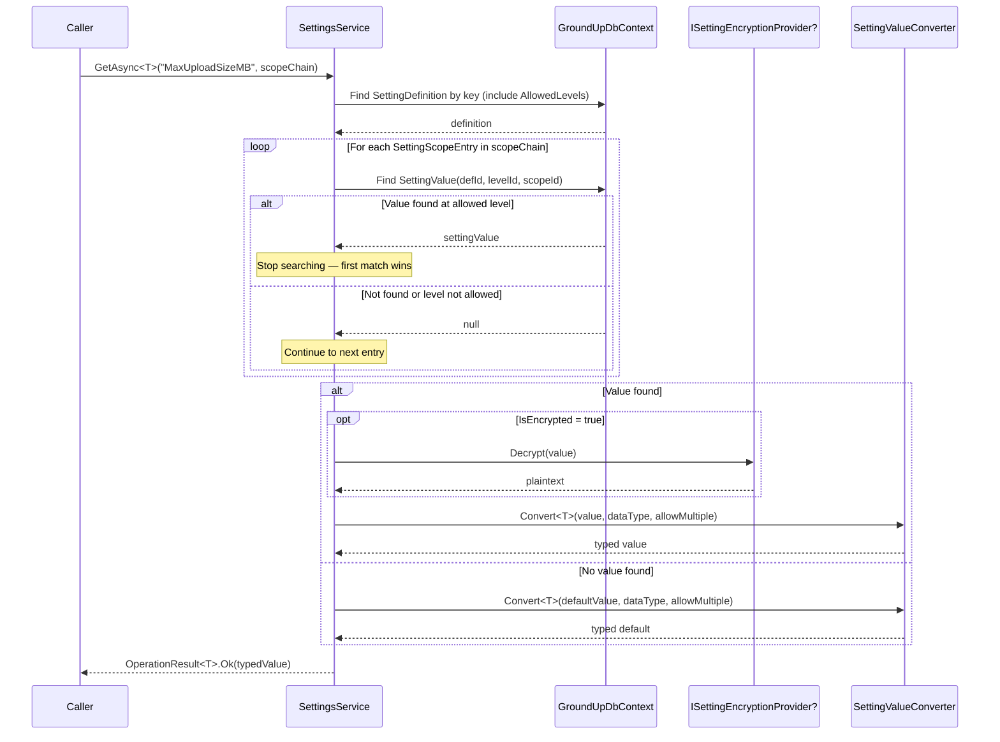

# Design Document: Phase 6B — Settings Module: Cascading Resolution Service

## Overview

Phase 6B delivers the runtime behavior layer for the GroundUp cascading settings infrastructure. Where Phase 6A established the data model (6 entities, DTOs, EF configurations), Phase 6B adds the service that makes those entities useful: cascading resolution, type-safe deserialization, transparent encryption/decryption, validation, and domain event publishing.

The central abstraction is `ISettingsService`, which consuming applications depend on for all settings operations. The caller provides a scope chain — an ordered list of `SettingScopeEntry` records from most specific to least specific (e.g., User → Team → Tenant → System) — and the service resolves the effective value by checking each entry in order, returning the first match or falling back to the definition's default value.

**Key design constraint**: The service accepts `GroundUpDbContext` (not a specific derived context) and uses EF Core directly via `DbContext.Set<T>()` rather than `IBaseRepository<T>`. Settings have custom query patterns (scope chain walks, batch resolution, composite key lookups) that don't fit the generic CRUD model.

### What Phase 6B Delivers

| Artifact | Project | Purpose |
|----------|---------|---------|
| `SettingScopeEntry` | GroundUp.Core | Readonly record struct for zero-allocation scope chain entries |
| `ISettingsService` | GroundUp.Core | Service interface for all settings operations |
| `ResolvedSettingDto` | GroundUp.Core | DTO with effective value + provenance metadata |
| `SettingChangedEvent` | GroundUp.Events | Domain event for setting value changes |
| `SettingsService` | GroundUp.Services | Sealed, scoped implementation of ISettingsService |
| `SettingValueConverter` | GroundUp.Services | Internal helper for type-safe deserialization |
| `SettingsServiceCollectionExtensions` | GroundUp.Services | DI registration extension method |
| Unit tests | GroundUp.Tests.Unit | Property-based and example-based tests |

### What Phase 6B Does NOT Include

- Caching (Phase 6C)
- API controllers (Phase 6C)
- Data seeders (Phase 6C)
- Integration tests against real Postgres (Phase 6D)

## Architecture

### Layer Placement

```
GroundUp.Core (no dependencies)
├── Models/SettingScopeEntry.cs           ← readonly record struct
├── Abstractions/ISettingsService.cs      ← service interface
└── Dtos/Settings/ResolvedSettingDto.cs   ← resolved value DTO

GroundUp.Events (depends on Core)
└── SettingChangedEvent.cs                ← domain event record

GroundUp.Services (depends on Core, Events, Data.Postgres)
└── Settings/
    ├── SettingsService.cs                ← sealed, scoped implementation
    ├── SettingValueConverter.cs           ← internal type conversion helper
    └── SettingsServiceCollectionExtensions.cs ← DI registration
```

### Dependency Flow



### Cascade Resolution Flow



### Design Decisions and Rationale

1. **EF Core direct access (not BaseRepository)**: Settings queries don't fit the generic CRUD pattern. Cascade resolution needs composite key lookups (`DefinitionId + LevelId + ScopeId`), batch loading for `GetAllForScopeAsync`, and group-filtered queries. Using `DbContext.Set<T>()` directly gives full control over query shape without fighting the repository abstraction.

2. **SettingScopeEntry as readonly record struct**: Scope chains are built per-request and passed through method calls. A readonly record struct avoids heap allocations for each entry, which matters when scope chains are built frequently in hot paths. The struct has only two fields (`Guid LevelId`, `Guid? ScopeId`) — well within the value type size guidelines.

3. **Caller-supplied scope chain**: The service doesn't know how to build a scope chain because it doesn't know the consuming application's hierarchy. A User → Team → Tenant → System chain requires application-specific context (current user, their team membership, their tenant). The caller builds this from their own `ICurrentUser` / `ITenantContext` and passes it in.

4. **Single-query batch resolution for GetAllForScopeAsync**: Rather than N+1 queries (one per definition), the service loads all `SettingValue` records matching any `(LevelId, ScopeId)` pair in the scope chain in a single query, then resolves in memory. This keeps the database round-trips constant regardless of how many definitions exist.

5. **SettingValueConverter as internal static helper**: Type conversion is a pure function with no dependencies — it takes a string value, a `SettingDataType`, and an `AllowMultiple` flag, and returns a typed result. Making it `internal static` keeps it testable (via `InternalsVisibleTo`) without polluting the public API.

6. **Optional ISettingEncryptionProvider via nullable constructor parameter**: The encryption provider is resolved from DI as `ISettingEncryptionProvider?`. When not registered, the service works fine for non-encrypted settings. It only fails (with a clear error message) when an encrypted setting is actually accessed without a provider. This avoids forcing all consuming apps to register an encryption provider they may not need.

7. **Secret masking in bulk reads, plaintext in targeted reads**: `GetAllForScopeAsync` and `GetGroupAsync` mask secret values because they're typically used for UI rendering where secrets should be hidden. `GetAsync<T>` returns the real value because the caller explicitly requested a specific setting by key for programmatic use.

8. **Fire-and-forget event publishing**: Following the existing `BaseService` pattern, event publishing failures are caught and swallowed. A failing event handler should never break a settings operation. The `InProcessEventBus` already logs handler failures.

9. **Validation before persistence**: All validation rules (required, min/max value, min/max length, regex, read-only, allowed levels) are checked in `SetAsync` before any database write. This prevents invalid values from ever reaching the database, matching the framework's "validate in service layer" convention.

## Components and Interfaces

### SettingScopeEntry (GroundUp.Core/Models/)

```csharp
/// <summary>
/// Represents a single entry in the cascade scope chain.
/// The consuming application builds a list of these from most specific
/// to least specific (e.g., User → Team → Tenant → System).
/// </summary>
/// <param name="LevelId">The cascade level this entry represents.</param>
/// <param name="ScopeId">
/// The specific entity at this level (e.g., a UserId or TenantId).
/// Null indicates the root/system level where no specific entity scope applies.
/// </param>
public readonly record struct SettingScopeEntry(Guid LevelId, Guid? ScopeId);
```

### ISettingsService (GroundUp.Core/Abstractions/)

| Method | Parameters | Returns | Purpose |
|--------|-----------|---------|---------|
| `GetAsync<T>` | `string key`, `IReadOnlyList<SettingScopeEntry> scopeChain`, `CancellationToken` | `Task<OperationResult<T>>` | Resolve single setting to typed value |
| `SetAsync` | `string key`, `string value`, `Guid levelId`, `Guid? scopeId`, `CancellationToken` | `Task<OperationResult<SettingValueDto>>` | Create or update a setting value |
| `GetAllForScopeAsync` | `IReadOnlyList<SettingScopeEntry> scopeChain`, `CancellationToken` | `Task<OperationResult<IReadOnlyList<ResolvedSettingDto>>>` | Resolve all settings for a scope |
| `GetGroupAsync` | `string groupKey`, `IReadOnlyList<SettingScopeEntry> scopeChain`, `CancellationToken` | `Task<OperationResult<IReadOnlyList<ResolvedSettingDto>>>` | Resolve all settings in a group |
| `DeleteValueAsync` | `Guid settingValueId`, `CancellationToken` | `Task<OperationResult>` | Delete a setting override |

### ResolvedSettingDto (GroundUp.Core/Dtos/Settings/)

| Property | Type | Purpose |
|----------|------|---------|
| `Definition` | `SettingDefinitionDto` | Full setting definition metadata |
| `EffectiveValue` | `string?` | Resolved value (decrypted or masked as appropriate) |
| `SourceLevelId` | `Guid?` | Which level the value came from (null = definition default) |
| `SourceScopeId` | `Guid?` | Which scope entity the value came from |
| `IsInherited` | `bool` | True if value came from a higher level or the default |

### SettingChangedEvent (GroundUp.Events/)

Extends `BaseEvent`. Published on create, update, and delete of setting values.

| Property | Type | Purpose |
|----------|------|---------|
| `SettingKey` | `string` | The setting definition key |
| `LevelId` | `Guid` | The level where the change occurred |
| `ScopeId` | `Guid?` | The scope where the change occurred |
| `OldValue` | `string?` | Previous value (null for new creates) |
| `NewValue` | `string?` | New value (null for deletes) |

### SettingsService (GroundUp.Services/Settings/)

Sealed, scoped class implementing `ISettingsService`. Constructor dependencies:

| Dependency | Type | Required | Purpose |
|-----------|------|----------|---------|
| `dbContext` | `GroundUpDbContext` | Yes | EF Core data access |
| `eventBus` | `IEventBus` | Yes | Domain event publishing |
| `encryptionProvider` | `ISettingEncryptionProvider?` | No | Encrypt/decrypt sensitive values |

Key implementation details:
- Uses `DbContext.Set<SettingDefinition>()`, `DbContext.Set<SettingValue>()`, etc. — no DbSet properties needed
- All read queries use `AsNoTracking()`
- Cascade resolution is a linear walk through the scope chain — O(n) where n = scope chain length
- `GetAllForScopeAsync` uses a single batch query to load all relevant `SettingValue` records, then resolves in memory

### SettingValueConverter (GroundUp.Services/Settings/)

Internal static class with a single public method:

```csharp
internal static class SettingValueConverter
{
    /// <summary>
    /// Converts a string value to the requested CLR type based on the setting's data type.
    /// </summary>
    public static OperationResult<T> Convert<T>(
        string? value,
        SettingDataType dataType,
        bool allowMultiple,
        string settingKey);
}
```

Conversion rules by `SettingDataType`:

| DataType | CLR Type | Parsing Strategy |
|----------|----------|-----------------|
| `String` | `string` | Direct return |
| `Int` | `int` | `int.TryParse` with `CultureInfo.InvariantCulture` |
| `Long` | `long` | `long.TryParse` with `CultureInfo.InvariantCulture` |
| `Decimal` | `decimal` | `decimal.TryParse` with `CultureInfo.InvariantCulture` |
| `Bool` | `bool` | `bool.TryParse` (case-insensitive) |
| `DateTime` | `DateTime` | `DateTime.TryParseExact` with "O" format |
| `Date` | `DateOnly` | `DateOnly.TryParseExact` with "yyyy-MM-dd" format |
| `Json` | `T` | `JsonSerializer.Deserialize<T>` |

When `AllowMultiple` is true, the value is deserialized as a JSON array into `List<T>` where the element type matches the `SettingDataType`.

When the value is null and no default exists, returns `OperationResult<T>.Ok(default(T))`.

### SettingsServiceCollectionExtensions (GroundUp.Services/Settings/)

```csharp
public static class SettingsServiceCollectionExtensions
{
    /// <summary>
    /// Registers <see cref="ISettingsService"/> as <see cref="SettingsService"/>
    /// with scoped lifetime. Does not require ISettingEncryptionProvider to be registered.
    /// </summary>
    public static IServiceCollection AddGroundUpSettings(this IServiceCollection services);
}
```

## Data Models

Phase 6B introduces no new entities or EF configurations. It operates on the Phase 6A entities:

- **SettingDefinition** — queried by `Key`, includes `AllowedLevels` collection for level validation
- **SettingValue** — queried by composite key `(SettingDefinitionId, LevelId, ScopeId)`, created/updated/deleted by `SetAsync`/`DeleteValueAsync`
- **SettingLevel** — referenced via `SettingScopeEntry.LevelId`
- **SettingGroup** — queried by `Key` for `GetGroupAsync`
- **SettingDefinitionLevel** — checked during resolution to skip values at disallowed levels, checked during `SetAsync` to reject writes at disallowed levels

### New Types (non-entity)

**SettingScopeEntry** — `readonly record struct` in `GroundUp.Core/Models/`:
```csharp
public readonly record struct SettingScopeEntry(Guid LevelId, Guid? ScopeId);
```

**ResolvedSettingDto** — `record` in `GroundUp.Core/Dtos/Settings/`:
```csharp
public record ResolvedSettingDto(
    SettingDefinitionDto Definition,
    string? EffectiveValue,
    Guid? SourceLevelId,
    Guid? SourceScopeId,
    bool IsInherited);
```

**SettingChangedEvent** — `record` extending `BaseEvent` in `GroundUp.Events/`:
```csharp
public sealed record SettingChangedEvent : BaseEvent
{
    public required string SettingKey { get; init; }
    public required Guid LevelId { get; init; }
    public Guid? ScopeId { get; init; }
    public string? OldValue { get; init; }
    public string? NewValue { get; init; }
}
```


## Correctness Properties

*A property is a characteristic or behavior that should hold true across all valid executions of a system — essentially, a formal statement about what the system should do. Properties serve as the bridge between human-readable specifications and machine-verifiable correctness guarantees.*

### Property 1: Cascade resolution returns the first match at an allowed level, or the default

*For any* setting definition with a set of allowed levels, *for any* scope chain of `SettingScopeEntry` records, and *for any* set of stored `SettingValue` records, the resolved effective value SHALL equal the `Value` of the first `SettingValue` whose `(SettingDefinitionId, LevelId, ScopeId)` matches a scope chain entry at an allowed level (iterating the chain from index 0). If no such match exists, the resolved value SHALL equal the `SettingDefinition.DefaultValue`.

**Validates: Requirements 4.3, 4.4, 4.5, 4.6, 4.7**

### Property 2: Type conversion round-trip preserves values

*For any* value of a supported `SettingDataType` (Int, Long, Decimal, DateTime, Date), formatting the value to its string representation using invariant culture / ISO 8601 and then parsing it back via `SettingValueConverter` SHALL produce a value equal to the original. *For any* serializable object of type `T`, serializing to JSON and deserializing back SHALL produce an equivalent object. When `AllowMultiple` is true, *for any* list of typed values, serializing as a JSON array and deserializing back SHALL produce an equal list.

**Validates: Requirements 5.2, 5.3, 5.4, 5.6, 5.7, 5.8, 5.9**

### Property 3: Invalid type conversions produce failure results

*For any* string that is not a valid representation of the target `SettingDataType` (e.g., a non-numeric string for `Int`, malformed JSON for `Json`), `SettingValueConverter.Convert<T>` SHALL return `OperationResult<T>.Fail` with a message describing the conversion failure, the setting key, the expected type, and the actual value.

**Validates: Requirements 5.10**

### Property 4: Secret settings are masked in bulk reads

*For any* setting definition where `IsSecret` is true, *for any* scope chain, the `EffectiveValue` in the `ResolvedSettingDto` returned by `GetAllForScopeAsync` or `GetGroupAsync` SHALL be a masked string (e.g., "••••••••"), never the plaintext value.

**Validates: Requirements 6.4, 11.6**

### Property 5: Writes to disallowed levels are rejected

*For any* setting definition and *for any* `levelId` that is NOT present in the definition's `AllowedLevels` collection, calling `SetAsync` with that `levelId` SHALL return `OperationResult.BadRequest`.

**Validates: Requirements 7.2**

### Property 6: Numeric values outside [MinValue, MaxValue] are rejected

*For any* setting definition with a `MinValue` and/or `MaxValue` constraint, *for any* numeric value (parsed according to the definition's `SettingDataType`) that is less than `MinValue` or greater than `MaxValue`, calling `SetAsync` SHALL return `OperationResult.BadRequest`.

**Validates: Requirements 7.4, 7.5**

### Property 7: Strings outside [MinLength, MaxLength] are rejected

*For any* setting definition with a `MinLength` and/or `MaxLength` constraint, *for any* string value whose length is less than `MinLength` or greater than `MaxLength`, calling `SetAsync` SHALL return `OperationResult.BadRequest`.

**Validates: Requirements 7.6, 7.7**

### Property 8: IsInherited flag reflects value provenance

*For any* resolved setting in the result of `GetAllForScopeAsync`, `IsInherited` SHALL be `false` if and only if the effective value came from a `SettingValue` matching the first entry in the scope chain (the most specific level). `IsInherited` SHALL be `true` if the value came from any other scope chain entry or from the definition's default value.

**Validates: Requirements 11.4, 11.5**

### Property 9: Group and bulk results are ordered by DisplayOrder

*For any* set of resolved settings returned by `GetGroupAsync` or `GetAllForScopeAsync`, the results SHALL be ordered by `SettingDefinition.DisplayOrder` in ascending order.

**Validates: Requirements 12.4**

## Error Handling

All error handling follows the framework's `OperationResult` pattern — business logic errors return `OperationResult.Fail(...)`, never throw exceptions.

### Error Scenarios by Method

#### GetAsync\<T\>

| Scenario | Result | Requirements |
|----------|--------|-------------|
| Setting key not found | `OperationResult<T>.NotFound("Setting '{key}' not found")` | 4.2 |
| IsEncrypted=true, no encryption provider | `OperationResult<T>.Fail("Encryption provider required...")` | 6.3 |
| Value cannot be parsed to type T | `OperationResult<T>.Fail("Cannot convert '{value}' to {typeof(T).Name} for setting '{key}'")` | 5.10 |
| Null value, no default | `OperationResult<T>.Ok(default(T))` | 5.11 |

#### SetAsync

| Scenario | Result | Requirements |
|----------|--------|-------------|
| Setting key not found | `OperationResult<SettingValueDto>.NotFound("Setting '{key}' not found")` | 7.1 |
| Level not in AllowedLevels | `OperationResult<SettingValueDto>.BadRequest("Level '{levelId}' is not allowed for setting '{key}'")` | 7.2 |
| IsRequired and value is null/empty | `OperationResult<SettingValueDto>.BadRequest("Setting '{key}' requires a value")` | 7.3 |
| Value below MinValue | `OperationResult<SettingValueDto>.BadRequest("Value must be at least {minValue} for setting '{key}'")` | 7.4 |
| Value above MaxValue | `OperationResult<SettingValueDto>.BadRequest("Value must be at most {maxValue} for setting '{key}'")` | 7.5 |
| Value shorter than MinLength | `OperationResult<SettingValueDto>.BadRequest("Value must be at least {minLength} characters for setting '{key}'")` | 7.6 |
| Value longer than MaxLength | `OperationResult<SettingValueDto>.BadRequest("Value must be at most {maxLength} characters for setting '{key}'")` | 7.7 |
| Value doesn't match RegexPattern | `OperationResult<SettingValueDto>.BadRequest(definition.ValidationMessage ?? "Value does not match the required pattern for setting '{key}'")` | 7.8 |
| IsReadOnly is true | `OperationResult<SettingValueDto>.BadRequest("Setting '{key}' is read-only")` | 7.9 |
| IsEncrypted=true, no encryption provider | `OperationResult<SettingValueDto>.Fail("Encryption provider required...")` | 6.3 |

#### DeleteValueAsync

| Scenario | Result | Requirements |
|----------|--------|-------------|
| SettingValue not found | `OperationResult.NotFound("Setting value '{id}' not found")` | 9.2 |

#### GetAllForScopeAsync / GetGroupAsync

| Scenario | Result | Requirements |
|----------|--------|-------------|
| Group key not found (GetGroupAsync only) | `OperationResult<IReadOnlyList<ResolvedSettingDto>>.NotFound("Setting group '{groupKey}' not found")` | 12.2 |
| IsEncrypted=true, no encryption provider | Encrypted settings are skipped or masked rather than failing the entire batch | Design decision |

### Event Publishing Failures

Event publishing via `IEventBus.PublishAsync` is fire-and-forget. Exceptions are caught and swallowed — they never cause the settings operation to fail. This matches the existing `BaseService.PublishEventSafelyAsync` pattern. The `InProcessEventBus` already logs handler failures at the Error level.

### Database Exceptions

Unexpected database exceptions (connection failures, constraint violations not caught by validation) are NOT caught by the service — they propagate to the caller. The framework's global exception handling middleware (Phase 3E) handles these at the API layer.

## Testing Strategy

### Approach

Phase 6B testing uses a **dual approach**: property-based tests for universal correctness properties and example-based unit tests for specific scenarios, edge cases, and integration behavior.

All tests use **xUnit + NSubstitute** (not Moq). Test naming follows `MethodName_Scenario_ExpectedResult`.

### Property-Based Testing

**Library**: [FsCheck.Xunit](https://github.com/fscheck/FsCheck) — the standard PBT library for .NET/xUnit.

**Configuration**: Minimum 100 iterations per property test.

**Tag format**: `// Feature: phase6b-settings-service, Property {number}: {property_text}`

Each correctness property from the design maps to a single property-based test:

| Property | Test Class | What Varies |
|----------|-----------|-------------|
| P1: Cascade resolution | `CascadeResolutionPropertyTests` | Scope chain length/order, stored value positions, allowed levels |
| P2: Type conversion round-trip | `SettingValueConverterPropertyTests` | Random int/long/decimal/DateTime/DateOnly/JSON values |
| P3: Invalid conversion failure | `SettingValueConverterPropertyTests` | Random non-parseable strings per data type |
| P4: Secret masking | `SecretMaskingPropertyTests` | Random secret values, scope chains |
| P5: Disallowed level rejection | `SetAsyncValidationPropertyTests` | Random level IDs not in allowed set |
| P6: Numeric range validation | `SetAsyncValidationPropertyTests` | Random min/max bounds and out-of-range values |
| P7: String length validation | `SetAsyncValidationPropertyTests` | Random min/max lengths and strings outside bounds |
| P8: IsInherited flag | `IsInheritedPropertyTests` | Scope chains with values at various positions |
| P9: DisplayOrder sorting | `DisplayOrderPropertyTests` | Random display orders on definitions |

### Unit Tests (Example-Based)

Located in `tests/GroundUp.Tests.Unit/Services/Settings/`.

| Test Class | Covers | Key Scenarios |
|-----------|--------|---------------|
| `SettingsServiceGetAsyncTests` | GetAsync\<T\> | Key not found (4.2), empty scope chain (4.7), encryption/decryption (6.1, 6.5), missing encryption provider (6.3), null value returns default (5.11), bool parsing (5.5) |
| `SettingsServiceSetAsyncTests` | SetAsync | Create new value (8.1), update existing (8.2), success result (8.3), old value capture (8.4), read-only rejection (7.9), required validation (7.3), regex validation (7.8) |
| `SettingsServiceDeleteValueAsyncTests` | DeleteValueAsync | Not found (9.2), successful delete (9.3, 9.4) |
| `SettingsServiceGetAllForScopeAsyncTests` | GetAllForScopeAsync | Loads all definitions (11.1), resolves each (11.2) |
| `SettingsServiceGetGroupAsyncTests` | GetGroupAsync | Group not found (12.2), group-filtered resolution (12.3) |
| `SettingsServiceEventTests` | Event publishing | Event on set (10.3), event on delete (10.4), event failure swallowed (10.5) |
| `SettingValueConverterTests` | Type conversion | String passthrough (5.1), bool case-insensitive (5.5), null handling (5.11) |
| `SettingsServiceCollectionExtensionsTests` | DI registration | Scoped registration (14.2), no encryption provider required (14.3) |

### Structural Tests

| Test Class | Covers |
|-----------|--------|
| `SettingScopeEntryTests` | Is readonly record struct (1.4), has LevelId/ScopeId properties (1.2, 1.3) |
| `SettingChangedEventTests` | Extends BaseEvent (10.1), has required properties (10.2) |

### Test Infrastructure

- **NSubstitute** mocks for `GroundUpDbContext`, `IEventBus`, `ISettingEncryptionProvider`
- **In-memory DbContext** using SQLite in-memory provider for EF Core query testing (since the service uses `DbContext.Set<T>()` directly, mocking individual DbSets is complex — an in-memory provider is simpler and more realistic)
- **FsCheck generators** for `SettingScopeEntry`, scope chains, `SettingDefinition` with various configurations, and typed values per `SettingDataType`
- `InternalsVisibleTo` on `GroundUp.Services` for testing `SettingValueConverter` directly
