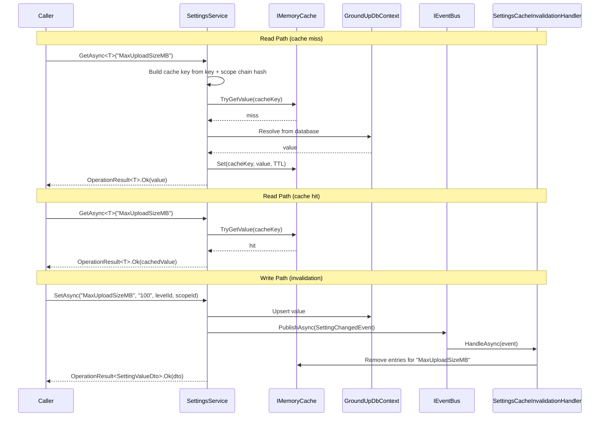

# Design Document: Phase 6C — Settings Module: API Layer, Caching, and Admin Service

## Overview

Phase 6C completes the GroundUp settings module by adding the pieces that make it consumable by real applications. Where Phase 6A delivered the data model (entities, DTOs, EF configurations) and Phase 6B delivered the cascading resolution service (`ISettingsService`), Phase 6C adds the scope chain provider, in-memory caching, admin service, API controllers, convenience overloads, DI registration, sample app wiring, and integration tests.

### What Phase 6C Delivers

| Artifact | Project | Purpose |
|----------|---------|---------|
| `IScopeChainProvider` | GroundUp.Core | Abstraction for building scope chains from request context |
| `DefaultScopeChainProvider` | GroundUp.Services | Default implementation using `ITenantContext` |
| `SettingsCacheOptions` | GroundUp.Core | Options class for configuring cache TTL |
| `SettingsCacheInvalidationHandler` | GroundUp.Services | `IEventHandler<SettingChangedEvent>` for cache invalidation |
| Convenience overloads on `ISettingsService` | GroundUp.Core / GroundUp.Services | Parameterless `GetAsync<T>`, `GetAllForScopeAsync`, `GetGroupAsync` |
| `ISettingsAdminService` | GroundUp.Core | Interface for CRUD on levels, groups, definitions |
| `SettingsAdminService` | GroundUp.Services | Sealed implementation of admin CRUD |
| Request DTOs | GroundUp.Core | `CreateSettingLevelDto`, `UpdateSettingLevelDto`, `CreateSettingGroupDto`, `UpdateSettingGroupDto`, `CreateSettingDefinitionDto`, `UpdateSettingDefinitionDto`, `SetSettingValueDto` |
| `SettingsController` | GroundUp.Api | Consumer-facing controller for resolving/setting values |
| `SettingLevelsController` | GroundUp.Sample | Admin CRUD for levels (sample app only) |
| `SettingGroupsController` | GroundUp.Sample | Admin CRUD for groups (sample app only) |
| `SettingDefinitionsController` | GroundUp.Sample | Admin CRUD for definitions (sample app only) |
| `DefaultSettingsSeeder` | GroundUp.Sample | Seeds example levels, groups, definitions |
| Updated `AddGroundUpSettings()` | GroundUp.Services | Registers all Phase 6C services |
| Integration tests | GroundUp.Tests.Integration | End-to-end cascading, admin CRUD, cache invalidation |

### What Phase 6C Does NOT Include

- Integration tests against real Postgres with Testcontainers (Phase 6D)
- Distributed cache (Redis) — future enhancement
- FluentValidation validators for admin DTOs — can be added later
- Bulk update endpoint — deferred

## Architecture

### Layer Placement

```
GroundUp.Core (no dependencies)
├── Abstractions/IScopeChainProvider.cs           ← scope chain builder interface
├── Abstractions/ISettingsAdminService.cs          ← admin CRUD interface
├── Models/SettingsCacheOptions.cs                 ← cache configuration
└── Dtos/Settings/
    ├── CreateSettingLevelDto.cs                   ← request DTOs
    ├── UpdateSettingLevelDto.cs
    ├── CreateSettingGroupDto.cs
    ├── UpdateSettingGroupDto.cs
    ├── CreateSettingDefinitionDto.cs
    ├── UpdateSettingDefinitionDto.cs
    └── SetSettingValueDto.cs

GroundUp.Services (depends on Core, Events, Data.Postgres)
└── Settings/
    ├── DefaultScopeChainProvider.cs               ← IScopeChainProvider default
    ├── SettingsAdminService.cs                    ← ISettingsAdminService implementation
    ├── SettingsCacheInvalidationHandler.cs         ← IEventHandler<SettingChangedEvent>
    └── SettingsServiceCollectionExtensions.cs      ← updated DI registration

GroundUp.Api (depends on Core, Services)
└── Controllers/Settings/
    └── SettingsController.cs                      ← consumer-facing endpoints

GroundUp.Sample (depends on all framework projects)
├── Controllers/Settings/
│   ├── SettingLevelsController.cs                 ← admin CRUD (sample only)
│   ├── SettingGroupsController.cs                 ← admin CRUD (sample only)
│   └── SettingDefinitionsController.cs            ← admin CRUD (sample only)
└── Data/
    └── DefaultSettingsSeeder.cs                   ← IDataSeeder for example data
```

### Dependency Flow

```mermaid
graph TD
    subgraph "GroundUp.Api"
        SC[SettingsController]
    end

    subgraph "GroundUp.Sample"
        SLC[SettingLevelsController]
        SGC[SettingGroupsController]
        SDC[SettingDefinitionsController]
        DSS[DefaultSettingsSeeder]
    end

    subgraph "GroundUp.Services"
        SS[SettingsService]
        SAS[SettingsAdminService]
        DSCP[DefaultScopeChainProvider]
        SCIH[SettingsCacheInvalidationHandler]
    end

    subgraph "GroundUp.Core"
        ISS[ISettingsService]
        ISAS[ISettingsAdminService]
        ISCP[IScopeChainProvider]
        SCO[SettingsCacheOptions]
    end

    SC --> ISS
    SLC --> ISAS
    SGC --> ISAS
    SDC --> ISAS
    DSS --> DB[(Database)]

    SS --> ISCP
    SS --> MC[IMemoryCache]
    SS --> DB
    SS --> EB[IEventBus]

    SAS --> DB
    DSCP --> TC[ITenantContext]
    DSCP --> DB
    SCIH --> MC

    style ISS fill:#e1f5fe
    style ISAS fill:#e1f5fe
    style ISCP fill:#e1f5fe
    style SCO fill:#e1f5fe
    style SC fill:#c8e6c9
    style SLC fill:#fff9c4
    style SGC fill:#fff9c4
    style SDC fill:#fff9c4
```



### Caching Flow



### Design Decisions and Rationale

1. **IScopeChainProvider builds from ITenantContext at the service layer**: The scope chain provider is a service-layer concern, not a controller concern. This keeps controllers thin and ensures the same scope chain logic works for both API and SDK consumers. The default implementation queries the database for a "Tenant" level and builds a single-entry chain. Consuming apps override this for complex hierarchies (User → Team → Tenant → System).

2. **Convenience overloads delegate to explicit overloads**: The parameterless `GetAsync<T>(key)` calls `IScopeChainProvider.GetScopeChainAsync()` then delegates to the existing `GetAsync<T>(key, scopeChain)`. This avoids code duplication — all resolution logic stays in one place. The explicit overloads remain for admin scenarios where the caller provides a custom scope chain.

3. **Cache key = setting key + scope chain hash**: The cache key combines the setting key (or operation identifier like `"all"` or `"group:{groupKey}"`) with a deterministic hash of the scope chain entries. This ensures different tenants get different cache entries. The hash is computed from the ordered `(LevelId, ScopeId)` pairs using a simple hash combine.

4. **Cache invalidation by setting key prefix**: When a `SettingChangedEvent` fires, the handler removes all cache entries whose key starts with the changed setting key. This is a simple approach that clears all scope variations for that setting. For bulk operations (`GetAllForScopeAsync`, `GetGroupAsync`), the handler clears all bulk cache entries since any setting change could affect them. This is slightly aggressive but correct — a stale bulk cache is worse than a cache miss.

5. **ISettingsAdminService separate from ISettingsService**: Admin CRUD (creating levels, groups, definitions) is a fundamentally different concern from resolution (getting effective values). Keeping them separate means consuming apps can inject only what they need. The admin service is needed by seeders and SDK consumers who manage settings metadata programmatically. The resolution service is needed by everyone who reads settings.

6. **Admin controllers in sample app, not framework**: The framework provides `ISettingsAdminService` so any consuming app can build admin endpoints. But the specific controller routes, authorization, and UI are application-specific decisions. The sample app demonstrates the pattern; consuming apps copy and customize.

7. **SettingsController does NOT extend BaseController**: Settings endpoints don't follow the standard CRUD pattern. The routes are custom (`/api/settings/{key}`, `/api/settings/groups/{groupKey}`), the DTOs vary per endpoint, and there's no single entity type. A custom controller inheriting from `ControllerBase` is cleaner.

8. **SetAsync and DeleteValueAsync bypass cache**: Write operations go directly to the database. Cache invalidation happens via the `SettingChangedEvent` → `SettingsCacheInvalidationHandler` pipeline. This keeps the write path simple and ensures cache invalidation is event-driven (which also works for distributed scenarios in the future).

9. **DefaultSettingsSeeder uses check-before-insert**: The seeder queries for existing records by key/name before inserting. This is simpler than deterministic GUIDs and works correctly with UUID v7 generation. The seeder runs on every startup but only creates data that doesn't already exist.

10. **SettingsCacheOptions with TimeSpan CacheDuration**: A simple options class configured via `Action<SettingsCacheOptions>` in `AddGroundUpSettings()`. Default is 15 minutes. Consuming apps can tune this based on their read/write ratio.

## Components and Interfaces

### IScopeChainProvider (GroundUp.Core/Abstractions/)

```csharp
/// <summary>
/// Builds a scope chain from the current request context. The default implementation
/// creates a single-entry chain from ITenantContext. Consuming applications override
/// this for complex hierarchies (e.g., User → Team → Tenant → System).
/// </summary>
public interface IScopeChainProvider
{
    /// <summary>
    /// Builds the scope chain for the current request context, ordered from
    /// most specific to least specific.
    /// </summary>
    Task<IReadOnlyList<SettingScopeEntry>> GetScopeChainAsync(
        CancellationToken cancellationToken = default);
}
```

### DefaultScopeChainProvider (GroundUp.Services/Settings/)

| Dependency | Type | Required | Purpose |
|-----------|------|----------|---------|
| `tenantContext` | `ITenantContext` | Yes | Current tenant identity |
| `dbContext` | `GroundUpDbContext` | Yes | Query for "Tenant" level ID |

Behavior:
- If `ITenantContext.TenantId` is `Guid.Empty`, returns an empty list (falls back to defaults).
- Otherwise, queries `SettingLevel` for a record named `"Tenant"`. If found, returns a single-entry scope chain `[new SettingScopeEntry(tenantLevel.Id, tenantContext.TenantId)]`. If not found, returns an empty list.

### ISettingsService Convenience Overloads

Three new methods added to the existing `ISettingsService` interface:

| Method | Parameters | Returns | Purpose |
|--------|-----------|---------|---------|
| `GetAsync<T>` | `string key`, `CancellationToken` | `Task<OperationResult<T>>` | Resolve using IScopeChainProvider |
| `GetAllForScopeAsync` | `CancellationToken` | `Task<OperationResult<IReadOnlyList<ResolvedSettingDto>>>` | All settings using IScopeChainProvider |
| `GetGroupAsync` | `string groupKey`, `CancellationToken` | `Task<OperationResult<IReadOnlyList<ResolvedSettingDto>>>` | Group settings using IScopeChainProvider |

Each convenience overload calls `IScopeChainProvider.GetScopeChainAsync()` then delegates to the existing explicit scope chain overload.

### SettingsCacheOptions (GroundUp.Core/Models/)

```csharp
/// <summary>
/// Configuration options for the settings in-memory cache.
/// </summary>
public sealed class SettingsCacheOptions
{
    /// <summary>
    /// How long resolved settings are cached before expiring.
    /// Default is 15 minutes.
    /// </summary>
    public TimeSpan CacheDuration { get; set; } = TimeSpan.FromMinutes(15);
}
```

### SettingsCacheInvalidationHandler (GroundUp.Services/Settings/)

Implements `IEventHandler<SettingChangedEvent>`. When a `SettingChangedEvent` is received:
1. Removes the cache entry for the specific setting key (all scope chain variations).
2. Removes all bulk cache entries (`GetAllForScopeAsync` and `GetGroupAsync` results) since any setting change could affect them.

Implementation detail: Uses a `ConcurrentDictionary<string, byte>` to track active cache keys, enabling targeted removal. When a cache entry is created, its key is added to the tracking set. When invalidation fires, matching keys are removed from both the tracking set and `IMemoryCache`.

### ISettingsAdminService (GroundUp.Core/Abstractions/)

| Method | Parameters | Returns | Purpose |
|--------|-----------|---------|---------|
| `GetAllLevelsAsync` | `CancellationToken` | `Task<OperationResult<IReadOnlyList<SettingLevelDto>>>` | List all levels |
| `CreateLevelAsync` | `CreateSettingLevelDto`, `CancellationToken` | `Task<OperationResult<SettingLevelDto>>` | Create a level |
| `UpdateLevelAsync` | `Guid id`, `UpdateSettingLevelDto`, `CancellationToken` | `Task<OperationResult<SettingLevelDto>>` | Update a level |
| `DeleteLevelAsync` | `Guid id`, `CancellationToken` | `Task<OperationResult>` | Delete a level (with reference checks) |
| `GetAllGroupsAsync` | `CancellationToken` | `Task<OperationResult<IReadOnlyList<SettingGroupDto>>>` | List all groups |
| `CreateGroupAsync` | `CreateSettingGroupDto`, `CancellationToken` | `Task<OperationResult<SettingGroupDto>>` | Create a group |
| `UpdateGroupAsync` | `Guid id`, `UpdateSettingGroupDto`, `CancellationToken` | `Task<OperationResult<SettingGroupDto>>` | Update a group |
| `DeleteGroupAsync` | `Guid id`, `CancellationToken` | `Task<OperationResult>` | Delete a group (orphans definitions) |
| `GetAllDefinitionsAsync` | `CancellationToken` | `Task<OperationResult<IReadOnlyList<SettingDefinitionDto>>>` | List all definitions (with options) |
| `GetDefinitionByIdAsync` | `Guid id`, `CancellationToken` | `Task<OperationResult<SettingDefinitionDto>>` | Get single definition |
| `CreateDefinitionAsync` | `CreateSettingDefinitionDto`, `CancellationToken` | `Task<OperationResult<SettingDefinitionDto>>` | Create definition with options and allowed levels |
| `UpdateDefinitionAsync` | `Guid id`, `UpdateSettingDefinitionDto`, `CancellationToken` | `Task<OperationResult<SettingDefinitionDto>>` | Update definition, replace options and allowed levels |
| `DeleteDefinitionAsync` | `Guid id`, `CancellationToken` | `Task<OperationResult>` | Delete definition (cascades to options, values, allowed levels) |

### SettingsAdminService (GroundUp.Services/Settings/)

Sealed, scoped class implementing `ISettingsAdminService`. Constructor dependency: `GroundUpDbContext`.

Key implementation details:
- Uses `DbContext.Set<T>()` directly (same pattern as `SettingsService`).
- All read queries use `AsNoTracking()`.
- `CreateDefinitionAsync` persists the definition, its options, and its allowed level junction records in a single `SaveChangesAsync` call.
- `UpdateDefinitionAsync` removes existing options and allowed levels, then adds the new ones from the request. This is a full replace, not a merge.
- `DeleteLevelAsync` checks for child levels and referencing `SettingValue` records before attempting deletion. Returns `OperationResult.BadRequest` if references exist.
- `DeleteGroupAsync` sets `GroupId = null` on all definitions in the group before deleting the group, matching the `SetNull` FK behavior.
- Maps entities to DTOs using static helper methods (same pattern as `SettingsService.MapToDto`).

### SettingsController (GroundUp.Api/Controllers/Settings/)

Custom controller inheriting from `ControllerBase` (NOT `BaseController<T>`).

| Endpoint | Method | Route | Service Call | Purpose |
|----------|--------|-------|-------------|---------|
| Get single | GET | `/api/settings/{key}` | `ISettingsService.GetAsync<string>(key)` | Resolve effective value |
| Get all | GET | `/api/settings` | `ISettingsService.GetAllForScopeAsync()` | All effective settings |
| Get group | GET | `/api/settings/groups/{groupKey}` | `ISettingsService.GetGroupAsync(groupKey)` | Group effective settings |
| Set value | PUT | `/api/settings/{key}` | `ISettingsService.SetAsync(key, dto.Value, dto.LevelId, dto.ScopeId)` | Set value at level/scope |
| Delete value | DELETE | `/api/settings/values/{id}` | `ISettingsService.DeleteValueAsync(id)` | Delete value override |

The controller uses a `ToActionResult` helper method (same pattern as `BaseController<T>`) to convert `OperationResult` to `ActionResult`.

### Sample App Admin Controllers

Three controllers in `samples/GroundUp.Sample/Controllers/Settings/`:

**SettingLevelsController** — `[Route("api/settings/levels")]`
- `GET` → `GetAllLevelsAsync()`
- `POST` → `CreateLevelAsync(dto)`
- `PUT {id}` → `UpdateLevelAsync(id, dto)`
- `DELETE {id}` → `DeleteLevelAsync(id)`

**SettingGroupsController** — `[Route("api/settings/groups")]`
- `GET` → `GetAllGroupsAsync()`
- `POST` → `CreateGroupAsync(dto)`
- `PUT {id}` → `UpdateGroupAsync(id, dto)`
- `DELETE {id}` → `DeleteGroupAsync(id)`

**SettingDefinitionsController** — `[Route("api/settings/definitions")]`
- `GET` → `GetAllDefinitionsAsync()`
- `GET {id}` → `GetDefinitionByIdAsync(id)`
- `POST` → `CreateDefinitionAsync(dto)`
- `PUT {id}` → `UpdateDefinitionAsync(id, dto)`
- `DELETE {id}` → `DeleteDefinitionAsync(id)`

All admin controllers accept `ISettingsAdminService` as a constructor dependency and contain zero business logic.

### Request DTOs (GroundUp.Core/Dtos/Settings/)

```csharp
public record CreateSettingLevelDto(
    string Name,
    string? Description,
    Guid? ParentId,
    int DisplayOrder);

public record UpdateSettingLevelDto(
    string Name,
    string? Description,
    Guid? ParentId,
    int DisplayOrder);

public record CreateSettingGroupDto(
    string Key,
    string DisplayName,
    string? Description,
    string? Icon,
    int DisplayOrder);

public record UpdateSettingGroupDto(
    string Key,
    string DisplayName,
    string? Description,
    string? Icon,
    int DisplayOrder);

public record CreateSettingDefinitionDto(
    string Key,
    SettingDataType DataType,
    string? DefaultValue,
    Guid? GroupId,
    string DisplayName,
    string? Description,
    string? Placeholder,
    string? Category,
    int DisplayOrder,
    bool IsVisible,
    bool IsReadOnly,
    bool AllowMultiple,
    bool IsEncrypted,
    bool IsSecret,
    bool IsRequired,
    string? MinValue,
    string? MaxValue,
    int? MinLength,
    int? MaxLength,
    string? RegexPattern,
    string? ValidationMessage,
    string? DependsOnKey,
    string? DependsOnOperator,
    string? DependsOnValue,
    string? CustomValidatorType,
    IReadOnlyList<CreateSettingOptionDto>? Options,
    IReadOnlyList<Guid>? AllowedLevelIds);

public record CreateSettingOptionDto(
    string Value,
    string Label,
    int DisplayOrder,
    bool IsDefault,
    string? ParentOptionValue);

public record UpdateSettingDefinitionDto(
    string Key,
    SettingDataType DataType,
    string? DefaultValue,
    Guid? GroupId,
    string DisplayName,
    string? Description,
    string? Placeholder,
    string? Category,
    int DisplayOrder,
    bool IsVisible,
    bool IsReadOnly,
    bool AllowMultiple,
    bool IsEncrypted,
    bool IsSecret,
    bool IsRequired,
    string? MinValue,
    string? MaxValue,
    int? MinLength,
    int? MaxLength,
    string? RegexPattern,
    string? ValidationMessage,
    string? DependsOnKey,
    string? DependsOnOperator,
    string? DependsOnValue,
    string? CustomValidatorType,
    IReadOnlyList<CreateSettingOptionDto>? Options,
    IReadOnlyList<Guid>? AllowedLevelIds);

public record SetSettingValueDto(
    string Value,
    Guid LevelId,
    Guid? ScopeId);
```

### Updated DI Registration

The existing `AddGroundUpSettings()` method is expanded:

```csharp
public static IServiceCollection AddGroundUpSettings(
    this IServiceCollection services,
    Action<SettingsCacheOptions>? configureCacheOptions = null)
{
    // Phase 6B: resolution service
    services.AddScoped<ISettingsService, SettingsService>();

    // Phase 6C: scope chain provider (overridable)
    services.TryAddScoped<IScopeChainProvider, DefaultScopeChainProvider>();

    // Phase 6C: admin service
    services.AddScoped<ISettingsAdminService, SettingsAdminService>();

    // Phase 6C: caching
    services.AddMemoryCache();
    services.Configure<SettingsCacheOptions>(options =>
    {
        configureCacheOptions?.Invoke(options);
    });
    services.AddScoped<IEventHandler<SettingChangedEvent>, SettingsCacheInvalidationHandler>();

    return services;
}
```

Uses `TryAddScoped` for `IScopeChainProvider` so consuming apps can register their own implementation before or after calling `AddGroundUpSettings()`.

## Data Models

Phase 6C introduces no new database entities or EF configurations. It operates on the Phase 6A entities and Phase 6B service layer. The new types are all in-memory:

### New Types

| Type | Kind | Project | Purpose |
|------|------|---------|---------|
| `IScopeChainProvider` | Interface | GroundUp.Core | Scope chain builder contract |
| `ISettingsAdminService` | Interface | GroundUp.Core | Admin CRUD contract |
| `SettingsCacheOptions` | Class | GroundUp.Core | Cache configuration |
| `DefaultScopeChainProvider` | Class | GroundUp.Services | Default scope chain builder |
| `SettingsAdminService` | Class | GroundUp.Services | Admin CRUD implementation |
| `SettingsCacheInvalidationHandler` | Class | GroundUp.Services | Event handler for cache invalidation |
| `SettingsController` | Class | GroundUp.Api | Consumer-facing API controller |
| `SettingLevelsController` | Class | GroundUp.Sample | Admin levels controller |
| `SettingGroupsController` | Class | GroundUp.Sample | Admin groups controller |
| `SettingDefinitionsController` | Class | GroundUp.Sample | Admin definitions controller |
| `DefaultSettingsSeeder` | Class | GroundUp.Sample | Example data seeder |
| 7 request DTOs | Records | GroundUp.Core | Write operation contracts |

### Cache Key Structure

Cache keys follow a predictable pattern for targeted invalidation:

| Operation | Cache Key Format | Example |
|-----------|-----------------|---------|
| `GetAsync<T>(key, scopeChain)` | `settings:get:{key}:{scopeChainHash}` | `settings:get:MaxUploadSizeMB:a1b2c3` |
| `GetAllForScopeAsync(scopeChain)` | `settings:all:{scopeChainHash}` | `settings:all:a1b2c3` |
| `GetGroupAsync(groupKey, scopeChain)` | `settings:group:{groupKey}:{scopeChainHash}` | `settings:group:DatabaseConnection:a1b2c3` |

The scope chain hash is computed by combining the hash codes of all `(LevelId, ScopeId)` pairs in order using `HashCode.Combine`.


## Correctness Properties

*A property is a characteristic or behavior that should hold true across all valid executions of a system — essentially, a formal statement about what the system should do. Properties serve as the bridge between human-readable specifications and machine-verifiable correctness guarantees.*

### Property 1: Convenience overloads produce identical results to explicit overloads

*For any* setting key and *for any* scope chain returned by `IScopeChainProvider.GetScopeChainAsync()`, calling the convenience overload `GetAsync<T>(key)` SHALL produce the same `OperationResult<T>` as calling the explicit overload `GetAsync<T>(key, scopeChain)` with that scope chain. The same equivalence SHALL hold for `GetAllForScopeAsync()` and `GetGroupAsync(groupKey)`.

**Validates: Requirements 3.4**

### Property 2: Scope chain hash determinism

*For any* two scope chains that contain the same `SettingScopeEntry` records in the same order, the computed cache key hash SHALL be identical. *For any* two scope chains that differ in at least one entry (different `LevelId` or `ScopeId`) or in ordering, the computed cache key hash SHALL differ (with high probability).

**Validates: Requirements 4.2**

### Property 3: Cache read-through populates on miss and returns on hit

*For any* setting key and scope chain, calling `GetAsync<T>` when the cache is empty SHALL resolve the value from the database and store it in the cache. A subsequent call with the same key and scope chain SHALL return the cached value without querying the database.

**Validates: Requirements 4.3, 4.4**

### Property 4: Cache invalidation clears stale entries on setting change

*For any* setting key with a cached value, when a `SettingChangedEvent` is published for that key (via `SetAsync` or `DeleteValueAsync`), the next `GetAsync<T>` call for that key SHALL resolve from the database (not the cache) and return the updated value. This SHALL hold regardless of which scope chain variation was cached.

**Validates: Requirements 4.7, 17.1, 17.2**

### Property 5: Definition CRUD preserves associated options and allowed levels

*For any* `CreateSettingDefinitionDto` with N options and M allowed level IDs, calling `CreateDefinitionAsync` SHALL persist the definition along with exactly N `SettingOption` records and M `SettingDefinitionLevel` records. *For any* subsequent `UpdateSettingDefinitionDto` with P options and Q allowed level IDs, calling `UpdateDefinitionAsync` SHALL result in exactly P options and Q allowed levels (replacing, not merging with, the previous collections).

**Validates: Requirements 6.5, 6.6**

### Property 6: Deleting a level with references is rejected

*For any* `SettingLevel` that has child levels or is referenced by at least one `SettingValue` record, calling `DeleteLevelAsync` SHALL return `OperationResult.BadRequest` and the level SHALL remain in the database unchanged.

**Validates: Requirements 6.7**

### Property 7: Deleting a group orphans its definitions

*For any* `SettingGroup` with one or more `SettingDefinition` records, calling `DeleteGroupAsync` SHALL remove the group from the database and set `GroupId` to null on all previously associated definitions. The definitions themselves SHALL remain in the database.

**Validates: Requirements 6.8**

### Property 8: Cascading resolution returns the most specific value with correct fallback

*For any* setting definition allowed at both System and Tenant levels, and *for any* scope chain containing a Tenant entry followed by a System entry: if a value exists at the Tenant level, the resolved value SHALL equal the tenant-level value. If no tenant-level value exists but a system-level value does, the resolved value SHALL equal the system-level value. If neither exists, the resolved value SHALL equal the definition's default value. Deleting a tenant-level override SHALL cause subsequent resolution to fall back to the system-level value.

**Validates: Requirements 15.3, 15.4, 15.5, 15.6**

### Property 9: Settings seeder is idempotent

*For any* number of invocations N ≥ 1 of `DefaultSettingsSeeder.SeedAsync`, the database state after N invocations SHALL be identical to the state after 1 invocation. Specifically, the count of `SettingLevel`, `SettingGroup`, and `SettingDefinition` records created by the seeder SHALL not increase after the first run.

**Validates: Requirements 11.7**

## Error Handling

All error handling follows the framework's `OperationResult` pattern — business logic errors return `OperationResult.Fail(...)`, never throw exceptions.

### Error Scenarios by Component

#### SettingsService (Updated for Phase 6C)

Phase 6C adds caching and convenience overloads. The error scenarios from Phase 6B remain unchanged. New scenarios:

| Scenario | Result | Requirements |
|----------|--------|-------------|
| IScopeChainProvider returns empty list (convenience overloads) | Resolution falls back to definition defaults — this is normal behavior, not an error | 2.4, 2.5 |
| IMemoryCache throws on Get/Set | Cache exceptions are caught and swallowed — the service falls through to database resolution. Cache is a performance optimization, not a correctness requirement. | Design decision |

#### SettingsAdminService

| Scenario | Result | Requirements |
|----------|--------|-------------|
| Level not found (update/delete) | `OperationResult.NotFound("Setting level '{id}' not found")` | 6.7 |
| Level has child levels (delete) | `OperationResult.BadRequest("Cannot delete level '{name}' because it has child levels")` | 6.7 |
| Level referenced by SettingValues (delete) | `OperationResult.BadRequest("Cannot delete level '{name}' because it is referenced by setting values")` | 6.7 |
| Group not found (update/delete) | `OperationResult.NotFound("Setting group '{id}' not found")` | 6.8 |
| Definition not found (get by id/update/delete) | `OperationResult.NotFound("Setting definition '{id}' not found")` | 5.4 |
| Duplicate key on level/group/definition create | `OperationResult.BadRequest("A setting {entity} with key '{key}' already exists")` | Design decision |

#### SettingsController

The controller contains zero error handling logic. It delegates entirely to `ISettingsService` and converts the `OperationResult` to an `ActionResult` using the same `ToActionResult` pattern as `BaseController<T>`.

#### DefaultScopeChainProvider

The scope chain provider does not return errors. If the tenant context is empty or the "Tenant" level doesn't exist, it returns an empty scope chain. This causes resolution to fall back to definition defaults, which is correct behavior.

### Cache Exception Handling

Cache operations (`IMemoryCache.TryGetValue`, `IMemoryCache.Set`) are wrapped in try/catch blocks. If the cache throws (e.g., memory pressure), the service falls through to database resolution. This ensures the cache is a transparent optimization layer that never breaks the read path.

The `SettingsCacheInvalidationHandler` also catches exceptions during cache removal. A failed invalidation means the cache may serve stale data until the TTL expires — this is acceptable for a settings system where eventual consistency is sufficient.

### Database Exceptions

Unexpected database exceptions propagate to the caller, where the framework's global `ExceptionHandlingMiddleware` handles them. The admin service catches specific scenarios (duplicate keys, FK violations) and returns appropriate `OperationResult` failures before they reach the database.

## Testing Strategy

### Approach

Phase 6C testing uses a **dual approach**: property-based tests for universal correctness properties and example-based unit tests for specific scenarios, edge cases, and structural verification.

All tests use **xUnit + NSubstitute** (not Moq). Test naming follows `MethodName_Scenario_ExpectedResult`.

### Property-Based Testing

**Library**: [FsCheck.Xunit](https://github.com/fscheck/FsCheck) — the standard PBT library for .NET/xUnit.

**Configuration**: Minimum 100 iterations per property test.

**Tag format**: `// Feature: phase6c-settings-api, Property {number}: {property_text}`

Each correctness property from the design maps to a single property-based test:

| Property | Test Class | What Varies |
|----------|-----------|-------------|
| P1: Convenience overload equivalence | `SettingsServiceConvenienceOverloadPropertyTests` | Random setting keys, scope chains from provider |
| P2: Scope chain hash determinism | `ScopeChainHashPropertyTests` | Random scope chain entries, ordering |
| P3: Cache read-through | `SettingsCachePropertyTests` | Random setting keys, scope chains, values |
| P4: Cache invalidation | `SettingsCacheInvalidationPropertyTests` | Random setting keys, old/new values, scope chain variations |
| P5: Definition CRUD options/levels | `SettingsAdminServicePropertyTests` | Random option counts, level ID counts |
| P6: Delete level with references rejected | `SettingsAdminServicePropertyTests` | Random levels with children or referencing values |
| P7: Delete group orphans definitions | `SettingsAdminServicePropertyTests` | Random groups with varying definition counts |
| P8: Cascading resolution | `CascadingResolutionPropertyTests` | Random system/tenant values, presence/absence of overrides |
| P9: Seeder idempotency | `DefaultSettingsSeederPropertyTests` | Random number of invocations (2-5) |

### Unit Tests (Example-Based)

Located in `tests/GroundUp.Tests.Unit/`.

| Test Class | Covers | Key Scenarios |
|-----------|--------|---------------|
| `DefaultScopeChainProviderTests` | DefaultScopeChainProvider | Tenant ID set → single-entry chain (2.3), Guid.Empty → empty chain (2.4), missing "Tenant" level → empty chain (2.5) |
| `SettingsServiceConvenienceOverloadTests` | Convenience overloads | GetAsync<T>(key) delegates to GetAsync<T>(key, scopeChain) (3.4), GetAllForScopeAsync() delegates (3.2), GetGroupAsync(groupKey) delegates (3.3) |
| `SettingsCacheOptionsTests` | SettingsCacheOptions | Default TTL is 15 minutes (10.2), custom TTL is applied (4.5) |
| `SettingsCacheInvalidationHandlerTests` | Cache invalidation handler | Clears entries for changed key (4.7), clears bulk cache entries (4.9), implements IEventHandler (4.8) |
| `SettingsAdminServiceLevelTests` | Level CRUD | Create level (5.2), update level (5.2), delete level with children rejected (6.7), delete level with values rejected (6.7), delete orphan level succeeds |
| `SettingsAdminServiceGroupTests` | Group CRUD | Create group (5.3), update group (5.3), delete group orphans definitions (6.8) |
| `SettingsAdminServiceDefinitionTests` | Definition CRUD | Create with options and levels (6.5), update replaces options and levels (6.6), delete cascades (5.4), get all includes options (6.10) |
| `SettingsServiceCollectionExtensionsTests` | DI registration | All services registered (9.1-9.4), IScopeChainProvider overridable (9.6), cache options configurable (9.5) |

### Structural Tests

| Test Class | Covers |
|-----------|--------|
| `IScopeChainProviderStructureTests` | Interface exists (1.1), method signature (1.2) |
| `ISettingsAdminServiceStructureTests` | Interface exists (5.1), CRUD methods declared (5.2-5.4), return types (5.5) |
| `SettingsControllerStructureTests` | Inherits ControllerBase not BaseController (7.3), has [ApiController] and [Route] (7.2), accepts ISettingsService (7.4) |
| `RequestDtoStructureTests` | All request DTOs are records (13.5), SetSettingValueDto has correct properties (13.3), CreateSettingDefinitionDto has collections (13.4) |

### Integration Tests

Located in `tests/GroundUp.Tests.Integration/Settings/`. These use `CustomWebApplicationFactory` with Testcontainers Postgres.

| Test Class | Covers | Key Scenarios |
|-----------|--------|---------------|
| `SettingsCascadingResolutionTests` | End-to-end cascading | System value fallback (15.3), tenant override wins (15.4), different tenant gets system value (15.5), delete override reverts (15.6) |
| `SettingsAdminCrudTests` | Admin CRUD via API | Create level (16.1), create definition with options (16.2), set and resolve value (16.3), update level (16.4), delete definition (16.5) |
| `SettingsCacheInvalidationTests` | Cache invalidation via API | Set → read → update → read returns new value (17.1), delete → read falls back (17.2) |

### Test Infrastructure

- **NSubstitute** mocks for `ISettingsService`, `ISettingsAdminService`, `IScopeChainProvider`, `IMemoryCache`, `IEventBus`
- **In-memory SQLite** for unit tests that need EF Core (admin service tests)
- **Testcontainers Postgres** for integration tests
- **FsCheck generators** for `SettingScopeEntry`, scope chains, `CreateSettingDefinitionDto` with random options/levels, setting values
- `InternalsVisibleTo` on `GroundUp.Services` for testing internal cache key generation
